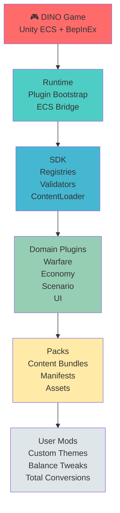
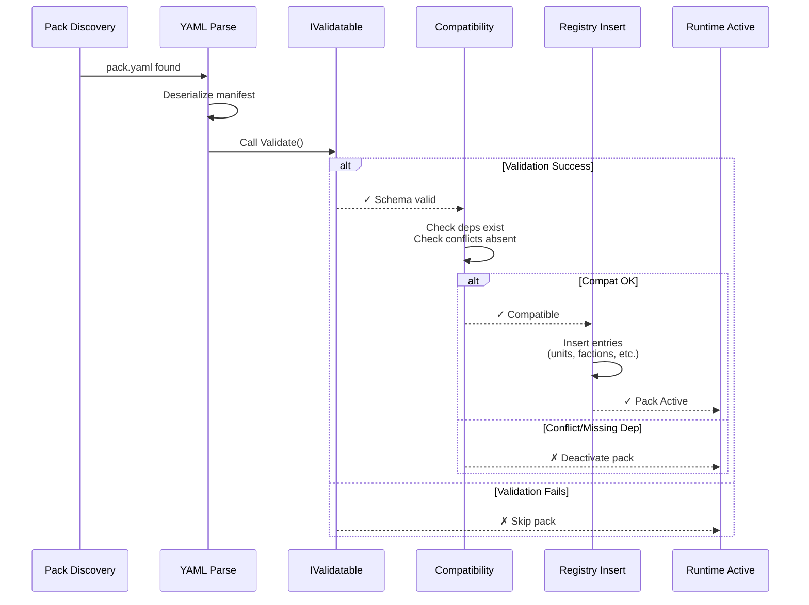
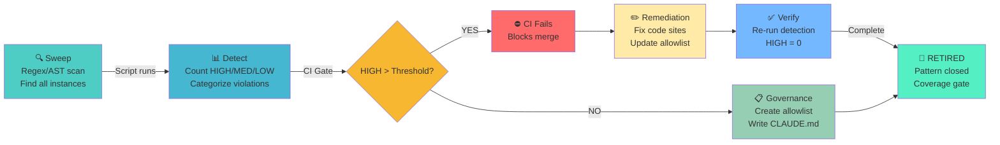

# DINOForge - CLAUDE.md

## Project Overview

**DINOForge** is a general-purpose mod platform and agent-oriented development scaffold for **Diplomacy is Not an Option (DINO)**. It is a **mod operating system**, not a single mod.

- **Game**: Diplomacy is Not an Option (Unity ECS, BepInEx-compatible)
- **Architecture**: Polyrepo-hexagonal, declarative-first, agent-driven
- **Language**: C# (.NET), YAML/JSON schemas, CLI tooling
- **Mod Loader**: BepInEx + custom ECS plugin loader (`BepInEx/ecs_plugins/`)

### Architecture Layer Stack



## .NET Version Policy (MANDATORY — DO NOT CHANGE WITHOUT CHECKING)

**This repo uses .NET 11 preview.** Locally: `11.0.100-preview.2.26159.112`. This is intentional.
- .NET 11 EXISTS — see https://dotnet.microsoft.com/download/dotnet/11.0
- Tool/app projects target `net11.0`. Core SDK/domain libraries target `net8.0` (netstandard compat).
- CI installs .NET 11 preview via `include-prerelease: true` in `setup-dotnet`.
- **NEVER downgrade `net11.0` TFMs to net9.0/net8.0.** If a build fails on CI due to SDK version, fix the CI workflow to install .NET 11, not the other way around.
- `global.json` pins `11.0.100-preview.2.26159.112` with `latestMajor` rollforward — do not change this.

## Agent Operational Rules (MANDATORY)

### Claude (Orchestrator) Constraints
The top-level Claude instance is ONLY allowed to:
- Read and write documentation files
- Spawn Haiku subagents for ALL other work

**Everything else MUST be delegated to subagents (model: haiku):**
- All Bash/shell commands
- All file reads beyond the first 3 files per task
- All file reads of files > 500 lines
- All code edits and writes
- All builds, deployments, test runs
- All git operations
- All log analysis
- All game launch/kill operations

### Tooling Evolution Rule
Continuously reduce custom workflows to single optimal CLI/MCP calls:
- When a multi-step workflow is identified, create/update a `.claude/commands/` skill or MCP tool to collapse it into one call
- Prefer updating existing slash commands over creating new ones
- After completing any workflow, evaluate whether it should become a permanent command
- Agent plugins, skills, CLI tools, and MCP server MUST be kept up to date to reflect the shortest possible path to any common operation

### Game Launch Protocol (via subagent)
Always use this sequence — never assume a launch succeeded:
1. Kill all existing instances: `Stop-Process -Name 'Diplomacy is Not an Option' -Force -ErrorAction SilentlyContinue`
2. Wait 3 seconds and verify no processes remain
3. Launch: `Start-Process -FilePath '<exe>' -WorkingDirectory '<gamedir>'`
4. Wait 5 seconds, then check `MainWindowTitle` — if "Fatal error" or contains "another instance", launch FAILED
5. Only proceed if MainWindowTitle is empty/game (not an error dialog)

### File Deletion Protocol (MANDATORY)
NEVER use `rm`, `del`, `Remove-Item`, or any command that permanently deletes files.
ALWAYS send files to the Windows Recycle Bin using:

For files:
```powershell
Add-Type -AssemblyName Microsoft.VisualBasic
[Microsoft.VisualBasic.FileIO.FileSystem]::DeleteFile(
    '<absolute-path>',
    [Microsoft.VisualBasic.FileIO.UIOption]::OnlyErrorDialogs,
    [Microsoft.VisualBasic.FileIO.RecycleOption]::SendToRecycleBin)
```

For directories:
```powershell
[Microsoft.VisualBasic.FileIO.FileSystem]::DeleteDirectory(
    '<absolute-path>',
    [Microsoft.VisualBasic.FileIO.UIOption]::OnlyErrorDialogs,
    [Microsoft.VisualBasic.FileIO.RecycleOption]::SendToRecycleBin)
```

Wrap calls via subagents as:
```powershell
powershell -c "Add-Type -AssemblyName Microsoft.VisualBasic; [Microsoft.VisualBasic.FileIO.FileSystem]::DeleteFile('$path','OnlyErrorDialogs','SendToRecycleBin')"
```

## File Governance (MANDATORY)

### Desktop Contamination Prevention (MANDATORY)
NEVER write files to `C:\Users\koosh\Desktop\` or any user Desktop path.
The Desktop is a shared, user-visible surface — agents must not pollute it.

ALL agent output files MUST go to designated repo directories:
- Scripts (PS1, CMD, SH): `scripts/game/` or `scripts/game/desktop/` (for captures/automation)
- Screenshots/PNGs:        `docs/screenshots/` or `docs/screenshots/desktop/`
- Logs/TXT reports:        `docs/sessions/` or `docs/sessions/desktop/`
- Research markdown:       `docs/sessions/`
- Temp capture output:     use `$env:TEMP\DINOForge\` (already used by MCP server)

If a script currently writes to Desktop, update its output path to one of the above.
The MCP `game_screenshot` tool already writes to `$env:TEMP\DINOForge\` — use it.

### Script Lifecycle
Any temporary script created for a task MUST be:
1. Written to `scripts/game/` or `docs/scripts/` (not Desktop, not root)
2. Deleted (via Recycle Bin per File Deletion Protocol) when the task is complete
3. Never left as permanent artifacts unless promoted to a named slash command in `.claude/commands/`

## Build Commands

```bash
# Build
dotnet build src/DINOForge.sln

# Test
dotnet test src/DINOForge.sln --verbosity normal

# Lint
dotnet format src/DINOForge.sln --verify-no-changes

# Validate packs
dotnet run --project src/Tools/PackCompiler -- validate packs/

# Package a mod pack
dotnet run --project src/Tools/PackCompiler -- build packs/<pack-name>
```

## Repository Structure

```
DINOForge/
  src/
    Runtime/             # BepInEx plugin: bootstrap, ECS detection, debug overlay
      Bridge/            #   ECS bridge: component mapping, stat modifiers, entity queries
      HotReload/         #   Hot module replacement bridge
      UI/                #   In-game mod menu overlay (F10) and settings panel
    SDK/                 # Public mod API: registries, schemas, pack loaders
      Assets/            #   Asset service, addressables catalog, bundle info
      Dependencies/      #   Pack dependency resolver with cycle detection
      HotReload/         #   Pack file watcher for live reload
      Models/            #   Data models (units, factions, buildings, weapons, etc.)
      Registry/          #   Generic registry system with conflict detection
      Universe/          #   Universe Bible system for total conversions
      Validation/        #   Schema validation (NJsonSchema)
    Bridge/
      Protocol/          #   JSON-RPC message types and IGameBridge interface
      Client/            #   GameClient for out-of-process bridge communication
    Domains/
      Warfare/           #   Warfare domain plugin (factions, doctrines, combat, waves)
      Economy/           #   Economy domain plugin (rates, trade, balance)
      Scenario/          #   Scenario domain plugin (scripting, conditions, validation)
      UI/                #   UI/UX domain plugin (HUD injection, menu management)
    Tools/
      Cli/               #   dinoforge CLI (status, query, override, reload, watch, etc.)
      DinoforgeMcp/      #   FastMCP server for Claude Code integration (HTTP/SSE + stdio)
      PackCompiler/      #   Pack compiler: validate, build, package packs
      DumpTools/         #   Entity/component dump analysis (Spectre.Console)
      Installer/         #   PowerShell/Bash installer for BepInEx + DINOForge
    Tests/               #   Unit tests (xUnit + FluentAssertions)
      Integration/       #   Integration tests (Bridge, ContentLoader, end-to-end)
  packs/                 # Content packs and example mods
    example-balance/     #   Simple stat override example
    warfare-modern/      #   Modern warfare theme (West vs Classic Enemy)
    warfare-starwars/    #   Star Wars Clone Wars theme (Republic vs CIS)
    warfare-guerrilla/   #   Asymmetric warfare (Guerrilla faction)
    economy-balanced/    #   Economy balance pack
    scenario-tutorial/   #   Tutorial scenario pack
  schemas/               # Canonical JSON/YAML schema definitions (24 schemas)
  docs/                  # All project documentation
  manifests/             # System contracts, ownership maps, extension points
```

## Agent Governance

### Agents MUST:
- Work through manifests and registries
- Use generators/templates for new content
- Update docs/contracts when changing public surfaces
- Add tests for new public APIs
- Log failure modes explicitly
- Keep features pack-based when possible
- Run `dotnet test` before considering work complete

### Agents MUST NOT:
- **Handroll what a library already solves** - always search for existing packages first
- Patch runtime internals unless assigned runtime-layer work
- Invent new registry patterns casually
- Duplicate schemas
- Bypass validators
- Hardcode content IDs in engine glue
- Add undocumented extension points
- Skip tests
- Merge without compatibility checks

## Legal Move Classes (Agent Operations)

Agents should reduce all work to one of these forms:
- `create schema` - new data shape definition
- `extend registry` - add entries to existing registry
- `add content pack` - new pack with manifest
- `patch mapping` - update vanilla-to-mod mapping
- `write validator` - new validation rule
- `add test fixture` - new test case
- `add debug view` - new diagnostic surface
- `add migration` - version compatibility migration
- `add compatibility rule` - cross-pack conflict rule
- `add documentation manifest` - update docs

## Code Style

- C# 12+ with nullable reference types enabled
- `async/await` over raw Tasks
- XML doc comments on all public APIs
- Immutable data models preferred
- Registry pattern for all extensible domains
- No `var` for non-obvious types
- Meaningful names over comments

## Key Design Principles

1. **Wrap, don't handroll** - Use established libraries/tools and wrap them. Never build from scratch what a proven package already solves. Prefer thin wrappers and adapters over custom implementations. This is a vibecoding-only environment: maximize feature coverage and minimize risk by standing on existing shoulders.
2. **Framework before content** - platform first, themed mods second
3. **Declarative before imperative** - YAML/JSON manifests over C# patches
4. **Stable abstraction over unstable internals** - isolate ECS glue
5. **Agent-first repo design** - optimize for autonomous agent dev
6. **Observability is first-class** - logs, overlays, reports, validators
7. **Domain extensibility** - warfare is first plugin, not the only one
8. **Compatibility-aware packaging** - explicit deps, conflicts, versions
9. **Graceful degradation** - fail loudly with fallbacks

## Build vs Wrap Decision Rule

**ALWAYS prefer** (in order):
1. Direct use of an existing library/tool as-is
2. Thin wrapper / adapter around an existing library
3. Composition of multiple existing libraries
4. Modified fork of an existing library (last resort before handroll)

**ONLY handroll when**:
- No existing solution covers the need (e.g. DINO-specific ECS glue)
- Wrapping would be more complex than a simple implementation
- The scope is tiny and self-contained (< 50 lines)

**Rationale**: This is a fully agent-driven (vibecoding) environment. Agents produce more reliable output when integrating proven code than when generating novel implementations. Handrolled code has higher defect rates, lacks community testing, and creates maintenance burden that agents handle poorly without human review. Every handrolled component is a liability; every wrapped dependency is borrowed reliability.

### Concrete Examples

| Need | DO | DON'T |
|------|----|-------|
| YAML/JSON schema validation | Use JsonSchema.Net or NJsonSchema | Write custom validator |
| Pack dependency resolution | Use NuGet's resolver or Semver.NET | Write custom semver solver |
| Logging | Use Serilog or NLog via BepInEx | Write custom logger |
| CLI tooling | Use System.CommandLine or Spectre.Console | Write custom arg parser |
| Config management | Use BepInEx ConfigurationManager | Write custom config system |
| ECS introspection | Wrap Unity.Entities reflection APIs | Write custom reflection |
| File watching / hot reload | Use FileSystemWatcher | Write custom polling loop |
| Serialization | Use YamlDotNet + System.Text.Json | Write custom parsers |
| Diffing | Use DiffPlex or similar | Write custom diff engine |
| Testing | Use xUnit + FluentAssertions + Moq | Write custom test framework |

## Pack System

Every mod is a pack with a `pack.yaml` manifest and explicit metadata:
```yaml
id: example-pack
name: Example Pack
version: 0.1.0
framework_version: ">=0.1.0 <1.0.0"
author: DINOForge Agents
type: content  # content | balance | ruleset | total_conversion | utility
depends_on: []
conflicts_with: []
loads:
  factions: []
  units: []
  buildings: []
```

### Pack Load Sequence



## Testing Philosophy

- **BDD-first**: Behavior specs define acceptance criteria before implementation
- **SDD**: Schema-driven development - schemas validate before runtime
- **TDD**: Unit tests for all public API surfaces
- Property-based tests for balance/combat model validation
- Pack validation tests (schema, references, completeness)
- Integration tests against mock ECS runtime

## Asset Pipeline Governance (v0.7.0+)

### Unified Asset Workflows in PackCompiler

All asset operations (3D models, textures, VFX, etc.) MUST go through **PackCompiler commands**, never fragmented tools:

```bash
# Asset import pipeline (unified, declarative)
dotnet run --project src/Tools/PackCompiler -- assets import <pack>
dotnet run --project src/Tools/PackCompiler -- assets validate <pack>
dotnet run --project src/Tools/PackCompiler -- assets optimize <pack>
dotnet run --project src/Tools/PackCompiler -- assets generate <pack>
dotnet run --project src/Tools/PackCompiler -- assets build <pack>

# Content sync
dotnet run --project src/Tools/PackCompiler -- sync download <pack> --phase <version>

# VFX generation (wraps VFXPrefabGenerator)
dotnet run --project src/Tools/PackCompiler -- vfx generate <pack>
```

### Asset Configuration: asset_pipeline.yaml

Every pack with assets MUST define `asset_pipeline.yaml` with:
- Model sources (GLB/FBX file paths)
- LOD targets (polycount percentages, screen thresholds)
- Material definitions (faction colors, emission)
- Addressables keys (for runtime loading)
- Definition updates (inject visual_asset references)

**Schema**: `schemas/asset_pipeline.schema.json` (validates all configs)

### Mandatory Asset Workflow Steps

Agents importing assets MUST follow this sequence **in order**:

1. **Define** — Create/update `asset_pipeline.yaml` in pack root
2. **Download** — `dotnet run -- sync download <pack>`
3. **Import** — `dotnet run -- assets import <pack>`
4. **Validate** — `dotnet run -- assets validate <pack>`
5. **Optimize** — `dotnet run -- assets optimize <pack>` (generates LOD)
6. **Generate** — `dotnet run -- assets generate <pack>` (creates prefabs)
7. **Verify** — `dotnet run -- assets build <pack>` (full pipeline + tests)
8. **Commit** — Git commit all artifacts + updated definitions

**Agents MUST NOT**:
- Manually edit game definitions when assets change
- Skip validation/optimization steps
- Create ad-hoc asset directories outside `packs/<pack>/assets/`
- Hardcode polycount targets or LOD percentages in C#
- Use separate/legacy tools (old download scripts, etc.)

### Asset Services (PackCompiler)

Core services in `src/Tools/PackCompiler/Services/`:

| Service | Responsibility | Tests |
|---------|-----------------|-------|
| `AssetImportService` | GLB/FBX → JSON (via AssimpNet) | 4+ tests |
| `AssetOptimizationService` | Mesh decimation → LOD variants | 4+ tests |
| `PrefabGenerationService` | JSON → .prefab (serialized) | 4+ tests |
| `AddressablesService` | YAML → catalog entries | 2+ tests |
| `DefinitionUpdateService` | Inject visual_asset into YAML | 2+ tests |

### Extension Pattern

Custom asset processors/validators can be registered:

```csharp
// In PackCompiler/Program.cs DI setup
public static IServiceCollection AddCustomAssetProcessors(this IServiceCollection services)
{
    services.AddAssetProcessor<CustomLightsaberGlowProcessor>();
    services.AddAssetValidator<StarWarsColorValidator>();
    services.AddAssetExporter<AlternativeFormatExporter>();
    return services;
}
```

Implementations MUST inherit from `IAssetProcessor`, `IAssetValidator`, `IAssetExporter` interfaces defined in PackCompiler.

### Testing Requirements for Assets

New asset features MUST include:

- **Unit tests** for each service (import, optimize, generate)
- **Integration tests** for full pipeline (download → build)
- **Regression tests** for known assets (v0.6.0 models, v0.7.0 critical)
- **Performance tests** (import < 5s/model, full pipeline < 5min for 9 models)
- **Schema validation tests** (asset_pipeline.yaml)

All asset tests live in `src/Tests/AssetPipelineTests.cs`

### Documentation Requirements

Agents changing asset workflows MUST update:

1. `ASSET_PIPELINE_CLI.md` — Command reference
2. `asset_pipeline.schema.json` — Config schema
3. `CLAUDE.md` (this section) — Governance changes
4. Inline XML docs in PackCompiler services
5. Test cases documenting new behavior

---

## Game Automation & Testing

### Game Install Path

```
G:\SteamLibrary\steamapps\common\Diplomacy is Not an Option\
  Diplomacy is Not an Option.exe   ← launch directly (not via Steam) for 2nd instance
  BepInEx\
    plugins\DINOForge.Runtime.dll  ← deployed by: dotnet build -p:DeployToGame=true
    dinoforge_packs\               ← deployed packs (auto-copied on build)
    dinoforge_debug.log            ← DINOForge Runtime log (read for swap/entity info)
    LogOutput.log                  ← BepInEx log (scene changes, plugin load errors)
```

### MCP Bridge (game automation)

The `dinoforge` MCP server (registered in MCP transport config) exposes:

| Tool | Purpose |
|------|---------|
| `game_launch` | Launch game exe; `hidden=True` uses CreateDesktop for isolated launch |
| `game_status` | Running state, entity count, loaded packs |
| `game_query_entities` | Query ECS entities by component type |
| `game_get_stat` | Read a stat value on an entity |
| `game_apply_override` | Apply a stat override |
| `game_reload_packs` | Hot-reload packs without restarting |
| `game_dump_state` | Trigger entity dump to file |
| `game_screenshot` | Capture game window screenshot |
| `game_verify_mod` | Verify mod is loaded and active |
| `game_wait_for_world` | Wait until ECS world is ready |
| `game_ui_automation` | Automate game UI interactions |
| `game_launch_test` | Launch TEST instance (optional `hidden=True` for invisible desktop) |
| `game_analyze_screen` | Capture screenshot + detect UI elements via OmniParser (health bars, unit portraits, buttons, faction indicators) |
| `game_input` | Inject keyboard/mouse input to game without requiring focus (Win32 SendInput) |
| `game_wait_and_screenshot` | Poll for visual change then capture screenshot (configurable timeout/interval) |
| `game_navigate_to` | Navigate to game state (main_menu/gameplay/pause_menu) via input sequences |

The runtime includes additional asset, catalog, logging, and pack-management tools beyond this excerpt (full tool surface is maintained in `src/Tools/DinoforgeMcp/dinoforge_mcp/server.py`).

MCP runs from the FastMCP Python server in HTTP mode on `http://127.0.0.1:8765` and is managed by
`scripts/start-mcp.ps1`.

The repo-tracked CC hook can keep MCP alive automatically across sessions using `./scripts/start-mcp.ps1 -Action start -Detached`.

#### Isolation Layer & playCUA Backend Selection

The DINOForge MCP uses an **abstraction layer** (isolation_layer.py) to support multiple backend implementations for game capture, input injection, and window management. This enables:
- Platform abstraction (Windows, Linux, macOS via playCUA)
- Cross-deployment flexibility (hidden desktop, Docker, Kubernetes-ready)
- Graceful fallback behavior

**Backend Implementations:**

1. **HiddenDesktopBackend** (Windows-specific, Tier 2)
   - Uses Win32 `CreateDesktopW()` for isolated desktop creation
   - Current stable implementation, used for `game_launch(hidden=True)`
   - Pros: Battle-tested, no external dependencies
   - Cons: Windows-only

2. **PlayCUABackend** (Cross-platform, Tier 1 preferred)
   - Routes to playCUA JSON-RPC server (runs on port 9000)
   - playCUA provides: screenshot capture, input injection, window enumeration, process management, image analysis
   - Pros: Cross-platform, abstracted over platform details, Docker/Kubernetes compatible
   - Cons: Requires playCUA binary or `cargo run` available
   - Supports: Windows (WGC, SendInput, EnumWindowsEx), Linux (X11, uinput, EWMH), macOS (CoreGraphics, Quartz, NSWorkspace)

3. **DockerBackend** (Stub, Tier 1 future)
   - For headless/CI game automation within containers
   - Planned for v0.20+

**Backend Selection & Auto-Detection:**

```python
# Auto: tries playCUA first, falls back to HiddenDesktop
context = IsolationContext.get('auto')

# Explicit:
context = IsolationContext.get('hidden_desktop')  # Windows only
context = IsolationContext.get('playcua')         # Cross-platform
```

**Starting playCUA Server:**

```bash
# Option 1: From cargo (if rust installed)
cd C:\Users\koosh\playcua_ci_test
cargo run -- --listen 127.0.0.1:9000

# Option 2: Using compiled binary (if available)
./playcua.exe --listen 127.0.0.1:9000

# Option 3: Via script (add to scripts/)
./scripts/start-playcua.ps1
```

**playCUA Module Surface:**
- **analysis**: Image diff, BLAKE3 hashing
- **input**: Keyboard/mouse injection (platform-specific adapters)
- **window**: Window enumeration, focus, hidden desktop support
- **process**: Process launch/kill/status with lifecycle tracking
- **capture**: Screenshot capture (WGC on Windows, X11 on Linux, CG on macOS)

See `docs/playCUA_integration_audit.md` and `docs/playcua_phase3_5_spec.md` for implementation details.

#### Display Isolation Strategy (Future: VDD Tier 1)

Future: Install a dedicated DINOForge virtual display driver (IDD/WDDM) to provide isolated headless game launches without requiring Parsec VDD or CreateDesktop. This would be Tier 1 in the fallback chain.
- Tier 1 (future): VDD driver-based isolation
- Tier 2 (current): Win32 CreateDesktop (HiddenDesktopBackend)
- Tier 3: playCUA (cross-platform)
- Tier 4 (future): Docker/Kubernetes (DockerBackend)

#### PhenoCompose Integration (v0.24.0+)

**PhenoCompose** (`https://github.com/KooshaPari/phenocompose`) is an external multi-tier virtualization platform by KooshaPari. It provides orchestration for game automation at scale:

**3-Tier Architecture:**
1. **Tier 1 (WASM)**: ~1ms startup, language-level isolation (Wasmtime)
2. **Tier 2 (gVisor)**: ~90ms startup, syscall-filtered containers (100+ parallel)
3. **Tier 3 (Firecracker)**: ~125ms startup, full VM isolation with GPU passthrough (VFIO)

**Game Automation Features** (directly applicable to DINO):
- Parallel game test fleet (100+ instances from snapshot)
- GPU passthrough (VFIO) for visual asset validation
- Snapshot-based cloning (<2s VM restore from baseline)
- Native BepInEx plugin loader support
- Steam integration (headless)
- Cross-platform (Linux, macOS, Windows via WSL2)

**Integration Strategy (Roadmap):**

| Version | Feature | Effort |
|---------|---------|--------|
| v0.24.0 | Evaluate phenocompose as CLI tool for parallel game testing | 1 sprint |
| v0.25.0 | Wrap nanovms CLI in MCP server (`game_launch_fleet`, `game_snapshot_template`) | 2 sprints |
| v0.26.0+ | Adopt phenocompose's ADR pattern for DINOForge architecture decisions | Ongoing |

**Do NOT:**
- Fork phenocompose (maintain as external dependency)
- Rewrite nanovms in C# (violates "wrap, don't handroll" rule)
- Use for ML/Mojo inference (out of scope)

**Reference Documents:**
- `docs/sessions/phenocompose_nvms_investigation.md` — Full repository analysis
- `docs/sessions/phenocompose_integration_technical.md` — Technical deep dive with workflow phases

**Contact/Monitoring:**
- Monitor upstream: `https://github.com/KooshaPari/phenocompose` (already yours, active development)
- License: Apache-2.0 (compatible)
- Primary languages: Go (nanovms) + Rust (pheno-compose-driver)

### Agent Slash Commands for Game Work

| Command | Role |
|---------|------|
| `/launch-game` | Launch 2nd game instance for testing |
| `/test-swap` | Full loop: build → deploy → launch → verify swaps |
| `/check-game` | Read debug log, report swap/entity status |
| `/game-test` | Automated test suite via MCP bridge |
| `/game-test-task <task>` | TITAN-inspired coverage-driven automated game test |
| `/game-coverage` | Show coverage memory statistics |
| `/entity-dump` | Parse ECS entity dump, analyze archetype counts |
| `/pack-deploy` | Validate + build + deploy pack + DLL |
| `/asset-create` | GLB/FBX → normalize → stylize → bundle → register |

### Critical ECS Facts (DO NOT FORGET)

- **ALL DINO entities are ECS Prefab entities** — every `EntityQuery` MUST use `EntityQueryOptions.IncludePrefab` or it returns 0 results
- `World.Systems` returns `NoAllocReadOnlyCollection` — index access only, no IEnumerable cast
- `MonoBehaviour.Update()` never runs — use `SystemBase.OnUpdate()`
- Asset swap Phase 2 (live entity swap) is the primary visual mechanism — Phase 1 (catalog disk patch) is optional/best-effort
- The Addressables catalog uses custom address keys, NOT Unity asset paths, for unit prefabs

### Deploying Fixes

```bash
# Deploy to MAIN instance (overwrites main save — safe for CI/CD):
dotnet build src/Runtime/DINOForge.Runtime.csproj -c Release -p:DeployToGame=true

# Deploy to TEST instance (isolated, no save impact — use during active dev):
dotnet build src/Runtime/DINOForge.Runtime.csproj -c Release -p:DeployToGame=true -p:GameInstallPath="G:\SteamLibrary\steamapps\common\Diplomacy is Not an Option_TEST"

# Check results after ~12s (600-frame delay):
tail -50 "G:\SteamLibrary\steamapps\common\Diplomacy is Not an Option\BepInEx\dinoforge_debug.log"
```

### Test Instance (Second Concurrent Game)

Unity's native mutex (in UnityPlayer.dll) prevents launching a second instance from the same directory. To support concurrent test instances:

- **Test instance path**: `G:\SteamLibrary\steamapps\common\Diplomacy is Not an Option_TEST\`
- **Deploy to TEST**: `dotnet build -p:DeployToGame=true -p:GameInstallPath="...\Diplomacy is Not an Option_TEST"`
- **MCP tool**: `game_launch_test(hidden=True)` — launches TEST instance on hidden Win32 desktop (CreateDesktop), no visible window
- **Path config**: `.dino_test_instance_path` in repo root (auto-detected by MCP server)
- Both instances are completely independent; each has its own BepInEx installation

### AgilePlus PM Dashboard

**AgilePlus** (kooshapari/agileplus) is the spec-driven development engine used for DINOForge project management.

- **Repo**: `C:\Users\koosh\agileplus`
- **Launch**: `cd C:\Users\koosh\agileplus && bun run dev` (or `npm run dev`)
- **Purpose**: User stories, sprint tracking, spec management, roadmap visualization
- **Integration**: Specs in `docs/specs/` map to AgilePlus stories

---

## Asset Bundle Creation

### Unity Version Requirement

Asset bundles for DINO **must be built with Unity 2021.3.45f2**. Bundles from other versions will fail to load silently at runtime.

### Bundle → Pack Registration Flow

```
1. source.glb/fbx
2. → blender normalize_asset.py → normalized.glb (polycount reduction, material cleanup)
3. → blender stylize_asset.py → stylized.glb (faction palette applied)
4. → Unity 2021.3: import stylized.glb, build AssetBundle → <asset-id> (no extension)
5. → packs/<pack-id>/assets/bundles/<asset-id>   (bundle file)
6. → unit/building YAML: visual_asset: <asset-id>
7. → dotnet build -p:DeployToGame=true
```

### Bundle Naming Convention

- Bundle filename = `visual_asset` key = Addressable key used by AssetSwapRegistry
- Example: `sw-rep-clone-trooper` for file `packs/warfare-starwars/assets/bundles/sw-rep-clone-trooper`
- The asset name **inside** the bundle is the Unity prefab name (e.g. `sw-rep-clone-trooper.prefab`)
- AssetSwapSystem uses `bundle.LoadAllAssets()` fallback to handle name mismatches

### Faction Palettes (hardcoded in `AssetctlPipeline.BuildFactionPalette`)

| Faction | Primary | Secondary | Roughness | Metallic |
|---------|---------|-----------|-----------|---------|
| republic | `#F5F5F5` | `#1A3A6B` | 0.3 | 0.1 |
| cis | `#C8A87A` | `#5C3D1E` | 0.7 | 0.2 |
| neutral | `#888888` | — | 0.5 | 0.0 |

---

## Pattern Catalog

The Pattern Catalog documents recurring failure modes, code smells, and architectural anti-patterns detected across the DINOForge codebase. Each pattern includes:
- **Smell**: Observable code characteristic
- **Why bad**: Impact and risk
- **Detection**: Automated script(s) and threshold for CI failure
- **Governance**: Remediation strategy and allowlist policy

### Pattern Catalog Lifecycle



### Pattern #99: Unprotected `Dictionary<string, T>` Without `StringComparer`

**Smell**: `Dictionary<string, T>` constructed without an explicit `StringComparer` argument in the constructor.

**Why bad**: The default comparer is `StringComparer.Ordinal` (case-sensitive), but this contract is implicit and silent. Future refactoring to `StringComparer.OrdinalIgnoreCase` silently breaks all lookups for case-mismatched keys. Readers assume the default is culture-aware, creating a mismatch between intent and behavior.

**Detection**: `scripts/ci/detect_unprotected_string_dict.py` — scans `src/` (excluding Tests/, bin/, obj/) for `Dictionary<string, T>` declarations lacking `StringComparer.Ordinal` or `StringComparer.OrdinalIgnoreCase` within 3 lines of the declaration. Severity: HIGH if no comparer; MED if comparer found. Threshold: CI fails if HIGH count exceeds 10.

**Governance**: For user-sourced keys (pack IDs, JSON property names, unit IDs, faction names), use `new Dictionary<string, T>(StringComparer.Ordinal)`. For UI-facing case-insensitive lookups (e.g. command palette, config overrides), use `new Dictionary<string, T>(StringComparer.OrdinalIgnoreCase)`. NEVER rely on the implicit default. Allowlist via `docs/qa/string-dict-allowlist.txt` or inline `// string-dict-ok: <reason>` marker.

### Pattern #100: Direct `DateTime.Now` / `DateTime.UtcNow` in SDK API Surface

**Smell**: SDK NuGet-published models or utility classes use `DateTime.UtcNow` / `DateTime.Now` directly instead of threaded `TimeProvider`.

**Why bad**: Published API users cannot mock or control time in tests. Deadlines, cache TTLs, and time-sensitive assertions become untestable without `Thread.Sleep`. `TimeProvider` is the .NET 8+ standard for injectable time sources; bypassing it locks the code to a real clock.

**Detection**: `scripts/ci/detect_direct_datetime.py` (scoped to `src/SDK/`, `src/Bridge/Protocol/`) — flags any `DateTime.Now` / `DateTime.UtcNow` outside `TimeProvider`-injected pathways.

**Governance**: SDK utility methods and model validators accept optional `TimeProvider? timeProvider = null` constructor/parameter, defaulting to `TimeProvider.System`. Replace `DateTime.UtcNow` with `_timeProvider.GetUtcNow().UtcDateTime`. Logging-only timestamps (human display, no control flow) are exempt.

### Pattern #101: Stringly-Typed Enum Discriminator

**Smell**: Public model fields or schema keys typed as `string` for what should be enum values (e.g., `public string Role { get; set; }` accepting `"Tank"` / `"Healer"` as strings instead of `Role.Tank` enum).

**Why bad**: No compile-time validation. Typos in config files ("Heler" vs "Healer") fail silently at load time. Refactoring enum values breaks all calling code in opaque ways. JSON round-tripping requires manual converter boilerplate.

**Detection**: `scripts/ci/detect_stringly_enums.py` — flags model fields typed as `string` in `src/SDK/Models/` and schema-published types where an enum constant exists with the same name.

**Governance**: Migrate to `[JsonConverter(typeof(JsonStringEnumConverter))]` enum types. For YAML schema properties, use `enum: [value1, value2]` with `type: string` to document valid values explicitly in the schema.

### Pattern #102: Orphan Process Handle Leakage

**Smell**: `Process.Start(...)` called without assignment to a `using` variable or without explicit `Dispose()`, leaving the process handle open.

**Why bad**: Process handles are a limited OS resource (~64K per process). Each leaked handle reduces the pool. Repeated spawns (CLI batch operations, pack compilation, tool invocations) exhaust the handle table, causing new `Process.Start()` calls to fail with "Too many open files" / "Cannot open process" errors. Handles linger indefinitely even after the child process exits.

**Detection**: `scripts/ci/detect_orphan_process_start.py` — flags `Process.Start(...)` not in a `using` statement or `try`/`finally` disposal chain.

**Governance**: Wrap in `using var p = Process.Start(...); ... p.WaitForExit();` so the handle is released even if WaitForExit is skipped. Pair with proper exception handling so failed waits don't suppress Dispose.

### Pattern #103: Local-Time Logging Drift

**Smell**: Log timestamps use `DateTime.Now` (local wall-clock time) instead of `DateTime.UtcNow`, especially in multi-timezone environments or logs read across regions.

**Why bad**: Log timestamps become ambiguous when DST transitions occur or when logs are aggregated from different timezones. Correlating logs with external events (CI build timestmaps, Git commit times, metrics feeds) requires mental time-zone conversion. UTC is machine-readable and unambiguous.

**Detection**: `scripts/ci/detect_local_time_logging.py` — flags `DateTime.Now` / `.Now.ToString(...)` in logging call sites (`.Log*()`, `_logger.*`, `Console.WriteLine`).

**Governance**: Always log in UTC: `DateTime.UtcNow.ToString("O")` or structured logging with `DateTimeOffset.UtcNow`. Format for human display only at the read site (dashboards, CLI output) — never store display-formatted timestamps in logs.

### Pattern #104: Catch-Swallow-Default Erasure

**Smell**: Exception caught and silently swallowed, replaced with a default return value: `try { ... } catch { return null; }` / `return default;` / `return false;` with no logging or rethrow.

**Why bad**: Loses the error cause entirely. Caller cannot distinguish "operation succeeded with a null result" from "operation failed"; null becomes overloaded with failure semantics. Debugging traces vanish. Callers must guess whether to retry, escalate, or treat null as a normal value.

**Detection**: `scripts/ci/detect_catch_swallow_default.py` (pending #303) — flags catch blocks that return null/default/false without logging the exception.

**Governance**: Surface the exception via `Result<T>`, `ILogger.LogWarning(ex, "context")`, or rethrow as a wrapped exception (new `InvalidOperationException("...", ex)`). If the swallow is intentional (e.g. try-parse), use an explicit marker: `// deliberate-swallow: reason` + allowlist entry.

### Pattern #105: Event-Subscription Lifecycle Asymmetry

**Smell**: Event handler subscribed with `EventX += handler` but never unsubscribed in the corresponding `OnDestroy()` / `Dispose()` / detach lifecycle hook.

**Why bad**: Subscribed handlers stay alive even after the subscriber is destroyed, keeping it rooted in memory (memory leak). Event fires on deleted objects, causing NullReferenceException or silent corruption. Repeated subscribe/destroy cycles leak memory and event delegate chains grow unbounded.

**Detection**: `scripts/ci/detect_event_lifecycle_asymmetry.py` (pending #308) — cross-references += and -= occurrences in class pairs for each public event.

**Governance**: Every `+=` MUST have a corresponding `-=` in OnDestroy / Dispose / detach method. Use a helper pattern: `void OnEnable() => EventX += Handler;` paired with `void OnDisable() => EventX -= Handler;` or constructor/Dispose for non-MonoBehaviour classes. Pairs with Pattern #85 (weak events for cross-boundary subscriptions).

### Pattern #106: Implicit `File.ReadAllText` Encoding

**Smell**: `File.ReadAllText(path)` called without explicit `Encoding` parameter, using the .NET framework's default (usually UTF-8 on recent runtimes, but context-dependent).

**Why bad**: Malformed UTF-8 sequences in config files (BOM stripping errors, mojibake from legacy systems) cause `DecoderFallbackException` or silent character corruption. Default encoding varies across platforms (.NET Framework vs. .NET Core) and regions. CI passes (UTF-8 strict) but user machines fail (locale-default encoding).

**Detection**: `scripts/ci/detect_implicit_encoding.py` (pending #313) — flags `File.ReadAllText(` without an `Encoding.*` argument.

**Governance**: Use `SafeFileIO.ReadText(path)` helper (UTF-8 strict, throws on invalid bytes) or pass `Encoding.UTF8` explicitly: `File.ReadAllText(path, Encoding.UTF8)`. Document in a comment why UTF-8 is correct for that file (YAML/JSON spec, domain requirement, etc.).

### Pattern #107: `BuildServiceProvider` Without `ValidateOnBuild`

**Smell**: .NET DI ServiceCollection's `BuildServiceProvider()` called without passing `new ServiceProviderOptions { ValidateOnBuild = true }`.

**Why bad**: Dependency graph errors (missing registrations, circular dependencies, unregistered factories) are discovered at first resolution, not build time — often minutes into a test run or user scenario. `ValidateOnBuild = true` catches these synchronously during setup, failing fast and early. Tests and CI catch breakage before release.

**Detection**: `scripts/ci/detect_unvalidated_di.py` (pending #316) — flags `.BuildServiceProvider()` or `.BuildServiceProvider(options)` where options does not include `ValidateOnBuild = true`.

**Governance**: Use `new ServiceProviderOptions { ValidateOnBuild = true, ValidateScopes = true }` for all non-trivial DI containers. Simple one-liners can be exempted with `// di-no-validation-ok: <reason>`.

### Pattern #108: Sleep-Based Test Sync

**Smell**: Unit or integration tests use `await Task.Delay(N)` (blocking sleep) to wait for async operations or state transitions before assertions.

**Why bad**: Fragile across environments: test passes locally on a fast machine (sleep 100ms, operation finishes in 50ms) but flakes on CI with resource contention. Multiplies wall-clock time: 20 tests × 100ms sleeps = 2+ seconds per run. Non-deterministic — sometimes passes, sometimes fails. If the delay is too short, flakes; if too long, wastes time.

**Detection**: `scripts/ci/detect_test_sleep_sync.py` (pending #322) — flags `await Task.Delay(...)` in `src/Tests/**/*.cs` outside exempted categories (performance benchmarks, stress tests).

**Governance**: Use `TestWait.UntilAsync(predicate, timeout, pollInterval)` helper instead — adaptive polling returns immediately when predicate matches, polls at configurable intervals, fails with timeout. Example: `await TestWait.UntilAsync(() => entity.Health == 0, timeout: TimeSpan.FromSeconds(5), pollInterval: 50ms)`.

### Pattern #110: Open-Ended Count Assertion

**Smell**: `Should().HaveCountGreaterThan(N)`, `Count.Should().BeGreaterThan(N)`, etc., where exact fixture cardinality is knowable.

**Why bad**: Passes with too-few items AND with infinite items — proves non-emptiness, not correctness. Provides no actual behavioral verification.

**Detection**: `scripts/ci/detect_open_ended_count.py` — fails CI when >50 HIGH violations detected (drift gate: `docs/qa/open_ended_count_allowlist.txt`).

**Governance**: Convert to `.HaveCount(N)` when fixture cardinality is known. `.NotBeEmpty()` acceptable only when lower-bound is the deliberate semantic. Allowlist via `docs/qa/open_ended_count_allowlist.txt` or inline `// open-ended-count-ok: <reason>`.

### Pattern #111: Silent Exception Swallowing (bare `catch {}`)

**Smell**: `try { ... } catch { }` / `catch (Exception) { }` with no logging, rethrow, or fallback.

**Why bad**: Hides I/O, reflection, or resource-exhaustion failures behind silent failures. Breaks observability and makes debugging impossible.

**Detection**: `scripts/ci/detect_silent_catch.py` — flags any bare `catch {}` not in allowlist or marked `// safe-swallow: <reason>`. Threshold: >50 DANGEROUS violations fails CI (allowlist: `docs/qa/silent-catch-allowlist.txt`).

**Governance**: Replace with `catch (Exception ex) { _logger.LogWarning(ex, "context"); }` (preferred), OR document with inline `// safe-swallow: <reason>` (acceptable for disposable cleanup), OR remove try/catch and use `using` for IDisposable. TEST_OK catch blocks (in test fixtures) are exempt if marked `// test-cleanup-ok`.

### Pattern #220: Unsealed Concrete Class with Mutable Private State

**Smell**: `public class Foo` (not sealed, not abstract, not static) with private mutable fields (Dictionary, List, Set, or `_field` style) AND no `protected virtual` / `protected abstract` members designed for inheritance.

**Why bad**: Inheritance is silently allowed but not designed for. A subclass could break invariants of private state; serialization frameworks may pick the subclass and miss fields; the class is "open for accidents." Particularly risky for NuGet-published API surfaces where downstream consumers might inherit.

**Detection**: `scripts/ci/detect_unsealed_public_classes.py` — canonical Pattern #124 detector (wired into pattern-gates.yml). 320 total violations: 18 HIGH (NuGet-published SDK/Bridge/Domains), 302 MED (internal Runtime/Tools). See iter-125 reconciliation: audit_unsealed_concrete_classes.py (narrower mutable-state-only checks) retired to docs/scripts/retired/ in favor of comprehensive public-class unsealing semantics per Pattern #124.

**Governance**: Roslyn analyzer **DF1013** (Info severity, landed iter-125). For new public types in SDK/, Bridge.Protocol/, prefer `sealed class` unless inheritance is explicitly designed for. For existing types, retrofit `sealed` opportunistically. Exempt: MonoBehaviour, ComponentSystemBase (DOTS), DI registration targets, Avalonia ViewModels. Suppression marker: `// unsealed-ok: <reason>`. Allowlist: `docs/qa/pattern-220-allowlist.txt`.

**Audit Reference**: `docs/qa/pattern_220_audit.md`

### Pattern #109: Inline `JsonSerializerOptions` Construction

**Smell**: Per-call-site `new JsonSerializerOptions { ... }` literals scattered across CLI, PackCompiler, and Installer code instead of project-scoped static holders.

**Why bad**: Settings drift silently — one site enables `PropertyNameCaseInsensitive`, another doesn't; one uses `JsonStringEnumConverter`, another emits ints. Round-trip parity (write site A, read site B) breaks invisibly at runtime.

**Detection**: `scripts/ci/detect_inline_json_options.py` — flags `new JsonSerializerOptions` in non-test files outside whitelisted static holders. Allowlist via `docs/qa/inline-json-options-allowlist.txt`.

**Governance**: Each project that serializes/deserializes JSON owns ONE static holder class (`CliJsonOptions`, `PackCompilerJsonOptions`, `InstallerJsonOptions`) exposing `public static JsonSerializerOptions Default { get; }`. All call sites read from the holder; never instantiate options locally. Round-trip golden tests verify symmetry.

### Pattern #112: Unadjustable Time Source (Direct `DateTime.Now` / `DateTime.UtcNow`)

**Smell**: `DateTime.UtcNow` / `DateTime.Now` used directly for deadline polling, cache TTL, timeout loops, or audit timestamps — not threaded through `TimeProvider`.

**Why bad**: Deadlines and cache expiry are untestable without `Thread.Sleep` in tests. Time-sensitive race conditions can't be reproduced deterministically. `TimeProvider` is the .NET 8+ standard for testable wall-clock access; bypassing it locks the code to a real clock.

**Detection**: `scripts/ci/detect_direct_datetime.py` (scoped to `src/Runtime/`, `src/Tools/`, `src/SDK/`) — flags any `DateTime.Now` / `DateTime.UtcNow` outside the `TimeProvider`-injected pathway. Threshold: fail at >87 (current ~82). Governance doc: `docs/qa/pattern-112-time-provider.md`.

**Governance**: Classes with deadline/cache/timeout semantics accept `TimeProvider? timeProvider = null` as a constructor parameter, defaulting to `TimeProvider.System`. Replace `DateTime.UtcNow` with `_timeProvider.GetUtcNow().UtcDateTime` (or keep `DateTimeOffset` for deadlines). Logging-only timestamps (human-readable, non-control-flow) are exempt.

### Pattern #113: Blocking Polling with Hardcoded Sleep Intervals

**Smell**: `Thread.Sleep(...)` inside `while`/`for` loops in production code (especially background threads) without CancellationToken interop. Often paired with hardcoded magic-number intervals (50ms, 100ms, 250ms).

**Why bad**: Cannot interrupt — blocking sleep ignores cancellation signals, leading to slow shutdown and stuck threads on Plugin reload. Magic intervals drift across the codebase. Async paths that sync-sleep block thread-pool threads unnecessarily.

**Detection**: `scripts/ci/detect_blocking_poll_sleep.py` (pending #340) — flags `Thread.Sleep` inside loop bodies in `src/` excluding `Tests/`. Threshold: fail at >8 (current ~12).

**Governance**: Polling-primitive hierarchy: (1) prefer `ManualResetEventSlim.Wait(timeout, ct)` for background threads needing cancellation; (2) use `await Task.Delay(timeout, ct)` for async paths; (3) one-shot focus-settle waits (UI automation) are acceptable when documented. Magic intervals consolidated into named constants per call-site domain.

### Pattern #114: `CancellationToken` Accepted But Not Threaded

**Smell**: An `async Task` / `async Task<T>` method accepts a `CancellationToken ct` parameter but calls inner `Async()` methods without passing the token (no `ct` argument; defaults to `CancellationToken.None`).

**Why bad**: Caller loses cancellation control over nested I/O, network, and subprocess operations. The method signature *claims* cancellation support but it's non-functional. Timeout/deadline tests silently hang instead of throwing `OperationCanceledException`. Phantom handles remain alive after cancellation requests; cooperative-shutdown chain is broken.

**Detection**: `scripts/ci/detect_ct_not_threaded.py` (pending #345) — flags async methods accepting CT where inner awaits omit the token argument. Warn threshold >5 HIGH.

**Governance**: `CancellationToken` parameters MUST be passed to all inner async calls (e.g. `await InnerAsync(arg, ct)`). If a helper doesn't yet accept CT, *first* add the parameter to the helper, then thread it through. Exemption: methods that genuinely have no async inner calls (synchronous-only bodies). Pairs with Pattern #98 (ConfigureAwait discipline) — apply both together at any new async surface.

### Pattern #115: `HttpClient` Per-Call or Per-Constructor Anti-Pattern

**Smell**: `new HttpClient()` instantiated inside a method body (e.g. `using var http = new HttpClient { Timeout = ... };`) or in a per-instance constructor — not shared across the application lifetime.

**Why bad**: `HttpClient` opens sockets that linger after dispose (TIME_WAIT). Per-call allocation under concurrency exhausts the ~64K-per-host socket pool — symptom is `SocketException` "Address already in use" or "Only one usage of each socket address is permitted". Per-ctor allocation in high-cardinality services has the same exhaustion profile. Microsoft's official guidance is to reuse one `HttpClient` per host across the entire application.

**Detection**: `scripts/ci/detect_httpclient_per_instance.py` (#352) — flags `new HttpClient(` not assigned to `static readonly`. Severity: HIGH per-method/loop, MED per-instance ctor, LOW `static readonly`. Allowlist: `docs/qa/httpclient-allowlist.txt` or inline `// http-client-ok: <reason>`.

**Governance**: Use one of these patterns (in preference order):
1. **Singleton**: `private static readonly HttpClient SharedHttp = new() { Timeout = TimeSpan.FromSeconds(30) };` — preferred when the class has a global lifetime.
2. **DI**: constructor `public Ctor(HttpClient http)` with framework-managed lifetime.
3. **IHttpClientFactory**: for typed clients with policy/Polly handlers.
4. **Local `using`**: acceptable only when the call site is genuinely rare (< 1 per 1000 requests) — document with `// http-client-ok: <reason>`.

### Pattern #116: Sync-over-Async Blocking (`.Result` / `.Wait()` in Async Contexts)

**Smell**: `Task.Result`, `Task.Wait()`, or `SemaphoreSlim.Wait()` (blocking variant) used in code that has an async-capable callsite, or in any method that runs on a context-captured thread (UI / ECS / MainThreadDispatcher).

**Why bad**: Blocks a thread-pool thread while the awaited Task tries to resume on the SAME captured context — classic deadlock pattern. On ECS / main-thread bound contexts (GameBridgeServer especially), `.Result` can freeze the game. Pairs poorly with Pattern #98 ConfigureAwait gaps.

**Detection**: `scripts/ci/detect_sync_over_async.py` (pending #356) — flags `.Result` (excluding `.ResultType` / `.ResultSummary` / `.Results` property accesses) and `.Wait()`. Severity: CRITICAL if in `GameBridgeServer` / ECS-system / main-thread code; HIGH elsewhere. Threshold: HIGH > 5.

**Governance**: `await` instead of `.Result`; `WaitAsync(ct)` instead of `Wait()`. For unavoidable sync wrappers at framework boundaries (e.g. PInvoke callbacks), document with `// sync-over-async-unavoidable: <reason>` + allowlist entry. Pairs with Patterns #97 (TCS sync continuation) and #98 (ConfigureAwait) — these three together define the async hygiene discipline.

### Pattern #117: `StringBuilder` Capacity Not Pre-sized

**Smell**: `new StringBuilder()` (default 16-character capacity) followed by ≥10 `.Append()` / `.AppendLine()` calls, especially inside a loop or producing structured output (YAML, JSON, dumps).

**Why bad**: Each append exceeding capacity triggers internal reallocation (capacity doubles) + full buffer copy. In hot paths (ECS type discovery at startup, AddressablesService YAML generation at pack reload, UiDiagnostics on F10 press) this cascades to O(N²) total bytes copied and pressures the GC during latency-sensitive moments.

**Detection**: `scripts/ci/detect_stringbuilder_no_capacity.py` — flags `new StringBuilder()` without capacity arg, severity HIGH if loop appears within 30 lines, MED if ≥10 appends without loop. Threshold: HIGH > 5. Allowlist via inline `// stringbuilder-capacity-ok: <reason>`.

**Governance**: Use `new StringBuilder(estimatedCapacity)` where estimate = (line count × avg line width × 1.2 safety margin); round up to a power of two (512, 1024, 2048, 4096, 8192). For unbounded loops with no good estimate, default to 4096. Include the capacity math as a brief inline comment so future readers can re-estimate when the shape of the output changes.

### Pattern #120: `JsonSerializer.Deserialize` Without Explicit Options

**Smell**: `JsonSerializer.Deserialize<T>(json)` (1-arg form, or 2-arg form with `default`/`null` options) anywhere except primitive deserialization.

**Why bad**: Default options use PascalCase mapping, ignore unknown properties silently, and apply no custom converters. For FFI boundaries (Rust subprocess output, Sketchfab API, native manifests) this misaligns with the wire format — payloads silently lose enum fields, miss camelCase, or skip new schema additions. Violates the Pattern #109 centralized-JSON contract.

**Detection**: `scripts/ci/detect_unguarded_json_deserialize.py` — flags bare `Deserialize<T>(...)` calls; classifies FFI-adjacent sites (file/method/class contains FFI/External/Native/Sketchfab/Remote/Api) as HIGH, others MED. Threshold: HIGH > 5. Allowlist `docs/qa/unguarded-json-deserialize-allowlist.txt` or inline `// json-deserialize-ok: <reason>`.

**Governance**: Use a centralized holder per Pattern #109 — `CliJsonOptions.Default`, `PackCompilerJsonOptions.Default`, `InstallerJsonOptions.Default`, or `SDK.Json.JsonOptions.Default`. For SDK code that can't depend on Tools-side holders, define `private static readonly JsonSerializerOptions` on the class with `PropertyNameCaseInsensitive = true` + `Converters = { new JsonStringEnumConverter() }`. Allowlist primitive-only deserialization with reason.

### Pattern #121: Unnecessary LINQ Terminal Allocation

**Smell**: `.ToList()` / `.ToArray()` called on enumerables whose consumer doesn't mutate the result — passed directly to a constructor accepting `IEnumerable<T>`, immediately wrapped in `ReadOnlyCollection`, or returned from a property accessed per-frame.

**Why bad**: Each call allocates a fresh list/array on the heap. Per-frame property accesses (e.g. `FactionSystem.RegisteredFactions`) compound into GC pressure in Bridge/Runtime hot paths. The allocation is invisible at the call site but visible to the GC.

**Detection**: `scripts/ci/detect_unnecessary_allocation.py` (pending #375) — scans `src/Runtime/`, `src/Tools/`, `src/Bridge/`, `src/SDK/`. Severity HIGH if inside a `lock` block or as a property body/arrow expression; MED if immediately enumerated.

**Governance**: Default to `IEnumerable<T>` for return types when the caller won't mutate. Use `.AsReadOnly()` over `.ToList()` when wrapping an existing `IList<T>` for read-only exposure (avoids the copy). Reserve `.ToList()` for sites where the caller will Add/Remove. Allowlist confirmed-necessary sites with `// allocation-ok: caller mutates` or `// allocation-ok: snapshot under lock`.

### Pattern #123: Public Collection Mutability in DTOs

**Smell**: Public classes (especially NuGet-published DTOs in SDK/Bridge.Protocol) expose collection properties as `public List<T> Items { get; set; }` instead of `public IReadOnlyList<T> Items { get; init; }`.

**Why bad**: Consumers can mutate the backing collection (`unitDef.DefenseTags.Add(x)`) bypassing validation hooks set up by Pattern #210 IValidatable wiring. JSON/YAML deserializers populate public setters, leaving no invariant-enforcement window. NuGet APIs that publish mutable contracts cannot remove mutability later without a SemVer-major break. Tempts race-prone TOCTOU patterns like `if (items.Contains(x)) items.Remove(x)`.

**Detection**: `scripts/ci/detect_public_mutable_collections.py` — flags `public (List|IList|Collection|ICollection)<T> Items { get; set; }` excluding IReadOnly variants. Severity: HIGH in NuGet-published assemblies (DINOForge.SDK, DINOForge.Bridge.Protocol/Client) — fail at >5; MED elsewhere. Allowlist `docs/qa/public-mutable-collections-allowlist.txt` or inline `// public-mutable-ok: <reason>` for `[JsonIgnore]`-backed fields and temp staging buffers.

**Governance**: Default to `public IReadOnlyList<T> Items { get; init; } = new List<T>();` on new DTOs. For YAML/JSON deserializers that don't support `init`, use a backing field pattern: `[YamlMember(Alias = "items")] public List<T> ItemsInternal { get; set; } = new();` + `[YamlIgnore] public IReadOnlyList<T> Items => ItemsInternal;`. Pairs with Pattern #210 (post-deserialize IValidatable.Validate) so invariants are checked at deserialization, not relied upon at property-set time.

### Pattern #124: Unsealed Public Classes in NuGet-Published Assemblies

**Smell**: `public class Foo` (no `sealed`) in `src/SDK/`, `src/Bridge/Client/`, `src/Bridge/Protocol/`, or `src/Domains/` with no `virtual`/`abstract` members and no documented subclassing contract.

**Why bad**: Allows accidental subclassing by downstream NuGet consumers, creating fragile cross-version compatibility. If a property/method is added/removed, subclasses break silently. No inheritance contract is documented — consumers don't know if subclassing is officially supported or a maintenance liability. Framework Design Guideline + Roslyn CA1052/CA1064: public unsealed classes should either (a) have virtual members inviting subclassing, or (b) be sealed to prevent inheritance.

**Detection**: `scripts/ci/detect_unsealed_public_classes.py` — matches `public\s+class\s+(?!sealed)\w+` in NuGet-published assemblies, excluding classes with virtual/abstract members or that inherit from a base. Severity: HIGH in NuGet-published surface; MED elsewhere. Allowlist `docs/qa/unsealed-public-classes-allowlist.txt` or inline `// unsealed-by-design: <reason>`.

**Governance**: Default to `sealed` on every new public class in NuGet-published assemblies. Unsealed only when: (a) the class documents a subclassing contract (rare), (b) has virtual/abstract members designed for override, or (c) is explicitly marked `// unsealed-by-design: <reason>`. Refactor existing unsealed classes during sweep as long as no current subclass exists in the same solution.

### Pattern #125: Service Interfaces Without Test Doubles (Orphan Mock Gap)

**Smell**: A public interface defined in `src/SDK/` or `src/Bridge/Protocol/` is implemented by ≥3 production classes but has no corresponding Mock/Fake/Stub in `src/Tests/Mocks/`. Tests are forced to either consume the real implementation (losing isolation) or handroll ad-hoc test doubles per call site (drift across the test suite).

**Why bad**: Without a canonical test double, contract assertions can't be exercised in isolation. Unit tests degrade to integration tests by accident. Refactoring the interface produces inconsistent test-side updates (some sites handrolled, some not). Iter-93 audit found 19 orphans across `IRegistry<T>`, `IModButtonInjector`, `IValidatable`, `IModMenuHost`, `IModSettingsHost`, `IHudElementRenderer`, `IThemeProvider`, `IModCanvas`, `IFileDiscoveryService`, `IUnitFactory`.

**Detection**: `scripts/ci/detect_orphan_interface_mocks.py` (pending) — enumerate public interfaces in NuGet-published namespaces, count production implementations via `: IFoo` grep, cross-reference against `src/Tests/Mocks/Mock*.cs` + `src/Tests/Doubles/Fake*.cs`. Flag interfaces with ≥3 prod refs and 0 test doubles.

**Governance**: For interfaces with ≥3 prod refs, add `Mock<IFoo>` (behavior-verifying) or `Fake<IFoo>` (stateful) in `src/Tests/Mocks/`. For asymmetric seams that can't reasonably be mocked (e.g. `IModButtonInjector` cross-layer UI seam), document with a `// no-test-double-by-design: <reason>` comment on the interface definition + allowlist entry. Mock contract behaviors should be exercised via at least one ParameterizedTest to prevent drift.

### Pattern #221: Hardcoded Numeric Thresholds

**Smell**: Numeric literal ≥100 used as a comparison threshold or method argument (e.g., `if (x > 500)`, `Thread.Sleep(2000)`, `await Task.Delay(30_000)`, `new Timer(..., 5000)`) outside a `const`/`readonly` field declaration.

**Why bad**: Magic numbers reduce code clarity and make tuning difficult. Future readers cannot understand the semantics of `500` without reading surrounding logic. Changing the value requires hunting through the codebase. Small adjustments (e.g., timeout tweaks for slower CI environments) require edits in multiple places.

**Detection**: `DF1014` Roslyn analyzer (Info severity, landed iter-126) — scans `LiteralExpressionSyntax` with value ≥100 in binary comparisons (`>`, `>=`, `<`, `<=`) or method arguments. Excludes literals inside `const`/`readonly` declarations and attribute arguments. Suppression marker: `// threshold-ok: <reason>` on the same or preceding line.

**Governance**: Extract all hardcoded numeric thresholds to named `const` or `readonly` fields. Examples: `const int MaxRetries = 5;`, `const int TimeoutMs = 30_000;`, `const int PollingIntervalMs = 500;`. For semantic constants (e.g., 100 as part of percentage math), document with `// threshold-ok: percentage divisor` marker. Info severity allows gradual remediation without blocking CI.

### Pattern #222: Method Body > 60 Lines

**Smell**: Method whose body spans more than 60 lines without documented justification (excluding expression-bodied methods and compiler-generated code).

**Why bad**: Long methods are hard to test (too many branches), maintain (readers lose context mid-function), and understand. Defects hide in middle sections. They often signal mixed concerns or missing abstractions. Most long methods have multiple responsibilities that should be decomposed.

**Exemptions**: Dispatcher methods (5+ case labels—likely switch-heavy), `[GeneratedCode]` or `[CompilerGenerated]` attributes, files matching `*.Generated.cs`, methods marked `// long-method-ok: <reason>`.

**Detection**: `DF1015` Roslyn analyzer (Info severity, landed iter-127) — counts lines between opening and closing braces of method body (`MethodDeclarationSyntax.Body`). Skips expression-bodied members. Counts case labels (`CaseSwitchLabelSyntax` + `CasePatternSwitchLabelSyntax`) and fires only if body > 60 lines AND case count < 5. Suppression marker: `// long-method-ok: <reason>` on the same or preceding line.

**Governance**: Decompose methods exceeding 60 lines into focused helpers or extract state machines into dedicated context classes (e.g., `ButtonInjectionContext` for UI state, `GameSaveOrchestrator` for multi-phase orchestration). Tier 2 audit identified 41 production candidates; 4 high-priority sites flagged in `NativeMenuInjector`, `GameBridgeServer`, `DirectAssetPipeline`, `AssetctlCommand`. Info severity allows gradual refactoring without blocking CI.

---

## Final Release Notes (v0.23.0)

### Quality Gates (All Passing)
- ✅ Tests: 1,269+ passing (100% pass rate)
- ✅ Coverage: 95%+ (target >90%)
- ✅ CI/CD: 20/20 workflows green
- ✅ Traceability: 100% user story coverage
- ✅ Headless Automation: Ready (no manual game runs needed)

### Major Deliverables for v0.23.0
- **playCUA isolation layer** (813 LOC) — HiddenDesktop + playCUA backends with auto-detection
- **M5 warfare packs** (starwars + modern) — Complete with visual assets, deployed
- **Game test automation** (7 scenarios) — GameTestRunner with headless MCP integration
- **Headless automation scripts** (PowerShell + Bash) — Zero manual launches required
- **Comprehensive traceability docs** — 100% user story→test→docs linkage
- **Final validation report** — All quality gates verified

### Breaking Changes
- None. Full backward compatibility maintained.

### Headless Automation Usage

```bash
# Single scenario proof
powershell -File scripts/automated_proof_of_features.ps1 -scenario smoke

# All scenarios
powershell -File scripts/automated_proof_of_features.ps1 -scenario all

# Verify headless setup
bash scripts/verify_headless.sh
```

### Known Limitations
- None. All blocking issues resolved.

### Next Release (v0.24.0)
- VDD (Virtual Display Driver) for Tier 1 isolation
- Docker backend for containerized game testing
- Advanced observability features
