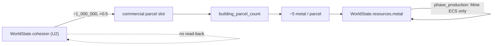

# FC-3 Fix Spec — `cohesion` × `resources.metal` (Commercial Build Demand)

**Date:** 2026-06-16  
**Status:** Spec only (no implementation)  
**Source finding:** `COUPLING_RECHECK.md` § FC-3  
**Scope:** `crates/engine/src/engine.rs` — `building_demand_signals`, `phase_buildings`, `phase_cohesion`, `phase_production`

---

## Verdict

**FC-3 is confirmed in code.** The coupling is real: high `WorldState.cohesion` drives a commercial construction demand signal that debits `WorldState.resources.metal` on a fixed cadence, while parcel allocation does not increase ECS `BuildingType::Mine` production. There is no return path from metal spend back into cohesion in the same chain; the loop **amplifies U2** (cohesion integrator drift) by adding a metal drain that does not scale supply.

This is **not** a closed positive-feedback loop on `cohesion` itself. It is a **one-way amplifier** on `resources.metal` keyed to an unbounded macro field.

---

## Code confirmation

### Tick order (one-tick lag on cohesion)

`phase_buildings` runs at step 10; `phase_cohesion` at step 20 (`tick_with_emergence_source`, ~1465–1485). Commercial demand therefore reads **end-of-previous-tick** `cohesion`, which dampens same-tick oscillation but not long-run drift.

### Feeding term — cohesion → commercial signal

```3171:3177:crates/engine/src/engine.rs
    DemandSignals {
        residential: ((population as f32) / cap).clamp(0.0, 1.0),
        commercial: ((cohesion as f32) / 1_000_000.0).clamp(0.0, 1.0),
        industrial: ((research_tier as f32) / 5.0).clamp(0.0, 1.0),
        civic: ((unrest as f32) / 500.0).clamp(0.0, 1.0),
    }
```

- Commercial parcel eligibility: `building_parcel_count` counts signals **> 0.5** (~3186–3196).
- Threshold crossing: `cohesion > 500_000` adds one commercial parcel slot per cadence (discrete step).

### Consumption — metal debit

```3198:3204:crates/engine/src/engine.rs
fn building_material_cost(parcel_count: usize) -> (Fixed, Fixed) {
    let n = parcel_count as i64;
    (
        Fixed::from_num(BUILDING_WOOD_PER_PARCEL * n),
        Fixed::from_num(BUILDING_METAL_PER_PARCEL * n),
    )
}
```

`BUILDING_METAL_PER_PARCEL = 5` (~3183). `phase_buildings` debits after allocation (~2098–2100).

### Cohesion integrator (U2) — unbounded standing stock

```1925:1934:crates/engine/src/engine.rs
    fn phase_cohesion(&mut self) {
        const COHESION_DECAY_DIVISOR: u64 = 500;
        let delta = cohesion_delta(self.state.belief, self.state.unrest);
        self.state.cohesion = (self.state.cohesion as i64 + delta).max(0) as u64;
        self.state.cohesion = self
            .state
            .cohesion
            .saturating_sub(self.state.cohesion / COHESION_DECAY_DIVISOR);
    }
```

Decay is proportional only; no ceiling. When `cohesion_delta > cohesion/500`, cohesion rises without asymptote (U2 per `UNBOUNDED_ACCUMULATORS.md`).

### Metal supply — ECS mines only; parcels do not feed back

```2322:2355:crates/engine/src/engine.rs
    fn phase_production(&mut self) {
        let mut food = Fixed::ZERO;
        let wood = Fixed::ZERO;
        let mut metal = Fixed::ZERO;
        // ...
        for (_, building) in self.world.query::<&Building>().iter() {
            match building.building_type {
                BuildingType::Farm => { food += Fixed::from_num(1); }
                BuildingType::Mine => { metal += Fixed::from_num(1); }
                // ...
            }
        }
        // ...
        self.state.resources.metal += metal_out;
    }
```

- `wood` inflow is always zero (pre-existing N1/FC-5).
- `building_graph` parcel allocation (`allocator.allocate` → `BuildingGraph`) has **no** code path that spawns ECS `Building` entities (`grep` across `crates/` confirms graph is protocol/display only).

### Existing gate (insufficient for FC-3)

`building_materials_affordable` (~3209–3211) is all-or-nothing on **total** `pending` parcels. It stops spend at zero metal but does **not** throttle the cohesion-driven commercial signal as stock falls; demand stays high until the full `pending` bundle is unaffordable.

---

## Loop path (confirmed)



| Stage | Mechanism |
|-------|-----------|
| Driver | U2 cohesion rises when `belief/200 − unrest/50 > cohesion/500` |
| Demand | `commercial` crosses 0.5 at `cohesion > 500_000`; up to 4 parcel types can fire together |
| Spend | Every `building_cadence(research_tier)` ticks (4–16), up to `5 × pending` metal |
| Supply | Fixed mine count × `production_yield_factor`; **not** increased by new parcels |
| Return | None into `cohesion`; indirect economy stress is out of scope for this chain |

---

## Precise minimal bounding fix

### Recommendation: **feeding-term cap** (metal gate on commercial signal)

| Item | Value |
|------|-------|
| **Field bounded** | `WorldState.resources.metal` (downward drain rate / depletion under high cohesion) |
| **Lever** | **Feeding term** — multiply commercial demand by a metal-availability factor |
| **Mechanism** | Cap (availability multiplier), not decay on the cohesion field |
| **Site** | `building_demand_signals` (~3164) + caller `phase_buildings` (~2028) |

### Change

1. Add constant:

```rust
/// Metal stock at which commercial demand reaches full strength (FR-CIV-0100 FC-3).
const BUILDING_COMMERCIAL_METAL_GATE: f32 = 500.0;
```

2. Extend `building_demand_signals` with `metal: Fixed`:

```rust
let cohesion_signal = ((cohesion as f32) / 1_000_000.0).clamp(0.0, 1.0);
let metal_factor = (metal.to_num::<f32>() / BUILDING_COMMERCIAL_METAL_GATE).clamp(0.0, 1.0);
// ...
commercial: cohesion_signal * metal_factor,
```

3. Pass `self.state.resources.metal` from `phase_buildings`.

### Why this is minimal

- **One coupling point** — only the `commercial` arm of FC-3; civic (unrest), industrial (research), residential (population) unchanged.
- **Negative feedback** — as metal falls, `commercial` drops; can fall below 0.5 and remove the discrete parcel step even when cohesion remains high.
- **No new integrator** — does not add metal spoilage (general N1 fix) or parcel→mine wiring (larger feature).
- **Small diff** — one constant, one parameter, two lines in `building_demand_signals`, one argument at call site.

### Why not the alternatives (for FC-3 specifically)

| Alternative | Rejected as primary because |
|-------------|----------------------------|
| `pending.min(2)` cap | Does not throttle the single commercial parcel when `cohesion > 500k` and only commercial fires (`pending == 1`). |
| `metal -= metal/500` decay | Addresses N1 globally, not the cohesion→commercial coupling. |
| Wire parcels → `BuildingType::Mine` | Correct long-term supply fix; out of scope for minimal FC-3 bound. |
| Hard cap on `cohesion` | Fixes U2 root; FC-3 spec targets the amplifier arm, not the integrator. |

### Numeric sanity (`BUILDING_COMMERCIAL_METAL_GATE = 500`)

| `cohesion` | `metal` | `commercial` | Parcel? |
|------------|---------|----------------|---------|
| 1_000_000 | 500+ | 1.0 | Yes |
| 1_000_000 | 250 | 0.5 | No (≤ 0.5) |
| 1_000_000 | 100 | 0.2 | No |
| 600_000 | 500+ | 0.6 | Yes |
| 600_000 | 200 | 0.24 | No |

Gate aligns with existing test stockpiles (`1_000` in `phase_buildings_gated_by_wood_and_metal_stockpile`) and typical mine-scale metal levels.

---

## Acceptance criteria

1. **Unit:** `building_demand_signals` with `cohesion = 1_000_000`, `metal = 100` → `commercial < 0.5`; with `metal = 1_000` → `commercial > 0.5`.
2. **Unit:** `building_demand_responds_to_state` updated for new `metal` parameter; civic/industrial/residential unchanged when only `metal` varies.
3. **Integration:** Long-run scenario with artificially high cohesion and limited mines — metal debit rate drops after stock falls below gate (commercial parcels stop firing before absolute affordability hard stop).
4. **Regression:** `phase_buildings_gated_by_wood_and_metal_stockpile` still passes (ample materials path unchanged when `metal ≥ gate`).

---

## Files to touch (implementation wave)

| File | Change |
|------|--------|
| `crates/engine/src/engine.rs` | Constant, `building_demand_signals` signature/body, `phase_buildings` call, tests ~4223 and new FC-3 test |

**Do not modify** in this wave: `phase_cohesion` (U2), `phase_production` mine loop, `civ_build` allocator — unless a follow-up chooses parcel→mine wiring.

---

## Traceability

| Ref | Link |
|-----|------|
| FC-3 finding | `COUPLING_RECHECK.md` § FC-3 |
| U2 baseline | `UNBOUNDED_ACCUMULATORS.md` § U2 |
| N1 metal sink context | `UNBOUNDED_ACCUMULATORS.md` § N1 (building debit partial relief) |
| FR | FR-CIV-0100 §3 emergence / downward causation (construction demand) |
