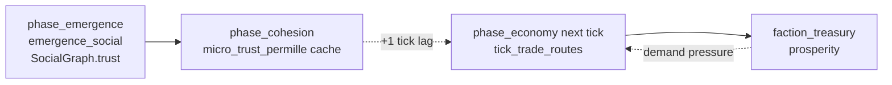

# M1-C Implementation Spec — Social Trust Density → Trade Permille Cache

**Status:** Implementation handoff (precise spec)  
**Source proposal:** `M1_MICROCULTURE_COUPLING.md` §3 map row **C**  
**Charter:** [M1] in `EMERGENCE_COUPLING_AUDIT.txt` — close micro social fabric → macro economy loop  
**Scope:** One coupling only. Cache field + economy consumer. No diplomacy, no cluster culture, no affinity homophily.

**Depends on:** M1-A landed (`micro_cohesion_delta` in `phase_cohesion` @ `engine.rs:1883–1889`).

---

## 1. Summary

Add upward causation from agent interpersonal trust (`SocialGraph` tie `trust`) into inter-faction trade volume by:

1. Aggregating mean positive trust across all directed ties each tick.
2. Writing the result into a new `WorldState` cache field `micro_trust_permille` at the **end** of `phase_cohesion`.
3. Consuming that cache in `tick_trade_routes` (called from `phase_economy`) on the **next** tick, because `phase_economy` (#5) runs **before** `phase_emergence` (#14), which is where `SocialGraph` trust is updated.

Pattern mirrors `agent_misery_unrest` (pure `hecs::World` scan) plus the tick-order cache pattern already called out for M1-C in `M1_IMPL_SPEC.md` §2.1.

---

## 2. `WorldState` field

### 2.1 New field

| Field | Type | Range | Location | Serde |
|-------|------|-------|----------|-------|
| `micro_trust_permille` | `u64` | `0..=250` | `WorldState` @ `crates/engine/src/engine.rs` (after `cohesion`, before `tech_unlocks`) | `#[serde(default)]` |

**Doc comment (required):**

```text
/// Cached micro social-trust trade bonus (per-mille above 1.0× volume, 0..=250).
/// Written at end of [`Simulation::phase_cohesion`] from agent [`SocialGraph`] ties;
/// consumed in [`Simulation::tick_trade_routes`] on the **next** tick because
/// `phase_economy` precedes `phase_emergence`. `#[serde(default)]` keeps older
/// `.civsave` files loadable (missing field → 0, no retroactive trade boost).
```

**Default:** `0` in `WorldState::default()` (`engine.rs:400–411`).

### 2.2 Cache semantics (not emergent accumulation)

| Property | Value |
|----------|-------|
| Writer | `phase_cohesion` — **overwrite** each tick from current ECS |
| Reader | `tick_trade_routes` inside `phase_economy` — read **stale** value from prior tick |
| Lag | Exactly **1 tick** between trust mutation (`emergence_social`) and economy effect |
| First tick | `0` (no boost until at least one `phase_cohesion` has run) |

Unlike `cohesion` or `dispossessed_permille`, this field is **not** integrated with decay/hysteresis — it is a per-tick snapshot of tie trust density.

### 2.3 Pin fields for tests

When asserting micro-trust-only trade effects, pin:

| Field | Pin value | Reason |
|-------|-----------|--------|
| `cohesion` | `0` | Isolate from macro cohesion trade boost |
| `unrest` | `0` | Isolate from `unrest_trade_factor` |
| `faction_relations` | neutral (`0.0`) | Isolate from `relation_trade_factor` |
| Arbitrage gap | equal stocks | Isolate from `trade_volume_multiplier` |

Set `micro_trust_permille` directly in unit/integration tests of the consumer; set `SocialGraph` ties when testing the producer.

---

## 3. ECS inputs (read-only)

### 3.1 Used

| Component | Field | Type | Source |
|-----------|-------|------|--------|
| `SocialGraph` | `ties[].trust` | `f32` ∈ `[-1.0, 1.0]` | `crates/agents/src/social.rs:58–68` |

**Query:** `world.query::<&SocialGraph>()` — iterate every agent graph, then every directed `Tie` in `graph.ties`.

**Trust mutation source (context, not read in aggregator):** `emergence_social` → `apply_social_event` (`emergence.rs:241–280`, `social.rs:152–182`). Cooperated events raise `trust`; decay multiplies by `0.992^gap` per tick (`social.rs:196`).

### 3.2 Per-tie normalization

`Tie.trust` is stored in `[-1, 1]` (`clamp11` in `social.rs:99–101`). Commerce semantics: **only non-negative reliability greases trade**.

```text
trust01 = tie.trust.clamp(0.0, 1.0)
```

Negative-trust ties (rivals, defectors) contribute `0` to the mean, not negative drag. Macro `unrest` already throttles commerce; M1-C adds a positive-only micro lift.

### 3.3 Not used (this slice)

| Input | Reason |
|-------|--------|
| `tie.familiarity` | Listed as optional weighted mean in proposal; deferred to follow-on |
| `tie.affinity` | Row E (homophily → unrest damp), not M1-C |
| `tie.kinship` | Genetic relatedness ≠ market reliability |
| `Psyche` | Row A (M1-A), separate sink |
| `ClusterMember` / `cluster_cultures` | Row B/D |

### 3.4 Directed-tie double counting

Each agent owns a **directed** `SocialGraph`. Mutual A→B and B→A edges are **both** counted. This measures **tie density** (how much reliable directed belief exists in the population), not unique unordered pairs. Intentional: dense reciprocal trust raises commerce more than a single asymmetric edge.

---

## 4. Aggregation formula

### 4.1 Pure function (new)

| Item | Value |
|------|-------|
| **Name** | `micro_social_trust_permille` |
| **Signature** | `fn micro_social_trust_permille(world: &hecs::World) -> u64` |
| **Location** | `crates/engine/src/engine.rs`, adjacent to `micro_cohesion_delta` (~2947) and `agent_misery_unrest` (~2931) |
| **Visibility** | `fn` (private) |

### 4.2 Constants

```text
MICRO_TRUST_SCALE: f32 = 250.0   // permille at trust_mean = 1.0
MICRO_TRUST_CAP:   u64 = 250     // max +25% trade volume from micro trust alone
```

### 4.3 Algorithm (deterministic)

```text
INPUT:  all agents with &SocialGraph in world
OUTPUT: u64 in [0, 250]

(n, sum) = fold over every directed tie in every SocialGraph:
    sum += tie.trust.clamp(0.0, 1.0)
    n   += 1

if n == 0:
    return 0

trust_mean = sum / (n as f32)          // ∈ [0.0, 1.0]
raw        = floor(trust_mean * MICRO_TRUST_SCALE) as u64
return     min(raw, MICRO_TRUST_CAP)
```

**No minimum-tie guard beyond `n == 0`:** a single high-trust tie is meaningful (unlike ideology variance, which needs `n ≥ 2`).

### 4.4 Reference values (unit-test oracle)

| Scenario | Ties (directed) | `trust_mean` | **Return** |
|----------|-----------------|--------------|------------|
| **HIGH_TRUST** | 12 ties, all `trust = 1.0` | `1.0` | **`250`** |
| **LOW_TRUST** | 12 ties, all `trust = 0.0` | `0.0` | **`0`** |
| **MIXED** | 6 × `1.0`, 6 × `0.0` | `0.5` | **`125`** |
| **PARTIAL** | 8 ties, all `trust = 0.4` | `0.4` | **`100`** |
| **NEGATIVE** | 4 ties, all `trust = -1.0` | `0.0` (clamped) | **`0`** |
| **EMPTY** | no `SocialGraph` / no ties | — | **`0`** |

**Tuning intent** (from proposal §3 row C):

- Saturated interpersonal reliability (`trust_mean = 1`) → `+250` permille → **+25%** trade volume (half the macro cohesion ceiling of `+500` permille / +50%).
- Micro and macro boosts **stack additively** on the permille scale (see §5.3) but share a combined cap so the loop cannot run away.

### 4.5 Optional extraction (follow-on, not blocking M1-C)

| Candidate | Crate | Notes |
|-----------|-------|-------|
| `social_trust_density(ties: &[f32]) -> f32` | `civ-emergence-metrics` | Pure f32 mean; engine wrapper applies scale → `u64` |
| Familiarity-weighted mean | `civ-emergence-metrics` | `Σ(trust01 · familiarity) / Σ(familiarity)` when `Σfamiliarity > 0` |

---

## 5. Phase wiring

### 5.1 Tick-order problem

```text
Tick N:
  #5  phase_economy      → tick_trade_routes READS micro_trust_permille (written tick N-1)
  #14 phase_emergence    → emergence_social WRITES SocialGraph.trust
  #19 phase_cohesion     → WRITES micro_trust_permille (fresh aggregate)
```

Cache at end of `phase_cohesion` is the **latest** trust state after emergence on the same tick; economy on tick **N+1** sees it. No phase reorder required.

### 5.2 Producer phase

| Phase | File:Line | Tick # | Reads | Writes |
|-------|-----------|--------|-------|--------|
| **`phase_cohesion`** | `engine.rs:1879–1889` | **#19** | `world` → `SocialGraph` | **`state.micro_trust_permille`** |

**Prerequisite:** `phase_emergence` (#14) must run earlier in the same `tick()` so `SocialGraph` ties are current.

**Exact edit** — append after cohesion decay (`engine.rs:1885–1889`):

```rust
self.state.micro_trust_permille = micro_social_trust_permille(&self.world);
```

**Unchanged:** `cohesion_delta`, `micro_cohesion_delta`, `COHESION_DECAY_DIVISOR` logic above the new line.

### 5.3 Consumer phase

| Phase | Subroutine | File:Line | Tick # | Reads | Effect |
|-------|------------|-----------|--------|-------|--------|
| **`phase_economy`** | `tick_trade_routes` | `engine.rs:2662–2697` | **#5** (next tick) | **`state.micro_trust_permille`**, `state.cohesion`, `state.unrest`, routes | Trade `quantity` multiplier |

**Current consumer** (`engine.rs:2664–2665`):

```rust
let unrest_factor = unrest_trade_factor(self.state.unrest);
let cohesion_factor = cohesion_trade_factor(self.state.cohesion);
```

**Replace** `cohesion_factor` computation with a combined helper:

```rust
let society_factor = society_trade_factor(self.state.cohesion, self.state.micro_trust_permille);
// ...
* society_factor   // was * cohesion_factor
```

### 5.4 Combined trade-factor helper (new)

Refactor `cohesion_trade_factor` → `society_trade_factor` (keep old name as thin wrapper or deprecate in-place).

```rust
/// Per-mille trade boost from agent tie trust alone.
const MICRO_TRUST_CAP_PERMILLE: u64 = 250;
/// Combined macro+micro trade boost cap (cohesion 500 + micro 250).
const SOCIETY_TRADE_BOOST_CAP_PERMILLE: i64 = 750;

/// Downward-causation policy (FR-CIV-0100 §3): macro cohesion AND cached micro
/// interpersonal trust lift trade volume. Returns factor in [1.0, 1.75].
fn society_trade_factor(cohesion: u64, micro_trust_permille: u64) -> Fixed {
    let cohesion_boost = (cohesion / COHESION_PER_TRADE_PERMILLE)
        .min(COHESION_TRADE_CAP_PERMILLE as u64) as i64;
    let micro_boost = micro_trust_permille.min(MICRO_TRUST_CAP_PERMILLE) as i64;
    let total = (cohesion_boost + micro_boost).min(SOCIETY_TRADE_BOOST_CAP_PERMILLE);
    Fixed::from_num(1_000 + total) / Fixed::from_num(1_000)
}
```

**Backward compatibility:** `society_trade_factor(c, 0)` must equal current `cohesion_trade_factor(c)` for all `c`.

**Volume formula** (unchanged except factor name):

```text
quantity = route.volume
         × trade_volume_multiplier(available, to_stock)
         × unrest_trade_factor(unrest)
         × society_trade_factor(cohesion, micro_trust_permille)
         × relation_trade_factor(relation)
```

### 5.5 Closed loop (multi-tick)



Indirect loop: higher trade → treasury → market demand (`engine.rs:2648–2657`). Bounded by `SOCIETY_TRADE_BOOST_CAP_PERMILLE` and existing `unrest_trade_factor` floor.

---

## 6. Unit tests

### 6.1 Primary test — pure aggregator

| Item | Value |
|------|-------|
| **Name** | `micro_social_trust_permille_aggregates_tie_trust` |
| **Module** | `crates/engine/src/engine.rs` → `mod tests` (~3407) |
| **Placement** | Adjacent to `cohesion_trade_factor_boosts_to_capped_ceiling` (~4224) |
| **FR cite** | `FR-CIV-0100 §3` emergence |

**Test body (exact structure):**

```rust
/// FR-CIV-0100 §3 — mean positive agent tie trust caches a trade permille bonus.
#[test]
fn micro_social_trust_permille_aggregates_tie_trust() {
    use civ_agents::{SocialGraph, Tie};

    fn graph_with_trusts(trusts: &[f32]) -> SocialGraph {
        let ties = trusts
            .iter()
            .enumerate()
            .map(|(i, &trust)| Tie {
                other: (i + 1) as u64,
                kinship: 0.0,
                familiarity: 0.5,
                affinity: 0.0,
                trust,
                last_seen: 0,
            })
            .collect();
        SocialGraph { ties }
    }

    fn spawn_graphs(world: &mut hecs::World, trusts: &[f32]) {
        world.spawn((graph_with_trusts(trusts),));
    }

    // EMPTY
    assert_eq!(micro_social_trust_permille(&hecs::World::new()), 0);

    // NEGATIVE: clamped to 0 before mean
    let mut negative = hecs::World::new();
    spawn_graphs(&mut negative, &[-1.0; 4]);
    assert_eq!(micro_social_trust_permille(&negative), 0);

    // HIGH_TRUST: 12 directed ties at 1.0 → 250
    let mut high = hecs::World::new();
    spawn_graphs(&mut high, &[1.0; 12]);
    assert_eq!(
        micro_social_trust_permille(&high),
        250,
        "saturated trust should max the permille cache"
    );

    // MIXED: mean 0.5 → 125
    let mut mixed = hecs::World::new();
    spawn_graphs(&mut mixed, &[1.0, 1.0, 1.0, 1.0, 1.0, 1.0, 0.0, 0.0, 0.0, 0.0, 0.0, 0.0]);
    assert_eq!(micro_social_trust_permille(&mixed), 125);

    assert!(
        micro_social_trust_permille(&high) > micro_social_trust_permille(&mixed),
        "denser trust must cache a higher permille"
    );
}
```

### 6.2 Secondary test — trade factor combiner

| Item | Value |
|------|-------|
| **Name** | `society_trade_factor_stacks_micro_trust_with_cohesion` |
| **Placement** | Replace/extend `cohesion_trade_factor_boosts_to_capped_ceiling` (~4224) |

```rust
#[test]
fn society_trade_factor_stacks_micro_trust_with_cohesion() {
    // Backward compat: micro=0 matches legacy cohesion-only
    assert_eq!(
        society_trade_factor(400, 0),
        cohesion_trade_factor(400)
    );
    assert_eq!(society_trade_factor(0, 0), Fixed::from_num(1));

    let cohesion_only = society_trade_factor(2_000, 0);
    let micro_only = society_trade_factor(0, 250);
    let both = society_trade_factor(2_000, 250);

    assert!(micro_only > Fixed::from_num(1));
    assert!(both > cohesion_only);
    assert!(both > micro_only);
    assert!(both <= Fixed::from_num(1_750) / Fixed::from_num(1_000)); // 1.75 cap
}
```

### 6.3 Integration test — cache write + consumer

| Item | Value |
|------|-------|
| **Name** | `micro_trust_permille_boosts_trade_volume` |
| **Pattern** | `Simulation::with_seed(42)`; pin macro trade drivers; compare treasury movement |

**Setup:**

1. Pin `sim.state.cohesion = 0`, `sim.state.unrest = 0`.
2. Set `faction_relations` to neutral for the default trade route pair.
3. Ensure exporter stock ≫ importer stock (or equal stocks if testing factor only via direct permille injection).
4. Record `to_treasury_before` for the importing faction.

**Case A — direct consumer (isolates lag):**

```text
sim.state.micro_trust_permille = 250;
sim.tick_trade_routes();
ΔA = to_treasury_after - to_treasury_before

sim.state.micro_trust_permille = 0;
reset treasuries/stocks;
sim.tick_trade_routes();
ΔB = ...

assert!(ΔA > ΔB)
```

**Case B — producer round-trip (validates cache write):**

```text
Inject HIGH_TRUST SocialGraph fixtures on ≥8 civilian entities.
sim.state.cohesion = 0; sim.state.unrest = 0;
sim.phase_cohesion();
assert_eq!(sim.state.micro_trust_permille, 250);

Advance tick (or call phase_economy on a sim whose cache was pre-written).
Assert trade volume / treasury delta exceeds zero-trust control.
```

### 6.4 Existing tests that must not regress

| Test | Line | Expectation |
|------|------|-------------|
| `cohesion_trade_factor_boosts_to_capped_ceiling` | ~4224 | Still passes via `society_trade_factor(c, 0)` equivalence |
| `unrest_trade_factor_*` | ~4210 | Unchanged |
| `relations_bias_trade_volume` | ~4234 | Unchanged |
| Default `Simulation::with_seed` economy trajectory | — | First-tick `micro_trust_permille = 0` → no change until cohesion phase populates cache |

---

## 7. Files to touch

| File | Change |
|------|--------|
| `crates/engine/src/engine.rs` | `WorldState.micro_trust_permille`; `micro_social_trust_permille`; `society_trade_factor`; write in `phase_cohesion`; read in `tick_trade_routes`; tests |
| `crates/civ-emergence-metrics/src/dashboard.rs` | **Optional** later: `social_trust_density` tile (observability only) |

**Do not modify:** `phase_emergence`, `SocialGraph` schema, JSON-RPC `sim.snapshot` shape (field is internal cache; add to snapshot only if a dashboard tile is added later), `cohesion` accumulation logic.

---

## 8. Acceptance criteria

- [ ] `micro_social_trust_permille` returns `0` when no ties exist.
- [ ] HIGH_TRUST fixture (12 ties @ `1.0`) returns exactly `250`; MIXED (6/6) returns exactly `125`.
- [ ] Negative tie trust contributes `0` after per-tie clamp (NEGATIVE fixture → `0`).
- [ ] `phase_cohesion` overwrites `micro_trust_permille` each tick from current `SocialGraph`.
- [ ] `tick_trade_routes` uses `society_trade_factor(cohesion, micro_trust_permille)`; `society_trade_factor(c, 0) == cohesion_trade_factor(c)`.
- [ ] Combined boost capped at `750` permille (factor `1.75`).
- [ ] `#[serde(default)]` on new field; older `.civsave` files load with `micro_trust_permille = 0`.
- [ ] `cargo test -p civ-engine micro_social_trust` passes.

---

## 9. Non-goals (M1-C)

- Familiarity-weighted trust mean (proposal parenthetical)
- `cluster_cultures` → `phase_belief` (M1-B)
- Inter-cluster cultural distance → diplomacy (M1-D)
- Affinity homophily → `cohesion_unrest_damp` (M1-E)
- Eliminating the 1-tick lag by reordering `phase_economy` (out of scope; cache is the stable fix)
- Exposing `micro_trust_permille` on `sim.snapshot` / web HUD (optional observability follow-on)

---

## 10. References

| Artifact | Path |
|----------|------|
| Proposal row C | `M1_MICROCULTURE_COUPLING.md` §3, §7 WBS |
| M1-A spec (cache contrast) | `M1_IMPL_SPEC.md` §2.1 |
| `phase_economy` / `tick_trade_routes` | `crates/engine/src/engine.rs:2619–2697` |
| `cohesion_trade_factor` | `crates/engine/src/engine.rs:3204–3215` |
| `phase_cohesion` | `crates/engine/src/engine.rs:1879–1889` |
| `emergence_social` | `crates/engine/src/emergence.rs:241–280` |
| `Tie` / `SocialGraph` | `crates/agents/src/social.rs:58–93` |
| Tick order | `crates/engine/src/engine.rs:1424–1451` |
| Coupling audit M1 | `EMERGENCE_COUPLING_AUDIT.txt` |
