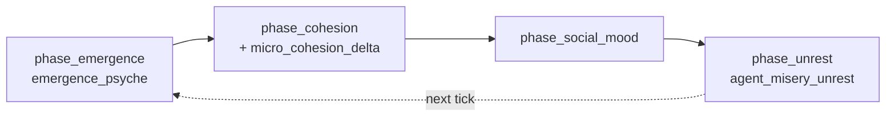

# M1-A Implementation Spec — Ideology Consensus → Cohesion Delta

**Status:** Implementation handoff (precise spec)  
**Source proposal:** `M1_MICROCULTURE_COUPLING.md` §4 (map row **A**)  
**Charter:** [M1] in `EMERGENCE_COUPLING_AUDIT.txt` — close micro ideology → macro society loop  
**Scope:** One coupling only. No `SocialGraph` / `cluster_cultures` in this slice.

---

## 1. Summary

Add upward causation from agent ideology (`Psyche.beliefs[0]`) into macro social cohesion by extending the existing per-tick cohesion delta in `phase_cohesion`. Pattern mirrors `agent_misery_unrest` → `phase_unrest` (pure `hecs::World` scan, capped `i64` return, no new persisted macro field).

---

## 2. `WorldState` field

### 2.1 New field

**None.** M1-A deliberately does **not** add a `WorldState` field.

| Decision | Rationale |
|----------|-----------|
| No new scalar | Avoids save-format churn and duplicate observability; dashboard already samples ideology via `EmergenceSample` |
| No cache field | Unlike M1-C (`micro_trust_permille` for economy), cohesion consumer runs **after** emergence in the same tick |

### 2.2 Existing sink (write target)

| Field | Type | Location | Role |
|-------|------|----------|------|
| `cohesion` | `u64` | `WorldState` @ `crates/engine/src/engine.rs:342` | Accumulated social-fabric strength; updated only in `phase_cohesion` |

**Pin fields for tests** (macro drivers isolated): `belief = 0`, `unrest = 0`, `cohesion = 0` before asserting micro-only effects.

### 2.3 Naming collision (do not conflate)

| Symbol | Meaning |
|--------|---------|
| `WorldState.belief` | Macro worship/faith scalar (`u64`), updated in `phase_belief` |
| `Psyche.beliefs[0]` | Micro collectivist/individualist axis (`f32`), updated in `emergence_psyche` |

M1-A reads **only** `Psyche.beliefs[0]`. It does **not** write `WorldState.belief`.

---

## 3. ECS inputs (read-only)

### 3.1 Used

| Component | Field | Type | Source |
|-----------|-------|------|--------|
| `Psyche` | `beliefs[0]` | `f32` | `crates/agents/src/psyche.rs:73` (`PSYCHE_DIM = 4` @ line 15) |

**Query:** `world.query::<&Psyche>()` — same as `agent_misery_unrest` @ `engine.rs:2933–2936`.

**Axis semantics:** Documented in `crates/engine/src/emergence_metrics.rs:388–393` as the collectivist/individualist ideology axis (dashboard `ideology_homophily` input). Use **raw** `psyche.beliefs[0]` (no `[-1, 1]` clamp used by dashboard extraction).

### 3.2 Not used (this slice)

| Component | Reason |
|-----------|--------|
| `SocialGraph` | Row A is population-level ideology variance, not tie topology |
| `ClusterMember` / `EmergenceState.cluster_cultures` | Deferred to M1-B |
| `Mood` | Already coupled via `agent_misery_unrest` |

---

## 4. Aggregation formula

### 4.1 Pure function (new)

| Item | Value |
|------|-------|
| **Name** | `micro_cohesion_delta` |
| **Signature** | `fn micro_cohesion_delta(world: &hecs::World) -> i64` |
| **Location** | `crates/engine/src/engine.rs`, immediately above or below `agent_misery_unrest` (~2931) and `cohesion_delta` (~3156) |
| **Visibility** | `fn` (private), same as `agent_misery_unrest` |

### 4.2 Constants

```text
MICRO_BIND_CAP: i64 = 12    // max positive bind per tick from micro consensus
MICRO_FRAY_CAP: i64 = 18    // max negative fray per tick from micro polarization
MIN_AGENTS:     u32 = 2     // below this, return 0 (mirror psyche_stability guard)
CONSENSUS_SCALE: f32 = 4.0 // maps var=0.25 on [0,1] → full polarization
```

### 4.3 Algorithm (deterministic)

```text
INPUT:  all agents with &Psyche in world
OUTPUT: signed i64 in [-18, +12]

(n, sum, sum_sq) = fold over query:
    x = psyche.beliefs[0]
    n += 1
    sum += x
    sum_sq += x * x

if n < 2:
    return 0

mean = sum / n
var  = max((sum_sq / n) - mean², 0.0)     // population variance; floor at 0 for float noise

consensus = 1.0 - (CONSENSUS_SCALE * var).clamp(0.0, 1.0)

micro_bind = floor(consensus * MICRO_BIND_CAP) as i64
micro_fray = floor((1.0 - consensus) * MICRO_FRAY_CAP) as i64

return micro_bind - micro_fray
```

### 4.4 Reference values (unit-test oracle)

| Scenario | `beliefs[0]` per agent (n=8) | `var` | `consensus` | `micro_bind` | `micro_fray` | **Return** |
|----------|------------------------------|-------|-------------|--------------|--------------|------------|
| **CONSENSUS** | all `0.85` | `0.0` | `1.0` | `12` | `0` | **`+12`** |
| **POLARIZED** | alternate `0.0`, `1.0` | `0.25` | `0.0` | `0` | `18` | **`-18`** |
| **MILD_SPLIT** | alternate `0.05`, `0.95` | `0.2025` | `0.19` | `2` | `14` | **`-12`** |
| **EMPTY** | no `Psyche` | — | — | — | — | **`0`** |
| **SINGLE** | n=1 | — | — | — | — | **`0`** |

**Tuning intent** (from proposal §4.2):

- Unanimous ideology: `+12` bind ≈ macro `belief` of `2_400` via `cohesion_delta` (`belief / 200`).
- Max spread (`var ≥ 0.25`): `-18` fray ≈ macro `unrest` of `900` via `cohesion_delta` (`unrest / 50`).
- Fray cap slightly exceeds bind cap so micro alone cannot run cohesion to infinity.

### 4.5 Optional extraction (follow-on, not blocking M1-A)

| Candidate | Crate | Notes |
|-----------|-------|-------|
| `ideology_consensus(ideologies: &[f32]) -> f32` | `civ-emergence-metrics` | Pure f32; engine wrapper applies caps → `i64` (same split as dashboard vs policy) |

---

## 5. Phase wiring

### 5.1 Consumer phase

| Phase | File:Line | Tick # (of 24) | Reads | Writes |
|-------|-----------|------------------|-------|--------|
| **`phase_cohesion`** | `crates/engine/src/engine.rs:1879–1889` | **#19** | `state.belief`, `state.unrest`, **`world` → `Psyche`** | **`state.cohesion`** |

**Prerequisite:** `phase_emergence` (#14) must run earlier in the same `tick()` so `Psyche.beliefs` are current (`engine.rs:1443` → `1448`).

### 5.2 Exact edit

**Before** (`engine.rs:1883–1884`):

```rust
let delta = cohesion_delta(self.state.belief, self.state.unrest);
self.state.cohesion = (self.state.cohesion as i64 + delta).max(0) as u64;
```

**After:**

```rust
let delta = cohesion_delta(self.state.belief, self.state.unrest)
    + micro_cohesion_delta(&self.world);
self.state.cohesion = (self.state.cohesion as i64 + delta).max(0) as u64;
```

**Unchanged:** `COHESION_DECAY_DIVISOR = 500` saturation decay on lines 1885–1888.

### 5.3 Existing macro term (context)

```rust
fn cohesion_delta(belief: u64, unrest: u64) -> i64 {
    let bind = (belief / COHESION_BELIEF_DIVISOR) as i64;  // divisor 200
    let fray = (unrest / COHESION_UNREST_DIVISOR) as i64;  // divisor 50
    bind - fray
}
```

**Combined per tick:** `Δcohesion = cohesion_delta(belief, unrest) + micro_cohesion_delta(world)`, then decay.

### 5.4 Closed loop (same tick + next tick)



---

## 6. Unit tests

### 6.1 Primary test

| Item | Value |
|------|-------|
| **Name** | `micro_ideology_consensus_biases_cohesion` |
| **Module** | `crates/engine/src/engine.rs` → `mod tests` (starts ~3407) |
| **Placement** | Adjacent to `agent_misery_raises_unrest` (~3746) and `cohesion_delta_balances_belief_against_unrest` (~4077) |
| **FR cite** | `FR-CIV-0100 §3` emergence (same as misery/cohesion tests) |

### 6.2 Test body (exact structure)

```rust
/// FR-CIV-0100 §3 — upward causation: shared micro ideology binds macro cohesion;
/// polarization frays it. Pure-function assertions; no tick RNG.
#[test]
fn micro_ideology_consensus_biases_cohesion() {
    use civ_agents::{Mood, PSYCHE_DIM, Temperament};

    fn psyche_with_belief0(b0: f32) -> Psyche {
        let mut beliefs = [0.5_f32; PSYCHE_DIM];
        beliefs[0] = b0;
        Psyche {
            drives: [0.0; PSYCHE_DIM],
            temperament: Temperament::neutral(),
            mood: Mood { valence: 0.0, arousal: 0.0 },
            beliefs,
            maturity: 0.5,
        }
    }

    fn spawn_ideologies(world: &mut hecs::World, beliefs0: &[f32]) {
        for &b0 in beliefs0 {
            world.spawn((psyche_with_belief0(b0),));
        }
    }

    // Regression: no Psyche → no micro effect
    assert_eq!(micro_cohesion_delta(&hecs::World::new()), 0);

    // Guard: single agent → no variance
    let mut lone = hecs::World::new();
    lone.spawn((psyche_with_belief0(0.85),));
    assert_eq!(micro_cohesion_delta(&lone), 0);

    // CONSENSUS: 8 × beliefs[0] = 0.85 → +12
    let mut consensus = hecs::World::new();
    spawn_ideologies(&mut consensus, &[0.85; 8]);
    assert_eq!(
        micro_cohesion_delta(&consensus),
        12,
        "unanimous ideology should max-bind cohesion"
    );

    // POLARIZED: alternate 0.0 / 1.0 → var=0.25 → -18
    let mut polarized = hecs::World::new();
    spawn_ideologies(
        &mut polarized,
        &[0.0, 1.0, 0.0, 1.0, 0.0, 1.0, 0.0, 1.0],
    );
    assert_eq!(
        micro_cohesion_delta(&polarized),
        -18,
        "max-spread ideology should max-fray cohesion"
    );

    assert!(
        micro_cohesion_delta(&consensus) > micro_cohesion_delta(&polarized),
        "consensus must bind more than polarization frays"
    );
}
```

### 6.3 Integration test (same file, optional second `#[test]`)

| Item | Value |
|------|-------|
| **Name** | `micro_ideology_consensus_biases_cohesion_integration` |
| **Pattern** | Two `Simulation::with_seed(42)` instances; replace default civilian psyches or spawn isolated agents; pin `sim.state.belief = 0`, `unrest = 0`, `cohesion = 0`; call `sim.phase_cohesion()` only (not full tick) |
| **Assert** | `sim_consensus.cohesion() > sim_polarized.cohesion()` |
| **Stronger variant** | One full `tick()` with pinned market/unrest drivers; assert same inequality on `cohesion()` after tick #1 |

### 6.4 Existing tests that must not regress

| Test | Line | Expectation |
|------|------|-------------|
| `cohesion_delta_balances_belief_against_unrest` | ~4077 | Unchanged (macro-only helper) |
| `agent_misery_raises_unrest` | ~3746 | Unchanged |
| Default `Simulation::with_seed` cohesion trajectory | — | May shift slightly when default civilians have non-zero belief variance; if flaky, pin psyches in integration test only |

---

## 7. Files to touch

| File | Change |
|------|--------|
| `crates/engine/src/engine.rs` | Add `micro_cohesion_delta`; wire `phase_cohesion`; add test(s) |
| `crates/civ-emergence-metrics/src/dashboard.rs` | **Optional** later: extract `ideology_consensus` pure fn (not required for M1-A) |

**Do not modify:** `WorldState` struct, save schema, JSON-RPC snapshot shape, `phase_emergence`.

---

## 8. Acceptance criteria

- [ ] `micro_cohesion_delta` returns `0` when `n < 2` or no `Psyche` entities.
- [ ] CONSENSUS fixture returns exactly `+12`; POLARIZED (0/1 alternate, n=8) returns exactly `-18`.
- [ ] `phase_cohesion` adds micro term to existing `cohesion_delta` before decay.
- [ ] `cargo test -p civ-engine micro_ideology_consensus` passes.
- [ ] No new `WorldState` fields; `.civsave` compatibility preserved.

---

## 9. Non-goals (M1-A)

- `cluster_cultures` → `phase_belief` (M1-B)
- `SocialGraph.trust` → trade (M1-C)
- Inter-cluster `cultural_distance` → diplomacy (M1-D)
- Affinity homophily → `cohesion_unrest_damp` (M1-E)
- Renaming `WorldState.belief` vs `Psyche.beliefs`

---

## 10. References

| Artifact | Path |
|----------|------|
| Proposal | `M1_MICROCULTURE_COUPLING.md` |
| `phase_cohesion` / `cohesion_delta` | `crates/engine/src/engine.rs:1879–1889`, `3156–3160` |
| `agent_misery_unrest` (pattern) | `crates/engine/src/engine.rs:2931–2942` |
| `Psyche` | `crates/agents/src/psyche.rs:65–76` |
| Dashboard ideology axis | `crates/engine/src/emergence_metrics.rs:388–420` |
| Tick order | `crates/engine/src/engine.rs:1419–1451` |
| Coupling audit M1 | `EMERGENCE_COUPLING_AUDIT.txt` |
