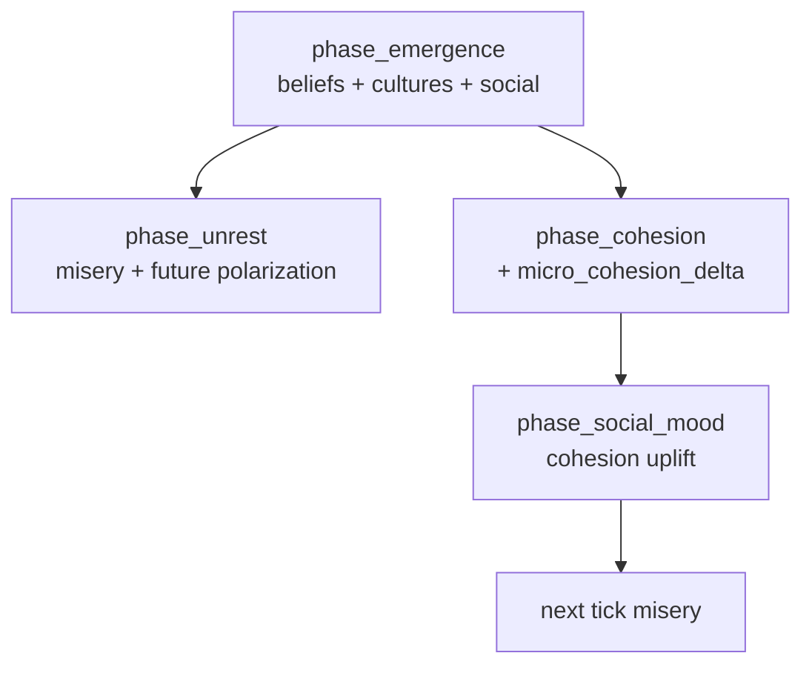

# M1 — Micro-Culture → Macro Society Coupling Proposal

**Status:** Research / design handoff (read-only audit, 2026-06-16)  
**Charter gap:** [M1] in `EMERGENCE_COUPLING_AUDIT.txt` — agent culture/psyche/social state does not shape macro `belief` / `unrest` / `cohesion` / diplomacy / trade.  
**Scope:** Close the micro→macro loop with deterministic, O(n)-cheap aggregations. No source changes in this artifact.

---

## 1. Survey — what exists today

### 1.1 `phase_emergence` (MOAT, ECS-only writes)

**File:** `crates/engine/src/emergence.rs`  
**Tick position:** #14 of 24, after `phase_life`, before macro society tail.

| Sub-phase | Agent / emergence state written | WorldState touched |
|-----------|----------------------------------|--------------------|
| `emergence_ensure_genomes` | `Dna` on civilians | — |
| `emergence_culture` | `EmergenceState.cluster_cultures: BTreeMap<u64, CultureProfile>` | — |
| `emergence_social` | `SocialGraph` ties (`familiarity`, `affinity`, `trust`, `kinship`) via cluster co-presence events | — |
| `emergence_psyche` | `Psyche` (`beliefs[4]`, `mood`, `temperament`, `maturity`) from DNA + culture exposure through ties | — |
| `emergence_genetics_sentience` | `sentient_agents` set | — |
| `emergence_legends` / `emergence_civ_ai` | saga graph, feed buffers | — |

**Culture path:** `ClusterMember.cluster` → `cluster_cultures[cluster_id].traits` drifts via `drift_populations` + synthetic inter-cluster `ContactEdge`s.  
**Belief path:** `belief_culture_exposure` blends neighbor cluster traits weighted by `SocialGraph` tie `familiarity`; `update_beliefs` nudges `Psyche.beliefs` toward exposure.  
**Social path:** same-cluster pairs get `Coexisted` / `Cooperated` events; graphs decay by tick.

### 1.2 Macro society phases (WorldState scalars)

**File:** `crates/engine/src/engine.rs`  
**Tick position:** #16–#22, all **after** emergence.

| Phase | Primary writes | Current inputs (macro) | Agent/micro inputs today |
|-------|----------------|------------------------|---------------------------|
| `phase_belief` | `state.belief` | `population`, `temple_level`, decay | **None** |
| `phase_unrest` | `state.unrest`, `belief` (hardship) | food price, energy, inequality, overcrowding, dispossession, garrison, cohesion damp, research | **`agent_misery_unrest`** ← mean negative `Psyche.mood.valence` only |
| `phase_cohesion` | `state.cohesion` | `belief`, `unrest`, decay | **None** |
| `phase_social_mood` | `Psyche.mood.valence` | `cohesion` | Downward only (macro→micro) |
| `phase_diplomacy` (every 500 ticks) | treasuries, `faction_relations` | treasury disparity, `belief+cohesion`, `pair_unrest`, relation bias | **None** |
| `phase_economy` (earlier, #5) | treasuries, prices, energy | unrest/cohesion trade factors | **None**; runs **before** emergence → micro trust would lag 1 tick unless cached |

**Naming collision:** `state.belief` is the **divine-powers worship scalar** (`population/2000 + temple − decay`). It is **not** `Psyche.beliefs[]`. The audit’s “belief silo” is real: micro ideology and macro faith share a word only.

### 1.3 Observability without feedback

`crates/engine/src/emergence_metrics.rs` + `crates/civ-emergence-metrics/src/dashboard.rs` already compute read-only tiles from the same ECS fields:

- `ideology_homophily` ← `Psyche.beliefs[0]` (documented as collectivist/individualist axis)
- `psyche_stability` ← variance of `Mood.valence`
- `cluster_entropy` ← `ClusterMember` population sizes

These metrics **do not** feed `phase_cohesion`, `phase_unrest`, or diplomacy. They are the natural extraction layer for M1 aggregators.

### 1.4 Existing partial loop

```
emergence_psyche → Psyche.mood.valence
       ↓ (same tick)
phase_unrest → agent_misery_unrest → state.unrest
       ↓
phase_cohesion → state.cohesion
       ↓ (same tick)
phase_social_mood → Psyche.mood.valence (+uplift)
```

**Missing:** `cluster_cultures`, `Psyche.beliefs`, `SocialGraph` trust/affinity, inter-cluster cultural distance.

---

## 2. Design goals

1. **Deterministic & cheap:** integer/fixed-friendly, single pass O(agents) or O(ties), per-tick caps (mirror `agent_misery_unrest`, `inequality_unrest`).
2. **Same-tick freshness:** aggregate in phases **after** `phase_emergence` (#14).
3. **Reuse metrics math:** prefer `civ-emergence-metrics` pure functions over new statistical machinery.
4. **Bounded feedback:** per-tick bind/fray caps so M1 does not reopen unbounded accumulator risks (audit U1–U4).
5. **Charter alignment:** ideology/culture/social fabric shapes collective behavior; do not hardcode outcomes.

---

## 3. Optimal aggregation map (full M1 closure)

Recommended micro signals, deterministic aggregations, and macro sinks. Ordered by implementation leverage.

| # | Micro signal | Aggregation (deterministic, cheap) | Macro sink | Mechanism | Tick phase |
|---|--------------|-----------------------------------|------------|-----------|------------|
| **A** | **Ideology dispersion** — population variance of `Psyche.beliefs[0]` ∈ [0,1] | `consensus = 1 − clamp(4·var, 0, 1)`; `micro_bind = ⌊consensus · 12⌋`; `micro_fray = ⌊(1−consensus)·18⌋` | **`cohesion_delta`** | Shared ideology binds social fabric; polarization frays it (parallel to macro belief bind / unrest fray) | `phase_cohesion` |
| **B** | **Belief–culture alignment** — per agent `1 − cultural_distance(beliefs, cluster_traits)` for agents with `ClusterMember` + cluster culture | population mean → `worship_efficiency_permille` | **`phase_belief` inflow** | Agents whose personal beliefs match settlement culture sustain collective faith; mismatch weakens worship yield | `phase_belief` |
| **C** | **Social trust density** — mean `Tie.trust` over all ties (or familiarity-weighted mean) | `trust_mean ∈ [0,1]`; `trust_bonus_permille = ⌊trust_mean · 250⌋` capped +250 | **`cohesion_trade_factor`** (via effective cohesion or direct permille add) | Interpersonal reliability greases commerce (“market trust”) | `phase_economy` **next tick** or cached `micro_trust_permille` written end of `phase_cohesion` |
| **D** | **Cross-cluster cultural distance** — mean `cultural_distance(traits_a, traits_b)` over cluster pairs with contact | `distance_mean ∈ [0,1]`; `culture_war_erosion = ⌊distance_mean · 3000⌋` capped | **`diplomacy_conflict_threshold`** (subtract) | Divergent settlement cultures lower war tolerance (culture clash) | `phase_diplomacy` |
| **E** | **Affinity homophily** — share of ties where `affinity > 0` and same `ClusterMember.cluster` | `homophily ∈ [0,1]` | **`cohesion_unrest_damp`** divisor bonus | Dense positive within-cluster ties damp scarcity-driven unrest rise | `phase_unrest` |
| **F** | **Ideology polarization** (same variance as A) | `polarization_unrest = ⌊var · 40⌋` capped 20 | **`phase_unrest` delta** | Political fragmentation adds unrest distinct from material misery | `phase_unrest` |

**Priority rationale:** **A** closes the core charter sentence (“ideology drift shapes collective behavior”) with one function, one test, no faction/cluster ID mapping. **B** links `cluster_cultures` without diplomacy refactor. **C–F** are second-wave; **C** needs tick-order cache because `phase_economy` precedes emergence.

---

## 4. Recommended first coupling (implement this one)

### 4.1 Choice: **Ideology consensus → `cohesion_delta`** (map row **A**)

**Why this first**

- Extends an existing emergence policy (`cohesion_delta`) rather than inventing a new macro field.
- Uses `Psyche.beliefs[0]` already documented in `emergence_metrics.rs` as the ideology axis.
- Runs in `phase_cohesion` (#19), **after** `emergence_psyche` updates beliefs the same tick.
- Mirrors the proven `agent_misery_unrest` pattern: pure function over `hecs::World`, capped i64 return.
- Does not require cluster↔faction alignment (unlike diplomacy row D — that is M4 territory).
- Creates a closed loop with existing downward path: micro beliefs → cohesion → `phase_social_mood` → mood → misery unrest.

### 4.2 Exact fields

**Inputs (read-only ECS query)**

```text
world.query::<&Psyche>()
  → for each agent: psyche.beliefs[0]   // f32 in [0.0, 1.0]
```

**Optional guard:** skip if `n < 2` (return 0), same as `psyche_stability` in dashboard.

**Pure function (new, suggested location: `engine.rs` next to `agent_misery_unrest`)**

```text
micro_cohesion_delta(world: &hecs::World) -> i64

  n, sum, sum_sq from beliefs[0]
  if n < 2: return 0
  mean = sum / n
  var  = (sum_sq / n) - mean²          // population variance, clamp var ≥ 0
  consensus = 1.0 - (4.0 * var).clamp(0.0, 1.0)

  MICRO_BIND_CAP = 12
  MICRO_FRAY_CAP = 18
  micro_bind = floor(consensus * MICRO_BIND_CAP) as i64
  micro_fray = floor((1.0 - consensus) * MICRO_FRAY_CAP) as i64
  return micro_bind - micro_fray          // signed, typically in [-18, +12]
```

**Sink (modify `phase_cohesion` only)**

```text
let delta = cohesion_delta(self.state.belief, self.state.unrest)
          + micro_cohesion_delta(&self.world);
```

**Constants tuning intent**

- At `var = 0` (unanimous): `+12` bind — comparable to ~2,400 macro `belief` worth of bind (`belief/200`), material but not dominant.
- At `var ≥ 0.25` (max spread on [0,1]): `−18` fray — comparable to ~900 macro `unrest` fray (`unrest/50`), slightly stronger than bind to avoid runaway high-cohesion from micro alone.
- No RNG; float math only on beliefs already mutated with RNG earlier in the tick (acceptable per emergence charter).

### 4.3 What this does *not* do yet

- Does not couple `cluster_cultures` directly (row B).
- Does not move `state.belief` worship scalar from agent beliefs (naming kept separate).
- Does not affect diplomacy threshold until cohesion accumulates (indirect, next diplomacy cadence).

---

## 5. Test idea

**Name:** `micro_ideology_consensus_biases_cohesion`  
**File:** `crates/engine/src/engine.rs` `#[cfg(test)]` (alongside `cohesion_delta_balances_belief_against_unrest`, `agent_misery_raises_unrest`)

**Setup**

1. `Simulation::with_seed(fixed_seed)`; run 0 ticks or minimal ticks to get a stable world handle.
2. Despawn or ignore default civilians; spawn exactly **8** entities with `Civilian`, `Psyche`, no RNG in the aggregator under test:
   - **Case CONSENSUS:** all `beliefs: [0.85, 0.5, 0.5, 0.5]`.
   - **Case POLARIZED:** beliefs `[0.05, …]`, `[0.95, …]` alternating (variance ≈ 0.2025).
3. Pin macro drivers so only micro term differs:
   - `sim.state.belief = 0; sim.state.unrest = 0; sim.state.cohesion = 0;`
4. Call `micro_cohesion_delta(&sim.world)` directly (unit test the pure function first):
   - CONSENSUS → `+12`
   - POLARIZED → `−18` (or `−17`/`−18` depending on float floor — assert inequality `consensus_delta > polarized_delta` and `consensus_delta ≥ 10`, `polarized_delta ≤ −10`).

**Integration variant**

1. Two sims with identical seeds and pinned macro state; inject CONSENSUS vs POLARIZED psyches before one `tick()`.
2. After tick, assert `sim_consensus.cohesion() > sim_polarized.cohesion()` with all other phases left enabled (stronger assertion).

**Regression guard:** with **no** `Psyche` components, `micro_cohesion_delta` returns `0` (does not change current behavior).

---

## 6. Tick-order & DAG (M1 slice)



**Depends on:** `phase_emergence` must run before any M1 aggregator consumer.  
**Does not require:** reordering `phase_economy` for the first coupling.

---

## 7. Phased WBS (follow-on, after first coupling lands)

| Phase | Task ID | Description | Depends on |
|-------|---------|-------------|------------|
| 1 | M1-A | `micro_cohesion_delta` + `phase_cohesion` wire + unit test | — |
| 2 | M1-B | `belief_culture_alignment` → `phase_belief` worship multiplier | M1-A |
| 3 | M1-C | Cache `micro_trust_permille` at end of cohesion; consume in `phase_economy` | M1-A |
| 4 | M1-D | Inter-cluster `cultural_distance` → diplomacy threshold erosion | M4 cluster↔faction map (optional) |
| 5 | M1-E | Affinity homophily → `cohesion_unrest_damp` | M1-A |

**Agent effort (aggressive):** Phase 1 ≈ 6–10 tool calls, ~3 min wall clock. Full M1 table ≈ 3 parallel subagent batches, ~15 min.

---

## 8. Cross-project reuse

| Candidate | Target shared location | Notes |
|-----------|------------------------|-------|
| `micro_cohesion_delta` / variance helpers | `civ-emergence-metrics` (pure f32) + thin `engine` i64 wrapper | Same split as dashboard `ideology_homophily` vs engine policy caps |
| `cultural_distance` | already in `civ_agents::culture` | Reuse for rows B, D |

---

## 9. References

| Artifact | Path |
|----------|------|
| Emergence phases | `crates/engine/src/emergence.rs` |
| Macro belief/unrest/cohesion | `crates/engine/src/engine.rs` (`phase_belief`, `phase_unrest`, `phase_cohesion`, `cohesion_delta`, `agent_misery_unrest`) |
| Psyche / beliefs | `crates/agents/src/psyche.rs` |
| Culture profiles | `crates/agents/src/culture.rs` |
| Social graph | `crates/agents/src/social.rs` |
| Dashboard metrics | `crates/civ-emergence-metrics/src/dashboard.rs` |
| Coupling audit M1 | `EMERGENCE_COUPLING_AUDIT.txt` §6 D3, §7 M1 |
| Emergence charter | `docs/guides/emergence-charter.md` |

---

## 10. Summary

**Gap:** Micro culture (`cluster_cultures`, `Psyche.beliefs`, `SocialGraph`) evolves every tick but macro society ignores it except mood→misery→unrest.

**Optimal closure:** A small set of capped O(n) aggregations into existing macro deltas — cohesion bind/fray, belief worship efficiency, trade trust, diplomacy threshold, unrest polarization — reusing dashboard-grade statistics.

**First concrete step:** Add `micro_cohesion_delta` from population variance of `Psyche.beliefs[0]` into `phase_cohesion`, with a two-scenario unit test (consensus vs polarized) proving cohesion diverges when macro belief/unrest are pinned.
