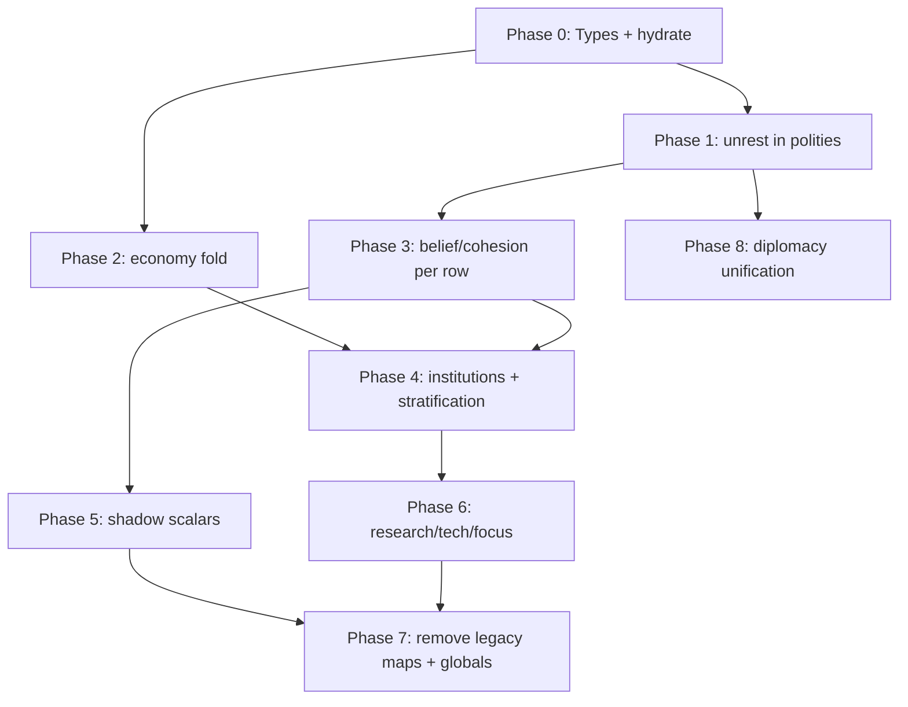

# Multipolity Migration Plan — `BTreeMap<u32, PolityMacroState>`

**Status:** READ-ONLY research artifact (2026-06-16). No source changes implied.  
**Design authority:** [`MULTIPOLITY_DESIGN.txt`](MULTIPOLITY_DESIGN.txt) (Option B — single struct map).  
**Scope:** Consolidate per-faction shadow maps and parallel `HashMap` registries in `WorldState` into one sorted struct map while keeping each migration step green.

---

## 1. Executive summary

Civis already has **per-faction economy** (`factions`, `faction_treasury`, `faction_resources`) and **one per-faction scalar map** (`faction_unrest`), plus **pairwise** diplomacy (`faction_relations: DiplomacyMatrix`). Global macro scalars (`belief`, `unrest`, `cohesion`, …) still represent a single civilization.

**Target:** `WorldState.polities: BTreeMap<u32, PolityMacroState>` becomes the authoritative per-polity row. Pairwise diplomacy stays **outside** the row (eventually `civ_diplomacy::DiplomacyState`; short-term `faction_relations` unchanged).

**Strategy:** Incremental dual-write → switch readers → deprecate parallel `HashMap`s → fold globals (last). Every step ships with serde round-trip tests and existing `engine.rs` faction tests green.

---

## 2. Current state inventory (`crates/engine/src/engine.rs`)

### 2.1 `WorldState` per-faction fields (L384–396)

| Field | Type | Role today |
|-------|------|------------|
| `factions` | `HashMap<u32, String>` | Registry + display name |
| `faction_treasury` | `HashMap<u32, Fixed>` | Per-polity wealth; diplomacy, trade, institution upkeep |
| `faction_resources` | `HashMap<u32, Resources>` | Per-polity stocks; trade routes, faction unrest shadow |
| `faction_unrest` | `HashMap<u32, u64>` | Per-polity unrest from `phase_faction_unrest` |
| `faction_relations` | `DiplomacyMatrix` | **Pairwise** scores in `[-1.0, 1.0]` — **not** per-polity owned |

All four scalar/economy maps use `#[serde(default)]` so older `.civsave` blobs load with empty maps.

### 2.2 `WorldState` global macro scalars (still single-civ; L313–382)

`population`, `research_progress`, `belief`, `unrest`, `cohesion`, `tech_unlocks`, `dispossessed_permille`, `temple_level`, `garrison_level`, `economic_focus`, `focus_pressure`, plus chronicle dedup fields. These are **migration targets** for per-row fields in later phases; they remain globals through Phase 4.

### 2.3 `Simulation` accessors (L1214–1250)

```text
belief()           → state.belief
unrest()           → state.unrest
faction_unrest(id) → state.faction_unrest.get(id).unwrap_or(0)
cohesion()         → state.cohesion
faction_relation(a,b) → state.faction_relations.record(ClusterId(a), ClusterId(b))
```

### 2.4 Tick phases that touch per-faction state

| Phase | Per-faction reads | Per-faction writes | Global reads |
|-------|-------------------|--------------------|--------------|
| `phase_unrest` | `faction_treasury` (spread) | — | `unrest`, `garrison_level`, … |
| `phase_faction_unrest` | `factions` keys, `faction_treasury`, `faction_resources` | `faction_unrest` | — |
| `phase_cohesion` | — | — | `belief`, `unrest`, `cohesion` |
| `phase_stratification` | `faction_treasury` (spread) | — | `dispossessed_permille`, `cohesion` |
| `phase_institutions` | `faction_treasury` (poorest `keys().min()`) | treasury debit | `belief`, `unrest`, temple/garrison |
| `phase_diplomacy` | sorted `factions` keys, treasuries, `faction_unrest`, `faction_relations` | treasuries, relations | `belief()`, `cohesion()` |
| `tick_trade_routes` | `faction_resources`, `faction_treasury`, `faction_relation` | resources, treasuries | global `unrest`, `cohesion` |

**Determinism note:** `phase_diplomacy` and tests already `sort_unstable` `factions.keys()`. `faction_treasury_spread` iterates `HashMap` values (order-independent min/max). `BTreeMap` keys remove the sort boilerplate for polity scans.

### 2.5 Downstream consumers (read paths to update in later steps)

| Consumer | Fields used |
|----------|-------------|
| `crates/watch/src/snapshot.rs` | `factions`, `faction_treasury` |
| `crates/server/src/ws_bridge.rs` | `faction_treasury`, `spectator_view().factions` |
| `crates/protocol-3d` `FactionStateEntry` | treasury snapshot only (extend later) |
| `crates/engine` tests (~L4097–4810) | direct `state.faction_*` mutation |

`faction_relations` uses `ClusterId(u64::from(faction_id))` as a bridge — keep until Phase 8 (diplomacy unification).

---

## 3. Target layout

### 3.1 `PolityMacroState` (new type)

**Preferred location:** `crates/engine/src/polity.rs` (re-export from `lib.rs`). Use `civ_diplomacy::PolityId` as the public newtype; map key remains `u32` for serde stability with existing saves.

```rust
/// One polity's macro + economy row. Map key == `id.0`.
pub struct PolityMacroState {
    pub id: PolityId,
    // --- economy (migrate from parallel HashMaps) ---
    pub name: String,
    pub treasury: Fixed,
    pub resources: Resources,
    // --- macro scalars (Phase 1+: per-polity; dual-write globals early) ---
    pub belief: u64,
    pub unrest: u64,
    pub cohesion: u64,
    pub research_progress: u64,
    pub tech_unlocks: u64,
    pub dispossessed_permille: u64,
    pub temple_level: u32,
    pub garrison_level: u32,
    pub economic_focus: EconomicFocus,
    pub focus_pressure: u8,
    pub population: u64,
    // --- shadow scalars (Phase 5; CIV-0105 aggregates) ---
    pub legitimacy_milli: i64,
    pub shadow_influence_index_milli: i64,
    pub influence_capital: i64,
    pub governance_integrity_milli: i64,
}
```

**Bounds** (carry from existing phases): `temple_level`/`garrison_level` ≤ `MAX_INSTITUTION_LEVEL` (5); `dispossessed_permille` ∈ [0, 1000]; shadow `*_milli` ∈ [0, 1000]; `influence_capital` ≥ 0.

**Default row:** `id` set at insert; `name` from registry or `format!("Faction {id}")`; treasury/resources from legacy maps or `Default`; scalar fields `0` / `EconomicFocus::Balanced`.

### 3.2 `WorldState` addition

```rust
#[serde(default)]
pub polities: BTreeMap<u32, PolityMacroState>,
```

### 3.3 Stays outside `PolityMacroState`

| Field | Reason |
|-------|--------|
| `faction_relations` / future `DiplomacyState` | Pairwise, symmetric — owned by neither polity |
| `trade_routes` | Edges between polities |
| `resources` (global bag) | Civilization-wide stock until per-polity production fully splits |
| `energy_budget_joules`, `rng_seed`, `tick`, chronicle globals | Session / world-level |
| `Simulation::faction_doctrines` | Dense `Vec` index 0..N-1; unify in Phase 9 |

---

## 4. Accessor changes (`Simulation`)

Add on `Simulation` / `WorldState`:

| New API | Behavior |
|---------|----------|
| `polity(id) -> Option<&PolityMacroState>` | `state.polities.get(&id)` |
| `polity_mut(id) -> Option<&mut PolityMacroState>` | `state.polities.get_mut(&id)` |
| `ensure_polity(id) -> &mut PolityMacroState` | Insert default row hydrated from legacy maps |
| `polity_ids() -> impl Iterator<Item = u32>` | `state.polities.keys().copied()` — **sorted** |
| `hydrate_polities_from_legacy()` | One-shot merge after deserialize / `WorldState::default()` |

**Shim accessors (dual-write phase):**

| Existing | During migration | After Phase 7 |
|----------|------------------|---------------|
| `faction_unrest(id)` | `polities[id].unrest` with fallback to `faction_unrest` map | `polities[id].unrest` only |
| Direct `state.faction_treasury` | Write-through: mutating either updates both | `polities` only |
| `faction_treasury_spread(&HashMap)` | Overload: `polity_treasury_spread(&BTreeMap<u32, PolityMacroState>)` | Same |

**Internal phase refactors:**

- Replace `let mut ids: Vec<_> = self.state.factions.keys().collect(); ids.sort_unstable()` with `for id in self.state.polities.keys().copied()` (or `polity_ids()`).
- `phase_faction_unrest` → rename to `phase_polity_unrest`; body iterates `polities` in key order.

---

## 5. Serde compatibility

### 5.1 Principles

1. **`#[serde(default)]` on `polities`** — pre-migration saves deserialize with empty map; hydration reconstructs rows from legacy fields.
2. **Never remove legacy fields until Phase 7** — old saves and tests keep working.
3. **Hydrate on load, not on every tick** — call `hydrate_polities_from_legacy()` from:
   - `WorldState::default()` tail
   - `Simulation::from_state` / deserialize entry points
   - Post-`bincode`/`serde_json` load hooks in save/load paths (when present)
4. **Dual-write on tick** — any phase that mutates a legacy `HashMap` field also mutates the matching `polities[id]` field (same tick).

### 5.2 Hydration algorithm (`hydrate_polities_from_legacy`)

```text
ids = sorted union of keys from: factions, faction_treasury, faction_resources, faction_unrest
for id in ids:
    row = polities.entry(id).or_insert_with(|| PolityMacroState::default_for(id))
    row.name        ← factions[id] or existing row.name
    row.treasury    ← faction_treasury[id] or row.treasury
    row.resources   ← faction_resources[id] or row.resources
    row.unrest      ← faction_unrest[id] or row.unrest
    // macro scalars: leave 0 until Phase 3 dual-write from globals
```

### 5.3 Optional serde aliases (Phase 7 only)

When removing `faction_unrest`:

```rust
#[serde(alias = "faction_unrest")]  // if ever flattened — prefer keeping nested in polities
```

Prefer **not** flattening unrest into a top-level alias; clients should read `polities[id].unrest`. For RPC/HUD backward compat during Phases 1–4, **dual-write global** `state.unrest` as `max(unrest)` or mean across rows (document choice: **max** matches today's `pair_unrest` semantics in `phase_diplomacy`).

### 5.4 Round-trip test matrix (add per phase)

| Test | Assert |
|------|--------|
| `world_state_default_hydrates_polities` | `polities.len() == factions.len()`, treasury parity |
| `serde_old_save_without_polities` | JSON/bincode without `polities` key loads; hydration fills rows |
| `serde_round_trip_with_polities` | `WorldState` equality after serialize/deserialize |
| `hydration_idempotent` | Second `hydrate_polities_from_legacy()` is no-op |

---

## 6. Phased migration (WBS + DAG)

Each step ends with: `cargo test -p civ-engine` (faction/diplomacy/unrest modules), `just civis-3d-verify` if snapshot/RPC touched.



---

### Phase 0 — Types + read path (no behavior change)

**Depends on:** —  
**Goal:** `polities` exists, hydrated from legacy maps; all behavior still uses `HashMap`s.

| Action | Detail |
|--------|--------|
| Add `PolityMacroState` + `Default` | Economy + scalar fields; shadow fields default 0 |
| Add `WorldState.polities` | `#[serde(default)]` |
| Implement `hydrate_polities_from_legacy(&mut WorldState)` | See §5.2 |
| Call hydrate from `WorldState::default()`, `Simulation::with_seed`, `from_state` | |
| Add `Simulation::polity` / `ensure_polity` | Read-only use in tests |

**Files:** `crates/engine/src/polity.rs` (new), `engine.rs`, `lib.rs` exports.

**Green gate:**

- All existing tests pass unchanged.
- New: `hydration_matches_default_world_state`, `polities_keys_sorted`.

---

### Phase 1 — Fold `faction_unrest` into `polities.unrest`

**Depends on:** Phase 0  
**Goal:** `phase_faction_unrest` writes `polities[id].unrest`; `faction_unrest` map dual-written or derived.

| Action | Detail |
|--------|--------|
| `phase_faction_unrest` | Iterate `polity_ids()`; read treasury/resources from **either** map (prefer `polities` after Phase 2; until then read legacy, write both) |
| Dual-write | `*polities[id].unrest = …` and `faction_unrest.insert(id, …)` |
| `faction_unrest(id)` accessor | Read `polities` first, fallback `faction_unrest` |
| `phase_diplomacy` `pair_unrest` | `max(polity(a).unrest, polity(b).unrest)` via accessor |

**Green gate:**

- `scarce_faction_accrues_unrest`, `wealthy_faction_stays_low_unrest`, `high_faction_unrest_lowers_conflict_threshold` pass.
- New: after ticks, `polities[id].unrest == faction_unrest(id)`.

---

### Phase 2 — Fold economy registry (`factions`, `faction_treasury`, `faction_resources`)

**Depends on:** Phase 0 (can parallelize with Phase 1 after Phase 0 lands)  
**Goal:** `polities` holds `name`, `treasury`, `resources`; legacy `HashMap`s dual-written.

| Action | Detail |
|--------|--------|
| `phase_diplomacy` treasury debit/credit | `polity_mut(a).treasury` + mirror `faction_treasury` |
| `tick_trade_routes` | Same dual-write for resources/treasury |
| `phase_institutions` upkeep | Debit **own** polity treasury (design fix); interim: debit poorest polity via `polities.values().min_by_key(\|r\| r.treasury)` |
| `faction_treasury_spread` | New `polity_treasury_spread(&BTreeMap<…>)`; call sites switch |
| `phase_faction_unrest` reads | `polities[id].treasury`, `.resources` |
| Replace sorted `factions.keys()` scans | `polity_ids()` |

**Green gate:**

- `faction_treasury_spread_is_rich_minus_poor`, diplomacy trade/conflict tests, trade route tests pass.
- Hydration: removing `faction_treasury` from JSON but keeping `polities` still loads (forward test for Phase 7).

---

### Phase 3 — Per-polity `belief`, `cohesion` (+ global dual-write)

**Depends on:** Phase 1  
**Goal:** Each polity accrues mood from **local** treasury/resources/population; globals mirror aggregate for HUD.

| Action | Detail |
|--------|--------|
| Add `phase_polity_mood` or split `phase_unrest`/`phase_cohesion` | Per-row: local food stress from `faction_wealth_scarcity_shadow(row.treasury, &row.resources)` + optional global market bleed |
| Per-row cohesion | `cohesion_delta(row.belief, row.unrest)` |
| Global dual-write | `state.belief = max/avg(row.belief)` — **document: use sum or max per product spec**; default **max** for unrest-sensitive HUD |
| `phase_diplomacy` thresholds | Replace `self.belief().saturating_add(self.cohesion())` with pair-local: `polity(a).belief + polity(b).belief` (or max pairwise — match `pair_unrest` style: **per-polity max then combine**) |

**Suggested pair formula (consistent with `pair_unrest`):**

```text
pair_belief   = max(polity(a).belief, polity(b).belief)
pair_cohesion = max(polity(a).cohesion, polity(b).cohesion)
base_threshold = diplomacy_conflict_threshold(pair_belief + pair_cohesion, pair_unrest)
```

**Green gate:**

- `phase_cohesion_*` tests still pass on globals during dual-write.
- New: two polities with divergent treasury → divergent `polities[id].unrest` after N ticks.

---

### Phase 4 — Per-polity institutions + stratification

**Depends on:** Phase 2, Phase 3  
**Goal:** `temple_level`, `garrison_level`, `dispossessed_permille` per row; institution upkeep from **own** treasury.

| Action | Detail |
|--------|--------|
| `phase_institutions` | Per `polity_ids()` row: targets from row `belief`/`unrest`; upkeep debits `row.treasury` |
| `phase_stratification` | Per-row `dispossession_target_permille(spread_vs_peers, row.cohesion)` |
| Remove `faction_treasury.keys().min()` hack | |

**Green gate:**

- Institution level tests (if any) + diplomacy tests pass.
- Poorest-faction-only upkeep test updated: each polity pays own upkeep.

---

### Phase 5 — Shadow scalars (CIV-0105 substrate, no graph)

**Depends on:** Phase 3  
**Goal:** Milli scalars on row; audit events on material change.

| Action | Detail |
|--------|--------|
| Extend `PolityMacroState` | `legitimacy_milli`, `shadow_influence_index_milli`, `influence_capital`, `governance_integrity_milli` |
| `phase_shadow` or subsection of `phase_institutions` | Integer updates; clamp ranges |
| `phase_diplomacy` bias | Optional peer differential from `shadow_influence_index_milli` |
| Replay bus | Emit JSON audit lines per FR-CIV-DIPLO-003 |

**Green gate:**

- New unit tests for clamping/saturation.
- No change to existing diplomacy tests unless bias wired (feature-flag bias initially).

---

### Phase 6 — Per-polity research, tech, economic focus, population

**Depends on:** Phase 4  
**Goal:** `research_progress`, `tech_unlocks`, `economic_focus`, `focus_pressure`, `population` per row.

| Action | Detail |
|--------|--------|
| `phase_research`, `phase_tech`, `phase_economic_focus` | Iterate `polities` in key order |
| `population` per row | Count `Alignment::Faction(id)` civilians each tick (or cached in row) |
| `phase_chronicle` | Tag lines with `PolityId` |
| Global dual-write | Aggregate tech bitmask OR keep global `tech_unlocks` as OR across rows until Phase 7 |

**Green gate:**

- Research/tech/economic-focus tests in `engine.rs` pass.
- Determinism: two runs same seed → identical `polities` map bytes.

---

### Phase 7 — Remove legacy maps + global macro fields

**Depends on:** Phases 1–6 stable; HUD/RPC updated  
**Goal:** Single source of truth.

| Remove from `WorldState` | Replaced by |
|--------------------------|-------------|
| `faction_unrest` | `polities[id].unrest` |
| `factions` | `polities[id].name` |
| `faction_treasury` | `polities[id].treasury` |
| `faction_resources` | `polities[id].resources` |
| `belief`, `unrest`, `cohesion`, … | Aggregates computed at snapshot time OR removed from wire |

| Consumer updates |
|------------------|
| `watch/snapshot.rs` — read `sim.state.polities` |
| `server/ws_bridge.rs` — treasury from `polities` |
| `protocol-3d::FactionStateEntry` — extend with `unrest`, `belief`, shadow fields `#[serde(default)]` |
| Tests — stop inserting into `faction_*` maps |

**Green gate:**

- Full `civ-engine` test suite.
- `just civis-3d-verify` if protocol extended.
- Manual: load oldest checked-in save fixture (if any) through hydrate-only path.

---

### Phase 8 — Pairwise diplomacy unification (parallel after Phase 1)

**Depends on:** Phase 1 (pair-local macro exists); independent of Phase 7  
**Goal:** Replace `DiplomacyMatrix` float scores with `civ_diplomacy::DiplomacyState` (`BTreeMap<Pair, Relation>`).

| Action | Detail |
|--------|--------|
| Add `WorldState.diplomacy: DiplomacyState` `#[serde(default)]` | |
| Dual-write `faction_relations.apply_signal` → `diplomacy.ingest` | |
| `faction_relation(a,b)` | Read new state; convert standing → float for compat |
| Deprecate `faction_relations` | Remove in later PR after wire clients migrate |

**Not folded into `PolityMacroState`.**

---

### Phase 9 (optional) — Dense cache + doctrine registry

**Depends on:** Phase 7 + profiling  
- `PolityRegistry { id_to_idx, ids }` aligned with `faction_doctrines` Vec indexing.  
- Per-tick `Vec<PolityMacroState>` snapshot for hot loops.  
- On-wire save shape unchanged (`BTreeMap`).

---

## 7. Step-by-step “always green” checklist

Use this as the PR sequence (one concern per PR where possible):

| PR | Step | Verification |
|----|------|--------------|
| 1 | Phase 0 types + hydrate + tests | `cargo test -p civ-engine hydration` |
| 2 | Phase 1 unrest dual-write | `cargo test -p civ-engine faction_unrest` |
| 3 | Phase 2 economy dual-write + `polity_ids()` scans | `cargo test -p civ-engine diplomacy` |
| 4 | Phase 3 per-polity mood + diplomacy pair thresholds | new divergent-polity test |
| 5 | Phase 4 institutions/stratification per row | institution/dispossession tests |
| 6 | Phase 5 shadow scalars | new shadow clamp tests |
| 7 | Phase 6 research/tech/focus per row | existing phase tests |
| 8 | Phase 7 delete legacy fields + consumer migration | full engine + `web`/`watch` if touched |
| 9 | Phase 8 diplomacy crate unification | `cargo test -p civ-diplomacy` + engine diplomacy tests |

**Do not** combine Phase 7 with Phase 1 — save compat and HUD depend on dual-write middle.

---

## 8. Field migration matrix

| Source (today) | `PolityMacroState` field | Phase |
|----------------|--------------------------|-------|
| `factions[id]` | `name` | 2 |
| `faction_treasury[id]` | `treasury` | 2 |
| `faction_resources[id]` | `resources` | 2 |
| `faction_unrest[id]` | `unrest` | 1 |
| `belief` (global) | `belief` per row | 3 → 7 |
| `cohesion` (global) | `cohesion` | 3 → 7 |
| `research_progress` | `research_progress` | 6 |
| `tech_unlocks` | `tech_unlocks` | 6 |
| `dispossessed_permille` | `dispossessed_permille` | 4 |
| `temple_level` / `garrison_level` | same | 4 |
| `economic_focus` / `focus_pressure` | same | 6 |
| ECS faction civilian count | `population` | 6 |
| (new) | shadow `*_milli`, `influence_capital` | 5 |
| `faction_relations` | **stays pairwise** | 8 |

---

## 9. Anti-patterns (do not)

- **HashMap** for the authoritative polity map — use `BTreeMap` (repo convention).
- **Parallel scalar HashMaps** (`faction_belief`, `faction_cohesion`, …) — key-set drift in saves.
- **Big-bang** removal of globals before RPC/HUD reads `polities`.
- **Unsorted iteration** over polities in tick phases — `BTreeMap` keys are safe; if using `values()`, pair with stored `id`.
- **Merging `faction_relations` into the row** — breaks symmetric pairwise semantics.
- **Float shadow scalars** — use integer milli per CIV-0105 / `civ-diplomacy`.

---

## 10. Cross-project reuse

| Candidate | Target | When |
|-----------|--------|------|
| `PolityMacroState` | `crates/polity` or `civ-polity` if CIV-0105 shadow graph lands | Phase 5+ |
| `civ_diplomacy::PolityId`, `Pair`, `DiplomacyState` | Replace `DiplomacyMatrix` in engine | Phase 8 |
| `protocol_3d::FactionStateEntry` | Extend for macro/shadow wire | Phase 7 |

---

## 11. Summary

| Decision | Choice |
|----------|--------|
| Container | `BTreeMap<u32, PolityMacroState>` |
| First slice | Phase 0 + 1 + 2 (hydrate, unrest, economy) |
| Pairwise diplomacy | Remains `faction_relations` until Phase 8 |
| Serde | `#[serde(default)]` on `polities`; hydrate from legacy maps; dual-write until Phase 7 |
| Accessors | `polity` / `polity_mut` / `polity_ids()`; shims for `faction_unrest` during migration |

**First implementation PR:** Phase 0 only — zero behavior change, hydration parity tests, sorted `polities` keys matching `factions` default world.
