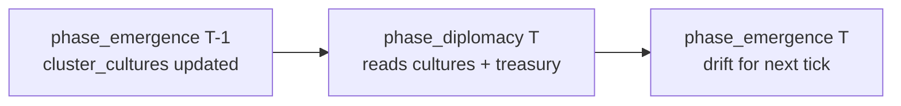

# N2 — Culture Distance → Diplomacy Threshold Coupling

**Status:** Research / design handoff (read-only audit, 2026-06-16)  
**Charter gap:** N2 in `EMERGENCE_CENSUS` / `EMERGENCE_COUPLING_AUDIT.txt` — `CultureProfile` drifts in `phase_emergence` but does not shape macro diplomacy; culture only nudges micro `Psyche.beliefs` via social-graph exposure.  
**Scope:** Specify the **optimal minimal first coupling** (pairwise culture similarity → conflict-threshold peace bonus). No source changes in this artifact.

---

## 1. Survey — how `CultureProfile` is computed

### 1.1 Data model (`civ_agents::culture`)

| Field | Type | Role |
|-------|------|------|
| `traits` | `[f32; 4]` | Cultural meme vector, `[0, 1]` per axis |
| `language` | `[f32; 4]` | Language drift vector (creolization path) |
| `contact` | `f32` | Incoming contact weight this tick (written by drift) |
| `kinship` | `f32` | Insulation against external drift (design: from social graph; **not set** in engine today — stays `0.0` at spawn) |

**Distance primitive (reuse, do not duplicate):**

```text
cultural_distance(a: TraitVector, b: TraitVector) -> f32   // ∈ [0, 1], RMS of per-axis deltas
language_distance(...) -> f32                               // alias of cultural_distance
```

### 1.2 `phase_emergence` → `emergence_culture` (`crates/engine/src/emergence.rs`)

**Tick position:** #14 of 24 — after `phase_life`, **before** macro society tail and **after** `phase_diplomacy` (#6).

**Algorithm (per tick):**

1. Count civilians per `ClusterMember.cluster.0`; skip clusters with `< 2` members.
2. Lazily insert `EmergenceState.cluster_cultures[cluster_id]` with seed traits derived from `cluster_id` bits (`CultureProfile::new(seed)`).
3. Clone all profiles into a `Vec`, build **synthetic fully-connected** `ContactEdge`s (weight `0.15`) between cluster indices.
4. Call `drift_populations(profiles, edges, rng, mutation_rate=0.02, diffusion_rate=0.08, creole_threshold=0.85)`.
5. Write profiles back into `cluster_cultures`.

**Micro coupling today (beliefs only):** `emergence_psyche` reads neighbor cluster `traits` through `SocialGraph` tie familiarity → `belief_culture_exposure` → `update_beliefs` nudges `Psyche.beliefs` toward exposure. **No write to `WorldState` belief/unrest/cohesion/diplomacy.**

**Observability:** `Simulation::cluster_cultures()` exposes `&BTreeMap<u64, CultureProfile>`. Test `culture_phase_drifts_cluster_profiles` asserts inter-cluster trait divergence after 200 ticks.

### 1.3 Faction ↔ cluster identity (diplomacy bridge)

`phase_diplomacy` already maps faction ids to diplomacy matrix keys as:

```text
ClusterId(u64::from(faction_id))
```

Default `WorldState::factions` keys: `0`, `1`, `2`. For N2, **lookup culture by the same numeric id**:

```text
cluster_cultures.get(&u64::from(faction_a))
cluster_cultures.get(&u64::from(faction_b))
```

This reuses the established partial identity bridge (see `EMERGENCE_COUPLING_AUDIT.txt` M4). Full emergent polity membership is out of scope for N2.

---

## 2. Survey — diplomacy conflict thresholds

### 2.1 Cadence and decision (`phase_diplomacy`, `engine.rs`)

- Runs when `tick % 500 == 0`.
- Picks faction pair `(a, b)` deterministically from sorted faction ids and `tick`.
- Computes treasury **disparity** `|treasury_a − treasury_b|` (Fixed currency units).
- **Outcome:** `disparity >= conflict_threshold` → `DiplomacyKind::Conflict`; else → `TradeAgreement`.
- Side effects: treasury ±50/±100, `faction_relations.apply_signal`, relation decay.

### 2.2 Threshold stack (current)

```text
pair_unrest = max(faction_unrest(a), faction_unrest(b))

base_threshold = diplomacy_conflict_threshold(
    belief + cohesion,          // macro worship scalar + social fabric
    pair_unrest,
)

conflict_threshold = max(
    DIPLOMACY_MIN_CONFLICT_THRESHOLD,
    base_threshold + diplomacy_relation_threshold_bias(relation_score),
)
```

| Constant | Value | Effect |
|----------|-------|--------|
| `DIPLOMACY_BASE_CONFLICT_THRESHOLD` | `10_000` | Neutral disparity tolerance |
| `BELIEF_PEACE_DIVISOR` | `50` | +1 threshold per 50 belief units |
| `BELIEF_PEACE_CAP` | `10_000` | Max +10k from faith (2× base) |
| `UNREST_WAR_DIVISOR` | `50` | −1 per 50 unrest |
| `UNREST_WAR_CAP` | `8_000` | Max −8k from unrest |
| `DIPLOMACY_MIN_CONFLICT_THRESHOLD` | `2_000` | Floor — war always needs some disparity |
| `FACTION_RELATION_THRESHOLD_SPAN` | `5_000` | ±5k from relation score ∈ [−1, 1] |

**Culture inputs today:** none.

### 2.3 Tick-order note

On diplomacy ticks, `phase_diplomacy` runs **before** `phase_emergence` updates `cluster_cultures`. The cultures read at tick *T* are those produced at the end of tick *T−1* (one-tick lag). Between diplomacy events (~500 ticks), cultures evolve freely; the lag is immaterial for N2.

---

## 3. Gap statement (N2)

| Layer | Evolves | Feeds diplomacy? |
|-------|---------|------------------|
| `cluster_cultures[].traits` | Yes, every tick (clusters ≥ 2) | **No** |
| `cluster_cultures[].language` | Yes (creolization) | **No** |
| `Psyche.beliefs` (culture exposure) | Yes | **No** (M1-A wired beliefs → cohesion only) |
| `state.belief` (worship scalar) | Yes | **Yes** (peace term) |

**Charter intent:** ideological/cultural affinity should affect diplomacy (trade tolerance vs conflict). `agileplus-specs/civ-009-culture-diffusion` notes diplomacy should account for ideological affinity.

---

## 4. Optimal minimal first coupling

### 4.1 Choice: **pairwise trait similarity → conflict-threshold peace bonus**

**Why this (not cohesion, not language, not global mean distance):**

| Alternative | Verdict |
|-------------|---------|
| Global mean inter-cluster distance (M1 row D) | Wrong grain — diplomacy decides **one pair** per event |
| `language_distance` | Second axis; traits already drive belief exposure |
| `CultureProfile.kinship` / `contact` | `kinship` never populated in engine; `contact` is per-step, not pairwise |
| Culture → `cohesion_delta` | Valid follow-on (N2b); does not close diplomacy charter gap alone |
| Reorder `phase_diplomacy` after emergence | Larger tick-order change; unnecessary given 1-tick lag |

**Mechanism (symmetric with existing peace terms):** culturally **similar** factions **raise** the wealth disparity they tolerate before fighting → more `TradeAgreement` at the same treasury spread. Culturally **divergent** pairs add **zero** bonus (neutral default), not a war penalty — avoids double-punishing with unrest/belief opposition and keeps the diff minimal.

### 4.2 Culture-distance metric

**Use:** `civ_agents::culture::cultural_distance(profile_a.traits, profile_b.traits)`  
**Do not use** `language` or `homophily` in v1.

**Pairwise similarity:**

```text
distance   = cultural_distance(traits_a, traits_b)     // ∈ [0, 1]
similarity = 1.0 - distance                            // ∈ [0, 1]
```

### 4.3 Threshold adjustment

**New pure function** (suggested location: `engine.rs` next to `diplomacy_relation_threshold_bias`):

```text
fn diplomacy_culture_threshold_bias(
    cultures: &BTreeMap<u64, CultureProfile>,
    faction_a: u32,
    faction_b: u32,
) -> i64
```

**Logic:**

```text
let Some(pa) = cultures.get(&u64::from(faction_a)) else { return 0 };
let Some(pb) = cultures.get(&u64::from(faction_b)) else { return 0 };

let distance   = cultural_distance(pa.traits, pb.traits);
let similarity = 1.0 - distance;

const CULTURE_PEACE_SPAN: f32 = 3_000.0;   // max +3k threshold at identity
(similarity * CULTURE_PEACE_SPAN).round() as i64
```

**Constants tuning intent:**

| `similarity` | `distance` | Bias | Compare to |
|--------------|------------|------|------------|
| `1.0` (identical traits) | `0` | `+3_000` | Half of `FACTION_RELATION_THRESHOLD_SPAN` (±5k); ~30% of base threshold |
| `0.5` | `0.5` | `+1_500` | Material but subordinate to saturated belief (+10k) |
| `0.0` (orthogonal extremes) | `1.0` | `0` | Neutral — no extra aggression from culture alone |

**Sink (single line change in `phase_diplomacy`):**

```text
let culture_bias = diplomacy_culture_threshold_bias(
    &self.emergence.cluster_cultures,
    a,
    b,
);

let conflict_threshold = Fixed::from_num(
    (base_threshold
        + diplomacy_relation_threshold_bias(relation)
        + culture_bias)
        .max(DIPLOMACY_MIN_CONFLICT_THRESHOLD),
);
```

**Imports:** `use civ_agents::culture::{cultural_distance, CultureProfile};` (or re-export via existing `engine` / `lib` paths).

### 4.4 Exact fields touched

| Read | Write |
|------|-------|
| `EmergenceState.cluster_cultures[u64::from(faction)].traits` | — |
| `phase_diplomacy` local `conflict_threshold` | — |
| — | `DiplomacyEvent.kind` (indirect via threshold) |
| — | `faction_treasury`, `faction_relations` (existing side effects) |

**No new `WorldState` fields.** No serde migration. Missing culture entry → bias `0` (current behavior preserved).

---

## 5. Test specification

### 5.1 Unit test — pure function

**Name:** `diplomacy_culture_threshold_bias_scales_with_similarity`  
**File:** `crates/engine/src/engine.rs` `#[cfg(test)]`

**Cases:**

```text
let mut cultures = BTreeMap::new();
cultures.insert(0, CultureProfile::new([0.5, 0.5, 0.5, 0.5]));
cultures.insert(1, CultureProfile::new([0.5, 0.5, 0.5, 0.5]));
assert_eq!(diplomacy_culture_threshold_bias(&cultures, 0, 1), 3_000);

cultures.insert(1, CultureProfile::new([0.0, 0.0, 0.0, 0.0]));
// distance([0.5…], [0.0…]) = 0.5 → similarity 0.5 → +1500
assert_eq!(diplomacy_culture_threshold_bias(&cultures, 0, 1), 1_500);

cultures.insert(1, CultureProfile::new([1.0, 1.0, 1.0, 1.0]));
// distance([0.5…], [1.0…]) = 0.5 → +1500 (symmetric metric)
assert_eq!(diplomacy_culture_threshold_bias(&cultures, 0, 1), 1_500);

// missing culture → 0
assert_eq!(diplomacy_culture_threshold_bias(&cultures, 0, 99), 0);
```

### 5.2 Integration test — diplomacy outcome flips

**Name:** `similar_cultures_bias_diplomacy_toward_trade`  
**Pattern:** mirror `high_cohesion_biases_diplomacy_toward_peace`, `high_faction_unrest_lowers_conflict_threshold`

**Setup:**

1. `Simulation::with_seed(5)`; `sim.state.tick = 500`.
2. Resolve `(a, b)` the same way as `phase_diplomacy` (sorted faction ids + tick modulus).
3. Pin macro drivers to isolate culture term:
   - `belief = 0`, `cohesion = 0`, `faction_unrest` cleared
   - `faction_treasury[a] = 0`, `faction_treasury[b] = 11_000` → disparity `11_000`
   - At base threshold `10_000`, this is **Conflict** without culture bonus.
4. **Case SIMILAR:** inject `cluster_cultures`:
   - `insert(u64::from(a), CultureProfile::new([0.5; 4]))`
   - `insert(u64::from(b), CultureProfile::new([0.5; 4]))`
   - `phase_diplomacy()` → assert last event `TradeAgreement` (threshold `13_000 > 11_000`).
5. **Case DIVERGENT (control):** reset event buffer; same treasuries; either omit cultures or set maximally distant traits (`[0,0,0,0]` vs `[1,1,1,1]`, bias `0`) → assert `Conflict`.

**Regression:** empty `cluster_cultures` → behavior unchanged from today at same pinned macro state.

---

## 6. What N2 v1 does *not* do

| Deferred | Rationale |
|----------|-----------|
| Culture → `cohesion_delta` | Separate sink; indirect diplomacy only; schedule as N2b |
| `language_distance` | Second-wave affinity axis |
| `kinship` / `contact` on profiles | Engine does not populate `kinship`; `contact` is not pairwise |
| Global mean culture distance | Wrong granularity for per-pair diplomacy |
| Emergent polity pairs (M4) | Static `faction: u32` pairing unchanged |
| Downward diplomacy → culture | No reverse creolization from trade wars in v1 |

---

## 7. Tick-order DAG (N2 slice)



**Depends on:** `emergence_culture` must have run at least once before first diplomacy read (natural after tick 1).  
**Does not require:** reordering phases or new cached WorldState fields.

---

## 8. Phased WBS (follow-on)

| Phase | Task ID | Description | Depends on |
|-------|---------|-------------|------------|
| 1 | **N2-A** | `diplomacy_culture_threshold_bias` + `phase_diplomacy` wire + unit test | — |
| 2 | N2-A-int | Integration test `similar_cultures_bias_diplomacy_toward_trade` | N2-A |
| 3 | N2-B | Pairwise `cultural_distance` → small `cohesion_delta` bind (optional) | N2-A |
| 4 | N2-C | `language_distance` as secondary diplomacy term (cap +1k) | N2-A |

**Agent effort (aggressive):** N2-A + tests ≈ 8–12 tool calls, ~4 min wall clock.

---

## 9. Cross-project reuse

| Candidate | Location | Notes |
|-----------|----------|-------|
| `cultural_distance` | `civ_agents::culture` | Already tested; N2 consumes only |
| `diplomacy_culture_threshold_bias` | `civ-emergence-metrics` (pure) + thin `engine` wrapper | Optional split mirroring M1-A pattern |

---

## 10. References

| Artifact | Path |
|----------|------|
| Culture drift phase | `crates/engine/src/emergence.rs` (`emergence_culture`, `emergence_psyche`) |
| `CultureProfile` + distances | `crates/agents/src/culture.rs` |
| Diplomacy phase + thresholds | `crates/engine/src/engine.rs` (`phase_diplomacy`, `diplomacy_conflict_threshold`, `diplomacy_relation_threshold_bias`) |
| M1 coupling precedent | `M1_MICROCULTURE_COUPLING.md` (row D deferred to diplomacy) |
| Coupling audit | `EMERGENCE_COUPLING_AUDIT.txt` §D3, §M1, §M4 |
| Emergence census (N2 ranking) | `.cursorlogs/audit-emergence-census.log` item 2 |
| Culture diffusion charter | `agileplus-specs/civ-009-culture-diffusion/spec.md` |

---

## 11. Summary

**Gap:** Settlement `CultureProfile.traits` drift every tick and shape agent beliefs, but `phase_diplomacy` ignores them.

**Minimal closure:** At each diplomacy event, add `diplomacy_culture_threshold_bias` = `round((1 − cultural_distance(traits_a, traits_b)) × 3000)` to the existing conflict threshold, using `cluster_cultures[u64::from(faction_id)]` and the existing `cultural_distance` primitive.

**Proof:** Unit test on bias endpoints (`0`, `1500`, `3000`) plus integration test showing identical cultures flip a `11_000` disparity from Conflict to Trade while divergent cultures do not.
