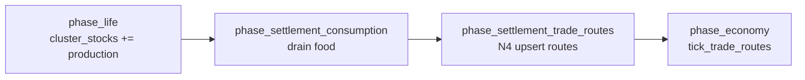

# N4 — Settlement Exchange → Emergent Trade Route Coupling

**Status:** Research / design handoff (read-only audit, 2026-06-16)  
**Charter gap:** Trade-route / network emergence — `WorldState::trade_routes` is a **static triangle** at init (`0→1 grain`, `1→2 ore`, `2→0 cloth`); `tick_trade_routes` runs every tick with unrest/cohesion/relation arbitrage but **topology never changes**. Diplomacy `TradeAgreement` moves treasury and `faction_relations.trade_volume` but **does not birth routes**.  
**Predecessors:** N1 (settlement `cluster_stocks` → market supply), N2 (`CultureProfile` → diplomacy threshold), N3 (settlement contact → diplomacy pair selection).  
**Scope:** Specify the **single highest-leverage coupling** among the weakest remaining charter layers (**LANGUAGE**, **LEGENDS/RELIGION**, **TRADE-ROUTE/network**). No source changes in this artifact.

> **Note on numbering:** Census item N4 (`dispossessed_permille` → production, M5) remains deferred. This document is the **post-N3 charter-layer N4** focused on trade-network emergence.

---

## 1. Why this coupling (not language, not legends→belief)

| Weak layer | Current state | Minimal coupling options | Verdict |
|------------|---------------|--------------------------|---------|
| **LANGUAGE** | `CultureProfile.language` drifts + creolizes every tick in `emergence_culture`; `language_distance` exists in `civ_agents::culture` | Language → diplomacy friction; language → trade cost; language → civ-ai naming | **Secondary axis** — N2 already closes cultural affinity via `traits`; no macro consumer with comparable fan-out |
| **LEGENDS/RELIGION** | `SagaGraph` ingests births/deaths/diplomacy; significance/promotion/salience are **HUD/query only** (audit D4); macro `state.belief` is population worship + hardship, not saga | Saga `significant()` aggregate → `phase_belief` worship bonus | **High value, smaller charter violation** — belief hub already works (cohesion, diplomacy, temples); legends path is display-siloed but not hardcoded |
| **TRADE-ROUTE / network** | Three **authored** routes at `WorldState::default()`; never upserted; diplomacy trade events ingested to legends only | Repeated cross-settlement surplus exchange → `trade_routes` upsert | **Chosen** — only layer that is **fully scripted topology**; closes economic geography loop with N1+N3 substrate; **every-tick** `tick_trade_routes` impact on `faction_resources` + `faction_treasury` |

**Leverage ranking:** TRADE-ROUTE > LEGENDS/RELIGION > LANGUAGE for a single next coupling, because frozen route topology is the strongest emergence-charter violation among the three and the N1→N3 stack already supplies geographic + stock signals.

---

## 2. Survey — trade route state today

### 2.1 Data model (`engine.rs`)

```text
pub struct TradeRoute {
    pub from_faction: u32,
    pub to_faction: u32,
    pub goods: String,      // "grain" | "ore" | "cloth" → ResourceType via route_resource()
    pub volume: Fixed,
}

WorldState::trade_routes: Vec<TradeRoute>   // static at init, never mutated in tick loop
```

### 2.2 Consumers (already wired)

| Phase | Behavior |
|-------|----------|
| `phase_economy` → `tick_trade_routes` | Per route: `unrest_trade_factor`, `cohesion_trade_factor`, `relation_trade_factor`, `trade_volume_multiplier` (arbitrage cap 2×); transfers `faction_resources`; moves treasury profit |
| `phase_diplomacy` (`TradeAgreement`) | `faction_treasury` ±100; `faction_relations.apply_signal(trade_volume: FACTION_TRADE_RELATION_SIGNAL)` — **no route write** |
| `emergence_legends` | Diplomacy events ingested as `EventKind::EconomicBoom` — narration only |

### 2.3 Settlement substrate (N1 + N3)

| Field / fn | Role |
|------------|------|
| `cluster_stocks: BTreeMap<u64, ClusterStocks>` | Per-settlement commons; **food only** in v1 (`Good::Food` via `CLUSTER_FOOD_PRODUCTION_PER_MEMBER` / `CLUSTER_FOOD_CONSUMPTION_PER_MEMBER`) |
| `cluster_member_counts` | Settlement filter (`>= 2` members) |
| `settlement_dominant_factions` (N3) | `cluster_id → faction_id` from `Alignment::Faction` plurality |
| `settlement_contact_pairs` (N3) | Adjacent multi-member clusters within `SETTLEMENT_CONTACT_RADIUS_FP` |

### 2.4 Tick-order constraint

Proposed N4 phase runs **after** `phase_settlement_consumption` and **before** `phase_economy` (so `tick_trade_routes` ships goods born/ grown same tick).

```text
phase_life → phase_settlement_consumption → [N4 phase_settlement_trade_routes] → phase_economy (tick_trade_routes)
```

Uses `cluster_stocks` **after** consumption drain (post-surplus is the tradeable signal).

---

## 3. Gap statement (N4)

| Layer | Evolves | Shapes trade topology? |
|-------|---------|------------------------|
| `cluster_stocks` (food commons) | Yes, every tick | **No** (N1 feeds market only) |
| Settlement contact edges (N3) | Yes (lagged) | **No** (diplomacy pair pick only) |
| `DiplomacyKind::TradeAgreement` | Every 500 ticks | **No** (treasury + relations only) |
| `trade_routes` | **Never** after init | **Yes** (sole topology source — hardcoded) |

**Charter intent (`docs/guides/emergence-charter.md`):** markets and exchange networks **emerge** from local scarcity and contact; `docs/design/polities-markets.md` — trade routes are diffusion vectors, not scenario fixtures.

---

## 4. Optimal minimal first coupling

### 4.1 Choice: **repeated bilateral food exchange at contacting settlements → upsert `TradeRoute`**

**Why this (not legends→belief, not language barrier, not diplomacy-only route spawn):**

| Alternative | Verdict |
|-------------|---------|
| Legends saga `significant()` → `phase_belief` | Closes religion narrative silo; belief already drives cohesion/diplomacy/temples — **second-order** vs scripted trade graph |
| `language_distance` → trade volume penalty | LANGUAGE layer; traits cover affinity; no geographic grain |
| Diplomacy `TradeAgreement` alone → insert route | One-shot; misses charter “**repeated settlement exchange**”; ignores N1 surplus signal |
| Agent `JobType::Trader` pathfinding | Heavier; settlement commons already aggregate local economics |
| Dynamic route decay / full graph library | v2; v1 upsert + volume growth is sufficient closure |
| Remove bootstrap routes at init | Breaking change; v1 **adds** emergent routes alongside legacy triangle |

**Mechanism:** For each **settlement contact edge** between clusters dominated by **different factions**, compute a one-tick **food export** from the surplus settlement to the deficit neighbor. Accumulate export into an existing route’s `volume` or **birth** a new route when cumulative flow crosses a threshold. Direction: exporter faction → importer faction.

### 4.2 Micro signal

**Per settlement (read-only):**

```text
(cluster_id, faction_id?, food_stock, member_count)
  faction_id  ← settlement_dominant_factions[cluster_id]  (omit if missing)
  food_stock  ← cluster_stocks[cluster_id].get(Good::Food)  // i64, post-consumption
  member_count ← cluster_member_counts[cluster_id]
```

**Per contact edge `(ca, cb)` from `settlement_contact_pairs`:**

```text
fa = dominant[ca], fb = dominant[cb]   // require fa != fb
buffer_a = member_count_a * SETTLEMENT_TRADE_BUFFER_PER_MEMBER
buffer_b = member_count_b * SETTLEMENT_TRADE_BUFFER_PER_MEMBER
surplus_a = max(0, food_stock_a - buffer_a)
deficit_b = max(0, buffer_b - food_stock_b)
export_a_to_b = min(surplus_a, deficit_b, EXCHANGE_CAP_PER_TICK)   // u64

// Symmetric reverse direction for cb → ca
export_b_to_a = ...
```

**Constants (tuning intent):**

| Constant | Suggested value | Rationale |
|----------|-----------------|-----------|
| `SETTLEMENT_TRADE_BUFFER_PER_MEMBER` | `2` | Trade only **excess** above ~2 ticks of local reserves |
| `EXCHANGE_CAP_PER_TICK` | `8` | Matches default bootstrap route volumes (8–12); bounds per-tick birth |
| `ROUTE_BIRTH_THRESHOLD` | `16` | ~2 ticks of capped exchange before first route appears (filters noise) |
| `ROUTE_VOLUME_GROWTH_CAP` | `Fixed::from_num(24)` | Per-tick volume increment cap; pairs with existing arbitrage 2× ceiling |

**Ledger (deterministic, replay-safe):**

```text
// New WorldState field (serde):
faction_exchange_ledger: BTreeMap<(u32, u32), u64>
// Key = canonical (min_faction, max_faction); value = food-units accumulated toward birth
// Increment on export_a_to_b + export_b_to_a (each directed export credits its ordered pair once)
```

Directed export `(fa → fb)` increments ledger key `(min(fa,fb), max(fa,fb))` by `export_a_to_b` (and symmetric for reverse flow on same tick).

### 4.3 Macro consumer

**New pure helpers** (suggested: `engine.rs` next to `trade_volume_multiplier`):

```text
fn settlement_food_surplus(stock: i64, members: u32, buffer_per_member: i64) -> u64
fn settlement_food_deficit(stock: i64, members: u32, buffer_per_member: i64) -> u64
fn bilateral_food_exchange(surplus: u64, deficit: u64, cap: u64) -> u64

fn emergent_trade_route_upsert(
    routes: &mut Vec<TradeRoute>,
    ledger: &mut BTreeMap<(u32, u32), u64>,
    from: u32,
    to: u32,
    exchange: u64,
    birth_threshold: u64,
    base_volume: Fixed,
    growth_cap: Fixed,
) 
```

**`emergent_trade_route_upsert` logic:**

```text
if from == to || exchange == 0 { return; }
let pair = (from.min(to), from.max(to));
*ledger.entry(pair).or_default() += exchange;

// Find existing route matching (from, to, goods="grain")
if let Some(route) = routes.iter_mut().find(|r| r.from_faction == from && r.to_faction == to && r.goods == "grain") {
    route.volume = (route.volume + Fixed::from_num(exchange.min(growth_cap.raw))).min(growth_cap * 2);
    return;
}

if ledger[pair] < birth_threshold { return; }

routes.push(TradeRoute {
    from_faction: from,
    to_faction: to,
    goods: "grain".into(),
    volume: base_volume,   // Fixed::from_num(8)
});
ledger.insert(pair, 0);   // reset after birth (repeat accumulation grows volume thereafter)
```

**New phase** `phase_settlement_trade_routes`:

```text
fn phase_settlement_trade_routes(&mut self) {
    let dominant = settlement_dominant_factions(&self.world, &self.cluster_member_counts);
    let contacts = settlement_contact_pairs(
        &self.world,
        &self.cluster_member_counts,
        SETTLEMENT_CONTACT_RADIUS_FP,
    );
    for (ca, cb) in contacts {
        let (Some(fa), Some(fb)) = (dominant.get(&ca), dominant.get(&cb)) else { continue; };
        if fa == fb { continue; }
        // ... load stocks, members, compute export_a_to_b, export_b_to_a ...
        emergent_trade_route_upsert(&mut self.state.trade_routes, &mut self.state.faction_exchange_ledger,
            *fa, *fb, export_a_to_b, ...);
        emergent_trade_route_upsert(..., *fb, *fa, export_b_to_a, ...);
    }
}
```

**Sink:** existing `tick_trade_routes` — no changes required beyond consuming new/updated entries.

**Tick hook** (in `tick_with_emergence_source`):

```text
self.phase_settlement_consumption();
self.phase_settlement_trade_routes();   // NEW
// ... later ...
self.phase_economy();  // tick_trade_routes inside
```

### 4.4 Exact fields touched

| Read | Write |
|------|-------|
| `cluster_stocks[*].food` (`Good::Food`) | — |
| `cluster_member_counts` | — |
| `ClusterMember`, `Position3d`, `AgentCivilian.alignment` | — |
| `settlement_dominant_factions` / `settlement_contact_pairs` (N3) | — |
| — | `WorldState.trade_routes[]` (`from_faction`, `to_faction`, `goods`, `volume`) |
| — | `WorldState.faction_exchange_ledger` **(new)** |
| — | `faction_resources`, `faction_treasury` (indirect via `tick_trade_routes`) |

**Serde:** add `faction_exchange_ledger` to `WorldState` with `#[serde(default)]` for backward-compatible saves.

**Bootstrap routes:** retain default triangle for empty-world sims; emergent routes **append** when settlements contact. Optional follow-on: scenario flag `emergent_routes_only` clears bootstrap list.

---

## 5. Test specification

### 5.1 Unit test — surplus/deficit exchange math

**Name:** `bilateral_food_exchange_caps_at_surplus_and_deficit`  
**File:** `crates/engine/src/engine.rs` `#[cfg(test)]`

```text
// surplus=20, deficit=5, cap=8 → 5
// surplus=20, deficit=0 → 0
// surplus=3, deficit=50, cap=8 → 3
```

### 5.2 Unit test — route upsert birth threshold

**Name:** `emergent_trade_route_upsert_births_after_threshold`  
**File:** same

```text
routes = []; ledger = {}; birth_threshold = 16; base_volume = 8
upsert(0→1, exchange=10) → no route, ledger[(0,1)]=10
upsert(0→1, exchange=10) → route {0,1,"grain",8}, ledger reset
upsert(0→1, exchange=5)  → volume grows (existing route), no duplicate
```

### 5.3 Unit test — directed pair canonicalization

**Name:** `exchange_ledger_canonicalizes_faction_pair`  
**File:** same

```text
export 0→1 and 1→0 same tick → ledger key (0,1) sums both directed flows
```

### 5.4 Integration test — contact + surplus asymmetry births route

**Name:** `settlement_exchange_emerges_trade_route_between_factions`  
**Pattern:** mirror N3 `adjacent_settlements_select_diplomacy_pair_over_absent_faction`

**Setup:**

1. `Simulation::with_seed(42)`; clear bootstrap routes: `sim.state.trade_routes.clear()`.
2. Pin two adjacent settlements (N3 layout):
   - Cluster 10: 4 agents `Alignment::Faction(0)`, high food stock (`test_set_cluster_stock(10, food=80)`), 4 members.
   - Cluster 20: 4 agents `Alignment::Faction(1)`, low food stock (`food=4`), within `SETTLEMENT_CONTACT_RADIUS_FP`.
3. Set `cluster_member_counts` + `ClusterMember` to match post-`phase_life` state.
4. Run `phase_settlement_trade_routes()` in a loop for `ROUTE_BIRTH_THRESHOLD / EXCHANGE_CAP_PER_TICK + 1` ticks (or single tick with pinned stocks above threshold via ledger preload in test helper).
5. **Assert:** `sim.state.trade_routes` contains `{from_faction: 0, to_faction: 1, goods: "grain"}` with `volume > 0`.
6. Run `tick_trade_routes()` once; assert faction `1` `faction_resources.food` increased vs faction `0` decreased (directional flow).

**Control:** same layout but `fa == fb` (both Faction(0)) → no new route.

**Regression:** fresh `Simulation::with_seed(5)` with no multi-faction settlements → only bootstrap triangle routes, ledger empty.

### 5.5 Integration test — emergent route moves treasury (closed loop)

**Name:** `emergent_route_arbitrage_transfers_treasury`  
**File:** same

After route birth, pin `faction_resources` exporter surplus / importer scarcity, call `tick_trade_routes()`, assert exporter treasury non-decreasing and `trade_volume_multiplier` path exercised (reuse `relations_bias_trade_volume` patterns).

---

## 6. What N4 v1 does *not* do

| Deferred | Rationale |
|----------|-----------|
| Ore/cloth/multi-good settlement stocks | `cluster_stocks` is food-only today; `goods` string maps 1:1 to `ResourceType::Food` for `"grain"` |
| Route decay when contact breaks | v2 network dynamics |
| Remove bootstrap triangle | Preserve legacy sim behavior |
| Legends `EconomicBoom` → route spawn | Duplicates geography signal; legends stay read-only |
| `language_distance` → trade friction | LANGUAGE charter layer; schedule as N4-LANG or N5 |
| Saga significance → `belief` | LEGENDS charter layer; schedule as N4-LEG |
| Social-graph tie density → route weight | Indirect; settlement contact is charter grain |
| `JobType::Trader` micro paths | Agent-level v2 |

---

## 7. Tick-order DAG (N4 slice)



**Depends on:** N3 `settlement_dominant_factions` + `settlement_contact_pairs` (or inlined equivalents).  
**Composes with:** N1 market pressure (settlement stocks), N2/N3 diplomacy (pairs + threshold), existing relation/unrest/cohesion trade multipliers.

---

## 8. Phased WBS (follow-on)

| Phase | Task ID | Description | Depends on |
|-------|---------|-------------|------------|
| 1 | **N4-A** | `settlement_food_surplus/deficit`, `bilateral_food_exchange`, unit tests | — |
| 2 | N4-A2 | `emergent_trade_route_upsert` + `WorldState.faction_exchange_ledger` serde | N4-A |
| 3 | N4-A3 | `phase_settlement_trade_routes` + tick hook | N4-A2, N3-A |
| 4 | N4-A-int | Integration tests `settlement_exchange_emerges_trade_route_between_factions` | N4-A3 |
| 5 | N4-B | Route decay when contact absent ≥ N ticks | N4-A3 |
| 6 | N4-C | Multi-good routes when `cluster_stocks` gains wood/metal | economy extension |
| 7 | N4-LEG | Saga `significant()` aggregate → `phase_belief` (legends layer) | independent |
| 8 | N4-LANG | `language_distance` → `relation_trade_factor` penalty | N2 |

**Agent effort (aggressive):** N4-A through N4-A-int ≈ 12–18 tool calls, ~6 min wall clock.

---

## 9. Cross-project reuse

| Candidate | Location | Notes |
|-----------|----------|-------|
| `settlement_dominant_factions`, `settlement_contact_pairs` | `engine.rs` (N3) | Direct dependency |
| `surplus` / `deficit` on `Stocks` | `civ_economy::stocks` | Extend for multi-good v2 |
| `emergent_trade_route_upsert` | `civ-emergence-metrics` (pure) + thin engine wrapper | Mirror M1-A / N2 pattern |
| `route_resource` / `trade_volume_multiplier` | `engine.rs` | Unchanged consumers |

---

## 10. References

| Artifact | Path |
|----------|------|
| Trade route struct + `tick_trade_routes` | `crates/engine/src/engine.rs` |
| Settlement stocks + consumption | `crates/engine/src/engine.rs` (`phase_life` §6, `phase_settlement_consumption`) |
| N1 market coupling | `crates/engine/src/engine.rs` (`phase_economy`, `SETTLEMENT_FOOD_MARKET_WEIGHT`) |
| N3 settlement contact | `N3_COUPLING_SPEC.md` |
| N2 culture diplomacy | `N2_CULTURE_DIPLOMACY_SPEC.md` |
| Coupling audit (trade static, legends silo) | `EMERGENCE_COUPLING_AUDIT.txt` §4, §6 D4, §7 honorable mention |
| Emergence charter (markets emerge) | `docs/guides/emergence-charter.md` |
| Markets design | `docs/design/polities-markets.md` |

---

## 11. Summary

**Gap:** Trade topology is **authored once** at world init; settlement food commons (N1) and geographic contact (N3) never create routes despite a full `tick_trade_routes` execution engine.

**Minimal closure:** After settlement consumption, scan **contacting cross-faction settlement pairs**, compute **directed food surplus→deficit exchange**, accumulate in `faction_exchange_ledger`, and **upsert `TradeRoute`** (`grain`, growing `volume`) when repeated exchange crosses `ROUTE_BIRTH_THRESHOLD`.

**Proof:** Unit tests on exchange math and upsert threshold; integration test showing adjacent Faction(0)/Faction(1) settlements with asymmetric stocks birth a route and `tick_trade_routes` transfers food resources.

**Not chosen instead:** Legends→belief (valuable religion-layer closure, but belief macro already functions) and language→trade friction (language drifts without hardcoded topology violation).
