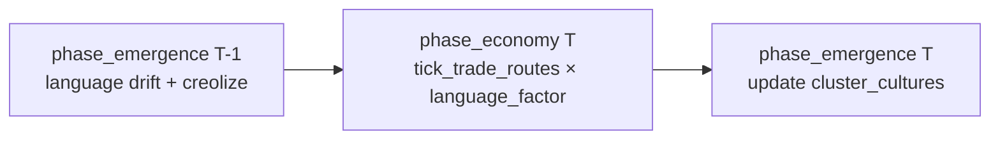

# N5 — Language Distance → Trade Friction Coupling

**Status:** Research / design handoff (read-only audit, 2026-06-16)  
**Charter gap:** LANGUAGE is the weakest remaining emergence layer — `CultureProfile.language` drifts and creolizes every tick in `emergence_culture`, and `civ_agents::culture::language_distance` exists as a first-class primitive, but **no macro consumer reads it**. N2 wired `cultural_distance(traits)` → diplomacy threshold; `language` remains a parallel axis with zero downstream effect.  
**Predecessors:** N1 (settlement stocks → market), N2 (trait similarity → diplomacy), N3 (settlement contact → diplomacy pairs), N4 (settlement exchange → trade routes).  
**Scope:** Specify the **single highest-leverage coupling** to make language matter at macro level. No source changes in this artifact.

---

## 1. Why this coupling (not shared-language → cohesion)

| Weak layer | Current state | Minimal coupling options | Verdict |
|------------|---------------|--------------------------|---------|
| **LANGUAGE** | `language` vector mutates at `0.5×` trait rate; creolization second-pass in `drift_populations`; `language_distance` = RMS delta ∈ `[0, 1]` | (A) `language_distance` → trade friction; (B) shared language → cohesion bonus; (C) language → diplomacy secondary term | **(A) chosen** |
| **LEGENDS/RELIGION** | Saga significance HUD-only | Saga → `belief` | Valuable; separate charter slice (N4-LEG) |
| **TRADE-ROUTE topology** | N4 addresses static routes | Settlement exchange upsert | N4 scope, not N5 |

**Leverage ranking for LANGUAGE closure:** trade friction **>** diplomacy secondary **>** cohesion bonus.

| Alternative | Verdict |
|-------------|---------|
| **Shared-language → cohesion bonus** | Wrong grain — `state.cohesion` is a **global** scalar; language is **pairwise** between populations. Cohesion already accrues from `belief − unrest` plus `micro_cohesion_delta` on `Psyche.beliefs[0]` (ideology consensus), not language vectors. Would add a fourth cohesion input without using the orphan `language_distance` primitive. |
| Language → diplomacy threshold (N2-C) | Valid follow-on but **second-order** — N2 already closes cultural affinity via `traits`; duplicates the “affinity → peace” story on a 500-tick cadence instead of every-tick commerce. |
| Language → civ-ai naming / HUD only | Observability, not emergence charter closure. |
| Agent-level language component | Heavy; population language already lives in `cluster_cultures`. |

**Why trade friction wins:**

1. **Uses the unused primitive directly** — `language_distance(a, b)` is implemented and tested in `civ_agents::culture` but never imported by the engine macro loop.
2. **Pairwise grain matches trade routes** — each `TradeRoute { from_faction, to_faction, … }` is a bilateral exchange; friction is naturally `f(distance(lang_a, lang_b))`.
3. **Every-tick consumer** — `tick_trade_routes` runs inside `phase_economy` with the same fan-out as `society_trade_factor` and `relation_trade_factor`.
4. **Orthogonal to N2** — charter treats ideology/culture **and language** as separate emergent layers; traits → diplomacy, language → transaction cost is a clean split.
5. **Creolization feedback loop** — contact zones blend `language` toward neighbors (`creole_threshold = 0.85` in `emergence_culture`); reduced distance **raises** trade volume on cross-border routes without new state.

---

## 2. Survey — language state today

### 2.1 Data model (`civ_agents::culture`)

| Field | Type | Role |
|-------|------|------|
| `traits` | `[f32; 4]` | Cultural meme vector — **N2 macro consumer** |
| `language` | `[f32; 4]` | Language drift vector — **no macro consumer** |
| `contact` | `f32` | Incoming contact weight this tick |
| `kinship` | `f32` | Drift insulation (engine never sets; stays `0.0`) |

**Distance primitives:**

```text
cultural_distance(a, b) -> f32   // ∈ [0, 1]
language_distance(a, b) -> f32   // alias — identical implementation, zero engine callers
```

### 2.2 Micro evolution (`emergence_culture`, `crates/engine/src/emergence.rs`)

**Tick position:** `phase_emergence` (#14) — after `phase_life` / `phase_settlement_consumption`, **after** `phase_economy`.

**Algorithm (per tick):**

1. Count civilians per `ClusterMember.cluster.0`; skip clusters with `< 2` members.
2. Lazily insert `EmergenceState.cluster_cultures[cluster_id]` with bit-scrambled seed (`CultureProfile::new`).
3. Build synthetic fully-connected `ContactEdge`s (weight `0.15`) between cluster indices.
4. `drift_populations(…, mutation_rate=0.02, diffusion_rate=0.08, creole_threshold=0.85)`.
5. Language mutates at **`mutation_rate × 0.5`**; creolization second-pass blends divergent contact pairs.

**Key property:** `language` and `traits` **decouple** over time — identical seeds diverge at different rates; creolization can converge languages at contact while traits stay farther apart.

### 2.3 Macro trade execution (`tick_trade_routes`, `engine.rs`)

Per route, shipped quantity:

```text
quantity = route.volume
         * trade_volume_multiplier(available, to_stock)
         * unrest_trade_factor(unrest)
         * society_trade_factor(cohesion, micro_trust_permille)
         * relation_trade_factor(relation)
```

| Factor | Range | Source |
|--------|-------|--------|
| `unrest_trade_factor` | `[floor, 1.0]` | global unrest |
| `society_trade_factor` | `[1.0, 1.75]` | cohesion + micro trust |
| `relation_trade_factor` | `[0.5, 1.5]` | pairwise relation score |

**Gap:** no term reads `CultureProfile.language`. Commerce ignores the charter’s separate language layer.

### 2.4 Tick-order note

`phase_economy` (trade) runs **before** `phase_emergence` (culture drift) in `tick_with_emergence_source`. Language read at tick *T* is the profile from tick *T−1* — same one-tick lag as N2 diplomacy (also pre-emergence). Acceptable: language drift is slow (`0.01` effective mutation on language axis).

---

## 3. Gap statement (N5)

| Layer | Evolves | Feeds macro economy / cohesion / diplomacy? |
|-------|---------|---------------------------------------------|
| `cluster_cultures[].traits` | Yes | **Yes** — N2 diplomacy threshold |
| `cluster_cultures[].language` | Yes (drift + creolize) | **No** |
| `language_distance(·,·)` | Computable any tick | **No callers in engine** |
| `Psyche.beliefs` (culture exposure) | Yes | Beliefs → cohesion only (not language) |

**Charter intent (`docs/guides/emergence-charter.md`):** “Ideology & culture **& language** … drift + diffuse … dialects/creoles emerge from contact.”  
**FR-CIV-PSYCHE-912:** contact zones show language mixing; distinct language regions detectable.

---

## 4. Optimal minimal first coupling

### 4.1 Choice: **pairwise `language_distance` → multiplicative trade friction in `tick_trade_routes`**

**Mechanism:** Derive each faction’s representative language vector from its settlement cultures, compute `language_distance` for each route’s `(from_faction, to_faction)` pair, map distance to a **penalty-only** factor in `[LANGUAGE_TRADE_FLOOR, 1.0]`, multiply into the existing trade quantity stack.

**Design stance:** Shared language = **absence of friction** (factor `1.0`). Divergent languages **reduce** volume; they do **not** increase it — avoids double-counting the cohesion/relation boost paths.

### 4.2 Micro signal

**Per settlement (read-only):**

```text
(cluster_id, language_vector, member_count, dominant_faction?)
  language_vector ← cluster_cultures[cluster_id].language        // [f32; 4]
  member_count    ← cluster_member_counts[cluster_id]            // u32, ≥ 2
  dominant_faction ← settlement_dominant_factions[cluster_id]    // Option<u32>, N3 helper
```

**Faction language centroid (new pure fn):**

```text
fn faction_language_centroids(
    cultures: &BTreeMap<u64, CultureProfile>,
    dominant: &BTreeMap<u64, u32>,
    member_counts: &BTreeMap<u64, u32>,
) -> BTreeMap<u32, TraitVector>
```

Logic:

1. For each `(cluster_id, faction_id)` in `dominant`, skip if `member_counts[cluster_id] < 2` or missing culture.
2. Accumulate per-faction weighted sum: `sum[axis] += language[axis] * member_count`, `weight += member_count`.
3. Output `centroid[axis] = clamp01(sum[axis] / weight)`.

**Fallback (minimal v1 alternate):** if `dominant` is empty for a faction, reuse N2’s partial bridge `cultures.get(&u64::from(faction_id)).map(|p| p.language)` so tests that pin faction-keyed profiles still work. Production sims should prefer settlement-weighted centroids once N3 helpers land.

**Per trade route pair:**

```text
let lang_a = faction_language_centroids.get(&route.from_faction);
let lang_b = faction_language_centroids.get(&route.to_faction);
let distance = match (lang_a, lang_b) {
    (Some(a), Some(b)) => language_distance(a, b),
    _ => 0.0,   // missing profile → no penalty (preserve legacy behavior)
};
let language_factor = language_trade_factor(distance);
```

### 4.3 Macro consumer

**New pure function** (suggested: `engine.rs` next to `relation_trade_factor`):

```text
/// Max per-mille reduction from language barrier (at distance = 1.0).
const LANGUAGE_TRADE_PENALTY_PERMILLE: i64 = 500;

/// Downward-causation (FR-CIV-LANG / FR-CIV-PSYCHE-912): mutually unintelligible
/// languages impose transaction friction. Returns factor in [0.5, 1.0].
fn language_trade_factor(distance: f32) -> Fixed {
    let d = distance.clamp(0.0, 1.0);
    let permille = 1_000 - (d * LANGUAGE_TRADE_PENALTY_PERMILLE as f32).round() as i64;
    Fixed::from_num(permille) / Fixed::from_num(1_000)
}
```

**Sink (single multiplication in `tick_trade_routes`):**

```text
let language_factor = language_trade_factor(
    route_language_distance(
        &self.emergence.cluster_cultures,
        &self.state.settlement_dominant_factions,   // N3 field
        &self.state.cluster_member_counts,
        route.from_faction,
        route.to_faction,
    ),
);

let boosted = route.volume
    * trade_volume_multiplier(available, to_stock)
    * unrest_factor
    * society_factor
    * relation_factor
    * language_factor;
```

**Imports:** extend `use civ_agents::culture::{cultural_distance, language_distance, CultureProfile, TraitVector};`

**Constants tuning intent:**

| `language_distance` | `language_factor` | Interpretation |
|---------------------|-------------------|----------------|
| `0.0` (identical / creolized) | `1.0` | No barrier |
| `0.5` | `0.75` | Moderate interpreter / pidgin cost |
| `1.0` (max divergence) | `0.5` | Matches `relation_trade_factor` floor — worst allies still trade more than mutually alien tongues at parity |

Penalty cap `500` permille mirrors the **lower half** of `relation_trade_factor`’s `[500, 1500]` span — language friction is material but subordinate to alliance status and societal cohesion.

### 4.4 Exact fields touched

| Read | Write |
|------|-------|
| `EmergenceState.cluster_cultures[cluster_id].language` | — |
| `WorldState.cluster_member_counts` | — |
| `WorldState.settlement_dominant_factions` (N3) | — |
| `TradeRoute.from_faction`, `TradeRoute.to_faction` | — |
| — | `faction_resources`, `faction_treasury` (indirect via reduced `quantity`) |

**No new persistent `WorldState` fields required.** Optional ephemeral cache `BTreeMap<u32, TraitVector>` local to `tick_trade_routes` if centroid aggregation is hoisted out of the per-route loop.

**No serde migration.**

---

## 5. Test specification

### 5.1 Unit test — pure factor

**Name:** `language_trade_factor_scales_with_distance`  
**File:** `crates/engine/src/engine.rs` `#[cfg(test)]`

```text
assert_eq!(language_trade_factor(0.0), Fixed::from_num(1));
assert_eq!(language_trade_factor(1.0), Fixed::from_num(1) / Fixed::from_num(2));  // 0.5
let mid = language_trade_factor(0.5);
assert!(mid > Fixed::from_num(1) / Fixed::from_num(2) && mid < Fixed::from_num(1));
```

### 5.2 Unit test — centroid aggregation

**Name:** `faction_language_centroids_member_weighted`  
**File:** same

Pin two clusters dominated by faction `0`: cluster `10` language `[0.0, …]`, 3 members; cluster `20` language `[1.0, …]`, 1 member. Assert centroid axis-0 ≈ `0.25` (3:1 weight). Faction `1` absent → not in map.

### 5.3 Integration test — divergent languages reduce shipped volume

**Name:** `language_barrier_reduces_trade_route_flow`  
**File:** same

**Setup:**

1. `Simulation::with_seed(42)` (or minimal harness).
2. Pin one bootstrap route `0 → 1`, `goods: "grain"`, `volume: Fixed::from_num(10)`.
3. Pin exporter/importer `faction_resources` so `trade_volume_multiplier` is active and not supply-limited.
4. Pin `state.cohesion`, `state.unrest`, `faction_relations` so `society_factor == 1`, `unrest_factor == 1`, `relation_factor == 1`.
5. **Case A — shared language:** insert `cluster_cultures` + `settlement_dominant_factions` so both factions centroid to `[0.5, 0.5, 0.5, 0.5]`.
6. **Case B — divergent language:** faction `0` → `[0.0, 0.0, 0.0, 0.0]`, faction `1` → `[1.0, 1.0, 1.0, 1.0]` (distance `1.0`).
7. Call `tick_trade_routes()` on both; snapshot importer food gain.

**Assert:** `importer_gain_A > importer_gain_B` (strict inequality).  
**Optional quantified assert:** `gain_B ≈ gain_A * 0.5` when other factors pinned to `1.0`.

**Control:** remove language profiles → both gains equal (factor defaults to `1.0`).

### 5.4 Integration test — creolization lowers friction over time (slow)

**Name:** `contact_creolization_restores_trade_volume`  
**File:** `crates/engine/src/emergence.rs` or `engine.rs`

Run `emergence_culture` with two clusters in contact, initial opposite language vectors, record `language_distance` at tick 0 vs tick 512. Assert distance decreases. (Validates the feedback loop premise; does not require full economy harness.)

---

## 6. What N5 v1 does *not* do

| Deferred | Rationale |
|----------|-----------|
| Shared-language → cohesion bonus | Global scalar; wrong grain; see §1 |
| Language → diplomacy threshold (N2-C) | Second affinity axis on 500-tick cadence |
| Per-agent language component | Population vector sufficient for macro v1 |
| Translation tech / institution unlock | v2 policy layer |
| `crates/lang` name generation pipeline | FR-CIV-LANG naming; not trade friction |
| HUD language-region overlay | FR-CIV-INFOVIEW-913; read-only after coupling exists |
| Penalty on intra-faction routes | Routes already skip `from == to` |

---

## 7. Tick-order DAG (N5 slice)



**Depends on:** N3 `settlement_dominant_factions` (or N2 faction-key fallback for tests).  
**Composes with:** N4 emergent routes (same consumer), existing unrest/cohesion/relation multipliers.

---

## 8. Phased WBS (follow-on)

| Phase | Task ID | Description | Depends on |
|-------|---------|-------------|------------|
| 1 | **N5-A** | `language_trade_factor`, `route_language_distance`, unit tests | — |
| 2 | N5-A2 | `faction_language_centroids` + member-weighted tests | N3-A (or inline dominant map) |
| 3 | N5-A3 | Wire into `tick_trade_routes` | N5-A, N5-A2 |
| 4 | N5-A-int | `language_barrier_reduces_trade_route_flow` | N5-A3 |
| 5 | N5-B | Language → diplomacy secondary term (+1k cap) | N2 |
| 6 | N5-C | Settlement HUD / infoview language regions | FR-CIV-INFOVIEW-913 |

**Agent effort (aggressive):** N5-A through N5-A-int ≈ 8–12 tool calls, ~4 min wall clock.

---

## 9. Cross-project reuse

| Candidate | Location | Notes |
|-----------|----------|-------|
| `language_distance`, `CultureProfile` | `civ_agents::culture` | Reuse; do not duplicate RMS |
| `faction_language_centroids` | `civ-emergence-metrics` (pure) + engine wrapper | Mirror N2/N4 pattern |
| `settlement_dominant_factions` | N3 `engine.rs` | Centroid key |
| `language_trade_factor` | `engine.rs` next to `relation_trade_factor` | Symmetric API shape |

---

## 10. References

| Artifact | Path |
|----------|------|
| Language drift + creolization | `crates/agents/src/culture.rs` |
| `emergence_culture` | `crates/engine/src/emergence.rs` |
| `tick_trade_routes`, trade factors | `crates/engine/src/engine.rs` |
| N2 trait → diplomacy | `N2_CULTURE_DIPLOMACY_SPEC.md` |
| N3 settlement → faction map | `N3_COUPLING_SPEC.md` |
| N4 deferred N4-LANG note | `N4_COUPLING_SPEC.md` §6, §8 |
| Emergence charter (language layer) | `docs/guides/emergence-charter.md` |
| FR-CIV-PSYCHE-912 | `docs/specs/requirements/FR-CIV-PSYCHE.md` |

---

## 11. Summary

**Gap:** `CultureProfile.language` evolves every tick and `language_distance` is implemented, but **macro commerce ignores language entirely** — the weakest charter layer with a ready primitive and no consumer.

**Minimal closure:** Aggregate faction language centroids from settlement `cluster_cultures`, compute `language_distance` per `TradeRoute` pair, apply **`language_trade_factor`** (penalty-only, `[0.5, 1.0]`) inside `tick_trade_routes`.

**Not chosen instead:** Shared-language → cohesion bonus (global scalar, wrong grain, does not consume `language_distance`); language → diplomacy (N2 already covers trait affinity on a slower cadence).

**Test anchor:** Pin identical vs maximally divergent faction language profiles with all other trade multipliers at unity; assert strictly lower importer resource gain when `language_distance == 1.0`.
