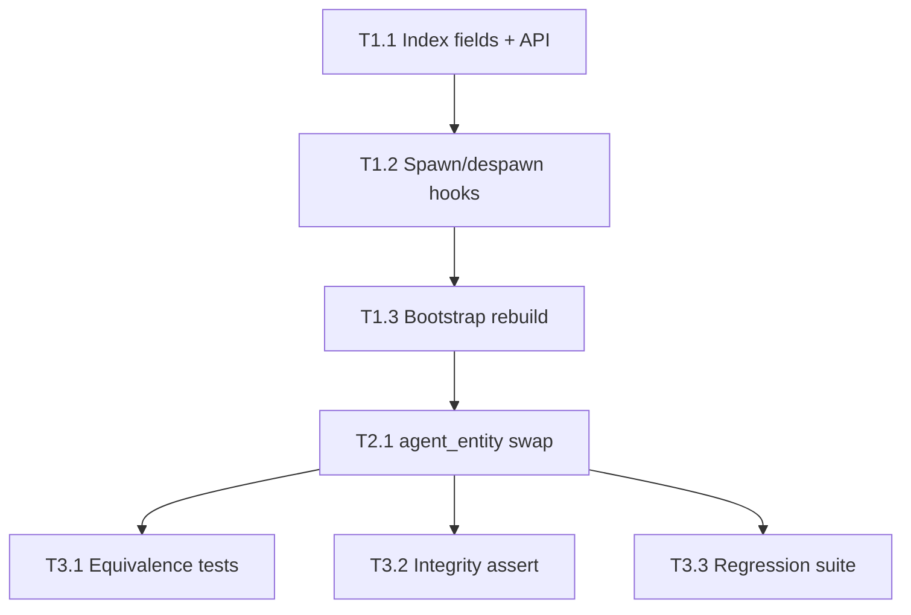

# PERF_OPT_SPEC_2 — Persistent `agent_id → Entity` index (PERF_OPT #2)

**Status:** SPECIFICATION (read-only audit output; no implementation in this change)  
**Source audit:** [`PERF_HOTPATH_2.md`](PERF_HOTPATH_2.md) rank **#1**  
**Wave:** PERF_OPT #2 (suggested optimization wave #2)  
**Date:** 2026-06-16  

**Primary scope:** `Simulation::phase_emergence` → `emergence_psyche` and `apply_social_pair`, via `agent_entity`.  
**Precedent:** PERF_OPT #1 (`life_cluster_position_fingerprint` + cached clustering in `phase_life` §5).

---

## 1. Problem statement

Every tick, `phase_emergence` runs after `phase_life` and performs MOAT wiring (genetics → culture → social → psyche → sentience → legends → civ-ai). The dominant steady-state cost is **repeated linear scans** of all civilians to resolve agent ids to ECS entities.

### 1.1 Exact hot-path functions

| Function | File | Role |
|----------|------|------|
| `Simulation::phase_emergence` | `crates/engine/src/emergence.rs:135` | Phase entry; calls sub-phases in fixed order |
| `Simulation::emergence_psyche` | `crates/engine/src/emergence.rs:328` | Per-agent tie exposure → culture beliefs; **calls `agent_entity` once per social tie** |
| `Simulation::apply_social_pair` | `crates/engine/src/emergence.rs:282` | Social pair mutation; **2× `agent_entity` per accepted pair** |
| `Simulation::agent_entity` | `crates/engine/src/emergence.rs:320` | **O(N) linear scan** over `world.query::<&Civilian>()` |
| `Simulation::agent_psyche` / `agent_social_graph` | `crates/engine/src/emergence.rs:654`, `:661` | Public getters; same `agent_entity` scan (cold path, same fix) |

Tick wiring (unchanged):

```text
tick_with_emergence_source (engine.rs:1606)
  … → phase_life → phase_settlement_consumption → phase_emergence → …
```

### 1.2 Current `agent_entity` implementation

```320:326:crates/engine/src/emergence.rs
    fn agent_entity(&self, agent_id: u64) -> Option<Entity> {
        self.world
            .query::<&Civilian>()
            .iter()
            .find(|(_, c)| c.id == agent_id)
            .map(|(e, _)| e)
    }
```

Each call walks **all** `Civilian` components until `c.id == agent_id`.

### 1.3 Where scans multiply

**`emergence_psyche`** (`emergence.rs:355–386`): for each of **N** agents, collect social ties (`T̄` mean ties per agent), then for each tie:

1. `agent_entity(other_id)` → **O(N)** scan  
2. `world.get::<&ClusterMember>(other_entity)` → **O(1)**  
3. `cluster_cultures.get(&other_cluster)` → **O(log K)**  

Dominant term: **O(N · T̄ · N) = O(N² · T̄)** per tick.

**`emergence_social` → `apply_social_pair`** (`emergence.rs:241–311`): for each co-located cluster pair that passes `gen_bool(0.12)`, `apply_social_pair` calls `agent_entity` twice. If **P** pairs fire per tick, cost is **O(P · N)** (currently **P ≪ N²** but still linear per lookup).

**Secondary costs in the same phase** (out of primary scope; see §6):

| Sub-phase | Cost | Note |
|-----------|------|------|
| `emergence_genetics_sentience` | **O(N · L_dna)** | Clones every `Dna` each tick (`emergence.rs:474–478`) even for agents already in `sentient_agents` |
| `emergence_culture` | **O(K² + K · profile_size)** | Clones all `CultureProfile` values into `Vec`, rebuilds complete contact graph (`emergence.rs:206–228`) |

---

## 2. Current cost (steady-state)

**Symbols:**

| Symbol | Meaning | Default baseline |
|--------|---------|------------------|
| **N** | Civilian count | ≈ 128 (4 factions × 32) |
| **T̄** | Mean directed ties per agent | Sparse early; grows toward social cap **150** (`MAX_TIES`) |
| **P** | `apply_social_pair` invocations per tick | Scenario-dependent; bounded by cluster adjacency × 0.12 accept rate |
| **K** | Active settlement cluster count | ≪ N early; grows with clustering |
| **L_dna** | Bytes per `Dna` genome | Class default length (64 in tests) |

**Per-tick dominant term (rank #1):**

```text
C_psyche  ≈ N · T̄ · N        = O(N² · T̄)     agent_entity in tie exposure loop
C_social  ≈ 2 · P · N        = O(P · N)       apply_social_pair lookups
C_entity  ≈ C_psyche + C_social + getter calls
```

**At N = 128, T̄ = 10 (illustrative mid-game):** psyche alone ≈ **128 × 10 × 128 ≈ 1.6×10⁵** civilian comparisons per tick, before mood/belief math.

**After index:** `agent_entity` → **O(1)** amortized hash lookup → **C_psyche ≈ N · T̄**, **C_social ≈ 2P**.

---

## 3. Proposed optimization

### 3.1 Data structure

Add to `Simulation` (`crates/engine/src/engine.rs`, alongside `life_cluster_position_fingerprint`):

```text
agent_id_to_entity: HashMap<u64, Entity>
```

- **Purpose:** persistent `Civilian.id` → `hecs::Entity` map for O(1) lookup.
- **Not serialized** in save/replay payloads unless a future save format requires it; rebuild from world on load (§3.4).
- **Invariant:** bijection between map keys and living civilians with `Civilian` component; duplicate ids are a hard integrity violation.

Optional test-only fields (mirror PERF_OPT #1):

```text
#[cfg(test)]
agent_entity_linear_scan_count: u64
#[cfg(test)]
force_agent_entity_linear_scan: bool   // baseline path for equivalence tests
```

### 3.2 API surface (engine)

| Method | Semantics |
|--------|-----------|
| `register_civilian_entity(&mut self, id: u64, entity: Entity)` | Insert after spawn; **panic or `IntegrityError`** if `id` already mapped |
| `unregister_civilian_entity(&mut self, id: u64)` | Remove on despawn; **panic or `IntegrityError`** if `id` missing when despawn was civilian |
| `rebuild_agent_id_index(&mut self)` | Full **O(N)** scan: `query::<&Civilian>()` → clear + repopulate map |
| `agent_entity(&self, id: u64) -> Option<Entity>` | **Production:** `self.agent_id_to_entity.get(&id).copied()`; **test baseline:** retain current linear scan when `force_agent_entity_linear_scan` |

`agent_entity` remains on `Simulation` in `emergence.rs` (or moves to `engine.rs` if import boundaries require).

### 3.3 Incremental maintenance (dirty paths)

Update the map on every civilian **spawn** and **despawn**. Do **not** rebuild the full map each tick.

| Event | Location | Action |
|-------|----------|--------|
| Initial world population | `spawn_faction_civilians` (`engine.rs:162–193`) | Capture `spawn_civilian_at` return `Entity` → `register_civilian_entity` **or** call `rebuild_agent_id_index` once after `attach_citizen_to_agents` in `Simulation::new` / `with_seed` |
| Birth | `phase_citizen_lifecycle` → `spawn_child_near` (`engine.rs:2631–2633`) | Register `child_id` with returned entity |
| Death (life needs) | `phase_life` despawn loop (`engine.rs:2440–2441`) | `unregister_civilian_entity(*entity_id)` before/after `world.despawn` |
| Death (citizen lifecycle) | `phase_citizen_lifecycle` despawn (`engine.rs:2642–2643`) | Same |
| Disaster kill | `disasters.rs` civilian despawn (`disasters.rs:271`) | Same |
| Scenario / test direct spawn | Any `spawn_civilian_at(&mut sim.world, …)` on a `Simulation` | Register via wrapper or explicit post-spawn hook |

**Not in scope for map maintenance:** military `MilitaryUnit` despawn (`engine.rs:2764–2765`) — no `Civilian` component.

**ID reuse:** `next_civilian_id` monotonicity must be preserved; re-registering a live id is forbidden.

### 3.4 Cache invalidation / rebuild triggers

| Trigger | Action |
|---------|--------|
| `Simulation::new` / `with_seed` after civilian spawn | `rebuild_agent_id_index()` once (simplest correct bootstrap) |
| Future save/load restore | `rebuild_agent_id_index()` after world hydration |
| `#[cfg(debug_assertions)]` end of `tick_with_emergence_source` | Optional: assert `agent_id_to_entity.len() == count_civilians(&world)` and spot-check one random id |

No per-tick fingerprint is required: population membership changes only on spawn/despawn, which are already discrete events.

### 3.5 Code changes in emergence (behavior-preserving)

1. **`agent_entity`:** hash lookup (§3.2).  
2. **`emergence_psyche`:** no algorithm change; tie loop unchanged except faster `other_entity` resolution.  
3. **`apply_social_pair`:** no algorithm change.  

**Optional follow-on in the same PR** (same phase, separate commits): store `other_cluster: Option<u64>` on `Tie` at `apply_social_event` write time to skip `ClusterMember` fetch in psyche — **not required** for PERF_OPT #2 acceptance; index alone removes the N² term.

### 3.6 Failure behavior (project stance)

- Stale or missing map entry when a civilian is alive → **`debug_assert` / `IntegrityError`**, not silent fallback to linear scan in production.
- Test-only `force_agent_entity_linear_scan` is the **only** intentional slow path for equivalence harnesses.

---

## 4. Expected win

| Metric | Before | After |
|--------|--------|-------|
| `emergence_psyche` tie resolution | **O(N² · T̄)** | **O(N · T̄)** |
| `apply_social_pair` | **O(P · N)** | **O(P)** |
| Memory | — | **O(N)** map entries |
| Steady tick at N=128, T̄=10 | ~1.6×10⁵ comparisons/tick (psyche lookups only) | ~1.3×10³ hash lookups/tick |

Largest gain at scale (N → 10⁴–10⁵ per CIV-0500 targets).

---

## 5. Phased WBS and dependency DAG

```text
Phase 1 — Index primitive (engine.rs)
  T1.1  Add `agent_id_to_entity` + register/unregister/rebuild helpers
  T1.2  Wire spawn/despawn hooks (table §3.3)
  T1.3  Bootstrap rebuild in `new` / `with_seed`
        Depends on: T1.1

Phase 2 — Hot-path swap (emergence.rs)
  T2.1  Replace `agent_entity` body with map lookup
  T2.2  Update `agent_psyche` / `agent_social_graph` transitively
        Depends on: T1.1, T1.2, T1.3

Phase 3 — Verification
  T3.1  Equivalence tests (§6)
  T3.2  Extend `check_integrity` or debug tick assert (§3.4)
  T3.3  Existing determinism + emergence tests green
        Depends on: T2.1

Phase 4 — Observability (optional, test-only)
  T4.1  `agent_entity_linear_scan_count` + skip-path counter
        Depends on: T2.1
```



**Agent effort (aggressive):** ~12–18 tool calls, ~5–8 min wall clock for Phases 1–3.

---

## 6. Behavior-equivalence tests

All tests live in `crates/engine/src/emergence.rs` (`#[cfg(test)]`) and/or `crates/engine/src/engine.rs` test module, following the PERF_OPT #1 pattern (`phase_life_clustering_skip_matches_full_recompute_on_movement`).

### 6.1 Primary equivalence harness

**Name:** `agent_id_index_matches_linear_scan_over_ticks`  
**Mechanism:**

1. `let mut indexed = Simulation::with_seed(SEED);`
2. `let mut baseline = Simulation::with_seed(SEED);`
3. `baseline.force_agent_entity_linear_scan = true;` (test-only; preserves pre-opt scan semantics)
4. Run **TICKS = 200** (match `determinism_holds_with_all_phases_enabled` depth), optionally inject `push_damage` every 17 ticks for population churn.
5. After **each** `tick()`, assert parity:

| Observable | Comparison |
|------------|------------|
| `state.tick`, `state.population` | `assert_eq!` |
| Per-agent `Psyche` | Collect `BTreeMap<u64, Psyche>` via `world.query::<(&Civilian, &Psyche)>()` — **must match exactly** |
| Per-agent `SocialGraph` | Same pattern — **must match exactly** |
| `emergence.cluster_cultures` | `assert_eq!` |
| `emergence.sentient_agents` | `assert_eq!` |
| `emergence_feed()` (kind, summary, agent_id) | `assert_eq!` per tick |
| `sentience_events()` | `assert_eq!` per tick |
| `cluster_member_counts` / settlement count | `assert_eq!` (clustering interacts upstream) |

Failure message must include **tick index** (same style as PERF_OPT #1 clustering test).

### 6.2 Index maintenance under churn

**Name:** `agent_id_index_survives_birth_and_death`  
**Steps:**

1. Run 50 ticks with `Simulation::with_seed`.
2. Record `agent_id_to_entity.len()` and `count_civilians(&world)` — equal.
3. Force deaths (`state.resources.food = ZERO`, run 250 ticks) and births (normal ticks).
4. After each tick in a window, assert `map.len() == count_civilians`.
5. For every `(id, entity)` in map, assert `world.get::<&Civilian>(entity).unwrap().id == id`.

### 6.3 Performance observability (test-only)

**Name:** `agent_entity_uses_index_not_linear_scan`  
**Steps:**

1. Stationary population warmup (reuse `pin_all_civilian_positions` pattern from PERF_OPT #1).
2. Run 30 ticks.
3. Assert `agent_entity_linear_scan_count == 0` on indexed sim.
4. Assert `agent_entity_linear_scan_count > 0` on baseline with `force_agent_entity_linear_scan = true` over the same seed/ticks (proves harness exercises slow path).

### 6.4 Regression guards (must remain green)

- `emergence::tests::psyche_phase_mutates_mood_over_ticks`
- `engine::tests::determinism_holds_with_all_phases_enabled`
- `engine::tests::test_determinism`
- `determinism_proptest.rs` — `same_seed_and_tick_count_yields_identical_outcome`
- `emergence::tests::agent_social_graph_returns_graph_for_known_agent`

### 6.5 Replay / determinism contract

Optimization **must not** change:

- RNG draw order in `emergence_social`, `emergence_psyche` (`ChaCha8Rng::seed_from_u64(self.state.rng_seed ^ self.state.tick ^ id)`), or culture drift.
- Phase call order inside `phase_emergence`.
- Tie iteration order (`SocialGraph.ties` sorted by `other`).

HashMap lookup is deterministic given the same insert/remove sequence; spawn/despawn order is already deterministic.

---

## 7. Acceptance criteria

- [ ] `agent_entity` hot path is **O(1)** map lookup in production builds.
- [ ] Map size always equals living civilian count (debug assert or integrity check).
- [ ] `agent_id_index_matches_linear_scan_over_ticks` passes for seeds `{12345, 4242, 777}`.
- [ ] No change to observable emergence outputs vs linear-scan baseline over 200 ticks.
- [ ] All existing engine + emergence tests pass (`cargo test -p civ-engine`).
- [ ] Documented in `PERF_HOTPATH_2.md` **Resolved** table on merge (future doc update).

---

## 8. Out of scope (PERF_OPT #3+)

| Item | Target wave |
|------|-------------|
| `phase_life` scan fusion, POI cache, in-place `cluster_stocks` | PERF_OPT #3 |
| `phase_diffusion` fused pass | PERF_OPT #4 |
| Dirty-gated `attach_citizen_to_agents` | PERF_OPT #5 |
| `emergence_genetics_sentience` skip `sentient_agents` + borrow `&Dna` | Optional same-wave follow-on |
| `emergence_culture` in-place drift / dirty clusters | Optional same-wave follow-on |
| `Tie.other_cluster` cache | Optional enhancement after index lands |

---

## 9. Validation after implementation

Re-run static audit and, when permitted, profiling:

```text
cargo flamegraph -p civ-engine --bench <emergence_hotpath_bench>   # if/when added
just civis-3d-verify                                              # no RPC shape change expected
```

*Spec generated from static read of `main`-line `engine.rs` + `emergence.rs` and [`PERF_HOTPATH_2.md`](PERF_HOTPATH_2.md). Re-validate with flamegraph on a representative scenario before claiming wall-clock wins.*
