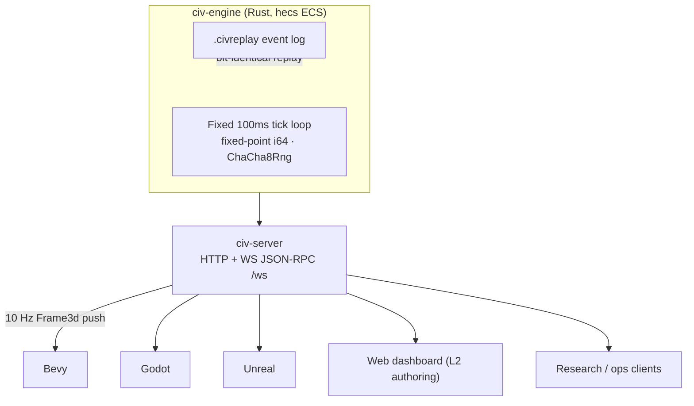

## Work State

| Field | Value |
|---|---|
| Updated | 2026-06-14 |
| State | Recovery complete (p-l1+p-w1 merged); consolidation collapsing (branches 180→97, worktrees 95→25); 13 PRs this session; playable voxel build via one-click launcher; 3D protocol + modding v3 partial; 113 / 212 traced requirements implemented; 82.6% line coverage; 750+ tests green; live emergence dashboard online; full triage complete. Still far from AAA: GFX is partial, balancing is not implemented, and audio is substrate-only. |
| Open PRs | None |
| Focus | Civis — 3D civilization godgame (WorldBox-class sandbox on emergent simulation) |

Progress: ████████▓░ 82.6% (recovery complete; consolidation collapsing: branches 180→97, worktrees 95→25; 13 PRs this session; playable voxel build shipped; 3D protocol + modding v3 partial; 113 / 212 FRs implemented; 750+ tests green; dashboard live; triage complete; AAA gaps: partial GFX, no balancing, audio substrate-only)

> **Pinned references (Phenotype-org)**
> - MSRV: see rust-toolchain.toml
> - cargo-deny config: see deny.toml
> - cargo-audit: rustsec/audit-check@v2 weekly
> - Branch protection: 1 reviewer required, no force-push
> - Authority: phenotype-org-governance/SUPERSEDED.md

# Civis — CivLab

**Work state:** ~30-35% overall; sim backend ~60%, emergent layers ~15% (lifecycle+diplomacy specs written; diplomacy is being implemented), client/render ~45% (AAA graphics-settings, DX12 default, terrain-fragmentation fix, native ocean, holocron theme landed), assets ~20%, gameplay-feel ~25%. `[####------]` 35%

[](https://github.com/KooshaPari/Civis/actions)
[](https://github.com/KooshaPari/Civis/releases)
[](LICENSE)
[](https://github.com/KooshaPari)


**Civis** is the canonical workspace for **CivLab**, a headless, deterministic civilization simulation engine.

CivLab decouples simulation logic from rendering: a Rust simulation core runs headlessly and exposes a client-agnostic protocol (WebSocket JSON-RPC + binary frames) so Bevy, Unreal, Unity, Godot, web, and research clients can attach to the same world timeline simultaneously.

> **Status:** Pre-MVP. See [`PRD.md`](./PRD.md), [`ADR.md`](./ADR.md), and [`PLAN.md`](./PLAN.md) for current scope and phasing.
> **Target:** MVP Q3 2026 → v1 Q4 2026.

---

## What CivLab Is

| Dimension | Choice |
|---|---|
| **Language** | Rust (edition 2021) |
| **Architecture** | ECS via [`hecs`](https://crates.io/crates/hecs) |
| **Determinism** | Fixed-point `i64` @ 10^6 scale; `ChaCha8Rng` seeded once per run; `BTreeMap` for ordered iteration |
| **Tick loop** | Fixed-timestep, 100 ms/tick, sub-16 ms target budget |
| **Protocol** | WebSocket JSON-RPC + binary frames (multi-client) |
| **Rendering clients** | Godot (game UX), Bevy (CI/reference), Unreal (visuals), **Web (L2 sandbox + ops)** — [ADR-009](docs/adr/ADR-009-web-client-strategy.md), [amendment](docs/adr/ADR-009-amendment-web-l2-authoring.md) |
| **Replay** | Full event log → bit-identical replay (`.civreplay`) |

CivLab is simultaneously a **game** (RTS-style city/nation building), a **research sandbox** (deterministic, scriptable, full event logs), and a **platform** (multiple renderers attach to one simulation).



> [!EMBED] STUB — multi-client world playback
> A recording of two renderers (e.g. Bevy + Web dashboard) attached to one live simulation timeline belongs here. Pending rich-embed pipeline (#966).

See [`COMPARISON.md`](./COMPARISON.md) for how CivLab differs from Dwarf Fortress, Victoria 3, CK3, and Factorio.

---

## Repository Structure

- `crates/` — simulation core (Rust workspace, 28 members)
- `Cargo.toml` — Rust 2024 workspace manifest
- `docs/` — VitePress docs and specification corpus
  - `docs/wiki/` — concept and architecture knowledge
  - `docs/development-guide/` — contributor and implementation guides
  - `docs/roadmap/` — planning and sequencing artifacts
  - `docs/api/` — API and contract documentation
- Root specs: [`PRD.md`](./PRD.md), [`ADR.md`](./ADR.md), [`PLAN.md`](./PLAN.md), [`FUNCTIONAL_REQUIREMENTS.md`](./FUNCTIONAL_REQUIREMENTS.md), [`COMPARISON.md`](./COMPARISON.md)

---

## Quick Start

**Prerequisites:** Rust (edition in `Cargo.toml`), [Bun](https://bun.sh) (docs only; no npm/yarn/pnpm), [Task](https://taskfile.dev), [lefthook](https://github.com/evilmartians/lefthook) (local git hooks).

```bash
git clone https://github.com/KooshaPari/Civis.git && cd Civis
lefthook install
cargo build --workspace && cargo test --workspace
just civis-3d-verify          # or: lefthook run pre-push (emits manifest + runs gates)
cargo run -p civ-server       # http://127.0.0.1:3000  (override with CIVIS_WS_ADDR)
```

### Launch the standalone game (Bevy)

The Bevy reference client needs **both** the `bevy,egui` feature set and
a `BEVY_ASSET_ROOT` env var. Bevy 0.18 `AssetPlugin::file_path` defaults
to `"./assets"` relative to CWD — from the workspace root that resolves
to the wrong directory and produces 6 phantom module errors + ~10 asset
404s. Use the ergonomic launcher (it defaults `BEVY_ASSET_ROOT` and
`CARGO_TARGET_DIR=G:/civis-target-gate` for you):

```bash
just play          # release build + detached launch + log tail
just play-debug    # RUST_LOG=info,civ_bevy_ref=debug,wgpu=warn
just play-trace    # + RUST_BACKTRACE=full
just play-window   # live F3D0 binary-frame client (civ-bevy-window)
```

Manual incantation if you don't have `just` (Windows PowerShell):

```powershell
$env:BEVY_ASSET_ROOT = "$PWD/clients/bevy-ref"
$env:CARGO_TARGET_DIR = "G:/civis-target-gate"   # any out-of-tree dir
cargo run -p civ-bevy-ref --features bevy,egui --bin civ-standalone
```

Manual incantation (POSIX / WSL):

```bash
BEVY_ASSET_ROOT="$PWD/clients/bevy-ref" \
CARGO_TARGET_DIR="$PWD/target" \
cargo run -p civ-bevy-ref --features bevy,egui --bin civ-standalone
```

The `just play*` recipes call into `Tools/play.ps1` (Windows) or
`Tools/play.sh` (POSIX) — both scripts honor a pre-set
`CARGO_TARGET_DIR` and default `BEVY_ASSET_ROOT` to
`clients/bevy-ref` when the env var is unset, so direct script
invocation is also safe. A runtime asset-root fallback in
`clients/bevy-ref/src/bin/standalone.rs` is planned but **deferred** to
a follow-up PR; for now, set `BEVY_ASSET_ROOT` (or use `just play*`,
which sets it for you).

### Local-first CI (avoid billable runners)

Heavy quality runs **on your machine** via lefthook; GitHub Actions only **verifies** the committed attestation in `.ci/quality-manifest.json` (no `cargo` on the runner — same pattern as phenotype-journey `manifest.verified.json`).

| Step | Command |
|------|---------|
| Install hooks | `lefthook install` |
| Run before push | `lefthook run pre-push` → runs fmt/clippy/test/web/dashboard checks, writes `.ci/quality-manifest.json` |
| Commit manifest | `git add .ci/quality-manifest.json` (staged automatically when hooks pass) |
| Cloud verify (CI) | `just quality-manifest-verify` or workflow job `quality-manifest` |

Optional full sweep on Actions (manual only): **Actions → Quality → Run workflow** (`workflow_dispatch` → `quality-full`).

**PR merge without billable runners:** only `quality-manifest` + `pr-governance-gate` run on pull requests. Legacy workflows (`cargo-deny`, CodeQL, `quality-gate`, etc.) run on `main` push or `workflow_dispatch` only. Add label `local-first-ci` or `ci-billing-exception` on the PR to ignore stale red checks from before this policy.

**`civ-server` protocol** — HTTP on the bind address; WebSocket JSON-RPC at `/ws`.

| Kind | Methods / routes |
|------|------------------|
| HTTP | `GET /healthz` → `{ "tick": <u64> }` · `GET /replay/export` → `.civreplay` (`application/octet-stream`) · `POST /replay/import` → load `.civreplay` bytes into the bridge |
| WS JSON-RPC | `health` · `sim.status` · `sim.snapshot` · `sim.command` (`noop` \| `tick`) · `sim.spawn_civilian` · `sim.spawn_entity` (`kind`: civilian \| vehicle \| airport) · `sim.place_voxel` · `sim.damage` (immediate voxel apply) · replay/policy/speed methods |

**`POST /replay/import`** — replace the live bridge simulation from a raw `.civreplay` body (no filesystem path). Request: `Content-Type: application/octet-stream`. Success: `{ "ok": true, "tick": <u64> }`; invalid bytes → `400`. Updates both the in-memory sim and the bridge tick counter (same state as `GET /healthz`).

**`sim.snapshot`** — read-only view of the in-memory simulation. Params: `{}`. When the bridge can read the sim, result includes `tick`, `population`, `building_count`, and `market_prices`; `energy_budget` and `hash_chain_root` (64-char lowercase hex from the replay hash chain) are included when set. Otherwise returns `{ "tick": <u64> }` only.

**`sim.reset`** — replace the bridge simulation with `Simulation::with_seed`. Params: `{ "seed": <u64> }` (required). Result: `{ "seed": <u64>, "tick": 0 }`. Resets the live world and tick counter.

**`sim.set_policy`** — update `Simulation::economy_policy`. Params: `{ "scarcity_multiplier": <f64> }` (required, ≥ 0); optional `{ "base_consumption_joules": <u64> }`. Result: `{ "updated": true, "scarcity_multiplier": <f64>, "base_consumption_joules": <f64> }` (joules reflect the live policy after apply).

**`sim.set_speed`** — store bridge tick speed multiplier. Params: `{ "multiplier": <u32> }` (0, 1, 2, 4, or 8). Result: `{ "accepted": true, "multiplier": <u32> }`.

**`sim.get_speed`** — read stored multiplier. Params: omit or `{}`. Result: `{ "multiplier": <u32> }`.

**Tick broadcast (10 Hz push)** — not JSON-RPC; the bridge pushes three `Frame3d` values each tick (`VoxelDelta`, `BuildingDiff`, `AgentAppearance`). Wire encoding is set by `WsBridgeConfig::tick_broadcast_format` (`TickBroadcastFormat`):

| Mode | WebSocket frames per tick |
|------|---------------------------|
| `Text` | 3 JSON text frames |
| `Binary` | 3 `F3D0` binary frames |
| `Both` (default) | 3 text frames, then 3 matching binary frames |

Binary layout: `F3D0` magic (4) · kind tag (1: voxel / building / agent) · payload length BE (4) · JSON body (`civ-protocol-3d`). `cargo run -p civ-server` reads `CIVIS_TICK_BROADCAST` (`text` | `binary` | `both`, default `both`). Bevy clients that prefer binary-only tick frames should start the server with `CIVIS_TICK_BROADCAST=binary`. When embedding `run_ws_bridge`, set `tick_broadcast_format` on `WsBridgeConfig` directly.

Examples (send as WebSocket text frames after connecting to `ws://127.0.0.1:3000/ws`):

```json
{"jsonrpc":"2.0","id":1,"method":"health","params":{}}
{"jsonrpc":"2.0","id":2,"method":"sim.snapshot","params":{}}
{"jsonrpc":"2.0","id":3,"method":"sim.reset","params":{"seed":4242}}
{"jsonrpc":"2.0","id":4,"method":"sim.set_policy","params":{"scarcity_multiplier":0.0}}
{"jsonrpc":"2.0","id":5,"method":"sim.set_speed","params":{"multiplier":2}}
{"jsonrpc":"2.0","id":6,"method":"sim.get_speed"}
```

Docs: `cd docs && bun install && bun run docs:dev` · build: `bun run docs:build` · index: `bun run docs:index`

> **Note on case:** the canonical repo name is **`Civis`** (capital C). Some legacy docs reference `civ` or `civis`; treat `Civis` as authoritative.

---

## Where to Start

Read these in order:

1. **[`PRD.md`](./PRD.md)** — product vision, target users, MVP/v1/v2 feature matrix, success criteria.
2. **[`ADR.md`](./ADR.md)** — architectural decisions (Rust + Hecs ECS, fixed-point arithmetic, ChaCha8Rng, WebSocket protocol).
3. **[`PLAN.md`](./PLAN.md)** — phased engineering plan (Phase 0 → 6), DAG dependencies, parallel tracks.
4. **[`FUNCTIONAL_REQUIREMENTS.md`](./FUNCTIONAL_REQUIREMENTS.md)** — FR-traceable requirements; every test references an FR.
5. **[`COMPARISON.md`](./COMPARISON.md)** — how CivLab compares to existing civilization games and engines.
6. **`docs/wiki/`** — concept and architecture deep-dives.
7. **`docs/roadmap/`** — current sequencing and milestones.

For contributors: [`CONTRIBUTING.md`](./CONTRIBUTING.md), [`AGENTS.md`](./AGENTS.md), [`CLAUDE.md`](./CLAUDE.md).

---

## Development

| Task | Command |
|---|---|
| Bevy live-attach smoke (headless, no GPU) | `just civis-3d-live-smoke` — F3D0 WS, `live_*`, `event_feed` / `menus`, protocol extended frames, optional `gpu_features` / `pbr-textures` (`materials`); see `clients/bevy-ref/README.md` |
| Run all Rust tests | `cargo test --workspace` |
| FR-CORE-001 tick budget (10k ticks, release) | `cargo test -p civ-engine --release ten_thousand_ticks_under_budget -- --ignored` |
| Lint (deny warnings) | `cargo clippy --workspace -- -D warnings` |
| Format check | `cargo fmt --check` |
| Local quality gate | `task quality` |
| Build docs | `cd docs && bun run docs:build` |
| Preview docs | `cd docs && bun run docs:dev` |
| Web dashboard (L2 authoring default) | `cargo run -p civ-server` + `cargo run -p civ-watch` (terrain) → `cd web/dashboard && npm run dev` → http://127.0.0.1:5173 — `?spectator=1` for read-only |
| Web tests | `cd web && npm test` |
| CA dirty-chunk benchmark | `just ca-bench` |
| CA dirty-chunk flamegraph | `just ca-flamegraph` |
| CA dirty-chunk perf sweep | `just ca-perf` |
| Screenshot assets | [`docs/guides/screenshot-automation.md`](docs/guides/screenshot-automation.md) |

All tests must reference a Functional Requirement (FR) per `FUNCTIONAL_REQUIREMENTS.md`.

---

## License

Dual-licensed under MIT ([`LICENSE-MIT`](./LICENSE-MIT)) or Apache 2.0 ([`LICENSE-APACHE`](./LICENSE-APACHE)) at your option.
