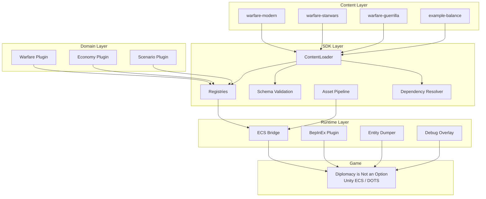
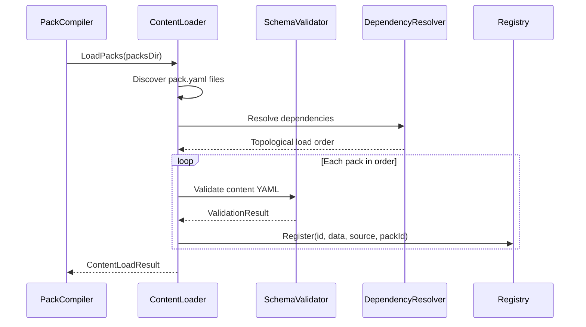

# DINOForge

[](https://github.com/KooshaPari/Dino/actions/workflows/ci.yml)
[](https://codecov.io/gh/KooshaPari/Dino)
[](https://www.nuget.org/packages/DINOForge.SDK/)
[](https://www.nuget.org/packages/DINOForge.Bridge.Protocol/)

**General-purpose mod platform for [Diplomacy is Not an Option](https://store.steampowered.com/app/1272320/Diplomacy_is_Not_an_Option/).**

DINOForge is a mod operating system, not a single mod. It provides the framework, registries, schemas, and tooling for building any type of mod — from simple balance tweaks to full total conversion packs.

## Features

- **Pack System** — YAML-first declarative content packs with dependency resolution, conflict detection, and schema validation
- **Typed Registries** — Units, buildings, factions, weapons, projectiles, doctrines, skills, waves, squads with layered override priority
- **ECS Bridge** — Maps mod content to DINO's actual Unity ECS components at runtime (30+ component mappings)
- **Asset Pipeline** — Full import → validate → optimize → LOD → prefab → Addressables pipeline; 38 catalog entries with 3-level LOD (100%/60%/30%)
- **Pack Submodule Management** — Add/list/update/lock git submodule packs via CLI and Desktop Companion
- **Asset Browser & Mod Manager** — Desktop Companion with visual asset browser, mod conflict detection, and update management
- **Asset Library & Catalog** — SQLite asset catalog with source adapters and CLI asset-library commands
- **Warfare Domain** — Faction archetypes (Order, Industrial Swarm, Asymmetric), doctrines, unit role validation, wave composition, balance calculation
- **Star Wars Clone Wars Pack** — 28 units (Republic + CIS) and 10 buildings with visual assets, prefabs, and Addressables entries
- **Dev Tooling** — PackCompiler CLI, DumpTools, in-game debug overlay, entity dumper
- **MCP Server** — game automation and analysis tools (screenshot capture, UI automation, input injection, state and catalog queries)
- **Schema Validation** — 24 JSON schemas catch errors before runtime
- **Polyglot Build** — Rust, Go, and Zig optimization modules with seamless .NET integration
- **Game Automation Framework** — Headless game testing, UI automation, and state validation
- **95%+ Test Coverage** — 3,613+ passing tests (unit, integration, parameterized, property-based, and E2E)
- **27 Tier 2 Analyzers** — 162 / 16,200 fuzz property cases with 5 caught SUT bugs
- **30+ Pattern Catalog** — 28 CI-gated patterns (12 new in iter-122-141), 11 retired, 100% enforcement

## Milestone Status

| Milestone | Description | Status |
|-----------|-------------|--------|
| M0 | Reverse-Engineering Harness (entity dumps, 45K entities) | Done |
| M1 | Runtime Scaffold (BepInEx plugin, ECS systems) | Done |
| M2 | Generic Mod SDK (registries, schemas, ContentLoader) | Done |
| M3 | Dev Tooling (PackCompiler, DumpTools, DebugOverlay) | Done |
| M4 | Warfare Domain (archetypes, doctrines, roles, waves, balance) | Done |
| M5 | Example Packs (warfare-starwars, warfare-aerial, warfare-guerrilla, warfare-modern) | Done |
| M6 | In-Game Mod Menu + HMR (F9/F10, hot reload) | Done |
| M7 | Installer + Universe Bible | Done |
| M8 | Runtime Integration (ModPlatform, ECS bridge, asset swap) | Done |
| M9 | Desktop Companion (WinUI 3, Mica, pack manager) | Done |
| M10 | Fuzzing (FsCheck 30+ props, SharpFuzz, corpus, nightly CI) | Done |
| M11 | Test Coverage + Code Completion (1017+ tests) | Done |
| M12 | Pack Submodule Management (PackSubmoduleManager, CLI pack add/list/update/lock) | Done |
| M13 | Asset Browser + Mod Manager (DesktopCompanion Asset Browser page, Browse/Update/Conflict views) | Done |
| M14 | Asset Library & Catalog (SQLite AssetCatalogStore, asset-library CLI commands, LocalSourceAdapter) | Done |

**Current Status (v0.25.0-dev)**
- Build: ✅ Clean (exit 0)
- Tests: ✅ 3,613+ passing / 0 failures
- Pattern Catalog: ✅ 30+ entries (27 Tier 2 analyzers, 12 new patterns), 11 RETIRED, 100% CI-gated
- Audit-Rotation: ✅ Converged (iter-122-141, 5 fuzz SUT bugs caught)
- v0.24.0: Released 2026-05-06 at commit f222cd3
- v0.25.0-dev: In progress (closure-gate on fix branch)

## Install

### Desktop Companion (out-of-game pack manager + F9/F10 mirror)

**Windows (PowerShell) — recommended:**
```powershell
irm https://raw.githubusercontent.com/KooshaPari/Dino/main/scripts/install-companion.ps1 | iex
```

**WSL / bash:**
```bash
curl -fsSL https://raw.githubusercontent.com/KooshaPari/Dino/main/scripts/install-companion.sh | bash
```

Or download `DINOForge.Companion-vX.Y.Z-win-x64.zip` directly from [Releases](https://github.com/KooshaPari/Dino/releases/latest).

> **First run**: Settings → set *Packs Directory* to `BepInEx\dinoforge_packs\` in your game folder.

### Game Plugin (BepInEx)

```powershell
irm https://raw.githubusercontent.com/KooshaPari/Dino/main/src/Tools/Installer/Install-DINOForge.ps1 | iex
```

---

## NuGet Packages

DINOForge publishes core libraries as NuGet packages for independent consumption:

| Package | Version | Purpose | Docs |
|---------|---------|---------|------|
| **DINOForge.SDK** | [](https://www.nuget.org/packages/DINOForge.SDK/) | Registries, schemas, pack loading, asset tools | [Docs](docs/SDK.md) |
| **DINOForge.Bridge.Protocol** | [](https://www.nuget.org/packages/DINOForge.Bridge.Protocol/) | JSON-RPC 2.0 bridge messages and interfaces | [Docs](docs/BRIDGE.md) |
| **DINOForge.Bridge.Client** | [](https://www.nuget.org/packages/DINOForge.Bridge.Client/) | Out-of-process game bridge client (netstandard2.0) | [Docs](docs/BRIDGE.md) |
| **DINOForge.Templates** | [](https://www.nuget.org/packages/DINOForge.Templates/) | dotnet new templates for packs and mods | [Docs](docs/TEMPLATES.md) |

**Installation**:
```bash
dotnet add package DINOForge.SDK
dotnet add package DINOForge.Bridge.Protocol
dotnet add package DINOForge.Bridge.Client
```

---

## Standalone Tools

Additional tools available as GitHub releases:

| Tool | Platform | Purpose | Latest |
|------|----------|---------|--------|
| **dinoforge-resolver** | Windows, Linux | Pack dependency resolution (topological sort) | [Release](https://github.com/KooshaPari/Dino/releases/latest) |
| **dinoforge-asset-pipeline** | Windows, Linux | High-performance asset import & LOD generation (Rust) | [Release](https://github.com/KooshaPari/Dino/releases/latest) |

See [LIBIFICATION_ROADMAP.md](docs/LIBIFICATION_ROADMAP.md) for complete package ecosystem documentation.

---

## Getting Started

New to DINOForge? Start here:

- **[Developer Guide](docs/DEVELOPER_GUIDE.md)** — Complete setup instructions, architecture overview, and development workflow
- **[Contributing Guidelines](CONTRIBUTING.md)** — How to contribute, testing requirements, and release process

### Using DINOForge as a Library

If you're building a mod or integration using DINOForge packages:

```bash
# Core SDK (registries, schemas, content loading)
dotnet add package DINOForge.SDK

# Game bridge (JSON-RPC protocol and client)
dotnet add package DINOForge.Bridge.Protocol
dotnet add package DINOForge.Bridge.Client
```

See [NuGet Packages](#nuget-packages) below for full package list and documentation links.

---

## Quick Start

### Prerequisites

- [.NET 8.0 SDK](https://dotnet.microsoft.com/download/dotnet/8.0) (or .NET 11 preview for tool projects)
- [Diplomacy is Not an Option](https://store.steampowered.com/app/1272320/) (for Runtime deployment)
- [BepInEx 5.4.x](https://github.com/BepInEx/BepInEx/releases) (installed in game directory)

### Build

```bash
dotnet build src/DINOForge.sln
```

### Test

```bash
dotnet test src/DINOForge.sln
```

### Validate a Pack

```bash
dotnet run --project src/Tools/PackCompiler -- validate packs/example-balance
```

### Create a Mod Pack

Create a directory with a `pack.yaml` manifest:

```yaml
id: my-balance-mod
name: My Balance Mod
version: 0.1.0
author: YourName
type: balance
framework_version: ">=0.1.0"
loads:
  units:
    - units/
  buildings:
    - buildings/
```

Then add YAML content files in the referenced directories. See `packs/example-balance/` for a complete example.

## Architecture



### Pack Loading Pipeline



### Registry Priority Layers

```
┌─────────────────────────────────┐
│  Pack (priority 3000+)          │  ← Mod content overrides
├─────────────────────────────────┤
│  Domain Plugin (priority 2000+) │  ← Warfare/Economy defaults
├─────────────────────────────────┤
│  Framework (priority 1000+)     │  ← DINOForge defaults
├─────────────────────────────────┤
│  Base Game (priority 0+)        │  ← Vanilla DINO values
└─────────────────────────────────┘
  Higher priority wins. Same priority = conflict detected.
```

| Layer | Purpose | Target |
|-------|---------|--------|
| **Runtime** | BepInEx bootstrap, ECS system injection, component mapping | netstandard2.0 |
| **SDK** | Public mod API — registries, schemas, pack loading, asset tools | netstandard2.0 |
| **Domains** | Game logic — factions, doctrines, combat, economy | netstandard2.0 |
| **Tools** | CLI — pack compiler, dump analyzer, asset inspector | net8.0 |
| **Tests** | xUnit + FluentAssertions | net8.0 |

## MCP Server Tools

The `dinoforge` MCP server provides a core set of game automation and analysis tools for Claude Code integration (39+ tools total in server runtime):

| Tool | Purpose |
|------|---------|
| `game_launch` | Launch game exe + wait for bridge |
| `game_status` | Running state, entity count, loaded packs |
| `game_query_entities` | Query ECS entities by component type |
| `game_get_stat` | Read a stat value on an entity |
| `game_apply_override` | Apply a stat override |
| `game_reload_packs` | Hot-reload packs without restarting |
| `game_dump_state` | Trigger entity dump to file |
| `game_screenshot` | Capture game window screenshot |
| `game_verify_mod` | Verify mod is loaded and active |
| `game_wait_for_world` | Wait until ECS world is ready |
| `game_ui_automation` | Automate game UI interactions |
| `game_launch_test` | Launch TEST instance (second concurrent DINO for testing) |
| `game_analyze_screen` | Capture screenshot + detect UI elements via OmniParser (health bars, unit portraits, buttons, faction indicators) |
| `game_input` | Inject keyboard/mouse input to game without requiring focus (Win32 SendInput) |
| `game_wait_and_screenshot` | Poll for visual change then capture screenshot (configurable timeout/interval) |
| `game_navigate_to` | Navigate to game state (main_menu/gameplay/pause_menu) via input sequences |

## MCP Runtime Mode (Recommended)

The MCP server runs in persistent HTTP mode on `http://127.0.0.1:8765` and is the active default for CC.

Quick start:

```powershell
# Start MCP once in the background (plus optional hot-reload watcher)
./scripts/start-mcp.ps1 -Detached -Watch

# Check health/status
./scripts/start-mcp.ps1 -Action status

# Stop cleanly
./scripts/start-mcp.ps1 -Action stop
```

In Claude Code, use URL transport configuration:

```json
{
  "mcpServers": {
    "dinoforge": {
      "url": "http://127.0.0.1:8765"
    }
  }
}
```

`.claude/mcp-servers.json` is already checked in with this URL transport. Copy it to your
user-level `~/.claude/mcp-servers.json` (or the local equivalent in `%APPDATA%`) and restart CC.

For unattended harness startup, use the repo-managed CC hook in `.claude/settings.json`; MCP starts automatically on session/prompt.
You can still start it manually from CLI during debugging:

```powershell
.\scripts\start-mcp.ps1 -Action start -Detached
```

before MCP tool calls. Set `DINOFORGE_MCP_WATCH=1` (or pass `-Watch`) if you want `hot-reload.ps1 -Watch` to run automatically.

## Project Structure

```
DINOForge/
  src/
    Runtime/           # BepInEx plugin + ECS Bridge
    SDK/               # Public mod API
    Domains/Warfare/   # Warfare domain plugin
    Tools/PackCompiler/# CLI: validate, build, assets
    Tools/DumpTools/   # CLI: dump analysis
    Tests/             # Unit + integration tests
  packs/               # Content packs
  schemas/             # JSON Schema definitions
  docs/                # Documentation (VitePress)
```

## Documentation

Visit [kooshapari.github.io/Dino](https://kooshapari.github.io/Dino) for full documentation.

## Project Policies

- [SECURITY.md](SECURITY.md) describes private vulnerability reporting, supported versions, and response timelines.
- [SUPPORT.md](SUPPORT.md) describes support channels, self-service checks, and issue routing.
- [FUZZING.md](FUZZING.md) documents the current randomized testing posture and remaining fuzzing gaps.
- [CONTRIBUTING.md](CONTRIBUTING.md) defines contributor workflow, testing expectations, and release hygiene.

## Development Methodology

- **SDD** (Spec-Driven Development) — specifications drive the pipeline
- **BDD** (Behavior-Driven Development) — acceptance criteria before implementation
- **TDD** (Test-Driven Development) — unit tests for all public APIs
- **DDD** (Domain-Driven Design) — bounded contexts (Warfare, Economy, Scenario)
- **ADD** (Agent-Driven Development) — fully agent-authored codebase
- **CDD** (Contract-Driven Development) — schemas as contracts between packs and engine

## Formal Governance

- **Coverage** — Code coverage is published to Codecov from CI and governed by `codecov.yml`.
- **Versioning** — public releases use SemVer tags (`vX.Y.Z`) with `VERSION` tracking the latest released version.
- **Changelog** — `CHANGELOG.md` follows Keep a Changelog with a permanent `[Unreleased]` section.
- **Ownership** — `.github/CODEOWNERS` is the review-routing source of truth.
- **Release Process** — see [RELEASING.md](RELEASING.md).
- **Shared KooshaPari semantics** — see [docs/reference/kooshapari-project-semantics.md](docs/reference/kooshapari-project-semantics.md).

## Contributing

See [CONTRIBUTING.md](CONTRIBUTING.md) for guidelines.

## Next Steps

**For Project Planning & Roadmap:**

- **[v0.25.0 Roadmap](docs/ROADMAP_v0.25.0.md)** — Planned features, milestones, and timeline
- **[Performance Baseline](docs/PERFORMANCE_BASELINE.md)** — Performance metrics, benchmarks, and optimization targets
- **[Pattern Catalog](docs/PATTERN_CATALOG.md)** — 30+ CI-gated code quality patterns and governance

**Coming in v0.25.0+:**
- **VDD (Virtual Display Driver)** — Tier 1 isolated headless game testing
- **Docker backend** — Containerized game automation for CI/CD environments
- **phenocompose integration** — AI-assisted parallel game fleet testing (phenocompose v1.0)

## License

MIT

## Acknowledgements

- [BepInEx](https://github.com/BepInEx/BepInEx) — Unity mod loader
- [AssetsTools.NET](https://github.com/nesrak1/AssetsTools.NET) — Unity asset bundle library
- [devopsdinosaur/dno-mods](https://github.com/devopsdinosaur/dno-mods) — Pioneering DINO modding patterns
# Trigger checks
