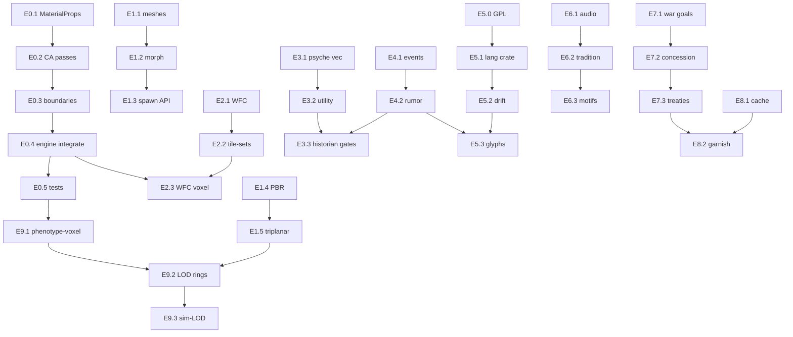

# Civis Emergent Systems — Consolidated Design Spec

> **Status:** Design (planner-only, 2026-05-31). **No implementation code** in this document.
> **Authority:** Locks R&D verdicts from `civis-prompts/rnd/` into one phased plan for engineer agents.
> **Governing canon:** [`docs/guides/emergence-charter.md`](../guides/emergence-charter.md), [`PRD.md`](../../PRD.md), [`PLAN.md`](../../PLAN.md), [`ADR.md`](../../ADR.md).
> **FR backlog:** appended to root [`FUNCTIONAL_REQUIREMENTS.md`](../../FUNCTIONAL_REQUIREMENTS.md) as `FR-CIV-{CA,LANG,SPECIES,ARCH,AUDIO,LEGENDS,PSYCHE,DIPLO,PBR,LLM,SCALE}-*`.
> **Companion specs (do not duplicate):** [`species-sentience.md`](species-sentience.md), [`legends-engine.md`](legends-engine.md), [`audio-direction.md`](audio-direction.md), [`psyche-social.md`](psyche-social.md).

---

## 1. Overview

Civis is a **living-world civilization substrate**: Layer-0 physical, chemical, and genomic **laws** produce Layer-1+ **emergent** life, culture, economy, architecture, language, sound, myth, and diplomacy. The product goal is *variety that makes sense* — not scripted enums, not bit-identical replays.

### 1.1 Emergence-default principle

| Rule | Meaning |
|------|---------|
| **Default = emerge** | Species morphology, society, psyche, language/scripts, sound/music, economy, law, religion/myth, and architecture **styles** are measured patterns over the substrate — never outcome tables. |
| **Hardcode only laws** | Dense-grid CA physics/thermo, materials DB, planet/climate, DNA primitives, and utility machinery (needs, markets, combat physics). |
| **Determinism NOT required** | Real RNG, floats, and OS entropy are welcome where they enrich emergence ([emergence-charter §Determinism](emergence-charter.md)). Seeded worldgen is convenience; saves are **state snapshots**, not mandatory replay-from-seed. |
| **LLM minimal** | Cached garnish only (~0 calls/tick); never the sim backbone (see §11). |
| **Wrap-over-handroll** | Prefer maintained OSS for hard problems (WFC, DSP, utility-AI, sound-change); hand-roll only Civis-differentiating glue (rumor drift, diplomacy concession, culture→scale). |

### 1.2 Two-layer content model

Every player-facing and agent-facing tool exposes **three modes** on the same primitive substrate:

```
┌─────────────────────────────────────────────────────────────────┐
│ CANONICAL MODE — named seeds (human + fantasy races, exemplar    │
│ cultures, starter settlements). Presets over primitives; NOT rails.│
│ Divergence dial 0..1: how fast presets drift toward emergent state.│
└───────────────────────────────┬─────────────────────────────────┘
                                │  canonical = primitive + presets
┌───────────────────────────────▼─────────────────────────────────┐
│ PRIMITIVE MODE — "spawn organism @ state", raw BuildingGraph,      │
│ blank lexicon, empty tradition vectors, unconstrained DNA cradle.  │
└───────────────────────────────┬─────────────────────────────────┘
                                │  cheat levers (god tools, scenario overrides)
┌───────────────────────────────▼─────────────────────────────────┐
│ CHEAT LEVERS — scenario YAML, brush tools, debug panels; never     │
│ silently downgrade required services (repo optionality stance).    │
└─────────────────────────────────────────────────────────────────┘
```

**Canonical seeds** include: biped/quad/avian glTF bases (MakeHuman CC0 exports), exemplar PBR material sets (ambientCG/Poly Haven), and named language/culture **starting inventories** — each a preset vector, not a scripted outcome path.

**Primitive spawn** is the universal escape hatch: `spawn_organism { genome, cradle_state, age, … }` with no species enum; architecture from raw `BuildingGraph` + tile-set IDs; diplomacy from raw utility tensors.

**Dual communication registers** (emergent, not authored dialogue trees):

| Register | Audience | Content | Drift |
|----------|----------|---------|-------|
| **Cultural** | Literature, historians, legends, art | Chronicle + rumor chains, myth spheres, oral tradition | High — retelling mutation per hop |
| **Formal** | Diplomacy, treaties, war negotiation | Structured clauses, trust/opinion ledgers, concession transcripts | Low — legalistic templates + optional LLM wording garnish |

Default UI language is **English** for the player; per-civilization **native** lexicon + script atlas toggles render path (semantic keys → lexeme IDs, never baked locale bytes).

### 1.3 Scale targets

| Milestone | World extent | Active sim volume | Notes |
|-----------|--------------|-------------------|-------|
| **MVP** | ~0.5 mi² resident | 256³ dense CA leaf per active chunk | Prove CA + species + architecture + PBR on one resident window |
| **v1** | Multi-chunk town | SVO + dirty chunks (existing `crates/voxel`) | No fixed entity cap; sim-LOD cohorts for agents |
| **Final** | **No fixed cap** — HW-bounded | Streaming window: LOD rings + horizon-fade seams + prefetch + sim-LOD cohorts | Phase 6+; shares phenotype-voxel streaming design |

Visuals are **hybrid**: full procedural architecture (grammar → voxel via wrapped 3D-WFC); **semi-parametric** species (glTF base + DNA-driven morph/scale/tint now); authored assets = **exemplar seeds** only.

---

## 2. Domain reference (wrap / model / crates / license)

### 2.1 CA physics & thermo (`FR-CIV-CA-*`)

| Aspect | Decision |
|--------|----------|
| **Wrap vs hand-roll** | **Extend in place** — `crates/voxel/src/fluid_ca.rs` + `MaterialRegistry` in `crates/laws`. **No fork** of salva (SPH) or bevy_falling_sand (ECS-per-particle, 2D). Borrow **designs only** from TPT, Noita dirty-chunk sweep, Mendicino unsaturated-flow CA. |
| **Concrete model** | Dense `CaGrid` 256³ per active chunk. Add `saturation: u8` beside existing `temperature`. Extend `MaterialProps` with TPT-style heat conduct 0–255, melting/boiling/freeze points, latent heat, phase transition targets (ITL/ITH/IPL/IPH) — **data tables, not GPL code**. Five rule passes per tick (6-neighbor stencils, RNG OK): (a) percolation/absorption with field capacity + porosity + capillary rise; (b) evaporation + vapor random-walk + condensation; (c) heat conduction + phase change ± latent; (d) boundary flux ghost planes (`Vacuum` / `Inflow{material,rate,temp}` / `Closed`); (e) sea-level equalization + angle-of-repose settling (wet powder raises repose). Noita-style dirty-chunk + bottom-up sweep + double-buffer stepper. |
| **Target crates** | `crates/voxel` (`fluid_ca.rs`, mesher hooks), `crates/laws` (material props), `crates/planet` (climate boundary inputs), `crates/engine` (`phase_voxel` integration). |
| **Licensing** | **Clean** — model-only borrow from TPT (GPL); MIT refs (bevy_falling_sand, sandspiel) for algorithms only. |

### 2.2 Species & genetics — semi-param morphology (`FR-CIV-SPECIES-*`)

| Aspect | Decision |
|--------|----------|
| **Wrap vs hand-roll** | **Wrap Bevy** morph targets + skinning; **offline factory** MakeHuman CC0 meshes (AGPL app, CC0 output) + Mixamo rig. SMPL math as upgrade path (beta blendshapes). **No** hand-rolled mesh deformer; **no** Unity creature fork. Genomic pipeline stays in [`species-sentience.md`](species-sentience.md) (`crates/genetics`). |
| **Concrete model** | Gene vector → pick glTF base archetype (biped/quad/avian) → morph-target weights (`body = base + Σ gene·morph`) → per-bone `Transform.scale` (limb length/girth) → `StandardMaterial` HSV tint/emissive → accessory child entities by gene thresholds. Canonical mode = preset genome + base mesh ID + divergence dial; primitive mode = raw `Dna` + `spawn_organism`. |
| **Target crates** | `crates/species`, `crates/genetics`, `crates/agents` (attachment), `clients/bevy-ref` (render), optional `clients/godot-ref` / Unreal shim for mesh payload. |
| **Licensing** | MakeHuman CC0 exports; SMPL license for future basis; Bevy MIT/Apache. |

### 2.3 Architecture — procedural built form (`FR-CIV-ARCH-*`)

| Aspect | Decision |
|--------|----------|
| **Wrap vs hand-roll** | **Wrap** `ghx_proc_gen` / `bevy_procedural_tilemaps` (3D tiled WFC, MIT/Apache). **Hand-roll thin** `BuildingGraph` split-grammar (CGA concept), per-(culture, era, wealth) voxel tile-sets + adjacency weights, jigsaw template pools for landmarks. **No** hand-rolled WFC solver. |
| **Concrete model** | Demand signals → parcel scoring (existing `FR-CIV-BUILD-010`) → WFC solves façade/volume tiles → voxel write into `VoxelWorld`. Style divergence = tile-set + weight tables keyed by emergent culture vector, not building-type enum. Freehand tools emit same graph mutations (`FR-CIV-BUILD-020`). |
| **Target crates** | `crates/build`, `crates/voxel`, `crates/engine` (`phase_buildings`), clients for preview. |
| **Licensing** | ghx_proc_gen MIT/Apache; marian42 WFC references as design only. |

### 2.4 Language & writing systems (`FR-CIV-LANG-*`)

| Aspect | Decision |
|--------|----------|
| **Wrap vs hand-roll** | **Wrap/vendor** ASCA (`Girv98/asca-rust`, **GPL-3 ⚠️**) for diachronic distinctive-feature sound-change — **isolated crate** `crates/lang` (package `civis-lang`). **If GPL blocks release:** clean-room reimplement IPA feature-matrix engine (public matrix). **Hand-roll** Lexifer-style phonotactics + cluster tables (~few hundred LOC). **Hand-roll** glyph stroke composition (vector strokes → `ab_glyph` / `cosmic-text` → Bevy `FontAtlas` or runtime TTF). Rosenfelder/Zompist LCK + gleb inventory heuristics = **spec tables**. |
| **Concrete model** | Every string = `semantic_key` + per-civ lexeme IDs. Render picks font family (system English vs `civ.script` atlas). Pipeline: few ASCA rules/tick → drift; branch = clone+diverge on split; borrow = lexeme copy through receiver phonotactics; orthography lags phonology. Store `(inventory, rule-history, root-delta)`; materialize lexicon+glyphs only for **viewed** civs; background = DF-tier name-gen. **Avoid** LLM in engine path. |
| **Target crates** | New `crates/lang` (`civis-lang`), `crates/legends` (name refs), `crates/ai` (garnish only), UI clients. |
| **Licensing** | **FLAG:** ASCA GPL-3 → vendor in isolated crate + legal review, else clean reimpl. Lexifer/gleb = algorithm port. EXAG'23 games-conlang PDF for N-civ scaling reference. |

### 2.5 Audio — soundscape & emergent music (`FR-CIV-AUDIO-*`)

| Aspect | Decision |
|--------|----------|
| **Wrap vs hand-roll** | **Wrap** `fundsp` + `bevy_procedural_audio` → `bevy_kira_audio` (mixer/spatial); `dasp` primitives. **Hand-roll** culture→`MusicalTradition` (scale, temperament, Euclidean rhythm, Markov degree, timbre gates) + material→modal/KS timbre (4 archetypes). Authored WAV = CC0 exemplar seeds only. |
| **Concrete model** | `MusicalTradition` derived from `(culture_vec, available_materials)` hash. Materials gate instruments (metal→idiophone, wood→marimba, hide+hollow→membrane, reed/bone→wind). Acoustics from density/stiffness/size → fundamental + damping (no wave sim). v1: KS/modal + Markov-on-Euclidean motif + kira spatial + slow drift perturbation. Align mix tree with [`audio-direction.md`](audio-direction.md) four-tier buses. |
| **Target crates** | New `crates/audio` (`civis-audio`), `clients/bevy-ref/src/audio.rs`, `crates/watch` (event hooks). |
| **Licensing** | fundsp/kira MIT/Apache; CC0 sample packs local-only. |

### 2.6 Legends, history & rumor drift (`FR-CIV-LEGENDS-*`)

| Aspect | Decision |
|--------|----------|
| **Wrap vs hand-roll** | **Hand-roll core** structured `HistoricalEvent` stream + historian agents + **rumor mutation per retelling hop** (actor swap, amplify, psyche/culture tags) — the differentiator. **Wrap** `tracery` / `rust-tracery` (MIT) for template prose; `bladeink` (Apache) for salience/storylets. Deity **spheres** (tag metal/fire/rock → cults/taboos/art refs). Borrow ToTT salience, DF rumor, Qud sultan-histories as **designs**. |
| **Concrete model** | Sim emits events; historians witness subset → re-emit `Rumor`/`Chronicle` keyed to event. Low conscientiousness / high openness → more embellish. Complements saga-graph in [`legends-engine.md`](legends-engine.md) (`crates/legends` + `petgraph`). Cultural register = chronicle+rumor; formal register = treaty text (§2.9). |
| **Target crates** | `crates/legends`, `crates/agents`, `crates/watch`, `crates/save-db`. |
| **Licensing** | tracery MIT; bladeink Apache-2.0. |

### 2.7 Psyche & mind (`FR-CIV-PSYCHE-*`)

| Aspect | Decision |
|--------|----------|
| **Wrap vs hand-roll** | **Hand-roll** compact state: OCEAN(5f) + PAD(3f mood decaying to baseline) + Maslow needs vec + sparse relationship `(affinity, trust, familiarity)`. **Wrap** `bevy_observed_utility` (primary), `dogoap`/`bevy_dogoap` (GOAP), `big-brain` fallback, `bevy_behave` (BT rituals). |
| **Concrete model** | Decision = utility AI (needs × personality → action); GOAP when multi-step plan; BT for rituals. Historian embellishment reads psyche gates (§2.6). Extends [`psyche-social.md`](psyche-social.md) and `FR-CIV-LIFE-*`. |
| **Target crates** | `crates/agents`, `crates/needs`, new `crates/psyche` (optional split), `clients/bevy-ref`. |
| **Licensing** | bevy_observed_utility, dogoap MIT/Apache. |

### 2.8 Diplomacy (`FR-CIV-DIPLO-*`)

| Aspect | Decision |
|--------|----------|
| **Wrap vs hand-roll** | **Hand-roll** — no crate exists. Stellaris-inspired **design borrow**: typed bounded war goals, treaty→Trust→Opinion (capped by best treaty, decays without income), Zeuthen/Rubinstein monotonic-concession utility bargaining. |
| **Concrete model** | Defender evaluates war-goal utility → capitulate/counter/fight. Negotiation: accept iff `offer ≥ reservation`; reservation from power + relationship (§2.7) + war exhaustion. Formal register transcripts; optional LLM wording garnish (§2.11). |
| **Target crates** | `crates/agents` (faction/cluster IDs), new `crates/diplomacy` or module under `crates/engine`, `crates/tactics` (war bridge). |
| **Licensing** | Clean — game-design patterns only. |

### 2.9 PBR & voxel texturing (`FR-CIV-PBR-*`)

| Aspect | Decision |
|--------|----------|
| **Wrap vs hand-roll** | **Wrap** CC0 PBR libraries (ambientCG, Poly Haven) — download full sets, do not procedural-generate albedo. Gap-fill albedo→PBR via Materialize or AwesomeBump (GPL tool, not shipped). **Wrap** `bevy_triplanar_splatting` (bonsairobo) for terrain; greedy mesh + texture-array for built voxels; vertex-color LOD-far fallback. **Hand-roll** `matid → layer` glue + Bevy channel wiring. |
| **Concrete model** | glTF convention: `metallic_roughness_texture` G=rough B=metal; **separate** `occlusion_texture` R=AO; `depth_map` for parallax. ambientCG ORM file fans into both MR and AO slots. Hybrid: triplanar terrain + array-atlas structures + vtx-color distant. |
| **Target crates** | `clients/bevy-ref`, `crates/voxel` (mesher emits pos+normal+matid), `crates/infra` (asset paths). |
| **Licensing** | CC0 assets; bevy_triplanar_splatting check crate license; Materialize/AwesomeBump = offline toolchain only. |

### 2.10 LLM integration (`FR-CIV-LLM-*`)

| Aspect | Decision |
|--------|----------|
| **Wrap vs hand-roll** | **Wrap** provider HTTP/local inference behind `crates/research` / `crates/ai`. **Hand-roll** cache ledger + prompt envelope. |
| **Concrete model** | Cache key `{seed, prompt_hash, model_id, snapshot_hash, output_hash}`. Prompt = tiny struct (event/sphere/theme tags), never raw world state. **Earns calls:** lore rephrase (Tracery fallback), diplomatic wording, ε tie-break flicker. **Forbidden:** event gen, rumor logic, utility/GOAP, treaty accept, Trust math, needs/mood. ~0 calls/tick; lazy on first VIEW; cache forever; off-thread batch. |
| **Target crates** | `crates/research`, `crates/ai`, `crates/legends` (read-only digest). |
| **Licensing** | Model weights user-supplied; no paid SaaS default (repo OSS policy). |

### 2.11 Scale & streaming (`FR-CIV-SCALE-*`)

| Aspect | Decision |
|--------|----------|
| **Wrap vs hand-roll** | **Wrap/share** phenotype-voxel patterns for chunk IO + LOD rings; **hand-roll** Civis-specific sim-LOD cohort scheduling + horizon-fade seam policy. |
| **Concrete model** | Active **resident window** streams in/out by camera + sim interest. Rings: full CA + full agents → reduced CA tick → statistical gestalt far field. Prefetch disk chunks by velocity vector. MVP: single 256³ resident; final: unbounded map, HW cap only. |
| **Target crates** | `crates/voxel`, `crates/engine`, `crates/agents`, shared **phenotype-voxel** crate (cross-repo). |
| **Licensing** | In-tree MIT/Apache; phenotype-voxel per org reuse protocol. |

---

## 3. Phased WBS with DAG

**Ordering:** MVP substrate (CA, species render, architecture WFC, PBR) → deeper emergence (language, audio, legends, psyche, diplomacy) → scale/streaming.

**Estimates:** agent-time only (tool-calls / parallel subagents / wall-clock minutes). No human calendar tasks.

### Phase E0 — CA thermo-fluid (MVP gate)

| Task ID | Description | Depends On | Est. (agents / wall-clock) |
|---------|-------------|------------|----------------------------|
| E0.1 | Extend `MaterialProps` + RON tables (TPT-style phase data, model-only) | — | 1 agent, 8–12 calls, ~5 min |
| E0.2 | Add `saturation` field + percolation/evap/thermo passes in `fluid_ca.rs` | E0.1 | 1 agent, 15–20 calls, ~8 min |
| E0.3 | Boundary flux ghost planes + sea-level/settling pass | E0.2 | 1 agent, 10–15 calls, ~6 min |
| E0.4 | Dirty-chunk stepper integration in `engine::phase_voxel` | E0.3 | 1 agent, 8–12 calls, ~5 min |
| E0.5 | CA regression tests (mass-ish conservation, basin fill, phase change smoke) | E0.4 | 1 agent, 6–10 calls, ~4 min |

### Phase E1 — Species semi-param + PBR (MVP gate, parallel with E0 tail)

| Task ID | Description | Depends On | Est. |
|---------|-------------|------------|------|
| E1.1 | MakeHuman CC0 base mesh pipeline + manifest | — | 1 agent, 6 calls, ~4 min |
| E1.2 | DNA→morph weights + bone scale + tint in `crates/species` | E1.1, `genetics` express | 2 agents ∥, 12–18 calls, ~8 min |
| E1.3 | Canonical seed presets + primitive `spawn_organism` API | E1.2 | 1 agent, 8 calls, ~5 min |
| E1.4 | CC0 PBR ingest + Bevy channel wiring | — | 1 agent, 10 calls, ~6 min |
| E1.5 | Triplanar terrain + array-atlas built + matid glue | E1.4, voxel mesher | 2 agents ∥, 15 calls, ~10 min |

### Phase E2 — Architecture WFC (MVP gate)

| Task ID | Description | Depends On | Est. |
|---------|-------------|------------|------|
| E2.1 | Wire `ghx_proc_gen` solver behind `BuildingGraph` | `build` graph schema | 1 agent, 12 calls, ~7 min |
| E2.2 | Culture/era/wealth tile-set tables + adjacency | E2.1, diffusion/culture vec | 1 agent, 10 calls, ~6 min |
| E2.3 | Landmark jigsaw pools + demand→parcel→WFC→voxel | E2.2, E0.4 | 1 agent, 12 calls, ~8 min |

### Phase E3 — Psyche + utility stack

| Task ID | Description | Depends On | Est. |
|---------|-------------|------------|------|
| E3.1 | OCEAN+PAD+needs+relationship components | `needs` crate | 1 agent, 8 calls, ~5 min |
| E3.2 | Integrate `bevy_observed_utility` + dogoap planner | E3.1, `agents` | 2 agents ∥, 18 calls, ~10 min |
| E3.3 | Historian psyche gates → rumor embellishment hooks | E3.1, E4.1 (legends ingest) | 1 agent, 6 calls, ~4 min |

### Phase E4 — Legends & rumor drift

| Task ID | Description | Depends On | Est. |
|---------|-------------|------------|------|
| E4.1 | `HistoricalEvent` producers on watch bus | engine/agents hooks | 1 agent, 10 calls, ~6 min |
| E4.2 | Rumor hop mutation + tracery template layer | E4.1, E3.3 | 1 agent, 12 calls, ~7 min |
| E4.3 | Saga-graph ingest alignment with [`legends-engine.md`](legends-engine.md) | E4.2 | 1 agent, 10 calls, ~6 min |

### Phase E5 — Language & scripts

| Task ID | Description | Depends On | Est. |
|---------|-------------|------------|------|
| E5.0 | **GPL decision** on ASCA: vendor isolate vs clean reimpl | — | 1 agent (research), 4 calls, ~3 min |
| E5.1 | `civis-lang` crate: phonology + lexifer port + semantic keys | E5.0 | 2 agents ∥, 20 calls, ~12 min |
| E5.2 | ASCA drift loop + branch/borrow on civ split/contact | E5.1, diffusion | 1 agent, 15 calls, ~8 min |
| E5.3 | Vector glyph atlas + English/native render toggle | E5.2 | 1 agent, 12 calls, ~7 min |

### Phase E6 — Audio emergent traditions

| Task ID | Description | Depends On | Est. |
|---------|-------------|------------|------|
| E6.1 | `civis-audio` crate: fundsp+kira scaffold | — | 1 agent, 10 calls, ~6 min |
| E6.2 | `MusicalTradition` + material-gated instruments | E6.1, culture vec, laws materials | 1 agent, 12 calls, ~7 min |
| E6.3 | Markov×Euclidean motifs + spatial playback | E6.2, [`audio-direction.md`](audio-direction.md) | 1 agent, 10 calls, ~6 min |

### Phase E7 — Diplomacy

| Task ID | Description | Depends On | Est. |
|---------|-------------|------------|------|
| E7.1 | War goals + Trust/Opinion ledger | clusters, tactics | 1 agent, 12 calls, ~7 min |
| E7.2 | Concession utility state machine | E7.1, E3.1 | 1 agent, 10 calls, ~6 min |
| E7.3 | Formal register treaty templates + LLM garnish hook | E7.2, E8.1 | 1 agent, 6 calls, ~4 min |

### Phase E8 — LLM cache hardening

| Task ID | Description | Depends On | Est. |
|---------|-------------|------------|------|
| E8.1 | Cache key schema + forbidden-call guards | `research` | 1 agent, 8 calls, ~5 min |
| E8.2 | Tracery fallback paths + inspect surfaced hashes | E8.1, E4.2, E7.3 | 1 agent, 6 calls, ~4 min |

### Phase E9 — Scale & streaming (post-MVP)

| Task ID | Description | Depends On | Est. |
|---------|-------------|------------|------|
| E9.1 | Extract/shared phenotype-voxel chunk IO contract | voxel SVO | 2 agents ∥, 15 calls, ~10 min |
| E9.2 | LOD rings + horizon-fade seam policy | E9.1, E0.4, E1.5 | 2 agents ∥, 20 calls, ~12 min |
| E9.3 | Sim-LOD cohort scheduler + prefetch | E9.2, agents LOD | 1 agent, 12 calls, ~7 min |

### DAG summary (critical path)



**Critical path to MVP:** `E0.* → E2.3` alongside `E1.*`; minimum parallel width **3 agents** for ~25–35 min wall-clock.

**MVP exit criteria:** 0.5 mi² resident, 256³ CA with thermo+fluids, semi-param species visible, WFC architecture placing voxels, hybrid PBR/triplanar terrain — verifiable via extended `just civis-3d-verify` + agent-smoke (future FR IDs).

---

## 4. Cross-Project Reuse Opportunities

| Candidate logic | Share target | Impacted repos | Migration order |
|-----------------|--------------|----------------|-----------------|
| SVO chunk storage + dirty queue + LOD multiplier | **phenotype-voxel** (org shared crate) | civis-game, future terrain tools | 1 — extract after E0.5 stable |
| Chunk streaming + disk prefetch + horizon fade | **phenotype-voxel** streaming module | civis-game, any large open-world Phenotype title | 2 — with E9.2 |
| LLM cache envelope `{seed,prompt_hash,…}` | **phenotype-llm-garnish** (thin shared lib) | civis-game `crates/research`, narrative tools | 3 — optional after E8.1 |
| `BuildingGraph` RON schema + WFC tile-set manifest format | **phenotype-procgen-build** | civis-game, city generators | 4 — after E2.3 |
| Semantic-key i18n layer (lexeme IDs, not bytes) | **phenotype-lang-core** | civis-game `civis-lang`, UI frameworks | 5 — after E5.1 |
| Triplanar matid splat WGSL | Stay vendored (`bevy_triplanar_splatting`); wrap only glue | civis-game clients | — no extract until second consumer |

**Forward-only rule:** extract shared crate → update all callers → delete duplicated local impl (per Phenotype reuse protocol).

---

## 5. Traceability

| Artifact | Role |
|----------|------|
| This spec | Consolidated R&D + canon for emergent domains |
| `FUNCTIONAL_REQUIREMENTS.md` | Appended `FR-CIV-{CA,LANG,…}-*` acceptance lines |
| `docs/traceability/fr-3d-matrix.md` | Map new FRs to phases when implementation starts |
| `docs/design/species-sentience.md` | Genomic/emergence life pipeline (complements §2.2) |
| `docs/design/legends-engine.md` | Saga graph (complements §2.6 rumor layer) |

---

*End of spec — implementation agents: satisfy FR backlog, do not expand LLM scope, respect GPL flags before shipping `civis-lang`.*
