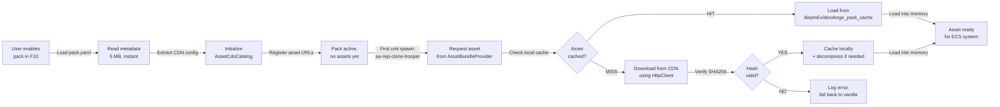

# Asset CDN + Lazy-Load Pipeline

## Overview

Large content packs (e.g., `warfare-starwars` at 967MB) create significant friction for end users:
- Initial download is expensive and time-prohibitive
- Many users only spawn a small subset of units (e.g., clone troopers but not battle droids)
- Network interruptions waste bandwidth and require full re-download

**Solution**: Split pack delivery into two layers:
1. **Metadata layer** (~5–10MB): YAML manifests, schemas, content definitions — downloaded upfront
2. **Asset layer** (900MB+): 3D models, prefabs, bundles — downloaded on-demand, cached locally

This design enables:
- **Installation time**: <30s (metadata only) instead of 15–30min (full pack)
- **Deferred loading**: Assets download when first spawned/needed
- **Bandwidth savings**: Only ~15–20% of asset files typically used per playthrough
- **Cache hit optimization**: Frequently-used assets warm-cached on next session

---

## Architecture

### Layer 1: Pack Metadata (Base Distribution)

The base pack ZIP contains:
```
warfare-starwars/
  pack.yaml                 ← 2.5 KB
  manifest.yaml             ← 22 KB
  asset_pipeline.yaml       ← 41 KB
  addressables.yaml         ← 22 KB
  factions/*.yaml           ← 150 KB
  units/*.yaml              ← 800 KB
  buildings/*.yaml          ← 200 KB
  doctrines/*.yaml          ← 150 KB
  weapons/*.yaml            ← 100 KB
  stats/*.yaml              ← 100 KB
  ─────────────────────────────────
  Total: ~1.5–2 MB (metadata)
```

**Important**: These YAML files declare **what assets exist** but the actual asset files (bundles, prefabs) are NOT included — only their URLs + hashes are declared.

### Layer 2: Asset CDN

All `.bundle` files, `.prefab` files, and texture atlases are hosted on a CDN:
- **Candidate providers**: GitHub Releases + LFS, Cloudflare R2, AWS S3, jsDelivr, or itch.io
- **Per-asset versioning**: Each asset tagged with SHA256 hash
- **Atomic delivery**: Pack versions → asset bundle versions (immutable)

**Example URL structure**:
```
https://cdn.example.com/dinoforge/warfare-starwars/v0.1.0/
  bundles/
    sw-rep-clone-trooper.bundle  (12.3 MB)
    sw-cis-battle-droid.bundle   (8.7 MB)
    sw-rep-av7-cannon.bundle     (4.2 MB)
    sw-rep-jedi-general.bundle   (15.6 MB)
    ...
  prefabs/
    sw-rep-clone-trooper.prefab.json
    ...
  atlases/
    republic_colors.atlas (2.1 MB)
    separatist_colors.atlas (1.9 MB)
```

### Layer 3: Pack Manifest Extensions

Existing `pack.yaml` + new `asset_cdn_manifest.yaml` declare asset locations:

**`pack.yaml`** (existing, updated):
```yaml
id: warfare-starwars
version: 0.1.0
# ... existing fields ...

# NEW: CDN configuration
asset_cdn:
  enabled: true
  base_url: "https://cdn.example.com/dinoforge/warfare-starwars/v0.1.0/"
  # Optional: fallback_base_url for mirror/redundancy
  cache_policy:
    max_cache_size_mb: 2048
    lru_enabled: true
    prefetch_on_pack_enable: false  # true = download all assets when F10 activates pack
```

**`asset_cdn_manifest.yaml`** (new, auto-generated by PackCompiler):
```yaml
version: 1
pack_id: warfare-starwars
pack_version: 0.1.0
generated_at: 2026-05-28T12:00:00Z

assets:
  # Unit bundles
  sw-rep-clone-trooper:
    url: bundles/sw-rep-clone-trooper.bundle
    sha256: 3c4d5e6f7a8b9c0d1e2f3a4b5c6d7e8f9a0b1c2d
    size_bytes: 12_345_678
    tags: [unit, republic, infantry]
    depends_on: []  # Other assets this bundle requires
  
  sw-cis-battle-droid:
    url: bundles/sw-cis-battle-droid.bundle
    sha256: 9f0e1d2c3b4a5f6e7d8c9b0a1f2e3d4c5b6a7f8e
    size_bytes: 8_765_432
    tags: [unit, separatist, infantry]
    depends_on: [separatist_colors]  # Requires the shared atlas
  
  # Shared atlases (downloaded once, used by many units)
  republic_colors:
    url: atlases/republic_colors.atlas
    sha256: 2a1b3c4d5e6f7a8b9c0d1e2f3a4b5c6d7e8f9a0
    size_bytes: 2_097_152
    tags: [shared, texture, republic]
    depends_on: []
  
  separatist_colors:
    url: atlases/separatist_colors.atlas
    sha256: 8f9a0b1c2d3e4f5a6b7c8d9e0f1a2b3c4d5e6f7a
    size_bytes: 1_966_080
    tags: [shared, texture, separatist]
    depends_on: []
  
  # Prefabs (small, usually cached eagerly)
  sw-rep-clone-trooper-prefab:
    url: prefabs/sw-rep-clone-trooper.prefab.json
    sha256: 1f2a3b4c5d6e7f8a9b0c1d2e3f4a5b6c7d8e9f0a
    size_bytes: 45_678
    tags: [prefab, republic]
    depends_on: [sw-rep-clone-trooper]
```

### Layer 4: Pack Loading Flow (Modified)

When a user enables the `warfare-starwars` pack in F10:



---

## Runtime Components

### 1. `AssetCdnCatalog` (Asset Registry)

Located: `src/SDK/Assets/AssetCdnCatalog.cs` (canonical), mirrored in `src/Runtime/Assets/`

```csharp
/// <summary>
/// Registry of asset CDN URLs and local cache locations.
/// Initialized once per pack load, thread-safe for concurrent asset requests.
/// </summary>
internal sealed class AssetCdnCatalog
{
    /// <summary>Load CDN manifest from pack.yaml + asset_cdn_manifest.yaml.</summary>
    public static AssetCdnCatalog Load(string packPath, TimeProvider? timeProvider = null);
    
    /// <summary>Get the CDN URL and expected SHA256 for an asset.</summary>
    public bool TryGetAssetUrl(string assetId, out string url, out string sha256, out long sizeBytes);
    
    /// <summary>Get the local cache path where this asset is (or should be) stored.</summary>
    public string GetLocalCachePath(string assetId);
    
    /// <summary>Check if asset is already cached locally.</summary>
    public bool IsCached(string assetId);
    
    /// <summary>Get current cache statistics (size, hit rate, oldest entry).</summary>
    public CacheStats GetCacheStats();
}
```

### 2. `AssetCdnCache` (Local Cache Manager)

Located: `src/SDK/Assets/AssetCdnCache.cs`

```csharp
/// <summary>
/// Manages local asset cache in BepInEx/dinoforge_pack_cache/.
/// Enforces LRU eviction, hash verification, and atomic writes.
/// </summary>
internal sealed class AssetCdnCache : IDisposable
{
    /// <summary>Initialize cache for a pack.</summary>
    public AssetCdnCache(string packId, long maxCacheSizeBytes, ILogger logger);
    
    /// <summary>
    /// Ensure an asset is cached locally.
    /// Downloads from CDN if missing, verifies hash, handles eviction.
    /// </summary>
    public Task<string> EnsureCachedAsync(
        string assetId,
        string cdnUrl,
        string expectedSha256,
        CancellationToken cancellationToken = default);
    
    /// <summary>Manually remove asset from cache (for cache prune).</summary>
    public bool TryRemove(string assetId);
    
    /// <summary>Get cache statistics.</summary>
    public CacheStats GetStats();
    
    /// <summary>Clear all cached assets for this pack.</summary>
    public Task ClearAsync();
}
```

### 3. `AssetBundleProvider` (Integration Point)

Modify existing asset loading to check CDN cache before vanilla paths:

Located: `src/SDK/Assets/AssetBundleProvider.cs` (new)

```csharp
/// <summary>
/// Unified asset loading with CDN fallback.
/// First tries CDN cache, then vanilla Addressables, then logs failure.
/// </summary>
internal sealed class AssetBundleProvider
{
    public AssetBundleProvider(AssetCdnCatalog? cdnCatalog, ILogger logger);
    
    /// <summary>Load an asset bundle, downloading from CDN if needed.</summary>
    public Task<AssetBundle?> LoadBundleAsync(
        string assetId,
        CancellationToken ct = default);
}
```

---

## Cache Layout

```
BepInEx/
  dinoforge_pack_cache/
    warfare-starwars/
      assets.db                    ← SQLite cache manifest (metadata)
      sw-rep-clone-trooper.bundle  ← 12.3 MB
      sw-cis-battle-droid.bundle   ← 8.7 MB
      republic_colors.atlas        ← 2.1 MB
      separatist_colors.atlas      ← 1.9 MB
      metadata/
        asset_cdn_manifest.yaml.cached
    warfare-modern/
      assets.db
      (other packs...)
```

**Cache Manifest (`assets.db`)**:
- SQLite table: `cached_assets(asset_id, sha256, size_bytes, cached_at, accessed_at)`
- Tracks which assets are cached, their hashes, and LRU timestamps
- Enables fast cache-hit checks without filesystem scans

---

## LRU Eviction Policy

When cache exceeds `max_cache_size_mb` (default: 2GB):

1. **Scan** `assets.db` for all cached assets, sorted by `accessed_at` (oldest first)
2. **Evict** oldest assets until `total_size < max_cache_size_mb * 0.9` (90% target)
3. **Update** `assets.db` to reflect evictions
4. **Log** evicted asset IDs for user awareness

Example:
```
[INFO] Cache exceeds 2000 MB. Evicting oldest assets...
[INFO] Evicted: sw-rep-clone-trooper.bundle (12.3 MB, last used 5 days ago)
[INFO] Evicted: sw-cis-battle-droid.bundle (8.7 MB, last used 2 weeks ago)
[INFO] Cache now 1800 MB / 2000 MB. ✓
```

---

## Prefetching (Optional)

When user enables pack in F10 UI:

```csharp
// Optional: background prefetch all assets for the pack
if (pack.AssetCdn?.CachePolicy?.PrefetchOnPackEnable == true)
{
    _ = AssetPrefetcher.PrefetchPackAsync(pack, cancellationToken: default);
}
```

Prefetch prioritizes:
1. **Small prefabs** (< 1 MB) — fast, high utility
2. **Shared atlases** — used by many units
3. **Common unit bundles** — infantry, archers (spawned frequently)
4. **Skip large, rare bundles** — boss units, siege equipment (low priority)

User sees a progress indicator in F10 (non-blocking, can cancel):
```
Pack: warfare-starwars
[████░░░░░░░░░░░░░░░░░░] 15% — Prefetching assets...
  Downloaded: 45 MB / 300 MB
  Speed: 8.3 MB/s
  ETA: 32 seconds
  [Cancel prefetch]
```

---

## CLI Commands

### `dinoforge cache stats`

Show cache statistics across all packs:

```
$ dinoforge cache stats

Cache Statistics
════════════════════════════════════
Global Cache Size: 1,456 MB / 2,000 MB (73%)

Pack: warfare-starwars
  Cached Assets: 15 / 36 (42%)
  Cache Size: 923 MB
  Hit Rate: 87% (estimated, last 7 days)
  Oldest Entry: 2026-05-21 (7 days ago)
  Newest Entry: 2026-05-28 (today)
  Prefetch Status: Idle (last run: 2026-05-26 10:30)

Pack: warfare-modern
  Cached Assets: 8 / 24 (33%)
  Cache Size: 533 MB
  Hit Rate: 61% (estimated, last 7 days)

Cache Policy (Global)
  Max Size: 2,000 MB
  LRU Eviction: enabled
  Prefetch on Pack Enable: disabled (warfare-starwars), enabled (warfare-modern)
```

### `dinoforge cache prune [--keep <pack-id>]`

Remove unused cached assets to free disk space:

```
$ dinoforge cache prune --keep warfare-starwars

Cache Cleanup
════════════════════════════════════
Scanning cache...

Evicting unused assets (keeping warfare-starwars):
  ✗ warfare-modern/sw-modern-tank.bundle (42 MB, unused 14 days)
  ✗ warfare-modern/sw-modern-helicopter.bundle (35 MB, unused 21 days)
  ✗ warfare-modern/sw-modern-powerplant.bundle (12 MB, unused 10 days)
  
Total freed: 89 MB
New cache size: 1,367 MB / 2,000 MB

Done. Run 'dinoforge cache stats' to verify.
```

### `dinoforge cache prefetch <pack-id> [--priority {prefabs|shared|all}]`

Pre-download all assets for a pack:

```
$ dinoforge cache prefetch warfare-starwars --priority shared

Prefetching: warfare-starwars
════════════════════════════════════
Strategy: shared assets first (atlases, common units)

[████████████░░░░░░░░░░░░░░░░░░░░░░░░] 34% — 102 MB / 300 MB
  Downloading: sw-rep-squad-leader.bundle (2.3 MB)
  Speed: 11.2 MB/s  ETA: 18s

Downloaded:  45 MB (shared atlases + prefabs)
Remaining:  255 MB (unit bundles, deferred)

Press Ctrl+C to cancel. Assets already cached will not re-download.
```

---

## HTTP Client & Download Configuration

**Network timeout**: 30 seconds per asset download (user-configurable in `BepInEx/config/DINOForge.Runtime.cfg`)

```ini
[AssetCdn]
download_timeout_sec = 30
retry_count = 3
retry_backoff_sec = 2
max_concurrent_downloads = 3
```

**Retry logic**:
- First failure (timeout/network error) → wait 2s, retry once
- Second failure → wait 4s, retry once  
- Third failure → log error, skip asset, continue (degrade gracefully)

**Bandwidth limiting** (optional):
- Per-download speed cap (e.g., 10 MB/s) to avoid hogging bandwidth
- User can pause/resume prefetch via F10 UI

---

## Fallback Behavior

If an asset fails to download:
1. Log warning with asset ID, error reason, and pack name
2. **Check vanilla Addressables** — if the asset also exists in vanilla DINO assets, use that (visual degradation but functional)
3. **Skip asset** — if not in vanilla, skip loading; unit/building renders with placeholder (grey box)
4. **Continue** — don't halt pack initialization; other assets load normally
5. **Offer retry** — F10 UI shows "Asset download failed for X. Retry?" button

Example in-game message:
```
[WARN] Asset 'sw-cis-orbital-station' failed to download (timeout).
       Falling back to vanilla starbase visual.
       [Retry Download] [Use Vanilla] [Ignore]
```

---

## Security & Integrity

### SHA256 Verification

Every downloaded asset is verified against the hash in `asset_cdn_manifest.yaml`:

```csharp
if (!VerifyHash(downloadedFile, expectedSha256))
{
    File.Delete(downloadedFile);  // Atomic: delete partial/corrupted file
    throw new AssetIntegrityException(
        $"Hash mismatch for {assetId}: expected {expectedSha256}");
}
```

**No TOCT​OU vulnerability**: File downloaded to temp path, verified, then atomically moved to cache.

### CDN Provider Security

- **HTTPS only** — all URLs must be `https://`
- **Domain whitelist** — manifest can only reference CDN domains in a blessed list (e.g., `github.com`, `cdn.example.com`)
- **Rate limiting** — client respects `Retry-After` headers; manual cache prefetch respects reasonable timeouts

---

## Testing Strategy

### Unit Tests

**`AssetCdnCatalogTests.cs`**:
- Load catalog from mock manifest
- Resolve asset URLs correctly
- Reject manifests with invalid SHA256 format
- Handle missing assets gracefully

**`AssetCdnCacheTests.cs`**:
- Cache hit/miss on exists/missing files
- LRU eviction when cache full
- SHA256 verification on cache read
- Atomic writes (partial downloads not cached)
- Thread-safe concurrent access

**`AssetBundleProviderTests.cs`**:
- Load from cache (happy path)
- Download from CDN when cache miss (mock HttpClient)
- Retry logic on transient failures
- Fallback to vanilla Addressables

### Integration Tests

**`AssetCdnIntegrationTests.cs`**:
- Mock CDN server (Wiremock or simple HttpServer)
- Download real asset, cache it, verify hash
- Simulate network errors (timeout, 503) and verify retry
- Evict LRU asset when cache full
- Multi-pack coexistence (both cached, different eviction policies)

---

## Performance Targets

- **Cache lookup**: < 1ms (SQLite `assets.db`)
- **SHA256 verification**: < 100ms (for 50 MB asset)
- **Download speed**: Limited by network (assumed 5–20 MB/s on typical residential)
- **Prefetch for 300 MB pack**: ~30–60 seconds (non-blocking, background)
- **LRU eviction**: < 500ms even with 500+ cached assets

---

## Deployment & Versioning

### Version Mapping

When a new version of `warfare-starwars` ships (e.g., v0.2.0):

```yaml
# New pack.yaml
id: warfare-starwars
version: 0.2.0

asset_cdn:
  base_url: "https://cdn.example.com/dinoforge/warfare-starwars/v0.2.0/"
  ...
```

**Old assets (v0.1.0) are NOT automatically cleaned** — users can roll back if needed. Manual `dinoforge cache prune` removes them.

### CDN Promotion Strategy

1. **Staging**: Upload v0.2.0 assets to CDN in a `staging/` prefix
2. **Validation**: PackCompiler validates all asset URLs are reachable (HTTP HEAD)
3. **Promotion**: Move from `staging/` to `v0.2.0/` (or update DNS CNAME)
4. **Announce**: Update `asset_cdn_manifest.yaml` and tag release

---

## Future Enhancements (v0.26.0+)

1. **Compression**: Pre-compress `.bundle` files with zstd; client auto-decompresses
2. **P2P seeding**: Use bittorrent or WebTorrent for peer-to-peer asset distribution (after high adoption)
3. **Differential updates**: Ship only changed assets between pack versions (delta sync like Steam)
4. **Resumable downloads**: HTTP Range support for partial re-downloads on network restart
5. **Edge-case caching**: Use Cloudflare Workers to cache hot assets geographically
6. **Analytics**: Track download speeds, cache hit rates, errors; feed back into CDN provider selection
7. **Asset streaming**: Load large bundles in chunks (e.g., 4K texture atlas in 1MB tiles)

---

## Configuration Example

**`pack.yaml`** (warfare-starwars v0.1.0):
```yaml
id: warfare-starwars
version: 0.1.0
# ... other fields ...

asset_cdn:
  enabled: true
  base_url: "https://releases.githubusercontent.com/KooshaPari/dinoforge-assets/v0.1.0/"
  cache_policy:
    max_cache_size_mb: 2048
    lru_enabled: true
    prefetch_on_pack_enable: false

# ... loads, ui_theme, settings, etc. ...
```

**`BepInEx/config/DINOForge.Runtime.cfg`**:
```ini
[AssetCdn]
download_timeout_sec = 30
retry_count = 3
retry_backoff_sec = 2
max_concurrent_downloads = 3
verify_sha256 = true
cache_dir = BepInEx/dinoforge_pack_cache
```

---

## Summary

| Feature | Scope |
|---------|-------|
| Metadata pre-caching | v0.25.0 (design/stubs) |
| Asset CDN catalog | v0.25.0 (design/stubs) |
| Local cache manager | v0.25.0 (design/stubs) |
| Download + verify | v0.26.0 (full impl, HttpClient) |
| Prefetch UI + progress | v0.27.0 (F10 panel) |
| LRU eviction + stats | v0.26.0 |
| CLI commands (`cache stats`, `cache prune`, `cache prefetch`) | v0.26.0 |
| Compression (zstd) | v0.28.0+ |
| P2P/bittorrent | v0.30.0+ |

