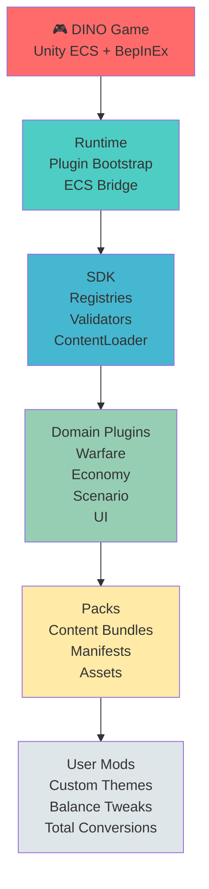
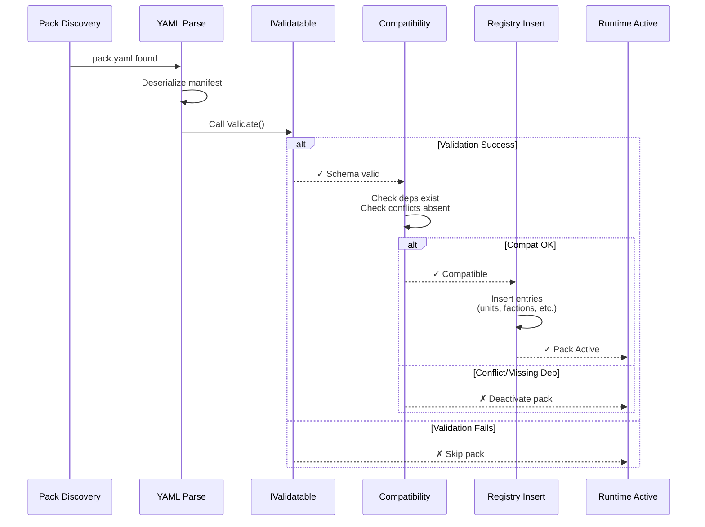
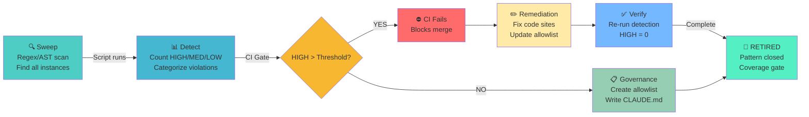
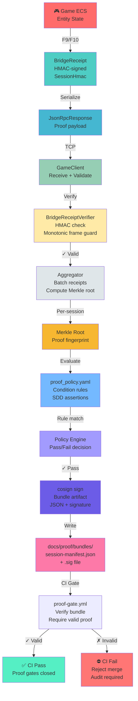

# Architecture Diagrams

This page surfaces the core architectural diagrams that define DINOForge's structure, pack lifecycle, and quality governance.

## Layer Stack

The architecture follows a layered design from the game engine up through the mod platform:

Each layer builds on the previous: the Runtime exposes the ECS bridge, the SDK provides registries and validators, domain plugins extend the SDK for specific gameplay areas, and packs instantiate content within those domains.

## Pack Load Sequence

When a pack is discovered, it flows through validation, compatibility checking, registry insertion, and runtime activation:

A pack must pass schema validation before compatibility is checked. Conflicts or missing dependencies cause the pack to be deactivated rather than loaded.

## Pattern Catalog Lifecycle

Quality patterns are detected, governed, and retired through a structured CI/remediation cycle:

Patterns are detected automatically on every CI run. If violations exceed the threshold, the CI gate blocks the merge and enforces remediation before retry. Passing violations are tracked in allowlists to ensure pattern closure.

## Smart-Contract Proof System Pipeline

The proof system creates cryptographically-verifiable bundles that certify game behavior, bridging the gap between autonomous testing and human-auditable proof. Each bundle is signed with a session HMAC and Merkle root, then validated against policy rules before archival:

The proof pipeline ensures that game feature claims are backed by signed, policy-validated receipts. HMAC signatures authenticate that receipts originate from the running game session. Merkle roots compress the full receipt corpus into a single verifiable fingerprint. Policy rules (written in YAML) define what constitutes valid proof for each feature claim. CI gates require valid bundles before merge, preventing unsubstantiated claims from reaching the codebase.
