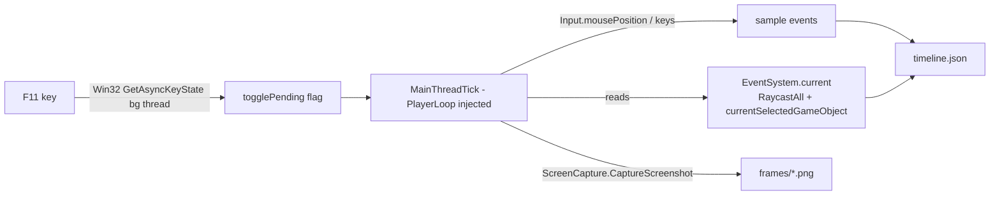

# Session Record Format (#971)

The **Session Recorder** (`src/Runtime/Capture/SessionRecorder.cs`) captures a REAL user
playthrough — pointer + key events, the widget DINO's `EventSystem` actually resolved, and
periodic screen frames — into a replayable **journey record**. This is the unblock for
autonomous vision-verify: synthetic OS input (SendInput / `SetCursorPos` / MCP `game_input`)
does **not** reach DINO's Unity `EventSystem`, but real user input does. Record once, then
replay it in-process (#972) and embed it in journeys (#966).

## How it works (in-process, DINO-ECS-safe)



- The per-frame sampler is injected into Unity's **PlayerLoop** (via
  `PlayerLoopKeyInputInjection`) so it runs on the **main thread every frame** — `Update()` /
  `OnGUI()` never fire in DINO.
- All `EventSystem.current` reads happen only on that main-thread tick and are **null-guarded**
  (Pattern #235).
- The **F11** toggle is detected on a Win32 `GetAsyncKeyState` background thread that only flips
  a `volatile` flag; the actual start/stop and all Unity API calls run on the main-thread tick.
- Frames reuse the proven `ScreenCapture.CaptureScreenshot` path (GPU backbuffer; works on Parsec).

## On-disk layout

```
BepInEx/dinoforge_recordings/<session-id>/
  manifest.json        session metadata
  timeline.json        ordered events
  frames/
    000000.png         frame 0 (start)
    000001.png
    ...
```

`<session-id>` = `session-<UTC yyyyMMddTHHmmssZ>`.

## manifest.json

```json
{
  "version": 1,
  "sessionId": "session-20260530T181500Z",
  "startedUtc": "2026-05-30T18:15:00.0000000Z",
  "endedUtc":   "2026-05-30T18:17:42.0000000Z",
  "stopReason": "f11",
  "screenWidth": 1920,
  "screenHeight": 1080,
  "eventCount": 214,
  "frameCount": 38,
  "framesDir": "frames",
  "timeline": "timeline.json"
}
```

## timeline.json

```json
{
  "version": 1,
  "sessionId": "session-20260530T181500Z",
  "events": [
    { "t": 0,    "type": "pointer.move", "x": 960, "y": 540, "target": "/MainMenuCanvas/ButtonRow/OptionsButton", "scene": "MainMenu" },
    { "t": 1203, "type": "pointer.down", "x": 1320, "y": 720, "button": 0, "target": "/MainMenuCanvas/ButtonRow/ModsButton", "selected": "/MainMenuCanvas/ButtonRow/ModsButton", "scene": "MainMenu", "frame": "frames/000004.png" },
    { "t": 1271, "type": "pointer.up",   "x": 1320, "y": 720, "button": 0, "target": "/MainMenuCanvas/ButtonRow/ModsButton", "scene": "MainMenu", "frame": "frames/000005.png" },
    { "t": 1402, "type": "key.char", "key": "a", "scene": "MainMenu" },
    { "t": 1980, "type": "key.down", "key": "Escape", "scene": "MainMenu" }
  ]
}
```

### Event fields

| Field      | Types                                   | Meaning |
|------------|-----------------------------------------|---------|
| `t`        | all                                     | Milliseconds since session start. |
| `type`     | all                                     | `pointer.move` \| `pointer.down` \| `pointer.up` \| `key.down` \| `key.up` \| `key.char`. |
| `x`,`y`    | pointer.*                               | Screen px, **bottom-left origin** (Unity `Input.mousePosition`). |
| `button`   | pointer.down/up                         | `0` = left, `1` = right. |
| `target`   | pointer.*                               | Top `EventSystem.RaycastAll` hit's transform path (`/root/.../leaf`). `""` if none. |
| `selected` | pointer.down/up                         | `EventSystem.current.currentSelectedGameObject` path at the event, or omitted. |
| `key`      | key.*                                   | `KeyCode` name (e.g. `Escape`, `Return`) or typed char for `key.char`. |
| `scene`    | all                                     | Active scene name. |
| `frame`    | any event that captured a frame         | Relative path to the PNG (`frames/NNNNNN.png`). |

Sparse encoding — only set fields are emitted.

## Mapping → in-process replay (#972)

The replay driver re-issues each event against the live `EventSystem` on the main thread,
honoring the inter-event `t` deltas:

| Recorded event             | Replay action |
|----------------------------|---------------|
| `pointer.move`             | Build a `PointerEventData` at `(x,y)`; resolve target by `RaycastAll`, prefer the recorded `target` path if present; drive `OnPointerEnter`/`OnPointerExit`. |
| `pointer.down`             | `PointerEventData` at `(x,y)` → `ExecuteEvents.Execute(target, ped, pointerDownHandler)`; set `EventSystem.SetSelectedGameObject(selected)`. |
| `pointer.up`               | `pointerUpHandler` then `pointerClickHandler` on the same target (synthesizes a click the EventSystem accepts). |
| `key.down` / `key.up`      | Inject the `KeyCode` to the selected widget's key handlers. |
| `key.char`                 | Append to the focused input field's text / `onValueChanged`. |

Resolving by **recorded widget path** (not just coordinates) makes replay resilient to small
layout shifts and resolution changes — the load-bearing reason we capture `target`/`selected`.

## Mapping → journey embeds (#966 / JourneyViewer.vue)

`JourneyViewer.vue` consumes `journey.steps[]` (frame URLs) + `annotations[step] = [{ bbox, label, type }]`.
A small adapter converts a session record:

- `steps[]` ← the ordered `frames/*.png` (one keyframe per captured frame).
- For each frame, find the event(s) that produced/precede it; emit an annotation with
  `label` = `type` + `target` leaf name, `type` = `pointer`/`key`, and `bbox` derived from
  `(x, y)` (flip Y to top-left for SVG: `bbox.y = screenHeight - y`).
- `manifest.json` supplies `screenWidth`/`screenHeight` for coordinate normalization.

This yields a playback gallery with click/hover keyframes annotated by the exact widget DINO
resolved — directly comparable across record vs. replay for vision-verify.

## Config (BepInEx `[SessionRecorder]` section)

| Key                    | Default | Meaning |
|------------------------|---------|---------|
| `Enabled`              | `true`  | Master switch for the F11 recorder. |
| `FrameIntervalMs`      | `500`   | Periodic frame cadence while recording (100–5000). |
| `CaptureFramePerEvent` | `true`  | Also grab a frame on every pointer down/up. |

## How to record (user instructions)

1. Launch DINO with the DINOForge runtime deployed (`steam_appid.txt` present; F9/F10 work).
2. Press **F11** to **start** recording (look for `▶ RECORDING STARTED` in
   `BepInEx/dinoforge_debug.log`). Press **F11** again to **stop** (`■ RECORDING STOPPED`).
3. Find the record at `BepInEx/dinoforge_recordings/session-<timestamp>/`.

### Suggested playthrough script (covers the screens we verify)

Do each step slowly and deliberately so frames land on each state:

1. **Main menu** — hover the Options button, then hover and **click MODS**.
2. **Mods page** — open **Settings**, then click **each subpage tab** in turn.
3. **Back** out to the main menu.
4. **Start a skirmish** (new game) and let the world load.
5. In-game: **place a building**, then **select units and fire** at a target.
6. Press **F11** to stop.

This single playthrough captures main-menu → mods → settings subpages → in-game build/combat,
which is the full set of UI/world screens the agent needs to replay and self-verify.
