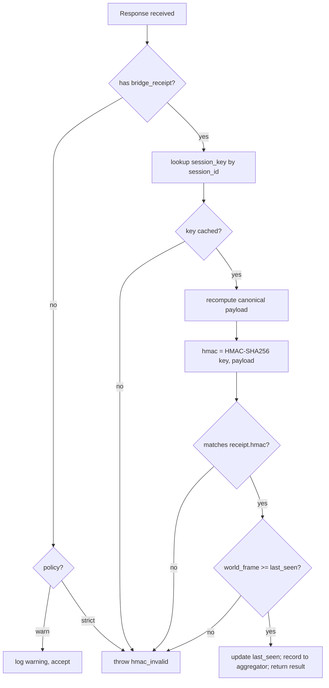

# Wave 2 Phase 4: Bridge HMAC implementation spec

**Status**: Implemented (partial — Phase 4a/4b shipped via #223; 4c flip + 4d aggregator pending)

**Implementation cross-reference**:
- Tracks tasks: #189, #191, #223 (4a+4b shipped), #232 (4d aggregator)
- Last verified: 2026-04-25 (iter 49 audit)
- Gap: server signing + WarnOnly client verification live in main; Strict-mode flip (4c) and bundle-aggregator integration (4d) not yet wired. See companion doc `2026-04-26-bridge-receipt-aggregator.md`.

**Author**: DINOForge agents
**Date**: 2026-04-25
**Parent spec**: `docs/design/2026-04-25-smart-contract-proof-system.md` section 6
**Precondition**: #189 GameBridgeServer bypass-surface fix landed.
**Prior phases**: #191 Phases 1+2+3 (signing, merkle, policy, gate, CI workflow).

## Goals

Phase 4 closes the last unsigned link in the proof chain: per-call bridge responses. Every `IGameBridge` reply gains a `bridge_receipt` carrying timestamp, world-frame, state-snapshot hash, and an HMAC-SHA256 signature derived from a per-session ephemeral key. Clients verify the HMAC on every response; the MCP receipt aggregator collects them across a test run and folds them into the proof bundle, where they get cosign-signed at bundle-finalize time.

## Threat model + non-goals

Closes:
- In-process tampering of bridge responses after they leave the server but before the client uses them.
- Replay of stale responses *within* the same session (timestamp + frame monotonicity).
- Post-hoc fabrication of bridge dumps without a corresponding HMAC.

Does NOT close:
- Malicious or compromised `GameBridgeServer` (the HMAC key originates there). Cross-session integrity is the bundle's Sigstore signature, not Phase 4.
- Replay across different sessions (each session gets a fresh key).
- Side-channel timing or resource attacks.

## Wire-format additions

Before:

```json
{"jsonrpc": "2.0", "id": 17, "result": {"entity_count": 45776}}
```

After (every method response, both success and error envelopes):

```json
{
  "jsonrpc": "2.0",
  "id": 17,
  "result": {"entity_count": 45776},
  "bridge_receipt": {
    "timestamp_utc": "2026-04-25T12:34:56.789Z",
    "world_frame": 12345,
    "state_snapshot_sha256": "9f2c...",
    "session_id": "550e8400-e29b-41d4-a716-446655440000",
    "hmac": "BASE64(HMAC-SHA256(session_key, canonical_payload))"
  }
}
```

Handshake (one-shot, on `Connect`):

```json
{
  "jsonrpc": "2.0", "id": 1, "result": {
    "session_id": "550e8400-...",
    "session_key_b64": "BASE64(32 random bytes)",
    "server_version": "0.24.0",
    "world_ready": true
  }
}
```

The `session_key_b64` field appears **only** on the `Connect` response, never echoed again.

## Key derivation + handshake

```mermaid
sequenceDiagram
    participant C as GameClient
    participant S as GameBridgeServer
    Note over S: startup: key = os.urandom(32)<br/>session_id = uuid4()
    C->>S: Connect()
    S-->>C: { session_id, session_key_b64 } (ONCE)
    Note over C: SessionKeyCache.put(session_id, key)
    C->>S: GetStat(...)
    S-->>C: { result, bridge_receipt{ hmac=HMAC(key, canonical) } }
    Note over C: verify HMAC; throw on mismatch
```

- Server: 256-bit key via `RandomNumberGenerator.GetBytes(32)`. Stored in `SessionHmac` singleton scoped to the JSON-RPC server instance. Never persisted, never logged.
- Transport: local named pipe / loopback socket; the key crosses the wire in clear once. No TLS pinning yet (local-only in v0.25); document upgrade path in Open Questions.
- Subsequent responses: `hmac = HMAC-SHA256(session_key, canonical_payload_bytes)`.

## Implementation file map

| Layer | File | Action |
|-------|------|--------|
| Server | `src/Runtime/Bridge/SessionHmac.cs` | NEW: per-session 32-byte key, `Sign(payload)`, exposes `SessionId`. |
| Server | `src/Runtime/Bridge/GameBridgeServer.cs` | Generate key on startup; build `BridgeReceipt` for every response; emit on `Connect` once. |
| Server | `src/Runtime/Bridge/CanonicalJson.cs` | NEW: deterministic JSON serializer (sorted keys, no whitespace). |
| Protocol | `src/Bridge/Protocol/BridgeReceipt.cs` | NEW: DTO `{timestamp_utc, world_frame, state_snapshot_sha256, session_id, hmac}`. |
| Protocol | `src/Bridge/Protocol/JsonRpcResponse.cs` | Add optional `BridgeReceipt? Receipt` (`bridge_receipt` json key). |
| Protocol | `src/Bridge/Protocol/ConnectResponse.cs` | NEW: `{session_id, session_key_b64, server_version, world_ready}`. |
| Client | `src/Bridge/Client/SessionKeyCache.cs` | NEW: `ConcurrentDictionary<Guid, byte[]>`, thread-safe. |
| Client | `src/Bridge/Client/GameClient.cs` | Cache key from `Connect`; verify HMAC on every response; throw `GameClientException("hmac_invalid")` on mismatch; verification mode (Off/WarnOnly/Strict) wired from config. |
| Client | `src/Bridge/Client/CanonicalJson.cs` | NEW: mirror server canonicalizer (or shared via netstandard project). |
| Aggregator | `src/Tools/DinoforgeMcp/dinoforge_mcp/bridge_receipt_aggregator.py` | NEW: in-memory list; `record(receipt)`, `flush_to_dir(bundle/bridge-receipts/)`. |
| Aggregator | `src/Tools/DinoforgeMcp/dinoforge_mcp/server.py` | Hook every IGameBridge tool to `aggregator.record(...)`. |
| Aggregator | `src/Tools/DinoforgeMcp/dinoforge_mcp/merkle.py` | Include `bridge-receipts/*.json` files in leaves; reference from `manifest.bridge_receipts`. |
| Tests | `src/Tests/Bridge/BridgeHmacTests.cs` | NEW: tampered-payload, wrong-key, missing-receipt, frame-monotonicity. |
| Tests | `tests/proof/test_bridge_receipt_aggregator.py` | NEW: aggregator collects N receipts → bundle has N. |

## Canonicalization rules

HMAC determinism requires byte-identical input on both sides. Rules (mirror RFC 8785 JCS for the parts that matter to us):

1. UTF-8 encoding, no BOM.
2. Object keys sorted lexicographically by Unicode code point.
3. No insignificant whitespace (no spaces between `,`/`:`/braces).
4. Strings: shortest-form JSON escapes only (`\\"`, `\\\\`, `\\b`, `\\f`, `\\n`, `\\r`, `\\t`, `\\uXXXX` for control chars only).
5. Numbers: `world_frame` and other integers as decimal with no leading zeros, no `+`, no exponent.
6. `timestamp_utc` as ISO 8601 UTC with millisecond precision and trailing `Z` (e.g. `2026-04-25T12:34:56.789Z`).
7. `state_snapshot_sha256` as lowercase hex, no `0x` prefix.
8. Booleans/null: `true`, `false`, `null`.
9. The `hmac` field itself is **excluded** from the canonical payload. Receipt = `{timestamp_utc, world_frame, state_snapshot_sha256, session_id, payload_sha256}` where `payload_sha256` is `sha256(canonical_json(result_or_error))`.

`CanonicalJson.cs` implementation: walk `JsonElement` recursively; for objects, sort `EnumerateObject()` by ordinal; for arrays, preserve order; emit via `Utf8JsonWriter` with `Indented=false`.

## Receipt verification flow



## Test plan

| # | Test | Scenario | Expected |
|---|------|----------|----------|
| 1 | `ValidReceipt_Verifies` | server signs, client verifies | passes, no throw |
| 2 | `TamperedPayload_Rejected` | flip a byte in `result` after signing | `GameClientException("hmac_invalid")` |
| 3 | `WrongSessionKey_Rejected` | inject mismatched key into client cache | `hmac_invalid` |
| 4 | `MissingReceipt_StrictMode` | server emits no receipt; client in strict mode | `hmac_invalid` |
| 5 | `MissingReceipt_WarnMode` | same, warn-only mode | passes, warning logged |
| 6 | `FrameRegression_Rejected` | second response has lower `world_frame` than first | `hmac_invalid` |
| 7 | `Frame0_OnNonStatusMethod_Rejected` | `GetStat` returns frame=0 (sentinel for `Connect`/`Status` only) | `hmac_invalid` |
| 8 | `Aggregator_CollectsAll` | 100 calls in a session | `bundle/bridge-receipts/` has 100 files, each referenced in `manifest.leaves` |
| 9 | `CanonicalJson_DeterministicAcrossPlatforms` | same payload, .NET vs Python serializer | byte-identical output |
| 10 | `SessionKey_NotInLogs` | grep `dinoforge_debug.log` for `session_key_b64` | 0 hits |

Tests live in `src/Tests/Bridge/BridgeHmacTests.cs` (xUnit + FluentAssertions) and `tests/proof/test_bridge_receipt_aggregator.py`. Mock `MockGameBridgeServer` is extended with a `SignResponses=true|false` flag so existing tests do not regress.

## Migration path

| Sub-phase | Server | Client | CI gate |
|-----------|--------|--------|---------|
| **4a** | emits receipts | logs only, never verifies | aggregator collects |
| **4b** | emits receipts | verifies, warn-on-mismatch | aggregator collects, gate ignores |
| **4c** | emits receipts | strict (throw on mismatch) — DEFAULT | gate requires `bridge_receipt` per `policy.require_bridge_receipt: true` |

Each sub-phase is independently shippable. 4a + 4b together let us ship the wire change without breaking existing fixtures; 4c is the compatibility flip.

## Effort estimate

- 2 days: Phase 4a + 4b + 4c (server signing, client cache, verification modes, canonical-json shared impl, ten tests).
- 0.5 day: receipt aggregator + bundle integration (Python, fits cleanly into existing `merkle.py`).
- 0.5 day: docs (this file + CHANGELOG + cross-link in spec section 6).
- **Total: 3 days**.

## Open questions

1. Should `session_key` rotate per reconnect (replay-safe but breaks long-running aggregation across reconnects), or persist for the test run (simpler aggregation, slightly weaker)? Default proposal: rotate; aggregator already correlates by `session_id`.
2. Should non-IGameBridge MCP tools (`game_screenshot`, `game_apply_override`, `game_input`) also emit `bridge_receipts`? Default proposal: yes for any tool that touches game state; pure-capture tools (screenshot) get a lighter receipt without `world_frame`.
3. Local-loopback transport currently sends the key in clear once. Future: derive key via X25519 ECDH on the named pipe handshake — track as Phase 4d, not blocking.
4. Receipt size: ~250 bytes per call. At 1000 calls/run = 250 KB. Acceptable; document in bundle-size policy.

## Cross-references

- Parent spec: `docs/design/2026-04-25-smart-contract-proof-system.md` section 6 (Bridge Response Signing).
- Precondition: task #189 (GameBridgeServer bypass surface fix) — must land before 4a.
- Prior work: task #191 Phase 1 (signing), Phase 2 (merkle + policy gate), Phase 3 (CI workflow).
- Policy field: `features.<id>.require_bridge_receipt` already defined in `policies/proof-policy.yaml`.
- Aggregator integration point: `src/Tools/DinoforgeMcp/dinoforge_mcp/merkle.py` `BundleManifest.bridge_receipts` field (already in spec section 4).
