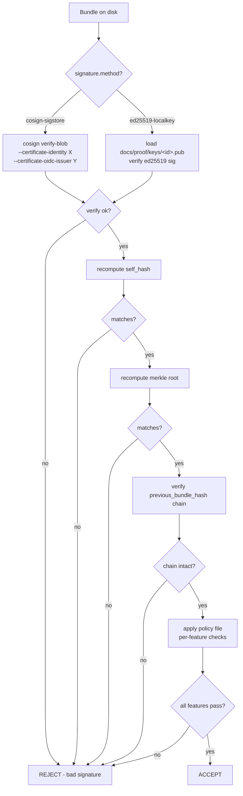

# Smart-Contract-Style Proof System for DINOForge

**Status**: Implemented (partial — Phase 1+3 partial, Phase 2 evaluator + key files in flight per #231)

**Implementation cross-reference**:
- Tracks tasks: #131, #189, #191, #231
- Last verified: 2026-04-25 (iter 49 audit)
- Gap: `proof_signing.py` + `merkle.py` + bundle generation in main; `policy.py` evaluator and the Phase 2 `prove-features-gate.ps1` strict-verifier extension are still in flight (#231). Phase 4 covered separately by `2026-04-25-bridge-hmac-phase4.md`.

**Author**: DINOForge agents
**Date**: 2026-04-25
**Related**: `docs/TRUTH_TABLE.md`, task #131 (`prove-features-gate.ps1`), task #189 (Bridge HMAC)
**Supersedes**: ad-hoc proof receipts under `docs/proof-of-features/`

---

## 1. Goals and Non-Goals

### Goals

- **Tamper-resistance**: any post-hoc edit of receipts, bundles, or judge calls is detectable.
- **Append-only history**: a hash chain of bundles makes silent rewrites of past results impossible.
- **Provenance**: every artifact (screenshot, judge response, bridge dump) is signed and linked to a session, policy, and signer identity.
- **Policy-enforced acceptance**: a YAML policy declares per-feature requirements; CI fails closed.
- **External-judge default**: Anthropic-family models cannot self-validate. The default tier is external (Sigstore identity required).
- **Reproducibility**: any third party can re-verify a bundle with `cosign` plus the policy file.

### Non-Goals

- No blockchain. No distributed consensus. No miners.
- No on-chain computation, no smart contract VM.
- No token issuance, no economic incentives.
- No public network — Sigstore Rekor is the only outbound transparency-log dependency, and even that is optional (offline ed25519 fallback exists).
- **No cryptocurrency, ever.**

This is a **tamper-evident append-only log of signed receipts**, governed by a versioned policy file. The "smart-contract" framing refers to *policy-as-code enforcement*, not to any distributed-ledger mechanism.

---

## 2. Receipt Structure

All receipts share a common envelope, differentiated by `kind`. The hash field is computed over the canonical JSON of the receipt with `self_hash` set to the empty string (deterministic JCS-style serialization, sorted keys, UTF-8, no whitespace).

### 2.1 Common Envelope

```json
{
  "version": "1.0",
  "kind": "BridgeReceipt | JudgeReceipt | BundleManifest",
  "timestamp_utc": "2026-04-25T12:34:56Z",
  "session_id": "<uuid-v4>",
  "subject": { },
  "previous_hash": "<sha256 of previous receipt in chain, or null>",
  "self_hash": "<sha256 of receipt minus self_hash + signature.value>",
  "signature": {
    "method": "cosign-sigstore | ed25519-localkey",
    "public_key_id": "<sigstore identity OR ed25519 fingerprint>",
    "signed_at_utc": "2026-04-25T12:34:57Z",
    "value": "<base64>"
  }
}
```

### 2.2 BridgeReceipt

Subject schema:

```json
{
  "tool": "game_query_entities | game_get_stat | ...",
  "request_args": { },
  "response_payload_sha256": "<sha256>",
  "world_frame": 12345,
  "state_snapshot_sha256": "<sha256 of dump>",
  "session_hmac": "<base64 hmac of payload using session key>"
}
```

### 2.3 JudgeReceipt

Subject schema:

```json
{
  "feature_id": "f9_overlay | f10_modmenu | pack_load",
  "judge_model": "moonshot-v1-128k | gpt-4-vision-preview | ...",
  "judge_endpoint": "https://api.moonshot.cn/v1 | ...",
  "input_artifact_sha256": "<sha256 of png/mp4>",
  "verdict": "PASS | FAIL",
  "rationale": "string",
  "raw_response_sha256": "<sha256 of full provider response>",
  "raw_response_path": "judge-receipts/<id>/raw.json"
}
```

### 2.4 BundleManifest

The merkle root and chain anchor for a proof run. See section 4.

---

## 3. Signing Keys and Verification Flow

### 3.1 Default tier: cosign keyless (Sigstore)

- Production: `cosign sign-blob --yes <file>` invoked from CI under a GitHub OIDC identity (`https://github.com/KooshaPari/Dino/.github/workflows/proof-gate.yml@refs/heads/main`).
- Public-key ID = the Sigstore certificate's SAN (workflow identity URI).
- Receipt + signature are uploaded to Rekor; Rekor log entry UUID stored in `signature.value` alongside the raw cert+sig blob.
- Verification: `cosign verify-blob --certificate-identity <expected> --certificate-oidc-issuer https://token.actions.githubusercontent.com ...`.

### 3.2 Fallback tier: ed25519 local key

- Used when Sigstore/Rekor is unreachable (offline runner, network failure, or transparency log outage).
- Key location: `~/.dinoforge/proof_signing.key` (mode 0600).
- Public key checked into `docs/proof/keys/<key-id>.pub`.
- `signature.method = "ed25519-localkey"`, `signature.public_key_id` = sha256 fingerprint of the public key.
- Verification: `python -c "from cryptography.hazmat.primitives.asymmetric.ed25519 import Ed25519PublicKey; ..."`.

### 3.3 Verification Flow



---

## 4. Bundle Merkle Root

Computed deterministically over every artifact in the bundle directory.

Algorithm:

1. Walk the bundle directory recursively, collecting all files except `manifest.json` itself.
2. For each file, compute `sha256(file_bytes)`.
3. Sort `(relative_path, sha256)` tuples lexicographically by `relative_path`.
4. Build a merkle tree:
   - leaves = `sha256(relative_path || ":" || hex_sha256)`
   - internal = `sha256(left || right)` with duplication for odd counts
   - root = top-level hash
5. Write `manifest.json`:

```json
{
  "version": "1.0",
  "kind": "BundleManifest",
  "bundle_id": "20260425T123456Z-abc12345",
  "previous_bundle_hash": "<sha256 of prior bundle's manifest.json bytes, or null for genesis>",
  "merkle_root": "<sha256>",
  "leaves": [
    {"path": "validate_f9.png", "sha256": "..."},
    {"path": "raw_f9.mp4", "sha256": "..."},
    {"path": "judge-receipts/jr-001.json", "sha256": "..."},
    {"path": "bridge-receipts/br-001.json", "sha256": "..."}
  ],
  "policy_id": "dinoforge-default-2026-04",
  "policy_version": "<sha256 of policy yaml>",
  "judge_receipts": ["judge-receipts/jr-001.json"],
  "bridge_receipts": ["bridge-receipts/br-001.json"],
  "session_id": "<uuid>",
  "self_hash": "<sha256>",
  "signature": { }
}
```

---

## 5. Policy File

Path: `policies/proof-policy.yaml`. Schema: `policies/proof-policy.schema.json`.

Example:

```yaml
version: 1.0
policy_id: dinoforge-default-2026-04
features:
  f9_overlay:
    required_judge: ["moonshot-v1-128k", "kimi-vlm", "gpt-4-vision-preview"]
    forbidden_judges: ["claude-*", "codex-*", "anthropic-*"]
    required_artifacts:
      - validate_f9.png
      - raw_f9.mp4
    require_bridge_receipt: true
    require_external_judge: true
    max_age_seconds: 86400
  f10_modmenu:
    required_judge: ["moonshot-v1-128k", "kimi-vlm", "gpt-4-vision-preview"]
    forbidden_judges: ["claude-*", "codex-*", "anthropic-*"]
    required_artifacts: [validate_f10.png, raw_f10.mp4]
    require_bridge_receipt: true
    require_external_judge: true
    max_age_seconds: 86400
  pack_load:
    required_judge: ["moonshot-v1-128k", "kimi-vlm"]
    forbidden_judges: ["claude-*", "codex-*"]
    required_artifacts: [pack_load.png, pack_dump.json]
    require_bridge_receipt: true
    require_external_judge: true
    max_age_seconds: 86400
```

### 5.1 Policy field semantics

| Field | Type | Semantics |
|-------|------|-----------|
| `version` | string | semver of policy schema |
| `policy_id` | string | stable id (referenced by manifests) |
| `features.<id>.required_judge` | list[string] | judge model names — at least one judge receipt must match one entry |
| `features.<id>.forbidden_judges` | list[glob] | reject any receipt whose `judge_model` matches |
| `features.<id>.required_artifacts` | list[string] | every path must appear in `manifest.leaves` |
| `features.<id>.require_bridge_receipt` | bool | at least one BridgeReceipt must reference this feature |
| `features.<id>.require_external_judge` | bool | judge endpoint must NOT be `*.anthropic.com` |
| `features.<id>.max_age_seconds` | int | reject if `now - timestamp_utc` exceeds this |

---

## 6. Bridge Response Signing (HMAC)

Sigstore is too heavy for per-call bridge traffic. Instead:

1. On `GameBridgeServer` startup, generate a 32-byte ephemeral session key (`os.urandom(32)`).
2. The session key is published once over the initial handshake (TLS-pinned local socket; clients store it for the run's duration).
3. Every bridge response carries:

```json
{
  "timestamp_utc": "...",
  "world_frame": 12345,
  "payload": { },
  "state_snapshot_sha256": "<sha256>",
  "hmac": "<hmac-sha256(session_key, canonical_json(timestamp+frame+payload+snapshot))>"
}
```

4. Client verifies HMAC. Mismatched HMAC → discard, do not include in receipt.
5. At bundle-finalize time, the aggregated `BridgeReceipt` records (one per call) are concatenated, hashed, and that aggregate hash is what gets cosign-signed inside the BundleManifest.

The session key is **never** persisted to disk and **never** included in receipts; only HMACs derived from it are.

---

## 7. Hash Chain Across Bundles

Every BundleManifest carries `previous_bundle_hash`. Construction:

- `previous_bundle_hash = sha256(prior_manifest.json_bytes_with_signature)`.
- The first bundle (genesis) sets `previous_bundle_hash = null` and is committed to git as the chain root.
- Tampering with bundle N flips its sha256, which breaks bundle N+1's chain.

The git commit history of `docs/proof/bundles/` becomes a second-axis verifier: bundle hashes baked into the git log give a third witness (Sigstore + ed25519 + git).

---

## 8. Policy Enforcement (`prove-features-gate.ps1`)

The gate becomes a strict verifier. Pseudocode:

```
load policy policies/proof-policy.yaml
load BundleManifest at <bundle>/manifest.json
verify signature (cosign or ed25519)
recompute self_hash; assert match
recompute merkle_root over leaves; assert match
load previous bundle, verify previous_bundle_hash
for each feature in policy:
  collect judge receipts where subject.feature_id == feature
  assert at least one receipt:
    - signature verifies
    - judge_model matches required_judge
    - judge_model does NOT match any forbidden_judges glob
    - judge_endpoint domain is not anthropic.com (if require_external_judge)
    - timestamp within max_age_seconds
  if require_bridge_receipt:
    assert >=1 BridgeReceipt with subject.feature_id == feature
  for each path in required_artifacts:
    assert path in manifest.leaves
exit 0 only if every feature passes; else exit 1
```

---

## 9. CI Integration (`proof-gate.yml`)

New required workflow. Trigger: `pull_request`, `push: main`.

Steps:

1. Checkout repo (full history for git-axis verification).
2. Install `cosign`, `python` with `cryptography`.
3. Locate latest bundle: `docs/proof/bundles/<latest>/manifest.json`.
4. `cosign verify-blob --certificate-identity <expected> manifest.json` (or ed25519 path).
5. `pwsh .claude/commands/prove-features-gate.ps1 -Bundle <path> -Policy policies/proof-policy.yaml -ExternalJudge`.
6. Verify hash chain: load prior bundle, assert `prior_sha256 == latest.previous_bundle_hash`.
7. On any non-zero exit, fail the workflow. Branch protection requires `proof-gate` to pass.

---

## 10. Default Flag Flip

| Flag | Today | New |
|------|-------|-----|
| `-ExternalJudge` | opt-in; absence silently uses local | DEFAULT-ON |
| `-Local` | did not exist | opt-in; LOUD warning printed; NEVER acceptable in CI |
| `-AllowAnthropic` | did not exist | opt-in; only for local debug; CI rejects |

Migration: a one-release deprecation of the old `-ExternalJudge` flag (now a no-op for back-compat); `-Local` is the new explicit downgrade.

---

## 11. Migration Path

| Phase | Scope | CI Effect |
|-------|-------|-----------|
| **Phase 1** | ship `proof_signing.py`, `merkle.py`, policy file, ed25519 fallback. Generate signed receipts on every prove-features run. | informational only |
| **Phase 2** | extend `prove-features-gate.ps1` to verify signatures and policy locally. Default flag flip lands here. | local gate enforces |
| **Phase 3** | add `proof-gate.yml` workflow; add to branch protection. | required for merge |
| **Phase 4** | bridge HMAC session keys (task #189 follow-up); BridgeReceipts now have non-empty `session_hmac`. | bridge calls fully covered |

Each phase is independently shippable. Phase 4 requires runtime DLL changes; phases 1–3 are tooling-only.

---

## 12. Implementation File Map

| File | Purpose | Phase |
|------|---------|-------|
| `src/Tools/DinoforgeMcp/dinoforge_mcp/proof_signing.py` | cosign + sigstore + ed25519 wrappers | 1 |
| `src/Tools/DinoforgeMcp/dinoforge_mcp/merkle.py` | bundle merkle root + manifest writer | 1 |
| `src/Tools/DinoforgeMcp/dinoforge_mcp/policy.py` | policy yaml loader + per-feature evaluator | 2 |
| `policies/proof-policy.yaml` | default policy | 1 |
| `policies/proof-policy.schema.json` | JSON Schema (draft-2020-12) for policy validation | 1 |
| `.claude/commands/prove-features-gate.ps1` | extended verifier (signatures + policy + chain) | 2 |
| `.github/workflows/proof-gate.yml` | new required CI workflow | 3 |
| `docs/proof/keys/cosign.pub` | production signer pub key | 1 |
| `docs/proof/keys/ed25519-fallback.pub` | offline fallback pub key | 1 |
| `docs/proof/bundles/<bundle-id>/` | per-run bundle directory | runtime |
| `docs/proof/judge-receipts/` | (created here) per-judge raw responses | 1 |
| `src/Runtime/Bridge/SessionHmac.cs` | per-session HMAC for bridge responses | 4 |

---

## 13. Test Plan

Each piece must have a failing-and-passing test pair. Tests live in `src/Tests/Proof/` and `tests/proof/` (Python).

| Case | Setup | Expected |
|------|-------|----------|
| **bad signature** | tamper `signature.value` byte | gate exits 1, message: `signature verification failed` |
| **tampered file** | flip a byte in `validate_f9.png` after signing | merkle mismatch → exit 1 |
| **forbidden judge** | inject `judge_model: claude-opus-4-7` | policy rejects → exit 1, message: `judge claude-opus-4-7 matches forbidden_judges` |
| **anthropic endpoint** | judge_endpoint = `https://api.anthropic.com` with `require_external_judge: true` | exit 1 |
| **chain break** | edit prior bundle manifest sha; new bundle's `previous_bundle_hash` no longer matches | exit 1, message: `hash chain break at bundle <id>` |
| **stale receipt** | timestamp 2 days old, `max_age_seconds: 86400` | exit 1 |
| **missing artifact** | drop `validate_f9.png` from leaves | exit 1, message: `required artifact missing: validate_f9.png` |
| **happy path** | all signed, fresh, external judge | exit 0 |
| **genesis bundle** | first ever bundle, `previous_bundle_hash: null` | exit 0 (special-case allowed) |
| **ed25519 fallback** | offline runner, ed25519 sig, no Rekor | exit 0 |

Each row maps 1-to-1 to a test method. Coverage target ≥ 95% on `proof_signing.py`, `merkle.py`, `policy.py`.

---

## Motivation and References

This design is the response to honest-coverage findings recorded in:

- `docs/TRUTH_TABLE.md` — many "tested" features rely on hardcoded mock returns (`MockGameBridgeServer`, `FakeAssetBundle`).
- Task #131 audit — `prove-features-gate.ps1` is honest about rejecting Anthropic-family judges, but is invoked nowhere in CI.
- Task #189 — bridge responses currently carry no provenance; nothing prevents a rogue script from fabricating bridge dumps post-hoc.
- `docs/test-results/2026-04-24-honest-decomposition.json` — behavioral coverage ~27%, line coverage 95%; the gap is filled by mock theater.

A signed, policy-enforced, chain-anchored proof system closes the audit loop: receipts are not believable on their own; only verified-and-policy-approved bundles count as evidence. The git history pins the chain. Sigstore pins the signer identity. Policy pins the acceptance criteria. Anthropic-family models cannot pass their own homework.

---

## Summary

This is a **policy-enforced, append-only, signed log**. No coins. No chains beyond a hash chain. No consensus beyond the local gate plus CI. The win condition: a third party with only this repo, the policy file, and a cosign binary can recompute every claim DINOForge makes about feature acceptance, and reject any tampered claim deterministically.
