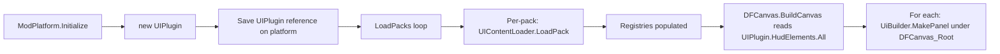

# UI Registry Wiring Plan (Task #194)

**Status**: Wiring not started — Pattern #86 risk; tracks #194 + #227

**Implementation cross-reference**:
- Tracks tasks: #193 (SDK split, Phase 1 landed), #194 (this plan), #227 (orphan-class follow-up)
- Last verified: 2026-04-25 (iter 49 audit)
- Gap: 12-step plan in section 3 has not begun. Adapter classes under `src/Runtime/UI/Adapters/` exist but are dead until `ModPlatform` consumes them — see Pattern #86 warning below.

> ⚠️ **Pattern #86 risk** — adapter files (HudElementRendererAdapter.cs etc.) exist under
> `src/Runtime/UI/Adapters/` and may give the false impression of progress. The 12-step plan below
> is what makes them callable from production. If task #227 is not closed, those adapter classes
> remain DEAD per `docs/proof/orphan-classes-{date}.json`.

**Date**: 2026-04-25
**Companion task**: #193 (SDK split). This plan **does not block on #193** — see "Dependencies on #193" below.

> **#193 Phase 1 landed (2026-04-25)**: Native/Extended/Bridge interface
> skeletons are now in `src/SDK/UI/` (`Native/`, `Extended/`, `Bridge/`,
> `Models/`). 11 interfaces + 2 stub model files, no impl migration yet.
> **Phase 2** of #193 will migrate `Runtime/UI` impls (`DFCanvas`,
> `ModMenuPanel`, `DebugPanel`, `HudStrip`, `HudIndicator`,
> `NativeMenuInjector`, `NativeUiHelper`, `NativeMainMenuModMenu`) to
> consume these interfaces and reconcile `DINOForge.SDK.UI.Models.HudElementDefinition` /
> `ThemeDefinition` with their `DINOForge.Domains.UI.Models` counterparts.
> Until Phase 2 lands the new SDK interfaces have **no callers** — they
> are contract-only.

---

## 1. Identified Gap (one sentence)

`Domains/UI` ships full registries (`HudElementRegistry`, `MenuRegistry`, `ThemeRegistry`), a `UIContentLoader`, and a `UIPlugin` aggregator — but `Runtime/ModPlatform.cs` neither references `DINOForge.Domains.UI` nor instantiates `UIPlugin`, and `Runtime/UI/DFCanvas.cs` only spawns the three hard-coded panels (`HudStrip`, `ModMenuPanel`, `DebugPanel`) without iterating any registry, so a pack like `ui-hud-minimal` declaring `hud_elements: [...]` is silently ignored.

Secondary gap discovered during audit: **directory-name mismatch**. `UIContentLoader.LoadHudElements` scans `<packDir>/hud_elements/` but `packs/ui-hud-minimal/` stores its file at `overlays/hud-elements.yaml`. The pack's `pack.yaml` `loads.hud_elements:` list points to `overlays/hud-elements.yaml`, so the YAML manifest is correct but the loader ignores it (it scans by directory, not by manifest).

---

## 2. Current State Summary

| Component | Path | State |
|---|---|---|
| `UIPlugin` | `src/Domains/UI/UIPlugin.cs` | Aggregator; constructed nowhere |
| `HudElementRegistry` | `src/Domains/UI/Registries/HudElementRegistry.cs` | Real registry, `Register/All/GetElementsByType` |
| `MenuRegistry` | `src/Domains/UI/Registries/MenuRegistry.cs` | Real registry, hierarchy validation |
| `ThemeRegistry` | `src/Domains/UI/Registries/ThemeRegistry.cs` | Real registry, ships `dark-theme` + `light-theme` defaults |
| `MenuManager` | `src/Domains/UI/MenuManager.cs` | Pure state machine (Open/Close/Toggle, panel visibility map) |
| `HUDInjectionSystem` | `src/Domains/UI/HUDInjectionSystem.cs` | **Stub** — `Update()` contains only a comment |
| `UIContentLoader` | `src/Domains/UI/UIContentLoader.cs` | Real loader, but scans `hud_elements/` / `menus/` / `themes/` subdirs (not the manifest's `loads.*`) |
| `DFCanvas` | `src/Runtime/UI/DFCanvas.cs` | Live UGUI host; builds 3 hard-coded panels; **no registry consumer** |
| `Runtime.csproj` | `src/Runtime/DINOForge.Runtime.csproj` | No `<ProjectReference>` to `DINOForge.Domains.UI` |
| `ModPlatform.cs` | `src/Runtime/ModPlatform.cs` | Owns `_contentLoader` (SDK), no UIPlugin field |
| `pack.yaml` for `ui-hud-minimal` | `packs/ui-hud-minimal/pack.yaml` | Declares `hud_elements / menus / ui_themes` and points to `overlays/hud-elements.yaml` etc. |

---

## 3. Wire-up Plan (Interim Path — no #193 dependency)



### File-modification table

| Step | File | Action | Effort |
|------|------|--------|--------|
| 1 | `src/Runtime/DINOForge.Runtime.csproj` | Add `<ProjectReference Include="..\Domains\UI\DINOForge.Domains.UI.csproj" />` to the unconditional ProjectReference ItemGroup (alongside SDK). | S |
| 2 | `src/Runtime/ModPlatform.cs` | Add `using DINOForge.Domains.UI;`. Add `private UIPlugin? _uiPlugin;` field, `public UIPlugin? UI => _uiPlugin;` accessor. In `Initialize()` after `_registryManager` is created: `_uiPlugin = new UIPlugin(_registryManager);`. | S |
| 3 | `src/Runtime/ModPlatform.cs` | After `_contentLoader.LoadPacks(packsDir)` in `LoadPacks()`, iterate `result.LoadedPacks` and for each call `_uiPlugin?.ContentLoader.LoadPack(Path.Combine(packsDir, packId), packId)` inside try/catch. Log count: `[ModPlatform] UI loaded N hud_elements, M menus, K themes`. | M |
| 4 | `src/Domains/UI/UIContentLoader.cs` | Add a manifest-driven overload: `public void LoadFromManifest(string packDir, string packId, IDictionary<string, List<string>> loads)`. Read `loads["hud_elements"]`, `loads["menus"]`, `loads["ui_themes"]` lists and dispatch each YAML file path through the existing wrapper deserialization. Keep existing directory-scan `LoadPack()` for back-compat. | M |
| 5 | `src/Runtime/ModPlatform.cs` | Switch step 3 to call the new `LoadFromManifest` using `result`'s per-pack manifest data. **Path of least resistance**: re-read `pack.yaml` once per pack (already done in `UpdateUI`), call `LoadFromManifest`. Resolves the `overlays/` vs `hud_elements/` directory mismatch. | M |
| 6 | `src/Runtime/UI/DFCanvas.cs` | Add public method `RenderRegistryHudElements(IReadOnlyList<HudElementDefinition> elements, ThemeDefinition? activeTheme)`. For each element: create a child `GameObject` under `DFCanvas_Root`, call `UiBuilder.MakePanel(canvasRoot, $"hud-{e.Id}", themeBg, new Vector2(e.Width, e.Height))`, position via `Position` enum (top_left / top_right / bottom_left / bottom_right / center) using `RectTransform` anchor presets. Apply `Opacity` to `CanvasGroup.alpha`. | M |
| 7 | `src/Runtime/Plugin.cs` (or wherever `DFCanvas.Initialize` is called) | After `DFCanvas.Initialize()` returns ready, call `dfCanvas.RenderRegistryHudElements(modPlatform.UI?.HudElements.All ?? Array.Empty<HudElementDefinition>(), modPlatform.UI?.Themes.ActiveTheme)`. | S |
| 8 | `src/Runtime/UI/DFCanvas.cs` | Hook `OnHudCountsChanged` (or new `OnUiRegistryUpdated`) so a hot-reload of packs causes `DestroyImmediate` of previous registry-spawned children and a re-render. Tag spawned children with name prefix `hud-` for easy cleanup. | M |
| 9 | `src/Tests/UIDomainTests.cs` (existing file) | Add test: `LoadPack_WithManifest_PopulatesRegistries` — write a temp dir mirroring `ui-hud-minimal`, call new `LoadFromManifest`, assert `HudElements.Count == 5`, `Menus.Count == 7`, `Themes.Count == 4 + 2 default`. | S |
| 10 | `src/Tests/Integration/UIWireupIntegrationTests.cs` (NEW) | Test ModPlatform end-to-end without Unity: `Initialize → LoadPacks` against fixture pack, assert `platform.UI.HudElements.Count > 0`. Skip the DFCanvas render assertion (Unity-only). | M |
| 11 | `packs/ui-hud-minimal/pack.yaml` | (Optional) Rename `overlays:` directory to `hud_elements:` to match SDK convention, or leave as-is once step 4/5 is manifest-driven. | S |
| 12 | `docs/TRUTH_TABLE.md` | Flip UI domain row from orphaned to wired; reference this plan. | S |

**Total: ~9 edits + 2 new test files + 1 doc update.**

---

## 4. Acceptance Test (next-dispatch verifiable)

```pwsh
# 1) Build SDK + Domain + Runtime (CI-mode, no Unity)
dotnet build src/Tests/DINOForge.Tests.csproj -c Release

# 2) Run the new integration test
dotnet test src/Tests/Integration/DINOForge.Tests.Integration.csproj `
    --filter "FullyQualifiedName~UIWireupIntegrationTests" -v normal

# Expected: PASS — assertions:
#   platform.UI.HudElements.Count == 5  (player-health-bar, resource-counter,
#                                         minimap, unit-portrait, alert-banner)
#   platform.UI.Menus.Count        == 7  (main-menu, packs-menu, warfare-,
#                                         economy-, settings-, themes-, help-)
#   platform.UI.Themes.Count       >= 4  (4 from pack + 2 default = 6)

# 3) (Optional, requires game install) deploy + visual smoke
dotnet build src/Runtime/DINOForge.Runtime.csproj -c Release -p:DeployToGame=true
# Launch game, expect 5 GameObjects under DFCanvas_Root with names "hud-*".
# A follow-up MCP query will confirm:
#   game_query_entities { component: "RectTransform", name_prefix: "hud-" }  → count >= 5
```

---

## 5. Effort Estimate

- **Files to create**: 1 (integration test)
- **Files to edit**: 8 (csproj, ModPlatform, UIContentLoader, DFCanvas x2, Plugin.cs, UIDomainTests, TRUTH_TABLE)
- **Tests to write**: 2 unit + 1 integration
- **Agent iterations**: **3 dispatches**
  1. Steps 1–5 (csproj + ModPlatform + UIContentLoader manifest path) + step 9 unit test
  2. Steps 6–8 (DFCanvas render + hot-reload cleanup) + step 10 integration test
  3. Step 11–12 (pack rename + TRUTH_TABLE) + acceptance verification
- **Calendar**: ~4–6 hours of agent-time end-to-end.

---

## 6. Dependencies on Task #193 (SDK Split)

**This plan can land 100% via the interim path without #193.** Rationale:

- Step 1 imports `DINOForge.Domains.UI.dll` directly into Runtime. This adds a Runtime → Domain coupling that #193 will later untangle by introducing `DINOForge.SDK.UI` interfaces (`IHudElementRegistry`, etc.) that both Runtime and Domain depend on.
- Steps 2–8 use **concrete types** (`UIPlugin`, `HudElementRegistry`, `HudElementDefinition`). When #193 lands, these become interface types and the only impacted lines are field declarations in `ModPlatform.cs` and the parameter type in `DFCanvas.RenderRegistryHudElements`.
- Migration cost from interim → post-#193: ~5 lines changed, mechanical.

**Why not wait for #193?** #193 requires designing the interface surface, moving classes between assemblies, and updating Domain consumers — significantly larger scope. Wiring is independently valuable: it converts `ui-hud-minimal` from documentation theater into a working pack.

---

## 7. Out-of-scope / Follow-up Tasks

- **Menu rendering**: This plan wires HUD elements only. `MenuRegistry` populates but the plan does not render menu hierarchy on screen. Follow-up: extend `ModMenuPanel` to read `UIPlugin.Menus` and replace the hard-coded mod-list with manifest-driven items. Tracked separately (recommend new task).
- **Theme application**: Plan applies `ActiveTheme` colors as background tints on HUD panels only. Full theme application (replacing `DinoForgeStyle` constants) is a larger refactor.
- **HUDInjectionSystem rewrite**: The stub `Update()` is left as-is. Once registry rendering works via DFCanvas, the stub can be deleted (it duplicates what DFCanvas does) — propose in a cleanup task.
- **Schema validation**: `pack.yaml` allows arbitrary `loads.hud_elements:` paths. PackCompiler validate should verify those paths exist and parse against `hud-element.schema.json`. Currently out of scope; tracked under task #141.

---

## 8. Risks

| Risk | Mitigation |
|------|------------|
| `UIContentLoader.LoadFromManifest` parsing differs from existing `LoadHudElements` | Reuse the same `_deserializer` + wrapper types; only the path-resolution layer changes. |
| DFCanvas render runs before registries populate (init order race) | Step 7 explicitly hooks the render call **after** `LoadPacks()` returns; add idempotent cleanup so re-render on pack reload works. |
| Domain DLL load-failure on game side (BepInEx) | `<Private>true</Private>` for the Domain `<ProjectReference>` so the DLL deploys to `BepInEx/plugins/`. Verify with `Get-ChildItem $BepInExDir/plugins` after deploy. |
| `netstandard2.0` ABI mismatch with BepInEx's Mono | Domain already targets `netstandard2.0` (verified in `DINOForge.Domains.UI.csproj`). No change needed. |
