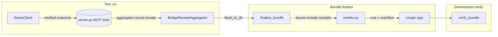

# Wave 2 Phase 4d: Bridge receipt aggregator + bundle integration

**Status**: Proposed — implementation not started (0 of 6 file-map artifacts exist)

**Implementation cross-reference**:
- Tracks tasks: #191, #232 (Wave 2 Phase 4d aggregator)
- Last verified: 2026-04-25 (iter 49 audit)
- Gap: design only; none of `bridge_receipt_aggregator.py`, `merkle.py`, `manifest.py`, server.py middleware, or the two pytest files exist yet. Phase 4c flip is also pending.

**Author**: DINOForge agents
**Date**: 2026-04-26
**Parent spec**: `docs/design/2026-04-25-bridge-hmac-phase4.md` (Phase 4 wire format + canonicalization)
**Adjacent spec**: `docs/design/2026-04-25-smart-contract-proof-system.md` section 4 (bundle merkle root, cosign signing)
**Precondition**: Phase 4a + 4b + 4c (partial) landed. Server emits `bridge_receipt`, clients in WarnOnly mode log mismatches. PerformConnectHandshake defaults to true.

## Goals

Phase 4 closed the per-call signing question — every `IGameBridge` response now carries a verifiable HMAC. Phase 4d closes the *aggregate* question: how do we collect those per-call receipts during a test run and fold them into the cosign-signed proof bundle, so a downstream verifier can prove the whole run wasn't fabricated post-hoc.

## Non-goals

- Re-signing: cosign is the only outer signature. Per-call HMACs prove integrity inside the run; cosign proves integrity of the run as a whole.
- Cross-session linking: each test run gets a fresh bundle; cross-bundle hash chains are tracked under `docs/design/2026-04-25-smart-contract-proof-system.md` section 5, not here.
- Streaming aggregation: receipts are buffered in memory for the run, then flushed at bundle finalize. Pure-streaming use cases are explicitly out of scope.

## Architecture



## Lifecycle

1. **Run start**: `BridgeReceiptAggregator()` instantiated by the FastMCP server when a proof-bundle target dir is configured (env var `DINOFORGE_PROOF_BUNDLE_DIR` or per-tool argument).
2. **Per call**: every IGameBridge tool wraps its `GameClient` call. After the client verifies the HMAC (WarnOnly today, Strict post-#103), the tool calls `aggregator.record(method, response)` with the response object. The aggregator pulls the `bridge_receipt` sub-document only — never the full response — and stamps a monotonic `seq` + `received_utc`.
3. **Run end**: bundle finalize calls `aggregator.flush_to_dir(bundle_dir / "bridge-receipts")`. Each receipt becomes a single JSON file `<seq:06>-<method>-<sha8>.json`. The flush also writes `bridge-receipts/index.json` summarising count, session_ids covered, frame range, and any WarnOnly soft-fails seen during the run.
4. **Merkle inclusion**: `merkle.py` hashes every receipt file as a leaf, in `seq` order, and exposes the resulting root as `manifest.bridge_receipts_root`. The bundle's overall `manifest.merkle_root` covers `bridge_receipts_root` plus the existing screenshot/dump/judge-receipt roots.
5. **Cosign**: bundle finalize already calls `cosign sign-blob` on the manifest. No change here — the manifest now just covers more leaves.
6. **Verify**: a downstream verifier loads the bundle, recomputes per-leaf hashes, recomputes `bridge_receipts_root` and `merkle_root`, then checks the cosign signature on `manifest.json`. Per-receipt HMAC re-verification is **not** required at the bundle layer — that was the in-run client's job, and the cosign signature attests the in-run state was preserved.

## Receipt-file shape

```jsonc
// bridge-receipts/000023-applyOverride-9f2c3a1d.json
{
  "seq": 23,
  "received_utc": "2026-04-26T14:01:22.117Z",
  "method": "applyOverride",
  "session_id": "550e8400-e29b-41d4-a716-446655440000",
  "world_frame": 12345,
  "timestamp_utc": "2026-04-26T14:01:22.092Z",
  "state_snapshot_sha256": "9f2c3a1d…",
  "hmac": "BASE64(HMAC-SHA256(session_key, canonical_payload))",
  "verification_status": "ok"
}
```

`verification_status` is one of `ok` | `warn_no_key` | `warn_mismatch`. Strict-mode runs never produce non-ok status (they throw inside the client). The status field is what the bundle verifier surfaces in its summary; it does NOT recompute HMACs.

## File map (NEW for Phase 4d)

| Layer | File | Action |
|-------|------|--------|
| Aggregator | `src/Tools/DinoforgeMcp/dinoforge_mcp/bridge_receipt_aggregator.py` | NEW: in-memory list, `record()`, `flush_to_dir()`, `index_manifest()`. |
| MCP server | `src/Tools/DinoforgeMcp/dinoforge_mcp/server.py` | Wire `BridgeReceiptAggregator` into per-tool middleware; pull receipts off `JsonRpcResponse`. |
| Bundle | `src/Tools/DinoforgeMcp/dinoforge_mcp/merkle.py` | Add `bridge_receipts_root` field; hash leaves in seq order. |
| Bundle | `src/Tools/DinoforgeMcp/dinoforge_mcp/manifest.py` | Add `bridge_receipts_root: str`, `bridge_receipts_count: int`, `bridge_receipts_warn_count: int`. |
| Tests | `tests/proof/test_bridge_receipt_aggregator.py` | record→flush→merkle round-trip; soft-fail counting; cosign-coverage assertion. |
| Tests | `tests/proof/test_bundle_verify_with_receipts.py` | mutate one receipt file; verifier rejects bundle. |

## Verifier checks

A bundle verifier (`scripts/proof/verify-bundle.ps1`, already exists) gains these new checks (Phase 4d):

1. `manifest.bridge_receipts_root` is non-empty AND matches recomputed root over `bridge-receipts/*.json` in seq order.
2. `bridge_receipts_count` equals the number of `*.json` files (excluding `index.json`).
3. `bridge_receipts_warn_count` matches `index.json.warn_total`.
4. Every receipt's `seq` is unique and dense (0..count-1).
5. Every receipt's `world_frame` is non-decreasing within each `session_id`.
6. **Optional** (`--strict-receipts` flag): every receipt has `verification_status == "ok"`. Default-off until policy demands it.

The verifier does NOT need session keys — those rotate per session and are never persisted. The cosign signature on `manifest.json` is what binds the bundle to a known signer; the per-receipt HMACs were the in-run defence and their *presence + structure* (not re-verification) is what Phase 4d audits.

## Failure modes

| Symptom | Cause | Disposition |
|---------|-------|-------------|
| `bridge_receipts_count: 0` on a run that called IGameBridge methods | Aggregator not wired into tool, or `PerformConnectHandshake=false` at GameClient site | Verifier WARNS in `--lenient` mode (default until task #103); FAILS in `--strict-receipts` mode (post-Phase 4c-final). |
| `bridge_receipts_root` mismatch | Tampering OR seq-ordering bug in flush | Verifier FAILS unconditionally. Receipts are leaves of the bundle merkle root — drift here means the cosign signature no longer covers them. |
| `verification_status: warn_*` count > 0 | In-run HMAC mismatches that the WarnOnly client tolerated | Surface in bundle summary; do NOT fail by default. Operators investigate via `dinoforge_debug.log`. |
| `world_frame` regression within a session | Server bug, replay attack, or client reconnect without session-key rotation | Verifier FAILS — this is the canonical replay signal. |

## Migration path

| Sub-phase | Aggregator | Verifier | Policy |
|-----------|-----------|----------|--------|
| **4d-a** | wired, records, flushes | recomputes root, surfaces counts | optional in policy.yaml |
| **4d-b** | unchanged | FAILS on root mismatch | `bridge_receipts_required: true` for E2E feature classes |
| **4d-c** | unchanged | FAILS on warn_count > 0 in strict mode | strict mode tied to `HmacVerificationMode = Strict` flip |

Sub-phases 4d-a and 4d-b are independent of the Phase 4c-final HmacVerificationMode flip. 4d-c is the tail end of the same flip — both will land in lock-step.

## Effort estimate

- 0.5 day: aggregator + record/flush + index.json (~150 LOC Python).
- 0.5 day: merkle.py + manifest.py wiring (~80 LOC + tests).
- 0.5 day: server.py middleware + per-tool integration (~60 LOC + 4 tools touched).
- 0.5 day: verifier additions in `verify-bundle.ps1` + 2 round-trip tests.
- **Total: 2 days**, ships independently of Phase 4c-final.

## Cross-references

- Parent spec: `docs/design/2026-04-25-bridge-hmac-phase4.md` (Phase 4 overall — wire format, canonicalization, sub-phases).
- Adjacent spec: `docs/design/2026-04-25-smart-contract-proof-system.md` section 4 (bundle merkle root + cosign).
- Policy: `policies/proof-policy.yaml` `features.<id>.require_bridge_receipt` already defined.
- CI: Phase 4d-b activation is gated in `proof-gate.yml`, the same gate that demands a Kimi receipt (#103).
- Implementation tracker: task #191 will spawn child task once 4d-a starts coding (currently design only).

## Open questions

1. Should `index.json` itself be a leaf, or only the per-receipt files? Default proposal: per-receipt files only — `index.json` is a recomputable summary and including it would force a re-flush whenever the summary template evolves.
2. Should the aggregator persist incrementally (append after each call) or only at flush? Default proposal: in-memory then flush, because (a) we want the run to fail-fast if disk is unavailable at finalize rather than mid-run, and (b) total receipt volume is bounded (~250 KB per 1000 calls).
3. How do we surface `bridge_receipts_root` in the existing bundle README/HTML report? Default proposal: add a "Bridge integrity" section with count + root + warn_count, mirroring the existing "Judge receipts" section.
4. Does the aggregator need a `clear()` method between runs (long-lived MCP server, multiple bundles back-to-back)? Default proposal: yes, called by `finalize_bundle` after `flush_to_dir` returns.
