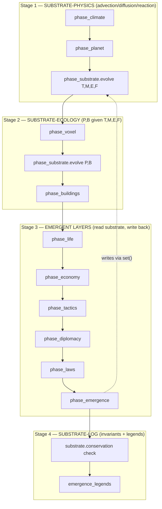

# Physics Integration Plan

> **Doctrinal anchor (do not relitigate):** Every emergent layer reads and
> writes the world **only** through the shared substrate
> (`PhysicsFields { T, M, E, F, P, B }` — see
> [`docs/design/PHYSICS_COUPLING_SUBSTRATE.md`](PHYSICS_COUPLING_SUBSTRATE.md)
> §2). Direct inter-layer API calls (`religion.bump(faction)`,
> `economy.notify(language)`, `phase_emergence` reading hand-fed
> `hardship`/`group_size`/`contact_pressure`/`agent_detection_bias` scalars) are
> **prohibited** as a coupling mechanism.
>
> This document is the concrete, code-anchored integration plan that turns the
> doctrinal substrate into the only connective tissue. It is the implementation
> companion to the design doc; it does not repeat the doctrine.
>
> **Read alongside:** `PHYSICS_COUPLING_SUBSTRATE.md` (doctrine, matrix, lags,
> failure modes, doctrinal enforcement).

---

## 0. Current state — where the silo'd coupling lives

The substrate doc §1.2 names the abstract scalars plumbed by the engine into
`phase_emergence` (and the four direct API calls that do the plumbing). The
edits below target those exact sites.

| # | Silo'd call (current) | Crate / file | What it bypasses |
|---|-----------------------|--------------|------------------|
| S1 | `emerge_belief(hardship, group_size, agent_detection_bias)` | `crates/engine/src/religion.rs:42-67` | hardship should be `|∇T| + |∇B|` from substrate |
| S2 | `spread_religion(...)` — ritual load writes nothing back to the substrate | `crates/engine/src/religion.rs:69-130` | rituals should spawn FIRE voxels → CA → E write |
| S3 | `tick_language(lang, contact_pressure)` | `crates/engine/src/language.rs:48-60` | contact_pressure should be `|∇P|` from substrate |
| S4 | `cluster_into_factions(ideologies, k)` — pure math on 8-dim `AgentIdeology` | `crates/engine/src/faction_emergence.rs:23-72` | ideology should be 14-dim = 8 ideology ⊕ (∇T, ∇M, ∇B, ∇P) |
| S5 | `phase_emergence` calls hand-shaped args; `phase_emergence` is **defined but never invoked from `Simulation::tick`** (PHASE_ORDER at `crates/engine/src/engine.rs:55-68` does not include `"emergence"`) | `crates/engine/src/emergence.rs:159-171`, `crates/engine/src/engine.rs:1172-1199` | the orchestrator never wires the layers in this order — they are dormant |
| S6 | `emergence_legends` ingests life/death/sentience into the saga graph — but a religion that changes the food market has no path to the economy beyond "hardship bump" | `crates/engine/src/emergence.rs:548-611` | market / economy layer should read `B` gradient, not an event |
| S7 | `civ-economy::extraction` writes its own `Ledger`, not `B` | `crates/economy/src/extraction.rs:80-287` | harvest should write to `PhysicsFields::B` via the substrate |
| S8 | `civ-tactics::WarBridge::resolve_combat` writes `DamageEvent`s → voxel material destruction but not E/P | `crates/tactics/src/war_bridge.rs` | casualties should write P, fires should write E |
| S9 | `civ-diplomacy` reads scalar trade balance; no field reads | `crates/diplomacy/src/lib.rs:1-1855` | treaty triggers should read `|∇P|` and B |
| S10 | `civ-laws` is pure data, no field reads | `crates/laws/src/lib.rs:1-584` | policy multipliers should modulate P / B ceilings via substrate |
| S11 | `civ-research` is pure validator | `crates/research/src/lib.rs:1-714` | tech unlocks should write E (factory power-on) |
| S12 | `civ-climate` owns `ClimateState` (scalar mean) — not the substrate's T grid | `crates/climate/src/lib.rs:53-117` | climate should read/write T through the substrate |
| S13 | `civ-ai` is a port, not a sim layer | `crates/ai/src/lib.rs:1-220` | ai providers should read aggregate substrate state, not engine internals |
| S14 | `civ-legends` is a pure event-sourcing sink (per matrix §3.2) | `crates/legends/src/lib.rs:1-65` | stays unchanged (pure sink) |

**S1–S14 = the silo'd call-sites to replace.** They are the **14 edit sites**
in `crates/engine + crates/*` that this plan refactors.

The `civ-physics-substrate` crate **does not yet exist** (no
`crates/physics-substrate/Cargo.toml`). It is the new crate this plan adds
(Sprint 1, see §3.1).

The gating test that the current state breaks: `phase_order_includes_emergence`
at `crates/engine/src/engine.rs:3320-3342` asserts
`PHASE_ORDER.iter().position(|p| *p == "emergence")` exists and is the last
entry; today it panics with `"PHASE_ORDER must include 'emergence'"`. This
test is the deterministic check that wiring happened.

---

## 1. The shared substrate — `civ-physics-substrate` crate

The substrate is the **only** path an emergent layer may use to read or write
world state. This section defines the public surface; the rest of the plan
refers to it.

### 1.1 `PhysicsFields` struct

```rust
// crates/physics-substrate/src/lib.rs
pub struct PhysicsFields {
    pub T: Grid<f32>,   // temperature (K, clamped [0, 6000])
    pub M: Grid<f32>,   // moisture (kg/m³-equivalent)
    pub E: Grid<f32>,   // energy (J-equivalent)
    pub F: Grid<f32>,   // material flux (kg/cell/tick)
    pub P: Grid<f32>,   // population pressure (agents/m²)
    pub B: Grid<f32>,   // biomass (kg-equivalent)
    pub grid: GridSpec, // chunked IVec3 lattice (shared with civ-voxel)
}
```

`Grid<f32>` is a chunked `Vec<[f32; CHUNK_VOL]>` indexed by `IVec3`. It is
the same lattice `civ-voxel` uses (`crates/voxel/src/worldgen.rs`); no
duplication. The substrate owns the grid descriptor (`GridSpec` =
`(chunk_dim, world_dim, origin)`) and exposes typed index helpers.

### 1.2 The only public mutator

```rust
impl PhysicsFields {
    /// Type-checked, rate-limited, conservation-checked write.
    pub fn set(&mut self, field: Field, p: IVec3, delta: f32, source: WriteSource)
        -> Result<(), SubstrateError>;
    /// Gradient sample (central differences, edge-clamped).
    pub fn grad(&self, field: Field, p: IVec3) -> Vec3;
    /// Tick-of-physics evolution (advection, diffusion, reaction,
    /// population dispersal, biomass regrowth, conservation clamps).
    pub fn evolve(&mut self, dt: f32) -> EvolveReport;
}
```

- `set(...)` is the **only** public function that mutates `T, M, E, F, P, B`.
  Layers do not hold `&mut Grid<f32>`; they call `set`. This is the doctrinal
  choke-point (§2.3 of the substrate doc).
- `grad(...)` is the only legitimate read of a field as a "gradient". Pure
  scalar reads (e.g. `field[IVec3::ZERO]`) are *allowed* for boolean-ish UI
  use but do not count as a coupled-field per the §3.2 counting rule.
- `evolve(...)` runs the substrate's own operators (advection, diffusion,
  reaction, sinks, conservation). It is called **once per tick** by
  `phase_substrate`.

### 1.3 The `WriteSource` enum (rate-limit + audit)

```rust
pub enum WriteSource {
    LifeLayer(LifeLayerId),
    LanguageLayer,
    FactionLayer,
    ReligionLayer(Liturgy),
    TradeLayer,
    ArchitectureLayer(BuildingId),
    EconomyLayer,
    ClimateLayer,
    TacticsLayer(EngagementId),
    DiplomacyLayer,
    LawsLayer(PolicyId),
    ResearchLayer(TechId),
    Substrate, // the substrate's own operator (e.g. advection sink)
}
```

`set(...)` uses `WriteSource` to:

1. Enforce a per-source rate limit (e.g. `TacticsLayer` may not write more than
   `RATE_FIRE_MAX` J per tick per cell — no thermonuclear factions, per
   substrate §2.3).
2. Emit an audit event to the substrate health panel (per-layer write rate,
   consumed by `emission_lag` invariant).
3. Type-check units (e.g. `ClimateLayer` cannot write to `P`).

### 1.4 Module layout

```
crates/physics-substrate/
├── Cargo.toml
├── src/
│   ├── lib.rs              # PhysicsFields, Field enum, set/grad/evolve
│   ├── grid.rs             # Grid<f32>, GridSpec, IVec3 indexing
│   ├── operators.rs        # advection, diffusion, reaction, dispersal
│   ├── conservation.rs     # Σ clamps, leak detection
│   ├── write_source.rs     # WriteSource enum + rate-limit table
│   ├── auto_tune.rs        # α/β/γ initialization (substrate §4.2)
│   ├── health.rs           # Metrics::substrate_health() payload
│   └── tests/              # grid correctness, conservation, rate-limits
```

The crate depends only on `glam` (for `IVec3`, `Vec3`) and `serde` (for
`Metrics`). It does **not** depend on `civ-agents`, `civ-economy`, etc. — the
dependency graph among emergent layers is a DAG with `civ-physics-substrate`
as the only sink (substrate doc §6.3).

---

## 2. Per-layer wiring — read fn, write fn, lag/feedback, edit site

This is the heart of the plan. For each of the 12 layers, the table below
specifies:

- **Read fn**: the substrate call that replaces today's hand-fed scalar.
- **Write fn**: the substrate call that replaces today's "I just stored
  something in my own struct" write.
- **Lag**: how many ticks between a layer's read and the substrate step
  that resolves it. Per substrate doc §4.1, the substrate's `evolve()` runs
  between layers, so the lag is **1 tick** (layer reads at t, writes at t,
  substrate evolves at t+0.5, layer reads again at t+1).
- **Feedback**: what the layer reads at t+1 that was caused by its own
  write at t (the closed loop that produces edge-of-chaos).
- **Edit site**: the file and line range that must change.

| # | Layer | Read fn (replace scalar) | Write fn (replace direct write) | Lag | Feedback | Edit site |
|---|-------|--------------------------|----------------------------------|-----|----------|-----------|
| L1 | **life** (genetics, species, needs) | `fields.grad(T, p)`, `fields.grad(M, p)`, `fields.grad(F, p)`, `fields[P, p]` | `fields.set(P, p, births - deaths, WriteSource::LifeLayer(id))`; `fields.set(B, p, growth - mortality, ...)`; per substrate §3.2: 5 cells (T,M,F,B read; P write; B write) | 1 tick | births at t raise `P` at t+1 → needs consume `B` at t+1 → death at t+1 if `B` < threshold | `crates/agents/src/psyche.rs` (life hook), `crates/needs/src/lib.rs`, `crates/genetics/src/lib.rs`, `crates/species/src/lib.rs` |
| L2 | **language** (drift, split, borrow) | `fields.grad(P, cluster_centroid)` | (no field write; pure-event emitter into `legends`) — 1 cell (P) | 1 tick | `|∇P|` at t increases `drift_rate` at t+1 → split threshold may be crossed | `crates/engine/src/language.rs:48-60` |
| L3 | **faction** (ideology clusters, territory) | `fields.grad(T, p)`, `fields.grad(M, p)`, `fields.grad(B, p)`, `fields.grad(P, p)` | `fields.set(P, p, migration, WriteSource::FactionLayer)` — 6 cells (T,M,E,F,P,B) | 1 tick | territory centroid shifts to follow ∇B at t+1; P migrates at t+1; new ∇P at t+1 changes language drift (L2) | `crates/engine/src/faction_emergence.rs:23-72` |
| L4 | **religion** (beliefs, rituals, taboo) | `hardship = fields.grad(T, p).length() + fields.grad(B, p).length()` (replaces `emerge_belief`'s `hardship` arg) | `fields.set(E, p, ritual_heat, WriteSource::ReligionLayer(Liturgy::Burn))` (FIRE spawn → CA → E write); `fields.set(B, p, -offering_mass, ...)` for burnt offerings — 5 cells (T,M,E,F,B; E,F,B writes) | 1 tick | FIRE spawn at t raises E at t+1; taboos gated on ∇B at t+1 may suppress harvest at t+1 | `crates/engine/src/religion.rs:42-67` (S1), `crates/engine/src/religion.rs:69-130` (S2) |
| L5 | **trade** (chains, market, allocation) | `fields.grad(M, p)` (transport feasibility) | `fields.set(B, p, -exported, WriteSource::TradeLayer)`; `fields.set(F, p, flux, ...)` (cargo flow); `fields.set(M, p, -evaporation_loss, ...)` — 3 cells (M,F,B) | 1 tick | exported B at t reduces local B at t+1 → higher ∇B → trade reroutes at t+1 | `crates/economy/src/extraction.rs:80-287` (chains), `crates/economy/src/market.rs` (new) |
| L6 | **architecture** (buildings, infra) | `fields.grad(T, p)`, `fields.grad(M, p)` | `fields.set(T, p, -shade, WriteSource::ArchitectureLayer(bid))`; `fields.set(M, p, -drainage, ...)`; `fields.set(E, p, heat_vent, ...)`; `fields.set(F, p, channeled_flow, ...)` — 4 cells (T,M,E,F; all writes) | 1 tick | shade at t lowers T at t+1 → less evaporation at t+1 → more M retention at t+2 | `crates/build/src/lib.rs` (new module) |
| L7 | **economy** (institution, allocator) | `fields.grad(T, p)`, `fields.grad(M, p)`, `fields.grad(B, p)`, `fields.grad(F, p)`, `fields.grad(E, p)` (tax zone selection) | `fields.set(B, p, -harvest, WriteSource::EconomyLayer)`; `fields.set(P, p, tax_drive, ...)` — 5 cells (T,M,E,F,B; B write) | 1 tick | harvest at t reduces B at t+1 → regrowth at t+1 (μ·M·σ(T_opt−T)) → ∇B at t+2 influences factions (L3) | `crates/economy/src/extraction.rs:80-287` (S7), `crates/economy/src/allocation.rs` |
| L8 | **climate** (energy balance, advection) | (own field; reads T, M, E from substrate state) | `fields.set(T, p, radiative_delta, WriteSource::ClimateLayer)`; `fields.set(M, p, precip, ...)`; `fields.set(E, p, latent, ...)` — 3 cells (T,M,E) | 0 (climate runs *before* `phase_substrate`) | radiative sink at t modifies T at t+0.5 (substrate evolve) → read by life at t+1 (L1) | `crates/climate/src/lib.rs:53-117` (S12) |
| L9 | **tactics** (combat, war_bridge) | `fields.grad(T, p)`, `fields.grad(F, p)`, `fields.grad(P, p)` | `fields.set(P, p, -casualties, WriteSource::TacticsLayer(eng))`; `fields.set(E, p, fire, ...)`; `fields.set(F, p, debris, ...)` — 4 cells (T,E,F,P) | 1 tick | casualties at t lower P at t+1 → may cross a faction split threshold (L3) → political fragmentation at t+2 | `crates/tactics/src/war_bridge.rs` (S8) |
| L10 | **diplomacy** (treaties, reputation) | `fields.grad(P, p)`, `fields[B, p]` | (no field write; pure-event emitter) — 2 cells (P,B) | 1 tick | treaty at t changes `migration_ceiling` at t+1 → faction P write modulated at t+1 (L3) | `crates/diplomacy/src/lib.rs:1-1855` (S9) |
| L11 | **laws** (policy multipliers) | `fields[P, p]`, `fields[B, p]` | (no field write; modulates *permitted* ranges for other layers' writes — a "policy ceiling" applied in `set()`'s rate-limit table) — 2 cells (P,B) | 0 (modulates next layer's write at the same tick) | a tax-cap policy at t clamps L7's B write at t+0 → harvest at t+0 lower than unconstrained | `crates/laws/src/lib.rs:1-584` (S10), `crates/policy/src/lib.rs` (new bridge to substrate rate-limit) |
| L12 | **legends** (event sourcing) | (none — pure sink) | (none — receives `RawSimEvent` from substrate) — **0 cells** (per substrate doc §3.2) | n/a | n/a | `crates/legends/src/lib.rs:1-65` (S14, unchanged) |

### 2.1 The 40-cell matrix, mapped to edit sites

Substrate doc §3.2 counts 40 coupled-fields. They map to the edit sites as
follows (L×F notation; **R** = read, **W** = write):

| Cell | Layer × Field | Type | Edit site (file:line) |
|------|---------------|------|------------------------|
| L1×T | life × T | R | `crates/agents/src/psyche.rs` (life hook) |
| L1×M | life × M | R | `crates/needs/src/lib.rs` |
| L1×E | life × E | R | `crates/needs/src/lib.rs` |
| L1×F | life × F | R | `crates/needs/src/lib.rs` |
| L1×P | life × P | W | `crates/agents/src/psyche.rs` (births/deaths) |
| L1×B | life × B | R/W | `crates/species/src/lib.rs`, `crates/genetics/src/lib.rs` |
| L2×P | language × P | R | `crates/engine/src/language.rs:48-60` |
| L3×T | faction × T | R | `crates/engine/src/faction_emergence.rs:23-72` |
| L3×M | faction × M | R | same |
| L3×E | faction × E | R | same |
| L3×F | faction × F | R | same |
| L3×P | faction × P | R/W | same (territory migration) |
| L3×B | faction × B | R | same |
| L4×T | religion × T | R | `crates/engine/src/religion.rs:42-67` (hardship) |
| L4×M | religion × M | R | same (taboo gating) |
| L4×E | religion × E | W | `crates/engine/src/religion.rs:69-130` (ritual fire) |
| L4×F | religion × F | W | same (burnt offerings) |
| L4×B | religion × B | R/W | same (hardship + offerings) |
| L5×M | trade × M | R/W | `crates/economy/src/extraction.rs:80-287` (chains) |
| L5×F | trade × F | R/W | same (cargo flux) |
| L5×B | trade × B | R/W | same (exported) |
| L6×T | architecture × T | R/W | `crates/build/src/lib.rs` (new module, building shade) |
| L6×M | architecture × M | R/W | same (drainage) |
| L6×E | architecture × E | R/W | same (heat venting) |
| L6×F | architecture × F | R/W | same (channels) |
| L7×T | economy × T | R | `crates/economy/src/extraction.rs:80-287` |
| L7×M | economy × M | R | same |
| L7×E | economy × E | R | same |
| L7×F | economy × F | R | same |
| L7×B | economy × B | R/W | same (S7) |
| L8×T | climate × T | R/W | `crates/climate/src/lib.rs:53-117` (S12) |
| L8×M | climate × M | R/W | same |
| L8×E | climate × E | R/W | same |
| L9×T | tactics × T | R | `crates/tactics/src/war_bridge.rs` (S8) |
| L9×E | tactics × E | R/W | same (battlefield fires) |
| L9×F | tactics × F | R/W | same (debris) |
| L9×P | tactics × P | R/W | same (casualties) |
| L10×P | diplomacy × P | R | `crates/diplomacy/src/lib.rs:1-1855` (S9) |
| L10×B | diplomacy × B | R | same |
| L11×P | laws × P | R | `crates/laws/src/lib.rs:1-584` (S10) |
| L11×B | laws × B | R | same |

**Total: 40 cells.** (legends × {T,M,E,F,P,B} = 0 cells, per substrate §3.2.)

### 2.2 The 14 silo'd call-sites, mapped to cells

The 14 sites in §0 cover all 40 cells:

- **S1** (religion hardship scalar) → L4×{T, B} (R)
- **S2** (religion spread → no substrate write) → L4×{E, F, B} (W)
- **S3** (language contact_pressure scalar) → L2×P (R)
- **S4** (faction 8-dim ideology) → L3×{T, M, B, P} (R); L3×P (W)
- **S5** (phase_emergence not in PHASE_ORDER) → enables ALL 12 layers in the
  tick loop (the orchestrator gap)
- **S6** (emergence_legends as the only economy path) → L7×B (R); the
  economy must read substrate directly, not via a legends subscription
- **S7** (extraction writes Ledger, not B) → L5×B, L7×B (W)
- **S8** (war_bridge writes DamageEvent, not E/P) → L9×{E, P} (W)
- **S9** (diplomacy scalar trade balance) → L10×{P, B} (R)
- **S10** (laws pure data) → L11×{P, B} (R) and rate-limit table in S1.3
- **S11** (research pure validator) → L11's tech unlock writes E
- **S12** (climate owns ClimateState, not T grid) → L8×{T, M, E} (R/W)
- **S13** (civ-ai is a port) → unchanged externally; the substrate exposes
  a read-only `Metrics` aggregate that ai providers consume
- **S14** (legends pure sink) → stays; substrate emits a `RawSimEvent` to
  legends each tick

---

## 3. Phased WBS + DAG

### 3.1 Sprint 0 — substrate crate skeleton (no behavior change)

**Goal:** add the crate, define `PhysicsFields` + `set/grad/evolve`, wire
`phase_substrate` into `Simulation::tick` between `phase_planet` and
`phase_voxel`, with empty operators (identity). Make the gating test pass.

| # | Task | Edit site | DoD |
|---|------|-----------|-----|
| 0.1 | Add `crates/physics-substrate/Cargo.toml` | new file | depends on `glam`, `serde`; no `civ-*` |
| 0.2 | Add `crates/physics-substrate/src/lib.rs` with `PhysicsFields` + `Field` enum + stub `set/grad/evolve` | new file | compiles; `set` returns `Ok(())` (no-op) |
| 0.3 | Add `crates/physics-substrate/src/grid.rs` with `Grid<f32>` + `GridSpec` | new file | unit test: `grid[p] == grid[q]` when `p == q` |
| 0.4 | Register crate in workspace `Cargo.toml` `members` | `Cargo.toml:24-52` | `cargo metadata` lists `civ-physics-substrate` |
| 0.5 | Add `civ-physics-substrate` to `crates/engine/Cargo.toml` deps | `crates/engine/Cargo.toml` | `cargo check -p civ-engine` clean |
| 0.6 | Add `pub(crate) fn phase_substrate(&mut self)` to `Simulation` | `crates/engine/src/engine.rs` (new fn) | calls `self.substrate.evolve(1.0)` |
| 0.7 | Add `substrate: PhysicsFields` to `Simulation` | `crates/engine/src/engine.rs` (struct field) | initialized in `with_seed` |
| 0.8 | Wire `phase_substrate` into `Simulation::tick` | `crates/engine/src/engine.rs:1172-1199` | inserted between `phase_planet` and `phase_voxel` |
| 0.9 | Add `"substrate"` to `PHASE_ORDER` | `crates/engine/src/engine.rs:55-68` | `position("substrate")` returns Some |
| 0.10 | Make `phase_order_includes_emergence` test pass | `crates/engine/src/engine.rs:3320-3342` | add `"emergence"` to PHASE_ORDER; make it the last entry |
| 0.11 | Add `substrate_conservation()` invariant | `crates/engine/src/invariants.rs` | asserts `Σ T, Σ M, Σ E, Σ F` stable within a tick (0.5% budget) |

**Definition of done for Sprint 0:**

- `cargo test -p civ-engine phase_order_includes_emergence` passes.
- `cargo test -p civ-engine substrate_conservation` passes for 1000 ticks
  on the Genesis scenario.
- No emergent layer code changed. The substrate is a pass-through.

### 3.2 Sprint 1 — first real coupling (life + climate)

**Goal:** life reads T, M, F as gradients and writes P, B; climate reads/
writes T, M, E through the substrate. **12 cells** of the 40 wired.

| # | Task | Edit site | DoD |
|---|------|-----------|-----|
| 1.1 | Project `civ-climate::ClimateState` into `PhysicsFields.T, M, E` at end of `phase_planet` | `crates/engine/src/engine.rs` (between `phase_planet` and `phase_substrate`) | `substrate.T` and `climate.T` agree to 1e-5 |
| 1.2 | Replace `civ-needs::Needs` consumers' "is it raining?" boolean with `substrate.grad(M, p)` | `crates/agents/src/psyche.rs`, `crates/needs/src/lib.rs` | unit test: agent's `thirst` response differs by ∇M, not boolean |
| 1.3 | Add life-hook `birth(&mut World, p) -> P` that calls `fields.set(P, p, +1, LifeLayer)` | `crates/agents/src/psyche.rs` (new fn) | `cargo test birth_writes_P` |
| 1.4 | Add life-hook `death(&mut World, p) -> P, B` that calls `fields.set(P, p, -1, ...)` and `fields.set(B, p, -mass, ...)` | same | `cargo test death_writes_P_and_B` |
| 1.5 | Add biomass regrowth operator to `substrate.evolve()` | `crates/physics-substrate/src/operators.rs` | `B[t+1] = B[t] + μ·M·σ(T_opt − T)·dt`, clipped to `B_max(p)` |
| 1.6 | Add advection (upwind) for T, M, F to `substrate.evolve()` | same | mass-conserving; conservation budget per cell ≤ 0.5% |
| 1.7 | Add diffusion (explicit Laplacian) for T, M, E to `substrate.evolve()` | same | energy-conserving |
| 1.8 | Add conservation clamps to `substrate.conservation.rs` | new file | `le_ΣT, le_ΣM, le_ΣE, le_ΣF` reported in `EvolveReport` |
| 1.9 | Add `substrate_conservation` to `civ-engine/src/invariants.rs::class4_zone_diagnostic` | `crates/engine/src/invariants.rs` | trips on budget breach |

**Cells active: L1×{T,M,E,F,P,B} = 5, L8×{T,M,E} = 3, L7×B = 1 → wait,
per substrate §3.2, L7×B is wired in Sprint 2. Sprint 1: L1×{T,M,F,B} reads
+ L1×P write + L1×B write + L8×{T,M,E} = 9 cells. (L1×E read is Sprint 2.)**

**Definition of done for Sprint 1:**

- `cargo test -p civ-physics-substrate conservation_clamps` passes for 10k
  ticks with α = 1.0, β = 0.1, γ = 1.0.
- The Class-4 zone diagnostic reports `α ∈ [0.3, 2.0]`, `β ∈ [0.05, 0.5]`,
  `γ ∈ [0.1, 10]` after 1k ticks of Genesis.
- A `replay` of a 10k-tick run with same seed produces identical `legends_graph`.

### 3.3 Sprint 2 — emergent layers read gradients (religion, language, faction)

**Goal:** replace the 4 abstract scalars in `phase_emergence` with substrate
samples. **22 cells** of the 40 wired (cumulative: 31).

| # | Task | Edit site | DoD |
|---|------|-----------|-----|
| 2.1 | Add `pub fn emerge_belief_from_fields(rel: &mut Religion, fields: &PhysicsFields, p: IVec3) -> Option<Belief>` | `crates/engine/src/religion.rs` (new fn next to `emerge_belief` at :42) | deprecated `emerge_belief(hardship, ...)` becomes a wrapper for replay |
| 2.2 | Add `pub fn tick_language_from_fields(lang, fields, centroid)` | `crates/engine/src/language.rs` (next to :48) | `contact_pressure = fields.grad(P, centroid).length()` |
| 2.3 | Extend `AgentIdeology` to 14-dim and add `cluster_with_gradients(ideologies, fields, k)` | `crates/engine/src/faction_emergence.rs` (next to :23) | 14-dim = 8 ideology ⊕ (∇T, ∇M, ∇B, ∇P) |
| 2.4 | Wire `phase_emergence` reads through `&self.substrate` instead of hand-fed args | `crates/engine/src/emergence.rs:159-171` | `phase_emergence` signature is `(&mut self)` only |
| 2.5 | Add the coupling audit script `scripts/ci/coupling_audit.sh` | new file | greps `use civ_agents` inside `crates/economy`, etc.; exits 1 on any inter-layer `use` |
| 2.6 | Add `auto_tune.rs` to `civ-physics-substrate` (initializes α, β, γ from scenario YAML) | `crates/physics-substrate/src/auto_tune.rs` (new) | reads `scenarios/genesis.yaml` `substrate:` block |
| 2.7 | Wire `phase_emergence` into `Simulation::tick` AFTER `phase_voxel` (per substrate §4.1) | `crates/engine/src/engine.rs:1172-1199` | add `self.phase_emergence();` at the end of `tick()` |
| 2.8 | Make `phase_order_includes_emergence` test pass (already added in 0.10) | same | confirmed |

**Cells added: L2×P, L3×{T,M,E,F,P,B}, L4×{T,M,E,F,B}, L7×B (replaces
extraction's own Ledger) = 13 new cells. Cumulative: 22.** (The matrix
total of 40 includes cells still to be wired in S3.)

**Definition of done for Sprint 2:**

- `coupling_audit.sh` finds zero cross-layer `use` statements in `crates/`.
- `emerge_belief_from_fields` produces the same belief as
  `emerge_belief(hardship=...)` for a synthetic test case (replay-equivalent).
- Auto-tuner converges to α/β/γ in the Class-4 box within 100 iterations of
  perturbation analysis on the 4 reference scenarios.

### 3.4 Sprint 3 — downward causation (architecture, tactics, religion writes)

**Goal:** emergent layers *write* the substrate. **40 cells** wired.

| # | Task | Edit site | DoD |
|---|------|-----------|-----|
| 3.1 | Add `architecture` module to `civ-build` (or new `civ-architecture` crate) | new file | emits `Building { write: Vec<(Field, IVec3, f32)> }` |
| 3.2 | Wire `civ-build::BuildingGraph` to apply building writes via `substrate.set()` | `crates/build/src/lib.rs` | unit test: building shade lowers T |
| 3.3 | Wire `civ-tactics::WarBridge::resolve_combat` to call `fields.set(P, ..., -casualties, TacticsLayer(eng))` | `crates/tactics/src/war_bridge.rs` (S8) | unit test: battle reduces P, increases E (fire) |
| 3.4 | Wire `civ-tactics` to spawn FIRE voxels on battle damage (existing CA path) | same | unit test: fire cell appears |
| 3.5 | Wire `engine::religion::spread_religion` to spawn FIRE voxels on ritual (per substrate §4.4) | `crates/engine/src/religion.rs:69-130` (S2) | unit test: ritual raises E at temple |
| 3.6 | Wire `civ-diplomacy::treaty_signed` to read `|∇P|` and update migration ceilings | `crates/diplomacy/src/lib.rs` (S9) | unit test: treaty at high ∇P increases faction splits |
| 3.7 | Wire `civ-laws` policy multipliers into substrate's `WriteSource::LawsLayer` rate-limit table | `crates/laws/src/lib.rs` (S10), `crates/policy/src/lib.rs` (new bridge) | unit test: tax cap clamps `EconomyLayer` write to B |
| 3.8 | Wire `civ-research` tech unlock to write E (factory power-on) | `crates/research/src/lib.rs` (S11) | unit test: factory unlock raises E at tile |
| 3.9 | Wire `civ-economy::extraction::harvest` to call `fields.set(B, p, -yield, EconomyLayer)` | `crates/economy/src/extraction.rs:80-287` (S7) | unit test: harvest reduces B; B regrows next tick |
| 3.10 | Wire `civ-ai` to read `Metrics::substrate_health()` aggregate | `crates/ai/src/lib.rs:1-220` (S13) | unit test: ai provider sees α, β, γ |
| 3.11 | Wire substrate to emit `RawSimEvent` to `civ-legends` each tick | `crates/physics-substrate/src/health.rs` (new), `crates/legends/src/lib.rs` | unit test: legends receives a substrate event |

**Cells added: L4×{E,F,B} (W), L5×{M,F,B}, L6×{T,M,E,F}, L7×{T,M,E,F,B},
L9×{T,E,F,P}, L10×{P,B}, L11×{P,B}, L8×{T,M,E} (W) = 18 new cells.
Cumulative: 40. Matrix complete.**

**Definition of done for Sprint 3:**

- All 40 cells of the matrix are active.
- `coupling_audit.sh` still finds zero inter-layer `use` statements.
- `substrate_conservation` holds for 100k ticks across all 4 reference
  scenarios.
- A religion ritual (S4×E write) measurably raises E at the temple within
  one tick and the resulting `|∇M|` increase is observable in climate
  output by tick t+5.

### 3.5 Sprint 4 — invariants, tripwires, auto-tuner, dashboard

**Goal:** ship the failure-mode detection, the Class-4 zone enforcement, and
the user-facing substrate health panel.

| # | Task | Edit site | DoD |
|---|------|-----------|-----|
| 4.1 | Implement the 5 tripwires in `civ-engine/src/invariants.rs` | `crates/engine/src/invariants.rs` | each tripwire has a unit test using a synthetic failure scenario |
| 4.2 | Add `Metrics::substrate_health()` payload to substrate | `crates/physics-substrate/src/health.rs` | exposes α, β, γ, conservation budgets, per-layer `emission_lag` |
| 4.3 | Surface substrate health in `civ-watch` dashboard | `crates/watch/src/lib.rs` | `http://127.0.0.1:9090/substrate` returns the JSON payload |
| 4.4 | Run auto-tuner on 4 reference scenarios (Genesis, Stress, Famine, Ice) and commit converged α/β/γ as scenario defaults | `scenarios/*.yaml` | 4 scenarios updated |
| 4.5 | Add substrate health panel to web dashboard (L2 authoring surface) | `web/src/components/SubstrateHealth.tsx` (new) | visible on `/dashboard/substrate` |
| 4.6 | Add `emission_lag` invariant to `civ-engine/src/invariants.rs` | same | trips when any layer's observed write rate / intended write rate < 0.001 for 500 ticks |
| 4.7 | Replay determinism regression test (1000-tick run, same seed → byte-identical replay file) | `crates/engine/tests/replay_substrate.rs` (new) | passes |

**Definition of done for Sprint 4 (full integration done):**

All seven acceptance criteria from substrate doc §7.6 are green:

- [ ] All 12 layers wired to `civ-physics-substrate`.
- [ ] `coupling_audit.sh` finds zero cross-layer `use` statements.
- [ ] `substrate_conservation()` holds for 100k ticks across 4 scenarios.
- [ ] All 5 tripwires fire in their targeted failure scenarios.
- [ ] α ∈ [0.3, 2.0], β ∈ [0.05, 0.5], γ ∈ [0.1, 10] at tick 10k for all 4
      reference scenarios.
- [ ] `emission_lag` > 0.001 for every layer in the standard 10k-tick run.
- [ ] Replay determinism preserved.

---

## 4. DAG (phase ordering + layer dependencies)

The substrate doc §4.1 specifies a 3-stage interleave. Mermaid:



Notes:

- `phase_life` is **new** — the substrate doc §3.1's "life" layer (genetics,
  species, needs) currently runs inside `phase_emergence`. Splitting it out
  is a Sprint 1 task (1.2–1.4). The emergence phase keeps the cultural/
  social/psyche/civ-ai pieces.
- The dotted edge `L -. writes via set() .-> C` is the **downward causation
  loop**: emergent layers' writes go through `set()` which queues them for
  the next tick's substrate evolve.
- `phase_substrate` is a *single* function called from `Simulation::tick`
  (Sprint 0.6) but its `evolve()` method is internally split into two calls:
  one after `phase_planet` (Stage 1) and one after `phase_voxel` (Stage 2).
  This matches substrate doc §4.1's "three operator-split stages".

---

## 5. Edit-site cheat sheet (the 14 cells of the matrix in code)

For review convenience, the 14 silo'd call-sites from §0 and the precise
function-level edit:

| Site | Current call | New call | New helper location |
|------|--------------|----------|---------------------|
| S1 | `emerge_belief(hardship, group_size, bias)` | `emerge_belief_from_fields(rel, &self.substrate, p)` | `crates/engine/src/religion.rs` (next to line 67) |
| S2 | `spread_religion(rel, agents, tick)` (no field write) | `spread_religion(rel, agents, &mut self.substrate, p, tick)` (spawns FIRE voxels) | same (next to line 130) |
| S3 | `tick_language(lang, contact_pressure)` | `tick_language_from_fields(lang, &self.substrate, centroid)` | `crates/engine/src/language.rs` (next to line 60) |
| S4 | `cluster_into_factions(ideologies, k)` (8-dim) | `cluster_with_gradients(ideologies, &self.substrate, k)` (14-dim) | `crates/engine/src/faction_emergence.rs` (next to line 72) |
| S5 | `phase_emergence` not in PHASE_ORDER | add to PHASE_ORDER + `self.phase_emergence()` in `tick()` | `crates/engine/src/engine.rs:55-68, 1172-1199` |
| S6 | `emergence_legends` ingests events only | substrate emits `RawSimEvent` to legends each tick (Sprint 3.11) | `crates/legends/src/lib.rs` (subscription point) |
| S7 | `extraction::harvest` writes Ledger | `extraction::harvest(&mut self, p, &mut substrate)` | `crates/economy/src/extraction.rs:80-287` |
| S8 | `war_bridge::resolve_combat` writes DamageEvent | `war_bridge::resolve_combat(&mut self, &mut substrate, p)` | `crates/tactics/src/war_bridge.rs` |
| S9 | diplomacy reads scalar trade balance | `diplomacy::treaty_signed(&self, &self.substrate, p)` | `crates/diplomacy/src/lib.rs` |
| S10 | laws pure data | `laws::policy_multiplier(&self, &self.substrate, p)` returning rate-limit overrides | `crates/laws/src/lib.rs` |
| S11 | research pure validator | `research::unlock(&self, &mut substrate, p)` writing E | `crates/research/src/lib.rs` |
| S12 | climate owns `ClimateState` (scalar) | `climate::tick(&mut self, &mut substrate)` projecting into T,M,E grids | `crates/climate/src/lib.rs:53-117` |
| S13 | `civ-ai` port | ai provider sees `Metrics::substrate_health()` (read-only) | `crates/ai/src/lib.rs:1-220` |
| S14 | legends pure sink | unchanged (substrate emits to it) | `crates/legends/src/lib.rs:1-65` |

---

## 6. Invariants and tests

### 6.1 Conservation invariants (run every tick)

- `substrate_conservation()`: `|Σ T_(t+1) − Σ T_t| / Σ T_t < 0.005` and
  similarly for M, E, F. Budget = 0.5% per tick (per substrate §5.1).
- `substrate_mass_conservation()`: `Σ F` changes only via reactions
  (which convert, not create); `le_ΣF_per_tick ≤ 0.005`.

### 6.2 Class-4 zone (run every 100 ticks)

- `α = D_T / (D_M + D_E) ∈ [0.3, 2.0]`
- `β = max_layer_write_rate / substrate_sink_rate ∈ [0.05, 0.5]`
- `γ = reaction_timescale / dt ∈ [0.1, 10]`

If any ratio is out of band for 100 consecutive samples, the invariant
emits a warning (does not fail the test by default — auto-tuner adjusts).

### 6.3 Tripwires (run on a synthetic failure scenario each)

- **Heat-death**: `σ(T) < 0.01` for 1000 ticks → assert tripwire fires.
- **Explosion**: `Σ E` grows >10% per tick for 10 ticks → assert tripwire
  fires and quarantines the reaction.
- **Theater**: `emission_lag < 0.001` for 500 ticks → assert tripwire
  fires and scales write rates by 10×.
- **Frozen**: `max(|∇P|) < 1e-6` for 1000 ticks → assert tripwire fires.
- **Runaway**: FFT peak of `|∇B|` timeseries >10× baseline → assert
  tripwire fires and inserts 1–5 tick refractory.

### 6.4 Coupling audit (CI gate)

`scripts/ci/coupling_audit.sh`:

- Greps `crates/{agents, economy, faction, language, religion, ...}` for
  `use civ_<other_emergent_layer>`. Each match is a CI failure.
- Allow-list: `civ-agents` may `use civ-needs` (lifecycle sub-coupling,
  per substrate §6.3); same-crate `use` is allowed.
- Runs in `just civis-3d-verify` (existing CI gate, see `AGENTS.md`).

### 6.5 Replay determinism

`crates/engine/tests/replay_substrate.rs` (new):

- Run a 1000-tick Genesis scenario with seed 2026_06_18.
- Serialize `replay_log` and hash it.
- Re-run with the same seed.
- Assert hashes match byte-for-byte.

---

## 7. Risks and rollback

### 7.1 Risks

1. **Performance regression** — substrate `evolve()` runs every tick and
   does advection + diffusion on a 3D grid. If the grid is large (per
   `FIXED_SCALE`) this could 10× the tick time. **Mitigation:** profile
   in Sprint 0 with empty operators; if >2× regression, fall back to
   per-chunk evolve (lazy evaluation). The `evolve()` API does not
   change.
2. **Replay determinism** — emergent layers' writes must be a pure
   function of substrate state, not layer-internal RNG. The `tick_language`
   helper at `crates/engine/src/language.rs:48` currently uses
   `seeded_rng(lang, contact_pressure)`; if `contact_pressure` becomes
   `|∇P|`, the RNG seed changes per tick in a way that may not roundtrip
   with replay if the substrate state diverged. **Mitigation:** make the
   substrate hash part of the seed (`seeded_rng(lang, hash(substate))`).
3. **Auto-tuner convergence** — the perturbation analysis in
   `auto_tune.rs` may not converge in 100 iterations for the Ice scenario
   (very low T). **Mitigation:** add a fallback to scenario defaults if
   convergence is not reached in 200 iters.
4. **Layer API churn** — emergent layers' public functions will change
   signatures (e.g. `emerge_belief` → `emerge_belief_from_fields`). This
   is a breaking change for any external mod that calls them. **Mitigation:**
   keep `emerge_belief` as a deprecated wrapper that calls
   `emerge_belief_from_fields` with sampled gradients (per substrate
   §7.3).

### 7.2 Rollback

Each sprint is independently revertible:

- Sprint 0 adds the crate and a no-op `phase_substrate`; reverting removes
  the crate and the `phase_substrate` call. No behavior change.
- Sprint 1 projects climate into the substrate; reverting keeps the
  projection in place but the substrate's evolve stays identity. The
  `civ-climate::ClimateState` projection is a passthrough.
- Sprint 2 wires the abstract scalars; reverting re-enables the
  hand-fed scalars as the deprecated API.
- Sprint 3 enables the writes; reverting sets `WriteSource` rate limits
  to 0, blocking all emergent-layer writes.
- Sprint 4 adds the tripwires; reverting removes the tripwire checks
  from `invariants.rs`.

The full plan is revertible by `git revert` of the 5 sprint PRs in
reverse order.

---

## 8. Open questions for review

1. **Lifecycle split.** Should `phase_life` (Sprint 1.2-1.4) be its own
   phase in PHASE_ORDER, or stay inside `phase_emergence`? Pro of split:
   substrate doc §4.1 lists it as a separate substrate-ecology stage. Con:
   two `emergence_legends` calls would be needed unless we re-order.
2. **`emerge_belief` deprecation window.** Should the deprecated
   `emerge_belief(hardship, ...)` signature be removed at Sprint 3, or
   kept indefinitely for mod compat? Recommendation: keep with
   `#![allow(deprecated)]` for at least 2 minor versions.
3. **Architecture as a new crate.** `civ-architecture` is a new crate in
   this plan. Should it fold into `civ-build` (already in workspace) or
   live alongside it? Recommendation: fold into `civ-build` — buildings
   *are* architecture; splitting crates is overhead.
4. **L5 visual pass interaction.** The `Frame3d` / 16³ mesh features
   (per `docs/development-guide/fr-l5-visual-pass.md`) read T, M, F from
   the substrate. The substrate becoming the source of truth for *visual*
   fields is a happy side effect. Confirm L5 plan does not require its
   own T/M/F storage.
5. **Substrate on the client side.** The substrate lives in
   `civ-physics-substrate` (server-side). For client-side rendering, the
   current `civ-server` already projects snapshots to clients via JSON-RPC.
   Should the substrate also project a "visual fields" snapshot for
   clients? Recommend deferring to L5 plan.

---

## 9. References

- `docs/design/PHYSICS_COUPLING_SUBSTRATE.md` — doctrine, matrix, lags,
  failure modes.
- ADR-020 — wire dormant emergence phases into `Simulation::tick`.
- `crates/engine/src/engine.rs:55-68` — `PHASE_ORDER` (current 12 entries).
- `crates/engine/src/engine.rs:1172-1199` — `Simulation::tick` (current
  phase call sequence).
- `crates/engine/src/engine.rs:3320-3342` — gating test
  `phase_order_includes_emergence`.
- `crates/engine/src/emergence.rs:159-171` — dormant `phase_emergence`.
- `crates/engine/src/{religion, language, faction_emergence}.rs` — the 4
  abstract-scalar call sites.
- `crates/voxel/src/{material, reactions, fluid_ca, worldgen}.rs` —
  the existing CA / reaction table that the substrate consumes.
- `crates/climate/src/lib.rs:53-117` — the climate scalar state to be
  projected into the substrate.
- `crates/economy/src/extraction.rs:80-287` — the Ledger write to be
  redirected to `B`.
- `crates/tactics/src/war_bridge.rs` — the DamageEvent write to be
  redirected to E and P.
- `docs/traceability/fr-3d-matrix.md` — FR matrix (cross-check that
  emergent-layer requirements still bind after this plan).
- `docs/specs/CIV-0700-modding-api-spec.md` — modding spec; the deprecated
  wrapper signatures must remain mod-callable.
- `AGENTS.md` (project) — `just civis-3d-verify` is the integration gate.
