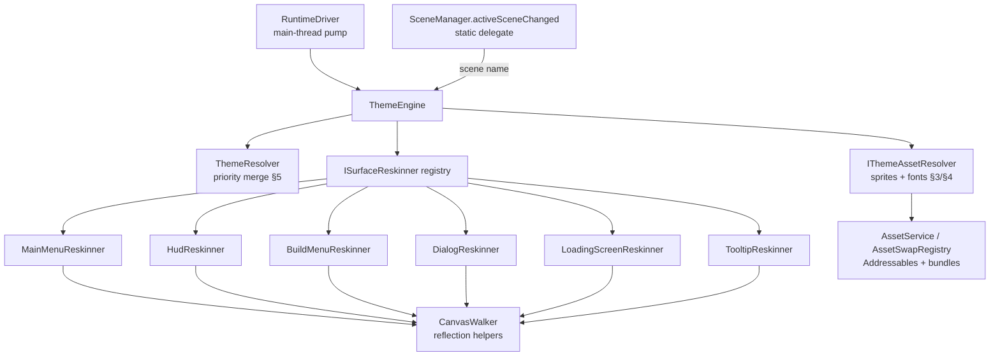
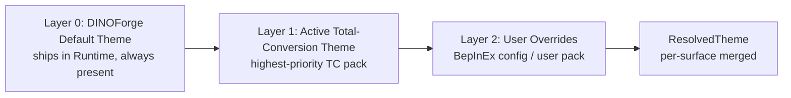

# Full Game UI/UX Reskin System

**Status:** Design / architectural spine for true total-conversion support
**Date:** 2026-05-28
**Owner:** DINOForge Runtime + SDK
**Supersedes/extends:** `src/Runtime/UI/MainMenuThemer.cs` (main-menu-only in-place reskin)

---

## 0. Problem & Goal

`MainMenuThemer` already proves the core mechanic works: walk a DINO `Canvas`, reflect
over `TMPro.TMP_Text` / `UnityEngine.UI.Text` / `Image` / `Selectable`, and rewrite text,
colors, and labels in-place — no compile-time TMPro reference, no asset bundle required for
the basics. DINO is **Unity 2021.3 ECS + BepInEx 5.4.23.5 (Mono CLR 4.0)**; its UI is
classic uGUI + TextMeshPro under runtime-built Canvases.

The goal of this system is to extend that single-surface proof into a **whole-game theme
engine** that restyles every UI surface — main menu, in-game HUD, build menu, unit
selection panels, resource bars, tooltips, pause menu, dialogs, loading screens — from one
declarative `ui_theme` block in the active total-conversion pack, with the cohesion of a
*Thrawn's Revenge* or *Red Rising* total conversion.

### Hard constraints (from DINO runtime execution model)

These are load-bearing and have killed prior iterations (see CLAUDE.md Pattern #233/#235,
MEMORY.md runtime facts). The ThemeEngine **must** respect them:

- **`MonoBehaviour.Update()` / `OnGUI()` never fire** — DINO replaces Unity's PlayerLoop.
  No per-frame theme reconciliation. Application is **event-driven only** (scene change +
  canvas-appearance polling on the existing Win32 / background thread).
- **`sceneLoaded` is unreliable; `SceneManager.activeSceneChanged` is the reliable hook**
  (iter-144 #546). The engine subscribes to `activeSceneChanged` (a static delegate that
  survives BepInEx Plugin object death — see Plugin.cs OnDestroy notes).
- **`Resources.FindObjectsOfTypeAll` from a background thread DEADLOCKS** during asset
  loading. All canvas walks happen **on the main thread** (inside a scene-change callback or
  the RuntimeDriver pump), never from the Win32 poll thread directly.
- **No compile-time TMPro / Addressables reference.** TextMeshPro and Unity Addressables
  types are resolved by reflection / `Type.GetType` against the loaded game assemblies, as
  `MainMenuThemer` already does. The Runtime DLL stays `netstandard2.0` (Pattern #233).
- **DINO uses Unity Addressables v1.21.18**, not classic AssetBundles, for game content; but
  *mod-supplied* UI bundles are loaded via `AssetService` / `AssetSwapRegistry` (AssetsTools.NET)
  and Addressables custom address keys. Sprite injection must work through both.

---

## 1. Theme Manifest Schema (`ui_theme` in `pack.yaml`)

`MainMenuThemer` currently parses a flat `ui_theme` block by hand (string scraping, see
`ExtractYamlValue`). We replace that with a **structured, schema-validated** block parsed by
YamlDotNet in the SDK (Pattern #1: wrap, don't handroll — reuse the existing pack loader),
and keep a hand-parse fallback in the Runtime for the netstandard2.0 plugin path.

New canonical schema: `schemas/ui_theme.schema.json` (registered in the 29-schema set).

```yaml
# pack.yaml (excerpt) — total_conversion pack
id: warfare-starwars
type: total_conversion
ui_theme:
  # ---- Identity / metadata ----
  display_name: "Clone Wars"
  priority: 100              # higher wins between competing total-conversion themes (see §5)

  # ---- Color palette (applied globally unless a surface overrides) ----
  palette:
    primary:    "#FFE81F"    # accent / highlight (Republic gold)
    secondary:  "#0B1B3A"    # panel fill / normal button
    accent:     "#C0392B"    # pressed / danger / alert
    text:       "#F5F5F5"    # body text
    text_muted: "#9AA4B2"    # secondary labels
    background_tint: "#02060FCC"   # 8-digit hex = RGBA; alpha honored

  # ---- Fonts ----
  fonts:
    primary:   "fonts/Aurebesh-Body"       # Addressables key OR bundle/asset path
    heading:   "fonts/Aurebesh-Display"
    monospace: "fonts/ShareTechMono"
    fallback_to_default: true              # keep DINO font metrics if asset missing

  # ---- Sprite replacements (panel frames, buttons, icons) ----
  sprites:
    # logical UI slot  ->  mod sprite source (Addressables key or bundle:asset)
    panel_frame:        "ui/panel_frame_republic"
    panel_frame_dark:   "ui/panel_frame_republic_dark"
    button_normal:      "ui/btn_normal"
    button_hover:       "ui/btn_hover"
    button_pressed:     "ui/btn_pressed"
    button_disabled:    "ui/btn_disabled"
    progress_fill:      "ui/bar_fill_gold"
    progress_track:     "ui/bar_track"
    tooltip_bg:         "ui/tooltip_frame"
    resource_food:      "icons/res_rations"
    resource_wood:      "icons/res_durasteel"
    # ... see §8 for the full required-sprite manifest

  # ---- Text rewrites (vanilla string -> themed string), per the existing label map ----
  rewrites:
    "New Game":   "New Campaign"
    "Continue":   "Resume Campaign"
    "Special Missions": "Clone Wars Missions"
    "Food":       "Rations"
    "Wood":       "Durasteel"

  # ---- Per-surface overrides ----
  # Each surface inherits palette/fonts/sprites above; keys here override per surface.
  surfaces:
    main_menu:
      title: "STAR WARS: Clone Wars"
      subtitle: "A Galaxy at War"
      background_image: "ui/menu_bg_coruscant"   # full-screen replacement, not just tint
    hud:
      palette: { primary: "#FFE81F" }
      sprites: { panel_frame: "ui/hud_frame_republic" }
    build_menu:
      sprites: { button_normal: "ui/buildcard_frame" }
    tooltip:
      fonts: { primary: "fonts/ShareTechMono" }
    loading_screen:
      background_image: "ui/loading_hyperspace"
      tip_text_color: "#FFE81F"
    pause_menu: {}
    unit_panel: {}
    resource_bar: {}
```

### Schema notes

- `palette`, `fonts`, `sprites`, `rewrites` are the **global defaults**.
- `surfaces.<name>.{palette,fonts,sprites,...}` are **shallow-merged over** the globals at
  theme-resolve time (§5), producing a fully-resolved `ResolvedSurfaceTheme` per surface.
- Color values accept `#RGB`, `#RRGGBB`, `#RRGGBBAA` (Unity `ColorUtility.TryParseHtmlString`).
- Sprite/font values are **source references**, resolved by `IThemeAssetResolver` (§3/§4) in
  priority order: Addressables key → `bundle:asset` → bare bundle filename (current
  `AssetSwapRegistry` convention).
- All keys optional. A theme supplying only `palette` reproduces today's MainMenuThemer
  behavior across *all* surfaces — graceful degradation (Principle #9).

### C# model (SDK, `net8.0` / netstandard2.0-compatible)

```csharp
namespace DINOForge.SDK.Models.Theme;

public sealed class UiTheme : IValidatable          // Pattern #210 validate-on-load
{
    public string DisplayName { get; init; } = "";
    public int Priority { get; init; } = 0;
    public ThemePalette Palette { get; init; } = new();
    public ThemeFonts Fonts { get; init; } = new();
    public IReadOnlyDictionary<string, string> Sprites { get; init; }
        = new Dictionary<string, string>(StringComparer.Ordinal);   // Pattern #99
    public IReadOnlyDictionary<string, string> Rewrites { get; init; }
        = new Dictionary<string, string>(StringComparer.Ordinal);
    public IReadOnlyDictionary<string, SurfaceOverride> Surfaces { get; init; }
        = new Dictionary<string, SurfaceOverride>(StringComparer.OrdinalIgnoreCase);

    public ValidationResult Validate() { /* color parse, dup keys, unknown surface names */ }
}

public sealed class ThemePalette
{
    public string Primary { get; init; } = "#FFE81F";
    public string Secondary { get; init; } = "#000000";
    public string Accent { get; init; } = "#C0392B";
    public string Text { get; init; } = "#FFFFFF";
    public string TextMuted { get; init; } = "#9AA4B2";
    public string? BackgroundTint { get; init; }
}

public sealed class ThemeFonts
{
    public string? Primary { get; init; }
    public string? Heading { get; init; }
    public string? Monospace { get; init; }
    public bool FallbackToDefault { get; init; } = true;
}

public sealed class SurfaceOverride
{
    public string? Title { get; init; }
    public string? Subtitle { get; init; }
    public string? BackgroundImage { get; init; }
    public ThemePalette? Palette { get; init; }      // partial; null fields inherit
    public ThemeFonts? Fonts { get; init; }
    public IReadOnlyDictionary<string, string>? Sprites { get; init; }
}
```

Known surface names (enum-style, validated): `main_menu`, `hud`, `build_menu`,
`unit_panel`, `resource_bar`, `tooltip`, `pause_menu`, `loading_screen`, `dialog`,
`minimap`, `notification`.

---

## 2. ThemeEngine Architecture

The ThemeEngine is a **runtime service owned by RuntimeDriver** (the long-lived object that
outlives the BepInEx Plugin wrapper). It replaces `MainMenuThemer` as the single entry point;
`MainMenuThemer` becomes one *surface adapter* among many.



### Core types

```csharp
namespace DINOForge.Runtime.UI.Theme;

/// Long-lived, main-thread-only theme orchestrator. Owned by RuntimeDriver.
internal sealed class ThemeEngine
{
    private readonly ManualLogSource _log;
    private readonly IReadOnlyList<ISurfaceReskinner> _reskinners;
    private readonly IThemeAssetResolver _assets;
    private ResolvedTheme? _active;          // resolved once when pack set changes
    private readonly HashSet<int> _styledCanvasIds = new();   // dedupe (§6)
    private string _lastScene = "";

    public ThemeEngine(ManualLogSource log, IThemeAssetResolver assets,
                       IEnumerable<ISurfaceReskinner> reskinners) { ... }

    /// Called when the loaded pack set changes (boot, hot-reload). Re-resolves the theme.
    public void SetActiveTheme(ResolvedTheme? theme)
    {
        _active = theme;
        _styledCanvasIds.Clear();     // force re-apply on next tick
    }

    /// MAIN THREAD ONLY. Called from RuntimeDriver pump and on scene change.
    /// Cheap when nothing new appeared (§6).
    public void Tick(string currentScene)
    {
        if (_active == null) return;
        if (currentScene != _lastScene) { _styledCanvasIds.Clear(); _lastScene = currentScene; }

        // Walk currently-active canvases ONCE; skip any already styled this scene.
        foreach (var canvas in CanvasWalker.ActiveCanvases())
        {
            int id = canvas.GetInstanceID();
            if (_styledCanvasIds.Contains(id)) continue;

            foreach (var r in _reskinners)
            {
                if (r.Matches(canvas))
                {
                    try { r.Apply(canvas, _active, _assets, _log); }
                    catch (Exception ex) { _log.LogWarning($"[ThemeEngine] {r.Surface} failed: {ex.Message}"); }
                }
            }
            _styledCanvasIds.Add(id);
        }
    }

    /// From SceneManager.activeSceneChanged (static delegate -> RuntimeDriver -> here).
    public void OnSceneChanged(string newScene) { _styledCanvasIds.Clear(); _lastScene = newScene; }
}
```

### Surface reskinner contract

Each UI surface gets its own reskinner. This is the extension seam (Pattern #125: ship a
test double `FakeSurfaceReskinner`). New surfaces = new `ISurfaceReskinner`, no engine change.

```csharp
internal interface ISurfaceReskinner
{
    string Surface { get; }                  // "hud", "build_menu", ... (matches schema key)

    /// Identify whether this canvas (or a child object on it) is this reskinner's surface.
    /// Detection is by canvas name / known child component type-name / well-known object path.
    bool Matches(Canvas canvas);

    /// Apply the resolved theme to this canvas in-place. Idempotent. Main thread only.
    void Apply(Canvas canvas, ResolvedTheme theme, IThemeAssetResolver assets, ManualLogSource log);
}
```

### Finding & hooking each surface

DINO builds Canvases at runtime with stable-ish names; detection is **name + component-type
heuristics**, exactly the pattern `FindMainMenuCanvas()` already uses. Each reskinner owns a
small detection rule. Recommended detectors (to be confirmed against live `ui-tree` dumps via
the `dinoforge ui-tree` CLI / `game_ui_automation` MCP tool — do not hardcode blind):

| Surface | Detection heuristic |
|---|---|
| `main_menu` | Canvas name contains `MainMenu`, excludes `PrimeCanvas` (existing rule) |
| `hud` | Canvas active during gameplay scene + child object names contain `Resource`/`Hud`/`TopBar`; or presence of a resource-counter TMP_Text |
| `resource_bar` | Sub-region of HUD — child path `*/ResourcePanel/*` or repeated icon+count layout groups |
| `build_menu` | Canvas/panel with grid of build cards; child names `Build*`, `Construction*` |
| `unit_panel` | Panel shown on selection; names `Selection*`, `UnitInfo*`, presence of health/portrait widgets |
| `tooltip` | Short-lived object name `Tooltip*` / `Hint*`; styled on appearance (re-checked each Tick because it's created on hover) |
| `pause_menu` | Canvas name `Pause*`/`InGameMenu*`, appears on Esc |
| `loading_screen` | Active during the loading scene; large background Image + progress bar; tip TMP_Text |
| `dialog` | Modal `Dialog*`/`Popup*`/`MessageBox*` canvases |

Detection rules live as data so they can be tuned without recompiling:
`ThemeEngine` loads `surface_detectors.json` (shipped with the default DINOForge theme),
allowing override per game patch.

### Re-application on scene change

1. `SceneManager.activeSceneChanged` (subscribed once, static, survives Plugin death — see
   Plugin.cs §`StartResurrectionWatcher`) → forwards `(oldScene, newScene)` to
   `RuntimeDriver`, which calls `ThemeEngine.OnSceneChanged(newScene.name)`.
2. `OnSceneChanged` clears `_styledCanvasIds` so every canvas is re-evaluated in the new
   scene (canvases are recreated per scene).
3. `RuntimeDriver`'s existing main-thread pump calls `ThemeEngine.Tick(currentScene)` each
   pump iteration. Tick is cheap when nothing new appeared (§6) — it only walks *active*
   canvases and skips already-styled instance IDs.
4. Transient surfaces (tooltip, dialog, unit panel) are created **after** the scene loads,
   on user interaction. Because they were never in `_styledCanvasIds`, the next `Tick` picks
   them up the first time they appear. This is why detection runs every Tick, not once.

This reuses MainMenuThemer's exact lifecycle idea (`OnSceneChanged() => _applied = false`)
generalized to per-canvas dedupe.

---

## 3. Sprite Replacement Strategy

Two complementary mechanisms; the engine prefers (A) and falls back to (B).

### (A) Slot-based replacement (preferred, declarative)

The theme maps **logical UI slots** (`panel_frame`, `button_normal`, `progress_fill`, …) to
mod sprite sources. Each reskinner knows which `Image` components on its surface correspond to
which slot (by object name / sibling structure) and swaps `Image.sprite` for the resolved
mod `Sprite`. This is robust and intentional.

```csharp
internal interface IThemeAssetResolver
{
    /// Resolve a sprite source ref ("ui/panel_frame" | "bundle:asset" | "bundle") to a Unity Sprite.
    /// Cached. Returns null if not found (caller leaves the vanilla sprite — graceful degrade).
    Sprite? ResolveSprite(string sourceRef);

    /// Resolve a TMP_FontAsset (boxed as object — no compile-time TMPro ref). Cached.
    object? ResolveFont(string sourceRef);

    /// Full-screen background texture/sprite for menu/loading.
    Sprite? ResolveBackground(string sourceRef);
}
```

```csharp
// inside a reskinner:
void ApplyPanelFrames(Canvas canvas, ResolvedSurfaceTheme t, IThemeAssetResolver assets)
{
    Sprite? frame = t.Sprites.TryGetValue("panel_frame", out var refStr)
        ? assets.ResolveSprite(refStr) : null;
    if (frame == null) return;                  // keep vanilla — graceful

    foreach (var img in CanvasWalker.Images(canvas))
    {
        if (CanvasWalker.NameMatches(img, "Panel", "Frame", "Window", "Background"))
        {
            img.sprite = frame;
            img.type = Image.Type.Sliced;       // honor 9-slice borders for frames
        }
    }
}
```

### (B) Sprite-name remap (fallback, broad)

For surfaces where slot mapping is unknown, the resolver can do a **name-keyed remap**: walk
every `Image`, read its current `sprite.name`, and if the theme supplies a sprite keyed by
that vanilla name, swap it. This is the "catch-all" that gives broad coverage without per-slot
knowledge, at the cost of precision. Used as a second pass after (A).

```csharp
foreach (var img in CanvasWalker.Images(canvas))
{
    string? vanillaName = img.sprite?.name;
    if (vanillaName != null && theme.SpriteByVanillaName.TryGetValue(vanillaName, out var modRef))
    {
        var s = assets.ResolveSprite(modRef);
        if (s != null) img.sprite = s;
    }
}
```

### Source resolution order (in `IThemeAssetResolver`)

A `sourceRef` resolves in this order, mirroring `AssetSwapRegistry`'s existing conventions:

1. **Addressables key** — `Type.GetType("UnityEngine.AddressableAssets.Addressables")` →
   `LoadAssetAsync<Sprite>(key)` via reflection (DINO ships Addressables v1.21.18). Used for
   sprites packaged into an Addressables group.
2. **`bundle:asset`** — load mod AssetBundle from `packs/<id>/assets/bundles/<bundle>`,
   then `bundle.LoadAsset<Sprite>(asset)`.
3. **bare bundle name** — `bundle.LoadAllAssets()` and take the first `Sprite` (the existing
   AssetSwapSystem name-mismatch fallback).
4. **raw PNG** — `packs/<id>/assets/ui/<name>.png` → `Texture2D.LoadImage` →
   `Sprite.Create`. Lowest-friction path for modders; no Unity 2021.3 bundle build needed for
   simple flat UI sprites. (Bundles still required for 9-slice metadata / atlases.)

All loaded sprites are cached by `sourceRef` in the resolver (§6). Bundles are loaded once and
kept open for the session.

> **9-slice note:** Panel frames must scale without distortion. Mod sprites for frame slots
> should be imported with border metadata (only AssetBundle path preserves `Sprite.border`);
> the reskinner sets `Image.type = Sliced`. For raw-PNG sprites, the theme may declare borders
> in the manifest: `panel_frame: { src: "ui/frame.png", border: [12,12,12,12] }`.

---

## 4. Font Replacement

DINO renders text with **TextMeshPro** (`TMP_Text` family). To reskin fonts we load a
mod-supplied **`TMP_FontAsset`** and assign it to every `TMP_Text.font`. Because the Runtime
DLL has no compile-time TMPro reference, everything is reflection.

### Loading the font asset

A `TMP_FontAsset` is a Unity object and **must be shipped inside an AssetBundle built with
Unity 2021.3.45f2** (matching the game; see CLAUDE.md "Asset Bundle Creation"). You cannot
synthesize a TMP_FontAsset from a raw `.ttf` at runtime reliably on Mono — so the mod supplies
a prebuilt font asset.

```csharp
object? ResolveFont(string sourceRef)   // returns boxed TMPro.TMP_FontAsset
{
    if (_fontCache.TryGetValue(sourceRef, out var cached)) return cached;

    // load via AssetSwapRegistry/AssetService -> AssetBundle.LoadAsset(name, tmpFontAssetType)
    Type? tmpFontType = Type.GetType("TMPro.TMP_FontAsset, Unity.TextMeshPro");
    UnityEngine.Object? loaded = _assetService.LoadFromBundle(sourceRef, tmpFontType);
    _fontCache[sourceRef] = loaded;
    return loaded;
}
```

### Swapping fonts everywhere

```csharp
void ApplyFont(Canvas canvas, object tmpFontAsset)   // tmpFontAsset boxed TMP_FontAsset
{
    foreach (var comp in canvas.GetComponentsInChildren<Component>(true))
    {
        if (comp == null) continue;
        var ct = comp.GetType();
        if (!(ct.FullName ?? "").StartsWith("TMPro.")) continue;
        var fontProp = ct.GetProperty("font");      // TMP_Text.font : TMP_FontAsset
        if (fontProp != null && fontProp.PropertyType.IsInstanceOfType(tmpFontAsset))
            fontProp.SetValue(comp, tmpFontAsset);
    }
}
```

Heading vs body vs monospace fonts are applied **per reskinner** using the surface's resolved
`fonts` block: titles get `fonts.heading`, body text gets `fonts.primary`, numeric/resource
counters can opt into `fonts.monospace`. The reskinner decides per object (title detection
already exists in `ReplaceTitle`).

**Material caveat:** TMP renders through a font's material preset. Swapping `.font` swaps the
material automatically, but custom outline/glow shaders shipped with the mod font are honored
only if baked into the font asset's default material. Document this in the modder guide.

**Graceful degrade:** if `fonts.fallback_to_default` is true (default) and the font fails to
load, leave the vanilla font — text still renders, only the typeface differs.

---

## 5. Priority / Layering

Three theme layers, resolved into one `ResolvedTheme` by `ThemeResolver`:



- **Layer 0 — DINOForge default.** A baked-in `UiTheme` so DINOForge surfaces (mod menu,
  F10 panel, overlays) always have a coherent look even with no mod active. Lowest priority.
- **Layer 1 — Active total-conversion theme.** Among loaded `type: total_conversion` packs
  that declare `ui_theme`, pick the one with the **highest `priority`** (ties broken by load
  order, then pack id). This generalizes MainMenuThemer's current "first TC pack with
  `ui_theme:`" selection into an explicit, deterministic rule.
- **Layer 2 — User overrides.** A user pack (`type: utility`) or BepInEx config entries
  (e.g. `[UiTheme] OverridePrimaryColor=#FF0000`) layered on top. Lets a player retint without
  editing the mod. Highest priority.

### Merge algorithm

```csharp
ResolvedTheme Resolve(IReadOnlyList<UiTheme> layersLowToHigh)
{
    // 1. Merge globals: each higher layer's non-null fields override.
    var palette = MergePalette(layersLowToHigh.Select(l => l.Palette));
    var fonts   = MergeFonts(layersLowToHigh.Select(l => l.Fonts));
    var sprites = MergeDict(layersLowToHigh.Select(l => l.Sprites));    // last writer wins
    var rewrites= MergeDict(layersLowToHigh.Select(l => l.Rewrites));

    // 2. For each known surface, shallow-merge surface overrides OVER merged globals.
    var resolvedSurfaces = new Dictionary<string, ResolvedSurfaceTheme>(StringComparer.OrdinalIgnoreCase);
    foreach (var surface in KnownSurfaces)
    {
        var ov = layersLowToHigh.Select(l => l.Surfaces.GetValueOrDefault(surface));
        resolvedSurfaces[surface] = new ResolvedSurfaceTheme(
            palette: MergePalette(palette, ov.Select(o => o?.Palette)),
            fonts:   MergeFonts(fonts,     ov.Select(o => o?.Fonts)),
            sprites: MergeDict(sprites,    ov.Select(o => o?.Sprites)),
            title:   LastNonNull(ov.Select(o => o?.Title)),
            background: LastNonNull(ov.Select(o => o?.BackgroundImage)));
    }
    return new ResolvedTheme(resolvedSurfaces, rewrites);
}
```

Resolution happens **once** when the loaded pack set changes (boot / `game_reload_packs`
hot-reload), not per Tick. The resolved theme is immutable (Pattern #123 — `IReadOnly`).

---

## 6. Performance

The cardinal rule: **no per-frame work** (and `Update()` wouldn't fire anyway). Concrete
measures:

1. **Event-driven application.** Themes apply on scene change and on first appearance of a
   canvas, never on a timer-per-frame. `ThemeEngine.Tick` is invoked from RuntimeDriver's
   existing pump but early-exits in O(active-canvas-count) when nothing new appeared.
2. **Per-canvas dedupe.** `_styledCanvasIds` (instance-id `HashSet`) ensures each canvas is
   walked exactly once per scene. Cleared only on `OnSceneChanged`. A styled HUD canvas is
   never re-walked.
3. **Resolve once.** `ResolvedTheme` is computed when packs change, not on each apply.
4. **Asset cache.** `IThemeAssetResolver` caches sprites and fonts by `sourceRef`. Bundles
   are opened once and held for the session (`AssetService` already manages handles;
   Pattern #102 — dispose on plugin teardown). Addressables handles released on scene unload.
5. **Bounded walks.** Reuse `GetComponentsInChildren<T>(true)` (one allocation per surface
   per scene, not per frame). Pre-size any `StringBuilder` used for diagnostics (Pattern #117).
   Avoid `FindObjectsOfType` except for top-level canvas discovery, and **never** off the main
   thread (deadlock risk).
6. **Transient-surface throttle.** Tooltip/dialog detection runs each Tick but is cheap: it
   checks only currently-active canvases and a styled-id set membership. A tooltip canvas, once
   styled, is skipped until it's destroyed and recreated (new instance id).
7. **No Harmony per-instance hooks for styling.** Styling is pull-based on appearance, not a
   patched constructor on every UI widget — avoids the per-widget overhead and the fragility
   of patching DINO internals (Agent rule: don't patch runtime internals for non-runtime work).

Target budget: theme application for a freshly-loaded gameplay scene < 16ms total
(one frame), amortized to ~0 thereafter. Measure with the existing F9 GC/frame overlay.

---

## 7. Build Sequence (Recommended, Ordered Phases)

Each phase is independently shippable and verifiable in-game (capture screenshot + external
judge receipt per `feedback_self_judging_proof_is_not_proof`). Surfaces are ordered by
**visibility-per-effort** and by detection difficulty.

### Phase 0 — Schema + resolver foundation (no visible change)
- Add `schemas/ui_theme.schema.json` + SDK `UiTheme`/`ResolvedTheme` models + `ThemeResolver`
  + validation tests. Wire YamlDotNet parse in the pack loader (keep Runtime hand-parse).
- Build `IThemeAssetResolver` (sprite/font/background resolution + cache) over `AssetService`.
- Unit + parameterized tests; no game launch needed. **Gate: `dotnet test` green.**

### Phase 1 — Refactor MainMenu into the engine (parity, no regression)
- Introduce `ThemeEngine` + `ISurfaceReskinner`. Reimplement today's `MainMenuThemer` as
  `MainMenuReskinner` driven by `ResolvedTheme`. RuntimeDriver owns `ThemeEngine` and calls
  `Tick` from the pump + `OnSceneChanged` from the static scene delegate.
- **Verify:** main menu looks identical to today (iter-146 MODS-button + title reskin still
  works). Screenshot diff against `docs/screenshots/iter146_mods_button_verified.png`.

### Phase 2 — In-game HUD + resource bar (highest visible impact)
- `HudReskinner` + `ResourceBarReskinner`: palette + panel frames + resource icons + fonts.
- This is where a total conversion *feels* total — it's on screen the whole match.
- **Verify:** launch gameplay scene, screenshot HUD, external judge confirms themed frames +
  icons + recolored resource counters.

### Phase 3 — Build menu + unit selection panel
- `BuildMenuReskinner` (build-card frames, hover/pressed sprites) + `UnitPanelReskinner`
  (portrait frame, health-bar fill sprite, panel background).
- These appear on interaction → exercises the transient-surface detection path.

### Phase 4 — Dialogs + pause menu
- `DialogReskinner` + `PauseMenuReskinner`: modal frames, buttons, text. Mostly reuses the
  selectable/label/font logic already generalized in Phase 1.

### Phase 5 — Tooltips + notifications (transient, fast-appearing)
- `TooltipReskinner` + `NotificationReskinner`: validates the per-Tick reapply for very
  short-lived canvases. Tune `surface_detectors.json` against live `ui-tree` dumps.

### Phase 6 — Loading screens + full-screen backgrounds
- `LoadingScreenReskinner`: full-screen `background_image` swap (not just tint), themed tip
  text + progress bar fill sprite. Hooks the loading scene via `activeSceneChanged`.

### Phase 7 — User-override layer + polish
- BepInEx config override entries (Layer 2), per-surface override docs, the `dinoforge`
  CLI `theme preview`/`theme validate` commands, and the asset manifest scaffolding in
  `dinoforge new --total-conversion`.

> Rationale: Phase 1 protects the working main menu; Phase 2 delivers the biggest perceived
> "total conversion" payoff first; transient/edge surfaces (3–6) come after the detection
> engine is proven; user overrides + tooling last.

---

## 8. Asset Manifest — UI Sprites a Mod Must Supply

For a **complete** reskin, a total-conversion pack supplies the following under
`packs/<id>/assets/ui/` (raw PNG acceptable for flat sprites; AssetBundle required where
9-slice borders or a TMP font asset are needed). All are optional — any omitted slot keeps the
vanilla sprite (graceful degrade), but the list below is the target for full cohesion.

### Frames & panels (9-slice, bundle recommended)
| Slot key | Purpose |
|---|---|
| `panel_frame` | Generic window/panel border |
| `panel_frame_dark` | Secondary/inset panel |
| `hud_frame` | In-game HUD container frame |
| `tooltip_bg` | Tooltip background frame |
| `dialog_frame` | Modal dialog frame |
| `unit_portrait_frame` | Selected-unit portrait border |

### Buttons (4 states each)
| Slot key | State |
|---|---|
| `button_normal` | Default |
| `button_hover` | Highlighted |
| `button_pressed` | Pressed |
| `button_disabled` | Disabled |
| `buildcard_frame` | Build-menu card background |

### Bars & meters
| Slot key | Purpose |
|---|---|
| `progress_fill` | Generic fill (build/research) |
| `progress_track` | Bar background track |
| `health_fill` | Unit/building health fill |
| `health_track` | Health background |

### Icons — resources (match DINO's resource set; rename via `rewrites`)
| Slot key | Vanilla concept |
|---|---|
| `resource_food` | Food/rations |
| `resource_wood` | Wood/material |
| `resource_stone` | Stone |
| `resource_gold` | Gold/credits |
| `resource_population` | Population/supply |

### Icons — actions / status
| Slot key | Purpose |
|---|---|
| `icon_attack` / `icon_defend` / `icon_move` / `icon_stop` | Command icons |
| `icon_build` / `icon_research` / `icon_upgrade` | Economy icons |
| `cursor_default` / `cursor_attack` / `cursor_build` | Optional cursor set |

### Full-screen art (raw PNG/JPG fine)
| Slot key | Purpose |
|---|---|
| `menu_bg` | Main-menu background |
| `loading_bg` | Loading-screen background |
| `logo` | Title/brand logo |

### Fonts (AssetBundle, Unity 2021.3.45f2 — **required**, cannot be raw .ttf at runtime)
| Slot key | Purpose |
|---|---|
| `font_primary` | Body text TMP_FontAsset |
| `font_heading` | Title/heading TMP_FontAsset |
| `font_monospace` | Numeric/counter TMP_FontAsset (optional) |

A `dinoforge new --total-conversion <id>` scaffold should emit this directory skeleton with
placeholder PNGs and a fully-populated `ui_theme` block so modders fill in the blanks and run
the standard asset pipeline (`assets import → validate → optimize → build`).

---

## 9. Open Questions / Validation TODOs

- **Live detection accuracy:** all surface detectors (§2 table) are heuristics and MUST be
  confirmed against real `dinoforge ui-tree` / `game_ui_automation` dumps before each phase —
  do not ship blind name guesses. Capture dumps for HUD/build/unit/tooltip first.
- **DINO resource set:** confirm the actual resource names/count in-game to finalize the
  `resource_*` slot list (the table above is a placeholder set).
- **Addressables sprite injection:** verify `Addressables.LoadAssetAsync<Sprite>` over
  reflection works for *mod-added* keys (vs only game keys) — fall back to bundle path if not.
- **TMP material/shader fidelity:** confirm outline/glow on swapped fonts; document the
  bake-into-default-material requirement.
- **Tests:** ship `FakeSurfaceReskinner` + `FakeThemeAssetResolver` test doubles (Pattern
  #125); FsCheck the merge algorithm (§5) for associativity/last-writer-wins.
```

