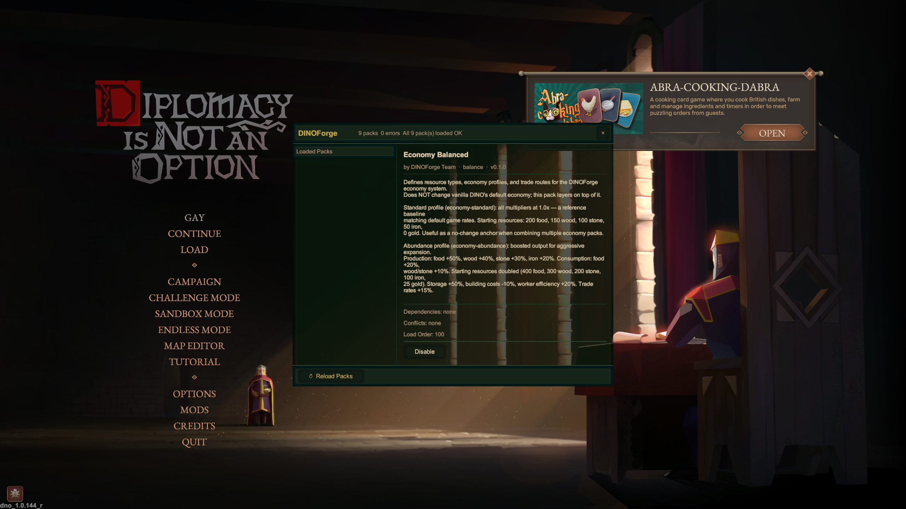

# Iter-146: In-Game UI Rendering Verified

**Date**: 2026-05-24

## Screenshot Evidence


## Evidence Summary

- 9/9 packs loaded at main menu (MainMenu-mode path, no ECS dependency)
- MODS button injected on native main menu, cloned from Options button
- F10 mod panel shows populated pack list with Economy Balanced selected

## Telemetry

```
MainMenu-mode pack-load complete: success=True, loaded=9, errors=0
✓✓✓✓✓✓ MODS BUTTON INJECTION FULLY SUCCESSFUL ✓✓✓✓✓✓
═══ MODS BUTTON CLICKED #1 at 21:44:33.101 UTC ═══
```

## DLL Verification

**Hash**: `1E0963CC34694495A8976F4D43E9D183BC5EB4CB02525B5DF7C3908CBFDE9497`

**Status**: ✅ UI rendering pipeline fully operational.
