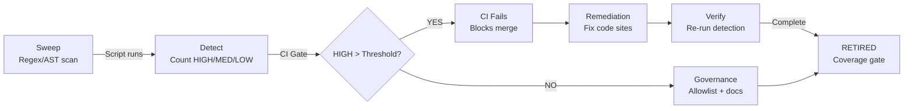

# DINOForge Pattern Catalog (Full Reference)

The Pattern Catalog documents recurring failure modes, code smells, and architectural anti-patterns detected across the DINOForge codebase. Each pattern records its **Smell** (observable code characteristic), **Why bad** (impact/risk), **Detection** (automated script/analyzer + CI threshold), and **Governance** (remediation + allowlist policy).

> A compact summary table of active patterns lives in `CLAUDE.md`. This file holds the full prose. When adding/retiring a pattern, update both.

## Pattern Catalog Lifecycle



---

### Pattern #99: Unprotected `Dictionary<string, T>` Without `StringComparer`

**Smell**: `Dictionary<string, T>` constructed without an explicit `StringComparer` argument in the constructor.

**Why bad**: The default comparer is `StringComparer.Ordinal` (case-sensitive), but this contract is implicit and silent. Future refactoring to `StringComparer.OrdinalIgnoreCase` silently breaks all lookups for case-mismatched keys. Readers assume the default is culture-aware, creating a mismatch between intent and behavior.

**Detection**: `scripts/ci/detect_unprotected_string_dict.py` — scans `src/` (excluding Tests/, bin/, obj/) for `Dictionary<string, T>` declarations lacking `StringComparer.Ordinal` or `StringComparer.OrdinalIgnoreCase` within 3 lines of the declaration. Severity: HIGH if no comparer; MED if comparer found. Threshold: CI fails if HIGH count exceeds 10.

**Governance**: For user-sourced keys (pack IDs, JSON property names, unit IDs, faction names), use `new Dictionary<string, T>(StringComparer.Ordinal)`. For UI-facing case-insensitive lookups (e.g. command palette, config overrides), use `new Dictionary<string, T>(StringComparer.OrdinalIgnoreCase)`. NEVER rely on the implicit default. Allowlist via `docs/qa/string-dict-allowlist.txt` or inline `// string-dict-ok: <reason>` marker.

### Pattern #100: Direct `DateTime.Now` / `DateTime.UtcNow` in SDK API Surface

**Smell**: SDK NuGet-published models or utility classes use `DateTime.UtcNow` / `DateTime.Now` directly instead of threaded `TimeProvider`.

**Why bad**: Published API users cannot mock or control time in tests. Deadlines, cache TTLs, and time-sensitive assertions become untestable without `Thread.Sleep`. `TimeProvider` is the .NET 8+ standard for injectable time sources; bypassing it locks the code to a real clock.

**Detection**: `scripts/ci/detect_direct_datetime.py` (scoped to `src/SDK/`, `src/Bridge/Protocol/`) — flags any `DateTime.Now` / `DateTime.UtcNow` outside `TimeProvider`-injected pathways.

**Governance**: SDK utility methods and model validators accept optional `TimeProvider? timeProvider = null` constructor/parameter, defaulting to `TimeProvider.System`. Replace `DateTime.UtcNow` with `_timeProvider.GetUtcNow().UtcDateTime`. Logging-only timestamps (human display, no control flow) are exempt.

### Pattern #101: Stringly-Typed Enum Discriminator

**Smell**: Public model fields or schema keys typed as `string` for what should be enum values (e.g., `public string Role { get; set; }` accepting `"Tank"` / `"Healer"` as strings instead of `Role.Tank` enum).

**Why bad**: No compile-time validation. Typos in config files ("Heler" vs "Healer") fail silently at load time. Refactoring enum values breaks all calling code in opaque ways. JSON round-tripping requires manual converter boilerplate.

**Detection**: `scripts/ci/detect_stringly_enums.py` — flags model fields typed as `string` in `src/SDK/Models/` and schema-published types where an enum constant exists with the same name.

**Governance**: Migrate to `[JsonConverter(typeof(JsonStringEnumConverter))]` enum types. For YAML schema properties, use `enum: [value1, value2]` with `type: string` to document valid values explicitly in the schema.

### Pattern #102: Orphan Process Handle Leakage

**Smell**: `Process.Start(...)` called without assignment to a `using` variable or without explicit `Dispose()`, leaving the process handle open.

**Why bad**: Process handles are a limited OS resource (~64K per process). Each leaked handle reduces the pool. Repeated spawns (CLI batch operations, pack compilation, tool invocations) exhaust the handle table, causing new `Process.Start()` calls to fail with "Too many open files" / "Cannot open process" errors. Handles linger indefinitely even after the child process exits.

**Detection**: `scripts/ci/detect_orphan_process_start.py` — flags `Process.Start(...)` not in a `using` statement or `try`/`finally` disposal chain.

**Governance**: Wrap in `using var p = Process.Start(...); ... p.WaitForExit();` so the handle is released even if WaitForExit is skipped. Pair with proper exception handling so failed waits don't suppress Dispose.

### Pattern #103: Local-Time Logging Drift

**Smell**: Log timestamps use `DateTime.Now` (local wall-clock time) instead of `DateTime.UtcNow`, especially in multi-timezone environments or logs read across regions.

**Why bad**: Log timestamps become ambiguous when DST transitions occur or when logs are aggregated from different timezones. Correlating logs with external events (CI build timestamps, Git commit times, metrics feeds) requires mental time-zone conversion. UTC is machine-readable and unambiguous.

**Detection**: `scripts/ci/detect_local_time_logging.py` — flags `DateTime.Now` / `.Now.ToString(...)` in logging call sites (`.Log*()`, `_logger.*`, `Console.WriteLine`).

**Governance**: Always log in UTC: `DateTime.UtcNow.ToString("O")` or structured logging with `DateTimeOffset.UtcNow`. Format for human display only at the read site (dashboards, CLI output) — never store display-formatted timestamps in logs.

### Pattern #104: Catch-Swallow-Default Erasure

**Smell**: Exception caught and silently swallowed, replaced with a default return value: `try { ... } catch { return null; }` / `return default;` / `return false;` with no logging or rethrow.

**Why bad**: Loses the error cause entirely. Caller cannot distinguish "operation succeeded with a null result" from "operation failed"; null becomes overloaded with failure semantics. Debugging traces vanish. Callers must guess whether to retry, escalate, or treat null as a normal value.

**Detection**: `scripts/ci/detect_catch_swallow_default.py` (pending #303) — flags catch blocks that return null/default/false without logging the exception.

**Governance**: Surface the exception via `Result<T>`, `ILogger.LogWarning(ex, "context")`, or rethrow as a wrapped exception (new `InvalidOperationException("...", ex)`). If the swallow is intentional (e.g. try-parse), use an explicit marker: `// deliberate-swallow: reason` + allowlist entry.

### Pattern #105: Event-Subscription Lifecycle Asymmetry

**Smell**: Event handler subscribed with `EventX += handler` but never unsubscribed in the corresponding `OnDestroy()` / `Dispose()` / detach lifecycle hook.

**Why bad**: Subscribed handlers stay alive even after the subscriber is destroyed, keeping it rooted in memory (memory leak). Event fires on deleted objects, causing NullReferenceException or silent corruption. Repeated subscribe/destroy cycles leak memory and event delegate chains grow unbounded.

**Detection**: `scripts/ci/detect_event_lifecycle_asymmetry.py` (pending #308) — cross-references += and -= occurrences in class pairs for each public event.

**Governance**: Every `+=` MUST have a corresponding `-=` in OnDestroy / Dispose / detach method. Use a helper pattern: `void OnEnable() => EventX += Handler;` paired with `void OnDisable() => EventX -= Handler;` or constructor/Dispose for non-MonoBehaviour classes. Pairs with Pattern #85 (weak events for cross-boundary subscriptions).

### Pattern #106: Implicit `File.ReadAllText` Encoding

**Smell**: `File.ReadAllText(path)` called without explicit `Encoding` parameter, using the .NET framework's default (usually UTF-8 on recent runtimes, but context-dependent).

**Why bad**: Malformed UTF-8 sequences in config files (BOM stripping errors, mojibake from legacy systems) cause `DecoderFallbackException` or silent character corruption. Default encoding varies across platforms (.NET Framework vs. .NET Core) and regions. CI passes (UTF-8 strict) but user machines fail (locale-default encoding).

**Detection**: `scripts/ci/detect_implicit_encoding.py` (pending #313) — flags `File.ReadAllText(` without an `Encoding.*` argument.

**Governance**: Use `SafeFileIO.ReadText(path)` helper (UTF-8 strict, throws on invalid bytes) or pass `Encoding.UTF8` explicitly: `File.ReadAllText(path, Encoding.UTF8)`. Document in a comment why UTF-8 is correct for that file (YAML/JSON spec, domain requirement, etc.).

### Pattern #107: `BuildServiceProvider` Without `ValidateOnBuild`

**Smell**: .NET DI ServiceCollection's `BuildServiceProvider()` called without passing `new ServiceProviderOptions { ValidateOnBuild = true }`.

**Why bad**: Dependency graph errors (missing registrations, circular dependencies, unregistered factories) are discovered at first resolution, not build time — often minutes into a test run or user scenario. `ValidateOnBuild = true` catches these synchronously during setup, failing fast and early. Tests and CI catch breakage before release.

**Detection**: `scripts/ci/detect_unvalidated_di.py` (pending #316) — flags `.BuildServiceProvider()` or `.BuildServiceProvider(options)` where options does not include `ValidateOnBuild = true`.

**Governance**: Use `new ServiceProviderOptions { ValidateOnBuild = true, ValidateScopes = true }` for all non-trivial DI containers. Simple one-liners can be exempted with `// di-no-validation-ok: <reason>`.

### Pattern #108: Sleep-Based Test Sync

**Smell**: Unit or integration tests use `await Task.Delay(N)` (blocking sleep) to wait for async operations or state transitions before assertions.

**Why bad**: Fragile across environments: test passes locally on a fast machine (sleep 100ms, operation finishes in 50ms) but flakes on CI with resource contention. Multiplies wall-clock time: 20 tests × 100ms sleeps = 2+ seconds per run. Non-deterministic — sometimes passes, sometimes fails. If the delay is too short, flakes; if too long, wastes time.

**Detection**: `scripts/ci/detect_test_sleep_sync.py` (pending #322) — flags `await Task.Delay(...)` in `src/Tests/**/*.cs` outside exempted categories (performance benchmarks, stress tests).

**Governance**: Use `TestWait.UntilAsync(predicate, timeout, pollInterval)` helper instead — adaptive polling returns immediately when predicate matches, polls at configurable intervals, fails with timeout. Example: `await TestWait.UntilAsync(() => entity.Health == 0, timeout: TimeSpan.FromSeconds(5), pollInterval: 50ms)`.

### Pattern #109: Inline `JsonSerializerOptions` Construction

**Smell**: Per-call-site `new JsonSerializerOptions { ... }` literals scattered across CLI, PackCompiler, and Installer code instead of project-scoped static holders.

**Why bad**: Settings drift silently — one site enables `PropertyNameCaseInsensitive`, another doesn't; one uses `JsonStringEnumConverter`, another emits ints. Round-trip parity (write site A, read site B) breaks invisibly at runtime.

**Detection**: `scripts/ci/detect_inline_json_options.py` — flags `new JsonSerializerOptions` in non-test files outside whitelisted static holders. Allowlist via `docs/qa/inline-json-options-allowlist.txt`.

**Governance**: Each project that serializes/deserializes JSON owns ONE static holder class (`CliJsonOptions`, `PackCompilerJsonOptions`, `InstallerJsonOptions`) exposing `public static JsonSerializerOptions Default { get; }`. All call sites read from the holder; never instantiate options locally. Round-trip golden tests verify symmetry.

### Pattern #110: Open-Ended Count Assertion

**Smell**: `Should().HaveCountGreaterThan(N)`, `Count.Should().BeGreaterThan(N)`, etc., where exact fixture cardinality is knowable.

**Why bad**: Passes with too-few items AND with infinite items — proves non-emptiness, not correctness. Provides no actual behavioral verification.

**Detection**: `scripts/ci/detect_open_ended_count.py` — fails CI when >50 HIGH violations detected (drift gate: `docs/qa/open_ended_count_allowlist.txt`).

**Governance**: Convert to `.HaveCount(N)` when fixture cardinality is known. `.NotBeEmpty()` acceptable only when lower-bound is the deliberate semantic. Allowlist via `docs/qa/open_ended_count_allowlist.txt` or inline `// open-ended-count-ok: <reason>`.

### Pattern #111: Silent Exception Swallowing (bare `catch {}`)

**Smell**: `try { ... } catch { }` / `catch (Exception) { }` with no logging, rethrow, or fallback.

**Why bad**: Hides I/O, reflection, or resource-exhaustion failures behind silent failures. Breaks observability and makes debugging impossible.

**Detection**: `scripts/ci/detect_silent_catch.py` — flags any bare `catch {}` not in allowlist or marked `// safe-swallow: <reason>`. Threshold: >50 DANGEROUS violations fails CI (allowlist: `docs/qa/silent-catch-allowlist.txt`).

**Governance**: Replace with `catch (Exception ex) { _logger.LogWarning(ex, "context"); }` (preferred), OR document with inline `// safe-swallow: <reason>` (acceptable for disposable cleanup), OR remove try/catch and use `using` for IDisposable. TEST_OK catch blocks (in test fixtures) are exempt if marked `// test-cleanup-ok`.

### Pattern #112: Unadjustable Time Source (Direct `DateTime.Now` / `DateTime.UtcNow`)

**Smell**: `DateTime.UtcNow` / `DateTime.Now` used directly for deadline polling, cache TTL, timeout loops, or audit timestamps — not threaded through `TimeProvider`.

**Why bad**: Deadlines and cache expiry are untestable without `Thread.Sleep` in tests. Time-sensitive race conditions can't be reproduced deterministically. `TimeProvider` is the .NET 8+ standard for testable wall-clock access; bypassing it locks the code to a real clock.

**Detection**: `scripts/ci/detect_direct_datetime.py` (scoped to `src/Runtime/`, `src/Tools/`, `src/SDK/`) — flags any `DateTime.Now` / `DateTime.UtcNow` outside the `TimeProvider`-injected pathway. Threshold: fail at >87 (current ~82). Governance doc: `docs/qa/pattern-112-time-provider.md`.

**Governance**: Classes with deadline/cache/timeout semantics accept `TimeProvider? timeProvider = null` as a constructor parameter, defaulting to `TimeProvider.System`. Replace `DateTime.UtcNow` with `_timeProvider.GetUtcNow().UtcDateTime` (or keep `DateTimeOffset` for deadlines). Logging-only timestamps (human-readable, non-control-flow) are exempt.

### Pattern #113: Blocking Polling with Hardcoded Sleep Intervals

**Smell**: `Thread.Sleep(...)` inside `while`/`for` loops in production code (especially background threads) without CancellationToken interop. Often paired with hardcoded magic-number intervals (50ms, 100ms, 250ms).

**Why bad**: Cannot interrupt — blocking sleep ignores cancellation signals, leading to slow shutdown and stuck threads on Plugin reload. Magic intervals drift across the codebase. Async paths that sync-sleep block thread-pool threads unnecessarily.

**Detection**: `scripts/ci/detect_blocking_poll_sleep.py` (pending #340) — flags `Thread.Sleep` inside loop bodies in `src/` excluding `Tests/`. Threshold: fail at >8 (current ~12).

**Governance**: Polling-primitive hierarchy: (1) prefer `ManualResetEventSlim.Wait(timeout, ct)` for background threads needing cancellation; (2) use `await Task.Delay(timeout, ct)` for async paths; (3) one-shot focus-settle waits (UI automation) are acceptable when documented. Magic intervals consolidated into named constants per call-site domain.

### Pattern #114: `CancellationToken` Accepted But Not Threaded

**Smell**: An `async Task` / `async Task<T>` method accepts a `CancellationToken ct` parameter but calls inner `Async()` methods without passing the token (no `ct` argument; defaults to `CancellationToken.None`).

**Why bad**: Caller loses cancellation control over nested I/O, network, and subprocess operations. The method signature *claims* cancellation support but it's non-functional. Timeout/deadline tests silently hang instead of throwing `OperationCanceledException`. Phantom handles remain alive after cancellation requests; cooperative-shutdown chain is broken.

**Detection**: `scripts/ci/detect_ct_not_threaded.py` (pending #345) — flags async methods accepting CT where inner awaits omit the token argument. Warn threshold >5 HIGH.

**Governance**: `CancellationToken` parameters MUST be passed to all inner async calls (e.g. `await InnerAsync(arg, ct)`). If a helper doesn't yet accept CT, *first* add the parameter to the helper, then thread it through. Exemption: methods that genuinely have no async inner calls (synchronous-only bodies). Pairs with Pattern #98 (ConfigureAwait discipline) — apply both together at any new async surface.

### Pattern #115: `HttpClient` Per-Call or Per-Constructor Anti-Pattern

**Smell**: `new HttpClient()` instantiated inside a method body (e.g. `using var http = new HttpClient { Timeout = ... };`) or in a per-instance constructor — not shared across the application lifetime.

**Why bad**: `HttpClient` opens sockets that linger after dispose (TIME_WAIT). Per-call allocation under concurrency exhausts the ~64K-per-host socket pool — symptom is `SocketException` "Address already in use" or "Only one usage of each socket address is permitted". Per-ctor allocation in high-cardinality services has the same exhaustion profile. Microsoft's official guidance is to reuse one `HttpClient` per host across the entire application.

**Detection**: `scripts/ci/detect_httpclient_per_instance.py` (#352) — flags `new HttpClient(` not assigned to `static readonly`. Severity: HIGH per-method/loop, MED per-instance ctor, LOW `static readonly`. Allowlist: `docs/qa/httpclient-allowlist.txt` or inline `// http-client-ok: <reason>`.

**Governance**: Use one of these patterns (in preference order):
1. **Singleton**: `private static readonly HttpClient SharedHttp = new() { Timeout = TimeSpan.FromSeconds(30) };` — preferred when the class has a global lifetime.
2. **DI**: constructor `public Ctor(HttpClient http)` with framework-managed lifetime.
3. **IHttpClientFactory**: for typed clients with policy/Polly handlers.
4. **Local `using`**: acceptable only when the call site is genuinely rare (< 1 per 1000 requests) — document with `// http-client-ok: <reason>`.

### Pattern #116: Sync-over-Async Blocking (`.Result` / `.Wait()` in Async Contexts)

**Smell**: `Task.Result`, `Task.Wait()`, or `SemaphoreSlim.Wait()` (blocking variant) used in code that has an async-capable callsite, or in any method that runs on a context-captured thread (UI / ECS / MainThreadDispatcher).

**Why bad**: Blocks a thread-pool thread while the awaited Task tries to resume on the SAME captured context — classic deadlock pattern. On ECS / main-thread bound contexts (GameBridgeServer especially), `.Result` can freeze the game. Pairs poorly with Pattern #98 ConfigureAwait gaps.

**Detection**: `scripts/ci/detect_sync_over_async.py` (pending #356) — flags `.Result` (excluding `.ResultType` / `.ResultSummary` / `.Results` property accesses) and `.Wait()`. Severity: CRITICAL if in `GameBridgeServer` / ECS-system / main-thread code; HIGH elsewhere. Threshold: HIGH > 5.

**Governance**: `await` instead of `.Result`; `WaitAsync(ct)` instead of `Wait()`. For unavoidable sync wrappers at framework boundaries (e.g. PInvoke callbacks), document with `// sync-over-async-unavoidable: <reason>` + allowlist entry. Pairs with Patterns #97 (TCS sync continuation) and #98 (ConfigureAwait) — these three together define the async hygiene discipline.

### Pattern #117: `StringBuilder` Capacity Not Pre-sized

**Smell**: `new StringBuilder()` (default 16-character capacity) followed by ≥10 `.Append()` / `.AppendLine()` calls, especially inside a loop or producing structured output (YAML, JSON, dumps).

**Why bad**: Each append exceeding capacity triggers internal reallocation (capacity doubles) + full buffer copy. In hot paths (ECS type discovery at startup, AddressablesService YAML generation at pack reload, UiDiagnostics on F10 press) this cascades to O(N²) total bytes copied and pressures the GC during latency-sensitive moments.

**Detection**: `scripts/ci/detect_stringbuilder_no_capacity.py` — flags `new StringBuilder()` without capacity arg, severity HIGH if loop appears within 30 lines, MED if ≥10 appends without loop. Threshold: HIGH > 5. Allowlist via inline `// stringbuilder-capacity-ok: <reason>`.

**Governance**: Use `new StringBuilder(estimatedCapacity)` where estimate = (line count × avg line width × 1.2 safety margin); round up to a power of two (512, 1024, 2048, 4096, 8192). For unbounded loops with no good estimate, default to 4096. Include the capacity math as a brief inline comment so future readers can re-estimate when the shape of the output changes.

### Pattern #120: `JsonSerializer.Deserialize` Without Explicit Options

**Smell**: `JsonSerializer.Deserialize<T>(json)` (1-arg form, or 2-arg form with `default`/`null` options) anywhere except primitive deserialization.

**Why bad**: Default options use PascalCase mapping, ignore unknown properties silently, and apply no custom converters. For FFI boundaries (Rust subprocess output, Sketchfab API, native manifests) this misaligns with the wire format — payloads silently lose enum fields, miss camelCase, or skip new schema additions. Violates the Pattern #109 centralized-JSON contract.

**Detection**: `scripts/ci/detect_unguarded_json_deserialize.py` — flags bare `Deserialize<T>(...)` calls; classifies FFI-adjacent sites (file/method/class contains FFI/External/Native/Sketchfab/Remote/Api) as HIGH, others MED. Threshold: HIGH > 5. Allowlist `docs/qa/unguarded-json-deserialize-allowlist.txt` or inline `// json-deserialize-ok: <reason>`.

**Governance**: Use a centralized holder per Pattern #109 — `CliJsonOptions.Default`, `PackCompilerJsonOptions.Default`, `InstallerJsonOptions.Default`, or `SDK.Json.JsonOptions.Default`. For SDK code that can't depend on Tools-side holders, define `private static readonly JsonSerializerOptions` on the class with `PropertyNameCaseInsensitive = true` + `Converters = { new JsonStringEnumConverter() }`. Allowlist primitive-only deserialization with reason.

### Pattern #121: Unnecessary LINQ Terminal Allocation

**Smell**: `.ToList()` / `.ToArray()` called on enumerables whose consumer doesn't mutate the result — passed directly to a constructor accepting `IEnumerable<T>`, immediately wrapped in `ReadOnlyCollection`, or returned from a property accessed per-frame.

**Why bad**: Each call allocates a fresh list/array on the heap. Per-frame property accesses (e.g. `FactionSystem.RegisteredFactions`) compound into GC pressure in Bridge/Runtime hot paths. The allocation is invisible at the call site but visible to the GC.

**Detection**: `scripts/ci/detect_unnecessary_allocation.py` (pending #375) — scans `src/Runtime/`, `src/Tools/`, `src/Bridge/`, `src/SDK/`. Severity HIGH if inside a `lock` block or as a property body/arrow expression; MED if immediately enumerated.

**Governance**: Default to `IEnumerable<T>` for return types when the caller won't mutate. Use `.AsReadOnly()` over `.ToList()` when wrapping an existing `IList<T>` for read-only exposure (avoids the copy). Reserve `.ToList()` for sites where the caller will Add/Remove. Allowlist confirmed-necessary sites with `// allocation-ok: caller mutates` or `// allocation-ok: snapshot under lock`.

### Pattern #123: Public Collection Mutability in DTOs

**Smell**: Public classes (especially NuGet-published DTOs in SDK/Bridge.Protocol) expose collection properties as `public List<T> Items { get; set; }` instead of `public IReadOnlyList<T> Items { get; init; }`.

**Why bad**: Consumers can mutate the backing collection (`unitDef.DefenseTags.Add(x)`) bypassing validation hooks set up by Pattern #210 IValidatable wiring. JSON/YAML deserializers populate public setters, leaving no invariant-enforcement window. NuGet APIs that publish mutable contracts cannot remove mutability later without a SemVer-major break. Tempts race-prone TOCTOU patterns like `if (items.Contains(x)) items.Remove(x)`.

**Detection**: `scripts/ci/detect_public_mutable_collections.py` — flags `public (List|IList|Collection|ICollection)<T> Items { get; set; }` excluding IReadOnly variants. Severity: HIGH in NuGet-published assemblies (DINOForge.SDK, DINOForge.Bridge.Protocol/Client) — fail at >5; MED elsewhere. Allowlist `docs/qa/public-mutable-collections-allowlist.txt` or inline `// public-mutable-ok: <reason>` for `[JsonIgnore]`-backed fields and temp staging buffers.

**Governance**: Default to `public IReadOnlyList<T> Items { get; init; } = new List<T>();` on new DTOs. For YAML/JSON deserializers that don't support `init`, use a backing field pattern: `[YamlMember(Alias = "items")] public List<T> ItemsInternal { get; set; } = new();` + `[YamlIgnore] public IReadOnlyList<T> Items => ItemsInternal;`. Pairs with Pattern #210 (post-deserialize IValidatable.Validate) so invariants are checked at deserialization, not relied upon at property-set time.

### Pattern #124: Unsealed Public Classes in NuGet-Published Assemblies

**Smell**: `public class Foo` (no `sealed`) in `src/SDK/`, `src/Bridge/Client/`, `src/Bridge/Protocol/`, or `src/Domains/` with no `virtual`/`abstract` members and no documented subclassing contract.

**Why bad**: Allows accidental subclassing by downstream NuGet consumers, creating fragile cross-version compatibility. If a property/method is added/removed, subclasses break silently. No inheritance contract is documented — consumers don't know if subclassing is officially supported or a maintenance liability. Framework Design Guideline + Roslyn CA1052/CA1064: public unsealed classes should either (a) have virtual members inviting subclassing, or (b) be sealed to prevent inheritance.

**Detection**: `scripts/ci/detect_unsealed_public_classes.py` — matches `public\s+class\s+(?!sealed)\w+` in NuGet-published assemblies, excluding classes with virtual/abstract members or that inherit from a base. Severity: HIGH in NuGet-published surface; MED elsewhere. Allowlist `docs/qa/unsealed-public-classes-allowlist.txt` or inline `// unsealed-by-design: <reason>`.

**Governance**: Default to `sealed` on every new public class in NuGet-published assemblies. Unsealed only when: (a) the class documents a subclassing contract (rare), (b) has virtual/abstract members designed for override, or (c) is explicitly marked `// unsealed-by-design: <reason>`. Refactor existing unsealed classes during sweep as long as no current subclass exists in the same solution.

### Pattern #125: Service Interfaces Without Test Doubles (Orphan Mock Gap)

**Smell**: A public interface defined in `src/SDK/` or `src/Bridge/Protocol/` is implemented by ≥3 production classes but has no corresponding Mock/Fake/Stub in `src/Tests/Mocks/`. Tests are forced to either consume the real implementation (losing isolation) or handroll ad-hoc test doubles per call site (drift across the test suite).

**Why bad**: Without a canonical test double, contract assertions can't be exercised in isolation. Unit tests degrade to integration tests by accident. Refactoring the interface produces inconsistent test-side updates (some sites handrolled, some not). Iter-93 audit found 19 orphans across `IRegistry<T>`, `IModButtonInjector`, `IValidatable`, `IModMenuHost`, `IModSettingsHost`, `IHudElementRenderer`, `IThemeProvider`, `IModCanvas`, `IFileDiscoveryService`, `IUnitFactory`.

**Detection**: `scripts/ci/detect_orphan_interface_mocks.py` (pending) — enumerate public interfaces in NuGet-published namespaces, count production implementations via `: IFoo` grep, cross-reference against `src/Tests/Mocks/Mock*.cs` + `src/Tests/Doubles/Fake*.cs`. Flag interfaces with ≥3 prod refs and 0 test doubles.

**Governance**: For interfaces with ≥3 prod refs, add `Mock<IFoo>` (behavior-verifying) or `Fake<IFoo>` (stateful) in `src/Tests/Mocks/`. For asymmetric seams that can't reasonably be mocked (e.g. `IModButtonInjector` cross-layer UI seam), document with a `// no-test-double-by-design: <reason>` comment on the interface definition + allowlist entry. Mock contract behaviors should be exercised via at least one ParameterizedTest to prevent drift.

### Pattern #220: Unsealed Concrete Class with Mutable Private State

**Smell**: `public class Foo` (not sealed, not abstract, not static) with private mutable fields (Dictionary, List, Set, or `_field` style) AND no `protected virtual` / `protected abstract` members designed for inheritance.

**Why bad**: Inheritance is silently allowed but not designed for. A subclass could break invariants of private state; serialization frameworks may pick the subclass and miss fields; the class is "open for accidents." Particularly risky for NuGet-published API surfaces where downstream consumers might inherit.

**Detection**: `scripts/ci/detect_unsealed_public_classes.py` — canonical Pattern #124 detector (wired into pattern-gates.yml). 320 total violations: 18 HIGH (NuGet-published SDK/Bridge/Domains), 302 MED (internal Runtime/Tools). See iter-125 reconciliation: audit_unsealed_concrete_classes.py (narrower mutable-state-only checks) retired to docs/scripts/retired/ in favor of comprehensive public-class unsealing semantics per Pattern #124.

**Governance**: Roslyn analyzer **DF1013** (Info severity, landed iter-125). For new public types in SDK/, Bridge.Protocol/, prefer `sealed class` unless inheritance is explicitly designed for. For existing types, retrofit `sealed` opportunistically. Exempt: MonoBehaviour, ComponentSystemBase (DOTS), DI registration targets, Avalonia ViewModels. Suppression marker: `// unsealed-ok: <reason>`. Allowlist: `docs/qa/pattern-220-allowlist.txt`. Audit reference: `docs/qa/pattern_220_audit.md`.

### Pattern #221: Hardcoded Numeric Thresholds

**Smell**: Numeric literal ≥100 used as a comparison threshold or method argument (e.g., `if (x > 500)`, `Thread.Sleep(2000)`, `await Task.Delay(30_000)`, `new Timer(..., 5000)`) outside a `const`/`readonly` field declaration.

**Why bad**: Magic numbers reduce code clarity and make tuning difficult. Future readers cannot understand the semantics of `500` without reading surrounding logic. Changing the value requires hunting through the codebase. Small adjustments (e.g., timeout tweaks for slower CI environments) require edits in multiple places.

**Detection**: `DF1014` Roslyn analyzer (Info severity, landed iter-126) — scans `LiteralExpressionSyntax` with value ≥100 in binary comparisons (`>`, `>=`, `<`, `<=`) or method arguments. Excludes literals inside `const`/`readonly` declarations and attribute arguments. Suppression marker: `// threshold-ok: <reason>` on the same or preceding line.

**Governance**: Extract all hardcoded numeric thresholds to named `const` or `readonly` fields. Examples: `const int MaxRetries = 5;`, `const int TimeoutMs = 30_000;`, `const int PollingIntervalMs = 500;`. For semantic constants (e.g., 100 as part of percentage math), document with `// threshold-ok: percentage divisor` marker. Info severity allows gradual remediation without blocking CI.

### Pattern #222: Method Body > 60 Lines

**Smell**: Method whose body spans more than 60 lines without documented justification (excluding expression-bodied methods and compiler-generated code).

**Why bad**: Long methods are hard to test (too many branches), maintain (readers lose context mid-function), and understand. Defects hide in middle sections. They often signal mixed concerns or missing abstractions. Most long methods have multiple responsibilities that should be decomposed.

**Exemptions**: Dispatcher methods (5+ case labels—likely switch-heavy), `[GeneratedCode]` or `[CompilerGenerated]` attributes, files matching `*.Generated.cs`, methods marked `// long-method-ok: <reason>`.

**Detection**: `DF1015` Roslyn analyzer (Info severity, landed iter-127) — counts lines between opening and closing braces of method body (`MethodDeclarationSyntax.Body`). Skips expression-bodied members. Counts case labels (`CaseSwitchLabelSyntax` + `CasePatternSwitchLabelSyntax`) and fires only if body > 60 lines AND case count < 5. Suppression marker: `// long-method-ok: <reason>` on the same or preceding line.

**Governance**: Decompose methods exceeding 60 lines into focused helpers or extract state machines into dedicated context classes (e.g., `ButtonInjectionContext` for UI state, `GameSaveOrchestrator` for multi-phase orchestration). Tier 2 audit identified 41 production candidates; 4 high-priority sites flagged in `NativeMenuInjector`, `GameBridgeServer`, `DirectAssetPipeline`, `AssetctlCommand`. Info severity allows gradual refactoring without blocking CI.

### Pattern #231: Static Constructor / Static Field Initializer with I/O Side Effect

**Smell**: Static field initializer (`static readonly Foo = ...`) or static constructor body (`static { ... }`) performing file I/O, process spawn, environment-variable read, HttpClient instantiation, or other blocking operations at class-load time.

**Why bad**: Load-order dependent and untestable. Class-load triggers at JIT compilation (unpredictable timing in .NET). Exceptions during static init become `TypeInitializationException`, hiding the root cause. I/O failures block entire assembly load. Audit (a74aaa4) found 11 HIGH violations in NuGet-published surfaces (SDK, Bridge.Client, Bridge.Protocol, Domains).

**Detection**: `scripts/ci/detect_static_init_side_effect.py` — scans NuGet-published assemblies for `static readonly ... = File|Process|Environment|HttpClient|Directory|Path\.` and `static { ... }` blocks containing I/O. Severity: HIGH in NuGet surface, MED elsewhere. Exit 1 if HIGH > 0. Allowlist: `docs/qa/pattern-231-static-init-allowlist.txt`.

**Governance**: Refactor static I/O to lazy initialization using `Lazy<T>` or explicit `Initialize()` method. For unavoidable static setup (rare), document with `// static-init-ok: <reason>` and add to allowlist. Examples: `static readonly Logger = LoggerFactory.CreateLogger()` (acceptable—logger setup), `static readonly Foo = File.ReadAllText(...)` (unacceptable—replace with lazy property).

### Pattern #232: Unbounded Append-Only File Logging Without Rotation

**Smell**: `File.AppendAllText(path, ...)` called in a hot path (e.g., WriteDebug on every frame or system event) with no size check or rotation logic.

**Why bad**: Log files grow unbounded (iter-142 incident: 3.3GB dinoforge_debug.log caused system slowdown and disk exhaustion). File I/O becomes the bottleneck; append operations on gigabyte-scale files degrade performance. Subsequent append operations may fail with disk-full or handle-exhaustion errors, silencing future debug output.

**Governance**: Add a rotation check before append: if log file exists and size ≥ N MB (typically 100 MB), rename current to `.1` (overwrite any prior `.1`), then start fresh. Pair with a fallback logger (e.g., BepInEx logger) so append failures don't lose messages entirely. Pairs with Pattern #54 (logging discipline) and #111 (silent swallow handling). **RETIRED** (iter-143 w2).

### Pattern #233: Stale `obj/` Cache During TFM/SDK Migration

**Smell**: Csproj `<TargetFramework>` changed but `obj/` directory retains compilation artifacts from prior TFM. Incremental builds may link old-TFM intermediates into new-TFM output, producing DLLs that pass reflection-based TFM checks (`Assembly.GetCustomAttributes(TargetFrameworkAttribute)` returns new TFM) but contain incompatible IL from the old TFM.

**Why bad**: Iter-142 caught this when changing Runtime DLL from net8.0 → netstandard2.0 — first build appeared correct by reflection but Plugin.Awake() never fired in BepInEx because the IL still referenced net8.0 BCL types. Clean rebuild (`Remove-Item obj/ -Recurse; dotnet clean; dotnet build`) resolved it. Silent: no compile error, no runtime exception, just non-functional binary.

**Detection**: Manual check during TFM changes — clean obj/ + bin/ before testing. Future CI gate: hash-check obj/.NETStandard,Version=v2.0.AssemblyAttributes.cs vs obj/.NETCoreApp,Version=v8.0.AssemblyAttributes.cs and warn if both exist.

**Governance**: Any csproj `<TargetFramework>` change MUST be followed by `Remove-Item obj/, bin/ -Recurse; dotnet clean; dotnet build --no-incremental` before claiming the change is deployed. Test the deployed binary's actual runtime behavior, not just reflection metadata.

**Additional governance (iter-142 extension)**: Any BepInEx plugin consumed as a project reference by net8.0+ tests MUST multi-target via `<TargetFrameworks>netstandard2.0;net8.0</TargetFrameworks>`. Single-TFM (either pure netstandard2.0 or pure net8.0) is unsafe — pure net8.0 silently breaks BepInEx loading (Mono CLR 4.0 incompat), pure netstandard2.0 breaks test consumers that need net8.0 metadata. iter-97 commit a6559c64 established this as the canonical pattern; iter-142 momentarily violated it and rediscovered the constraint.

### Pattern #234: Test Fixture IDs Leaking Into Deployed Packs

**Smell**: Pack manifest entries with IDs like `TestInvalidID`, `TestFixture*`, `MockTest*` reach the deployed `dinoforge_packs/` directory at game runtime, causing duplicate-key crashes in `Registry.Add()` / `ContentLoader`.

**Why bad**: Iter-142 incident — `TestInvalidID` deployed in production pack triggered `An item with the same key has already been added` exception during `[ModPlatform] Pack loading`. Fatal error dialog fired ~1s later. Game unstartable until offending pack removed.

**Detection**: `scripts/ci/detect_test_ids_in_packs.py` (pending) — scans `packs/**/*.{yaml,json}` for `id:` fields matching `^Test|^Mock|^Fake|^Dummy|^Placeholder` patterns. Test fixtures MUST live in `src/Tests/Fixtures/` not `packs/`.

**Governance**: Test pack fixtures live in `src/Tests/Fixtures/` (excluded from DeployPacks MSBuild target). Production pack IDs MUST NOT start with test/mock/fake prefixes. Registry.Add must use TryAdd + warning log + skip on duplicate (defense-in-depth). Pairs with Pattern #91 (Tautological Test Theater).

**Status**: CLOSED — fix landed 2026-05-18, CI detector pending. MSBuild Exclude attribute applied to Runtime.csproj line 292 to filter test-* packs from deployment glob.

### Pattern #235: BepInEx Plugin GraphicRaycaster Without EventSystem Guard

**Smell**: Plugin adds `GraphicRaycaster` to its overlay Canvas WITHOUT first ensuring `EventSystem.current != null`.

**Why bad**: BepInEx plugins load before/during Unity scene init. If the vanilla game hasn't yet created an EventSystem (or destroys it during scene transitions), the raycaster fires but pointer events have nowhere to route. Result: ALL Unity UI mouse clicks die silently—both plugin overlay AND native game UI. F-keys work (Win32 `GetAsyncKeyState` bypasses Unity), masking the issue.

**Detection**: grep `AddComponent<GraphicRaycaster>` in BepInEx plugin sources; verify each has preceding `EventSystem.current ?? CreateOne()` check.

**Governance**: Every Canvas with GraphicRaycaster MUST be preceded by EventSystem ensure block. Pairs with Pattern #231 (static init I/O discipline). Example: src/Runtime/UI/DFCanvas.cs.

### Pattern #530: MSBuild Deploy Target Silently No-ops Under Multi-TFM Project

**Smell**: Multi-targeting csproj (`<TargetFrameworks>netstandard2.0;net8.0</TargetFrameworks>`) has `<Target>` definitions conditioned on a specific `$(TargetFramework)` value but no guardrail when the user invokes `dotnet build -p:DeployToGame=true` without `-p:TargetFramework=<expected>`. MSBuild silently skips the target on the non-matching leaf and reports success.

**Why bad**: Iter-143 task #530 — `dotnet build -p:DeployToGame=true` for `DINOForge.Runtime.csproj` defaults to building net8.0, then DeployUiAssets / DeployPacks / OutputPath redirection (all conditioned on `'$(TargetFramework)' == 'netstandard2.0'`) are skipped without notice. Build exits 0, but no DLL is deployed to BepInEx. Users waste cycles diagnosing "why isn't my fix in the game?" The exit code is a lie because the *intent* of `DeployToGame=true` was unmet. Pairs with feedback `feedback_verify_deploy_by_hash_not_build_exit.md` (never trust exit 0 as proof of deploy).

**Detection**: Manual review of any csproj with `<TargetFrameworks>` (plural) plus TFM-conditional deploy targets. CI gate (future): grep csproj files for `<Target` with TFM condition AND verify a matching `Warning Code="DF0xxx"` guardrail exists for the negative case.

**Governance**: Every TFM-conditional deploy target MUST be paired with a guardrail warning target that fires on the *other* TFM leaf(s) when the deploy property is set. Example (landed in `src/Runtime/DINOForge.Runtime.csproj`):
```xml
<Target Name="WarnDeployWrongTFM" AfterTargets="Build"
        Condition="'$(DeployToGame)' == 'true' and '$(TargetFramework)' != 'netstandard2.0' and '$(TargetFramework)' != ''">
  <Warning Text="[#530] DeployToGame=true but TFM is '$(TargetFramework)'. Deploy targets will NOT fire. Add -p:TargetFramework=netstandard2.0." Code="DF0530" />
</Target>
```
The empty-string guard on `$(TargetFramework)` prevents the warning from firing during the outer multi-target dispatch (where TFM is empty); the warning surfaces exactly once per build invocation, on the leaf that won't deploy. Pairs with Pattern #233 (stale obj/ cache during TFM/SDK migration) — both patterns address invisible TFM-related build failures.
