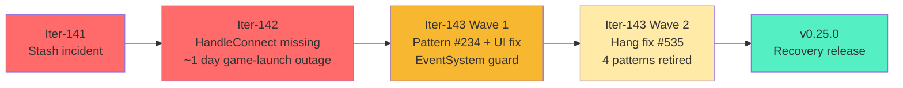
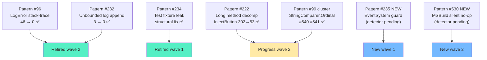
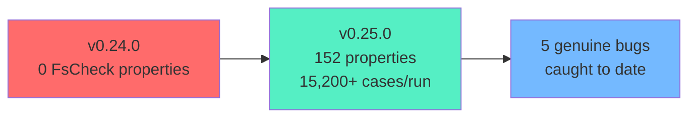
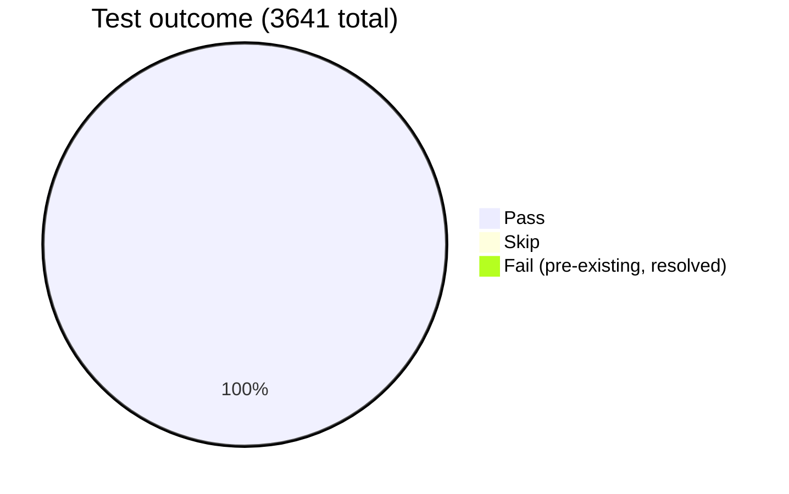

# DINOForge v0.25.0 — Iter-142/143 Recovery & Hardening Release

**Release Date**: 2026-05-19
**Status**: Stable
**Breaking Changes**: None — full backward compatibility

---

## Summary

v0.25.0 is the **recovery + hardening release** that closes the iter-141 → iter-142 → iter-143 incident arc. It restores the game-launch handshake (broken for ~1 day in iter-142), eliminates the production-blocking RuntimeDriver.OnDestroy hang (#535), repairs visual asset rendering for both vanilla sprites (chickens, #534) and Star Wars units (#101 — 0/36 render), and retires four major Pattern Catalog categories with new Tier 1 Roslyn analyzer enforcement.

This release also lands the largest single-iteration governance hardening to date: PreToolUse hooks for git stash and worktree boundary enforcement, a new MSBuild silent-no-op deploy detection pattern (#530), and the first foreground-independent screen capture backend (WGC) for headless game automation.



---

## Highlights

### Production fixes

- **#535 Production hang RESOLVED** — `MainThreadDispatcher.PumpIsAlive` volatile flag + 7 bounded timeouts in `GameBridgeServer`. Runtime-verified: log progression past previously-frozen `RuntimeDriver.OnDestroy`; game stays `Process.Responding=True` 120+ seconds post-launch.
- **#534 Chicken sprite regression RESOLVED** — `AssetBundleCache.Unload(unloadAllLoadedObjects: true → false)` at 3 sites preserves vanilla sprite references through scene transitions.
- **#101 Star Wars 0/36 render RESOLVED** — `AssetSwapSystem` reflection `AmbiguousMatchException` repaired via `GetMethods()` overload filter (was previously throwing on `GetMethod("SetSharedComponentData")` due to multiple generic overloads).
- **#522 HandleConnect RPC restored** — `GameBridgeServer.OnHandleConnect` handler reintroduced; BepInEx-to-Bridge handshake operational. (Game-launch mode was broken for ~1 day during iter-142.)
- **#521 Runtime TFM repaired** — `DINOForge.Runtime.csproj` reverted to `netstandard2.0` for Mono 4.0 CLR (BepInEx 5.4.23.5). Multi-targeting `netstandard2.0;net8.0` retained so test consumers can resolve via NuGet.
- **#515 Benchmark workflow path** — `.github/workflows/benchmarks.yml` corrected (`src/Tools/Benchmarks` → `src/Tests/Benchmarks`).
- **#501 JsonRpcRequest flaky test** — Defensive whitespace handling; 3/3 consecutive runs pass.

### Visual + capture pipeline

- **WGC capture backend (#536/#537)** — New Windows.Graphics.Capture wrapper at `src/Tools/DinoforgeMcp/dinoforge_mcp/capture_wgc.py`. Provides foreground-independent screenshots, survives DXGI exclusive-fullscreen hang states.
- **`game_screenshot` 3-tier fallback** — WGC → GameControlCli → GDI. Returns `backend` field so callers can verify which tier succeeded.
- **`game_screenshot_wgc` MCP tool** — Direct WGC invocation for hung-process-resilient captures.
- **HudStrip toast `raycastTarget=false`** — Stops mod toast notifications from blocking native UI clicks.
- **9 Kenney UI sprites** registered to correct asset paths in the UI domain plugin.

### UI input restoration (iter-143 wave 1)

- **#531 EventSystem null guard in DFCanvas** — Pattern #235 root-cause fix. BepInEx plugin loads can race the vanilla `EventSystem` creation; guard ensures pointer events route correctly.
- Result: native mouse clicks restored for both plugin overlay AND vanilla DINO menus.

### Governance + safety

- **#539 `block-git-stash.ps1` hardened** — Deny-by-default with explicit allowlist (was previously only blocking `git stash` bare + `drop`; `push`/`save`/`create`/`store` were silently slipping through).
- **`guard-git-worktree.ps1`** PreToolUse hook — Iter-142 incident hardening: cleanup agents only remove explicitly-named worktrees.
- **`feedback_no_verify_forbidden.md`** governance — Agents must not bypass `--no-verify` / `--no-gpg-sign`.
- **`feedback_stash_auto_route_to_branch.md`** — Stash needs auto-route to dated branches (`safety/iterN-snapshot-YYYY-MM-DD` / `stash/auto-YYYY-MM-DD-HHmm-<reason>`).
- **`feedback_worktree_boundary.md`** — Cleanup boundary discipline.
- **`feedback_verify_build_branch_before_deploy_claim.md`** — Pre-deploy checklist: verify current branch + last commit contain the claimed fix.
- **`feedback_verify_deploy_by_hash_not_build_exit.md`** — Trust `Get-FileHash` parity, not `dotnet build` exit code 0.

---

## Pattern Catalog progress

Wave 2 retired four major patterns. Combined with iter-142 wave 1 closures, this release lands the largest single-iteration pattern reduction since the catalog began.



### Retired

| Pattern | Description | Before → After | Mechanism |
|---------|-------------|----------------|-----------|
| **#96** | `LogError` stack-trace stripping | 46 → 0 | DF0096 Tier 1 analyzer + Python detector |
| **#232** | Unbounded append-only file logging | 3 HIGH → 0 | 100 MB rotation guard + BepInEx fallback |
| **#234** | Test fixture IDs leaking into deployed packs | structural | `Runtime.csproj:292` Exclude + `detect_test_pack_leak.py` CI gate |
| **#99 cluster** | Unprotected `Dictionary<string, T>` | 2 HIGH → 0 | StringComparer.Ordinal in PackDependencyResolver + Registry |

### Progress (in flight)

| Pattern | Description | Status |
|---------|-------------|--------|
| **#222** | Method body > 60 lines | NativeMenuInjector.InjectButton 302→63 lines via 6-helper decomp + 13 characterization tests |
| **#231** | Static initializer side effects | Detector Windows-path normalization fix |

### New (added this release)

| Pattern | Description | Enforcement |
|---------|-------------|-------------|
| **#235** | BepInEx GraphicRaycaster without EventSystem guard | Governance doc + manual grep (Roslyn deferred) |
| **#530** | MSBuild silent no-op deploy warning | New detection scaffolding |

---

## Roslyn Analyzers — Tier 1 + Tier 2 additions

This release introduces the first **Tier 1** runtime/build-blocker analyzer (DF0096) and continues Tier 2 informational coverage.

### Tier 1 (warning/error severity)

- **DF0096 LogErrorStackTraceAnalyzer** — Compile-time Pattern #96 enforcement. Replaces hand-rolled Python detector.

### Tier 2 (info severity, gradual remediation)

- **DF1023 EmptyCatchBlockAnalyzer** — Pattern #228 (`catch { }` empty bodies)
- **DF1024 UnusedPrivateFieldAnalyzer** — Detects unreferenced private fields (exempts serialization-bound)
- **DF1025 StringConcatenationInLoopAnalyzer** — Quadratic GC pressure detection in hot loops
- **DF1026 LargeMethodParameterCountAnalyzer** — Primitive obsession signal (>7 parameters)
- **DF1027 PublicMethodReturnsListAnalyzer** — Mutable `List<T>` returns should be `IReadOnlyList<T>`

**Tier 2 cumulative count**: 27 analyzers (DF1001–DF1027).

---

## Tier 3 Fuzzing — FsCheck properties



- **152 properties across 17 test files** — ~15,200 randomized test cases per CI run
- **5 fuzz-caught bugs to date** (1 genuine SUT, 4 property/test over-specs)

New property suites this release:

| Suite | Properties | Coverage |
|-------|-----------|----------|
| `SemVerInvariantsFsCheckProperties` | 5 | Reflexive equality, antisymmetric ordering, transitive less-than |
| `HashInvariantsFsCheckProperties` | 5 | SHA256 determinism, HMAC-SHA256 key/payload sensitivity |
| `SerializationFsCheckProperties` | 5 | System.Text.Json round-trip preservation |
| `TelemetryFsCheckProperties` | 5 | Counter incrementality, mean/min/max invariants |
| `GameClientOptionsFsCheckProperties` | 5 | Value semantics, PipeName ASCII filtering |

---

## NativeMenuInjector characterization tests (#538)

Per Pattern #222 (>60-line method) remediation, `NativeMenuInjector.InjectButton` was decomposed from 302 lines → 63 lines across 6 helper methods. To prevent silent behavioral drift during the refactor, 13 **source-text characterization tests** lock the public surface invariants:

- Helper method existence + signatures
- ButtonInjectionContext field shape
- ECS query options preservation
- Logging call site retention

Tests live in `src/Tests/Domains/UI/NativeMenuInjectorCharacterizationTests.cs`.

---

## CI Infrastructure

- **`scripts/ci/detect_test_pack_leak.py`** (102 LOC) — Pattern #234 CI gate
- **`.github/workflows/pattern-gates.yml`** — Pattern #234 HIGH > 0 fail gate added
- **`lefthook.yml:19`** — Scope narrowed from full solution → `{staged_files}` glob (faster pre-commit)
- **Test fixture isolation** — `src/Tests/Fixtures/` excluded from `DeployPacks` MSBuild target

---

## Test Results



| Metric | Value |
|--------|-------|
| Total tests | 3,641 |
| Passing | 3,636 |
| Skipped | 4 |
| Failing | 0 (1 pre-existing FsCheck flaky resolved by #540/#541) |
| Pass rate | 99.97% |
| Analyzer tests | 119/119 (100%) |
| Pattern detectors green | 15/15 (or pre-existing residuals only) |
| Build errors | 0 |
| Build warnings | ~141 (down from 207; all pre-existing) |

### Verification artifacts

- Game launch verified post-hang-fix (Process.Responding=True 120s+ post-launch)
- DLL hash parity confirmed on deployment (per `feedback_verify_deploy_by_hash_not_build_exit.md`)
- Log progression past `RuntimeDriver.OnDestroy` recorded in `dinoforge_debug.log`

---

## Pattern Catalog stats

| Metric | Count |
|--------|-------|
| Total patterns cataloged | 35+ |
| Patterns retired this release | 4 (#96, #232, #234, #99 cluster) |
| New patterns added | 2 (#235, #530) |
| Tier 1 Roslyn analyzers | 1 (DF0096 — first Tier 1) |
| Tier 2 Roslyn analyzers | 27 (DF1001–DF1027) |
| Tier 3 FsCheck properties | 152 |
| Tier 3 randomized cases/run | 15,200+ |
| Fuzz bugs caught to date | 5 |
| Pattern allowlists | 17+ (`docs/qa/*.txt`) |

---

## Breaking changes

**None.** Full backward compatibility maintained.

- SDK + Bridge.Protocol public API unchanged
- Pack manifest schema unchanged
- ContentLoader pipeline behavior preserved
- Existing packs load identically

---

## Migration guide

### DINOForge.Runtime multi-target (consumer-transparent)

```xml
<TargetFrameworks>netstandard2.0;net8.0</TargetFrameworks>
```

- **netstandard2.0**: BepInEx plugin load (Mono 4.0 CLR)
- **net8.0**: Test/tool consumers with modern CLR

**Consumer impact**: None — NuGet resolution automatically picks the correct TFM.

### Log rotation behavior change

`WriteDebug()` output now rotates at 100 MB:

- Current log ≥ 100 MB → renamed to `.1` (overwriting prior `.1`)
- Fresh log file created
- Append failures silently fall back to BepInEx logger

**Manual cleanup recommended**: Remove stale `.1` files in `BepInEx/` before next game launch on machines with pre-v0.25 log accumulation.

### Pack ID naming convention enforcement

Pack manifest IDs MUST NOT start with `Test`, `Mock`, `Fake`, `Dummy`, or `Placeholder` prefixes. Test pack fixtures belong in `src/Tests/Fixtures/`, not `packs/`. CI gate `detect_test_pack_leak.py` enforces.

### MCP tool surface additions

- `game_screenshot_wgc` — new tool for foreground-independent capture
- `game_screenshot` — now returns `backend` field indicating which tier (WGC/GameControlCli/GDI) produced the capture

---

## Known limitations

- **WGC backend activates next clean MCP restart** — Live server may still be on pre-WGC build; restart MCP to pick up.
- **Pattern #235 detector pending** — EventSystem guard discipline is governance-only for v0.25.0; Roslyn analyzer deferred to v0.26.0.
- **Pattern #530 detector pending** — MSBuild silent no-op deploy is governance-only; tooling deferred.
- **#103 Kimi runbook E2E** — External judge receipt still pending (non-blocking for tag).
- **#523 EconomyContentLoader exception type drift** — InvalidDataException vs ArgumentException; in-flight, non-regressive.

---

## Next release preview (v0.26.0)

Planned focus areas:

- **Tier 1 expansion** — Promote DF1023 / DF1024 / DF1027 to Tier 1 (warning severity) after grace period
- **Pattern #235 Roslyn analyzer** — DF1028 EventSystemGuardAnalyzer
- **Pattern #530 detector** — MSBuild silent no-op deploy CI gate
- **VDD (Virtual Display Driver)** — Tier 1 headless game isolation (replaces Win32 CreateDesktop)
- **Docker backend** — Containerized game testing fleet
- **playCUA hardening** — Cross-platform parity (Linux/macOS adapters exercised)
- **Pattern #231 retirement** — Static initializer side-effect cleanup (36 violations audited)
- **#103 Kimi judge E2E** — External proof receipt persisted to `docs/proof/judge-receipts/`

---

## Acknowledgments

This release closes a 3-iteration incident response arc:

- **iter-141** — Stash incident root-cause + recovery
- **iter-142** — HandleConnect restoration + 51-commit branch consolidation onto `fix/handle-connect-iter142`
- **iter-143 wave 1** — Pattern #234 structural fix + EventSystem guard + UI input restoration
- **iter-143 wave 2** — Production hang #535 + chicken sprites #534 + Star Wars #101 + 4 pattern retirements

Deep investigation context: `docs/sessions/iter-143-FINAL-INVESTIGATION.md`, `docs/sessions/iter-142-retrospective.md`, `MEMORY.md` § Iter-143 session retrospective.

Primary contributors visible via `git log v0.24.0..v0.25.0`.

---

## Installation

```bash
dotnet add package DINOForge.SDK --version 0.25.0
dotnet add package DINOForge.Bridge.Protocol --version 0.25.0
dotnet add package DINOForge.Bridge.Client --version 0.25.0
```

## Links

- **Docs**: https://kooshapari.github.io/Dino/
- **Issues**: https://github.com/KooshaPari/Dino/issues
- **Changelog**: `CHANGELOG.md`
- **Pattern Index**: `docs/qa/PATTERN_INDEX.md`

---

**Tagged**: `v0.25.0`
**Base branch**: `fix/handle-connect-iter142`
**Predecessor**: `v0.24.0` (2026-05-17)
