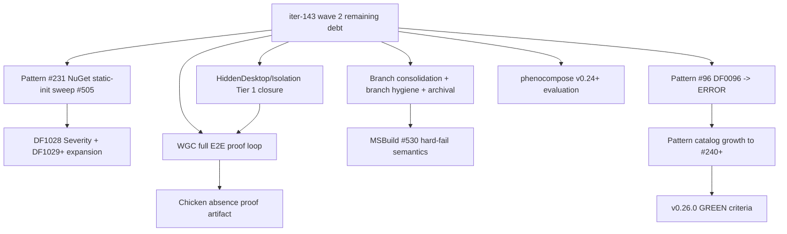
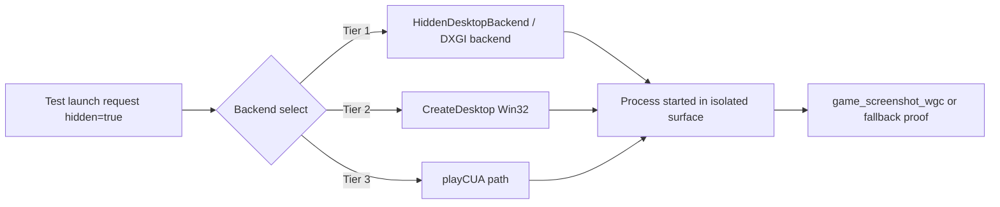
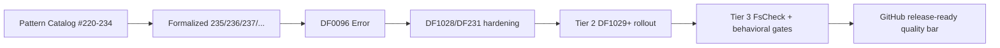
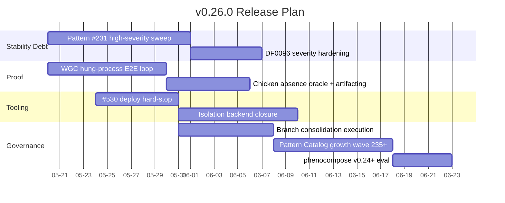

# DINOForge v0.26.0-PLAN

**Scope**: Forward-looking execution plan for remaining v0.26.0 work after iter-143 wave 2.
**Date**: 2026-05-19
**Source baseline**: `docs/release/v0.26.0-PLAN.md` base, `docs/release/v0.25.0-RELEASE_NOTES.md`, and `docs/qa/branch-consolidation-iter143-plan.md`.

## Overall objective
v0.26.0 should be a hardening release that closes deferred quality debt from iter-143 wave 2, formalizes governance, and establishes repeatable real-game proof gates around automation, capture, and isolation.

## Plan scope (required items)

## 1) Pattern #231 — 11 HIGH static-init violations (#505 deferred)

- Baseline: `docs/qa/pattern_231_audit.md` reports 11 HIGH and 2 MED for NuGet-published surface.
- This includes static side-effect hotspots in `src/SDK/Dependencies/PackSubmoduleManager.cs`, `src/SDK/IO/SafeFileIO.cs`, `src/SDK/NativeInterop/GoDependencyResolver.cs`, `src/SDK/NativeInterop/RustAssetPipeline.cs`, and others.
- Current analyzer mapping: `DF1028` exists and reports INFO.

Execution target:
1. Freeze API-safe refactor pass for each HIGH site.
2. Require `Lazy<T>` or explicit `Initialize()` paths for constructor-bound I/O/process/env reads.
3. Add explicit `static-side-effect-ok:` suppressions only with rationale, then reduce this allowlist over time.
4. Keep `docs/qa` scripts + allowlist in sync.

Success checkpoint:
- `docs/qa/pattern_231_audit.md` and detector result should show HIGH count reduced from 11 to 0 at v0.26.0 branch head.

## 2) WGC backend full E2E proof loop (capture hung DINO + verify chicken absence)

Goal: prove capture works on hung processes in Windows fullscreen/adapter-edge conditions and prevent chicken-placeholder regressions from reappearing.

Core acceptance test (`proof-wgc-hang.yml` style sequence):
- launch DINO through MCP test path with clean runtime + known world load target.
- force a hung condition (or long-blocking frame path) without killing the process.
- execute `game_screenshot`/`game_screenshot_wgc` with backend telemetry (`backend` field should be `wgc`).
- validate artifact integrity: image exists, non-black checksum, expected geometry, and time-to-first-frame metric.
- verify chicken absence from captured frame via visual oracle (template/entropy/histogram baseline) and/or screenshot diff against clean baseline.

Output artifacts:
- per-run screenshot hashes under deterministic proof path
- `capture.json` with backend, attempts, backend fallbacks, and elapsed duration
- `wgc_hang_proof.md` with pass/fail and captured evidence links

This loop should be callable as one reusable command from headless harness.

## 3) Branch consolidation execution (per `docs/qa/branch-consolidation-iter143-plan.md`)

Execution is still required after iter-143 merge-gate closure.

### 3.1 Merge/pull local main
- After `origin/main` has the wave 2 PR merge, run a fast-forward local main update.

### 3.2 Merge-squash cleanup
- Archive/scrub 10 squash-merged remote branches:
  - `origin/chore/add-agents-2026-05-02`
  - `origin/chore/add-gitignore`
  - `origin/chore/changelog-stub`
  - `origin/chore/deps-high-sweep`
  - `origin/chore/dino-governance-docs-20260425`
  - `origin/dependabot/bootstrap`
  - `origin/feat/journey-impl`
  - `origin/gt/polecat-35/83fd9402`
  - `origin/gt/polecat-44/40f140e5`
  - `origin/pr-template/bootstrap`
- Validate each deleted branch is truly present in `origin/main` first.

### 3.3 Orphan branch review and archive
- Keep and tag-or-archive four ambiguous branches as directed before delete:
  - `origin/backup/20260426-reconcile-05cd0168`
  - `origin/ci/pin-trufflehog`
  - `origin/cursor/gitignore-pattern-refinement-e743`
  - `origin/fix/deps-npm-2026-04-27`

### 3.4 Date-stamped archive requirement
- Create and push tags `archive/<branch>-2026-05-19` (or similarly explicit date style) before branch removal for non-required branches.

## 4) Pattern #96 to DF0096 ERROR (INFO -> ERROR)

Current status shows DF0096 is warning/INFO in source and docs state.

Target:
- Raise DF0096 diagnostic default severity to `Error` in analyzer definition and analyzer packaging release descriptors.
- Keep suppression mechanism (`// pattern-96-ok`) and `CodeFix` behavior.
- Add analyzer tests that lock:
  - warning code emitted at Info currently -> must fail build if still emitted as non-blocking.
  - non-conforming Debug/LogError usage in NuGet surface.

## 5) Tier 2 expansion targets: DF1028+ (next Roslyn wave)

Tier-2 expansion should be targeted as an explicit batch beyond DF1028.

Proposed expansion block:
1. DF1028 promotion work (if not already blocked by #96 work): `StaticInitializerSideEffectAnalyzer` reliability hardening.
2. DF10xx new analyzers for the deferred quality lane (longer body, hidden side effects, event-loop correctness, disposable ownership).
3. CI policy update to treat DF1028+ as severity gate in build graph for `src/Analyzers/` and `src/Tools/*` where risk surface is highest.

Planned sequencing:
- DF1028 + #231 migration complete before branch cleanup deletion finalization.
- Remaining DF1029+ analyzers can land while merge hygiene is running but must include tests before feature freeze.

## 6) Tier 3 expansion: more FsCheck property suites

v0.25 had 152 properties. v0.26 should add more suites focused on behavior around fragile integration zones.

Recommended additions:
- `PackLoaderPropertySuite`: round-trip invariants around pack manifests and unknown keys.
- `GameBridgeToolingPropertySuite`: argument canonicalization and timeout/exception surfaces.
- `AssetBundleSwapPropertySuite`: swap registration, idempotent replacement, and malformed manifest resilience.
- `SchemaConformancePropertySuite`: cross-version schema compatibility edges and migration behavior.
- `Receipt/ProofPropertySuite`: signature and policy-binding invariance for real/empty run artifacts.

## 7) MSBuild deploy pipeline modernization — resolve #530 silent-no-op fully (not warn only)

Current state is partial. v0.26 must enforce non-negotiable deploy correctness when `-p:DeployToGame=true`.

Requirements:
1. Make silent-no-op behavior fail-fast for unsupported TFM selection.
2. Distinguish “intended for deploy” vs “unsupported environment” outcomes.
3. Emit explicit errors when hash/source verification indicates target not produced/updated.
4. Add log marker + CI test that asserts this behavior from build output.

Implementation intent:
- one warning path converted to `Error` in build targets.
- clear guidance on required `-p:TargetFramework=` for multi-TFM runtime build.

## 8) HiddenDesktopBackend rewrite or DXGI Desktop Duplication backend for Tier 1 isolation

Current hidden-desktop findings indicate live launch does not use hidden desktop abstraction from `isolation_layer.py`.

v0.26 target:
- Decide and execute one Tier-1 path:
  1. rewrite `HiddenDesktopBackend` into a wired isolation contract used by launch path, or
  2. introduce DXGI Desktop Duplication isolation backend as tier-1 fallback (documented and gated).
- Move from “dead code” to “actively selected backend.”
- Add per-launch backend telemetry and explicit visible proof that hidden launch is not on primary desktop.

Minimal acceptance for v0.26:
- launch path for hidden mode selects and logs a defined tier backend.
- at least one non-primary-viewport launch path validated in automation loop.

## 9) phenocompose v0.24+ evaluation (per CLAUDE.md)

CLAUDE.md marks `phenoCompose` as the v0.24+ evaluation point and v0.25 MCP wrapper track.

v0.26 evaluation tasks:
- evaluate phenocompose CLI availability in repo environment and validate command contract.
- capture a small-scale proof run matrix: local path, command latency, and launch reliability baseline.
- document outcomes against CLAUDE roadmap tiers (WASM/gVisor/Firecracker path values).
- confirm decision rule for v0.26+: wrap MCP where integration value > rewrite effort.

## 10) Pattern Catalog growth toward #240+

Target growth is toward explicit catalog expansion and enforcement maturity, not just doc updates.

Plan:
- move deferred catalog candidates into formal entries with analyzer mapping,
- complete cross-source alignment in `docs/qa/PATTERN_INDEX.md`,
- grow analyzer catalog coverage until the pattern registry approaches numeric/completeness marker `#240+` in backlog terms and closure status.

## Proposed v0.26.0 schedule

## Success metrics (GREEN for v0.26.0)

- Pattern #231 HIGH violations: 0 on NuGet surface (`pattern_231_audit` and `detect_static_init_side_effect.py` alignment).
- DF0096 default severity is ERROR in analyzer package and build breaks on violations.
- WGC E2E loop includes successful hung-process capture and a successful chicken-absence check with proof artifact committed.
- `DeployToGame=true` never silently no-ops under unsupported TFM; CI fails when deploy target is mismatched.
- Isolation backend wiring: hidden launch path no longer remains “undocumented dead code”; launch is routed to a tagged tier.
- Branch consolidation completes with:
  - local `main` fast-forwarded,
  - 10 squash-merged remote branches removed,
  - 4 orphan branches archived or explicitly approved for retention,
  - safety branches preserved.
- Pattern Catalog alignment report updated (`docs/qa/PATTERN_INDEX.md`) and analyzer/tier coverage visibly expanded.
- At least two new Tier 3 FsCheck suites added and wired.
- phenocompose v0.24+ evaluation completed and decision memo logged in docs with a recommendation.
