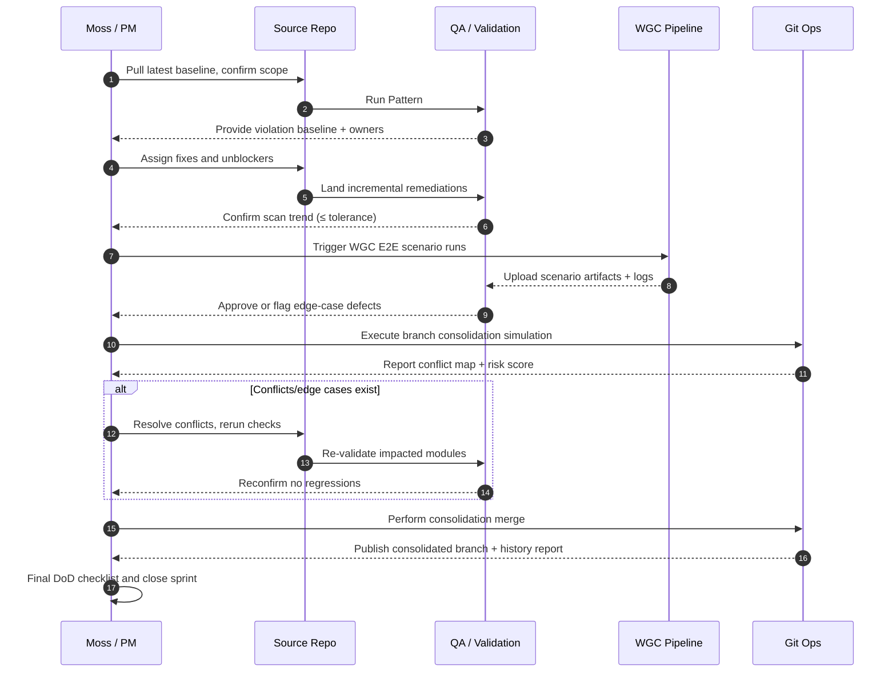

# v0.26.0 Sprint Kickoff

**Date:** 2026-05-19  
**Owner:** Moss-polecat-6c6d4555@78a8d430  
**Branch:** `convoy/methodology-dino/c61d464c/head`

## 1) Purpose
The v0.26.0 sprint targets three coordinated outcomes:

1. Execute a full **Pattern #231** compliance sweep across current workstreams.
2. Produce end-to-end proof that **WGC** flows function correctly and are reproducible.
3. Complete **branch consolidation** safely with auditable history preservation.

Success for this sprint is defined by measurable cleanup, verification artifacts, and a clean branch state suitable for post-sprint integration.

## 2) Sprint goals (measurable)

1. **Pattern #231 coverage:** Scan all active domains and report 100% of applicable files/areas with zero unresolved critical violations by sprint end.
2. **WGC E2E proof:** Run WGC pipeline and produce proof artifacts for at least **3 complete E2E scenarios**.
3. **Consolidation readiness:** Produce a branch topology plan and execute a dry-run reconciliation with zero unexpected merge conflicts.
4. **Automation of checks:** Integrate/standardize command checklist so all three workstreams can be re-run in under **30 minutes** end-to-end.
5. **Governance artifacts:** Publish a full kickoff-to-close evidence set (risk log, validation logs, status notes) by Day 10.

## 3) Deliverables (per goal)

### Goal 1 — Pattern #231 sweep
- Inventory of all affected modules/components.
- Per-module violation report with owner, severity, and remediation status.
- Validation log showing remaining items (if any) and acceptance decision.

### Goal 2 — WGC E2E proof
- WGC execution log with run ID, environment, and commit hash.
- Three or more test artifacts per scenario (input fixtures, run output, observed results).
- Signed summary note of failures, if any, with concrete mitigation actions.

### Goal 3 — Branch consolidation
- Pre-consolidation dependency map and migration checklist.
- Executed consolidation branch plan with preserved commit context metadata.
- Merge report capturing conflict count, resolutions, and verification results.

### Goal 4 — Reproducible check automation
- Documented runbook for local and CI-equivalent execution.
- Parameterized scripts or command profile covering Pattern #231, WGC proof, and branch checks.
- Time-per-run baseline recorded in kickoff notes.

### Goal 5 — Governance artifacts
- Updated `docs/release/v0.26.0-sprint-kickoff.md` with daily status deltas.
- Final risk register with mitigation and current owner.
- Final sprint close note with Go/No-Go decision rationale.

## 4) Work order (Sequence diagram)

## 5) Risks

- **Pattern #231 may reveal more violations than expected.**
  - Impact: Scope creep and delayed close.
  - Mitigation: Fix in priority order (critical/security/blocking first), keep a strict “must-fix-now” policy and defer cosmetic items to next sprint.

- **WGC may have edge cases on Win 11.**
  - Impact: Flaky proofs and false negatives in CI-equivalent runs.
  - Mitigation: Add OS-specific repro steps, capture machine/environment fingerprint, and maintain a dedicated Windows 11 stability pass.

- **Branch consolidation can destroy history if mishandled.**
  - Impact: Loss of auditability or rollback ability.
  - Mitigation: Mandatory pre-merge backup refs, non-destructive rehearsal (`--no-ff` / dry-run) and explicit verification logs before final merge.

## 6) Definition of Done

- All 5 sprint goals have measurable evidence attached.
- Pattern #231 critical issues reduced to zero and all others triaged.
- WGC E2E evidence includes at least 3 scenarios and is reproducible from documented commands.
- Branch consolidation completed with no unannounced history rewriting.
- Validation logs for all tracks are archived in release docs and linked from a central index.
- No unresolved `Blocker` risks at sprint close.

## 7) Daily standup format

Use this fixed 5-minute format every day:

1. **Yesterday:** what was completed, including scan counts and test results.
2. **Today:** exact target with expected output (files changed, scenario IDs, branch ops).
3. **Blockers:** current risks and owner/ETA for each.
4. **Evidence:** one log link or artifact per workstream.
5. **Next checkpoint:** milestone for the next standup and what “done” looks like.
