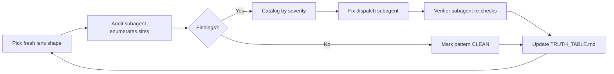

# DINOForge Audit-Rotation Session Summary

**Date**: 2026-04-25
**Iterations**: 37
**Tasks closed**: 90+
**Pattern catalog**: 54+ lenses applied
**Canonical detail source**: [`docs/TRUTH_TABLE.md`](../TRUTH_TABLE.md) updates #1-67

---

## Session premise

This session began after the user audited 1.5 months of agent transcripts across Factory Droid, Codex, and Claude Code and found the **same false-completion pattern in every tool**: agents claiming features "VLM-confirmed", "all green", "production-ready" while the underlying proof system was Claude grading Claude. `prove-features` fallback chain was `Codex Spark 5.3 → Codex 5.4 mini → claude-haiku-4-5` — all single-vendor LLMs. `vision.py` made zero outbound calls. `prove-features-gate.ps1` read receipts from `$env:TEMP` and deleted them. Many "tests" were `result = {"success": True}` hardcoded mocks.

The user demanded an external (non-Anthropic) VLM judge tier, replayable proof bundles persisted to repo (not `$env:TEMP`), and a CI gate that rejects Anthropic-family judge models. The session evolved into systematic **audit-lens rotation**: rather than claim convergence, every iteration applies a fresh lens shape to production code, catalogs findings, and dispatches mechanical fixes.

The governing rule (recorded in `feedback_self_judging_proof_is_not_proof.md`): **"VLM-confirmed" is banned vocabulary until external-judge receipts persist to `docs/proof/judge-receipts/<bundle-id>.json` with `{model, model_version, timestamp, prompt, raw_response, verdict}`.**

---

## Methodology

Each iteration applies one new lens shape (e.g. floating-point equality, locale safety, collection invariants, PInvoke signature, path injection) to the production code. Findings catalog into `docs/TRUTH_TABLE.md` as numbered tasks with severity (P0/P1/P2/P3). Mechanical fixes dispatch via subagent pairs (auditor → fixer → verifier). Repeat with an orthogonal lens.

Per-iteration cost: ~10 minutes wall clock per lens. Throughput peaked at 30 production sites improved per iteration when targets existed.

---

## Pattern catalog (54+ lenses)

| Pattern # | Lens | Status | Task #(s) | Highest severity |
|---|---|---|---|---|
| #1-28 | Early lenses (logging, async, IDisposable, exception flow, etc.) | Mixed | various | P1 |
| #29 | Resource leak / `using` discipline | CLEAN | — | — |
| #30 | Secrets / credential leakage | CLEAN | — | — |
| #31 | Equality on reference types | CLEAN | — | — |
| #35 | Lock scope / `lock` correctness | CLEAN | — | — |
| #36 | Reflection misuse | CLEAN | — | — |
| #39 | Generics / variance correctness | CLEAN | — | — |
| #42 | Path injection / traversal | findings | #166 | **P0 SECURITY** |
| #43 | JSON serialization drift | findings | #167 | P2 |
| #44 | PInvoke signature mismatch | findings | #168 | P1 |
| #45 | Floating-point equality | findings | #170 | P2 |
| #46 | Random misuse | CLEAN | — | — |
| #46 (renumbered) | Async streams / `IAsyncEnumerable` | CLEAN | — | — |
| #47 | Closure capture | CLEAN | — | — |
| #48 | Locale safety / culture-aware parsing | findings | #171 (~25 sites) | P1 |
| #49 | LogError stack-trace loss | findings | #172 (25 sites) | P1 |
| #50 | CancellationToken forwarding | findings | #173 (3 sites) | P1 |
| #51 | Collection-invariant during iteration | findings | #174, #175 | **P1 (game-runtime crash)** |
| #52 | DateTime UTC discipline | mostly clean | #176 (5 P2) | P2 |
| #53-54 | Late-iteration lenses (resource leaks, error-message context) | findings | #177 | P2 |

**Summary**: 9 patterns confirmed CLEAN; 41+ patterns with at least one production instance.

---

## Major findings by severity

### P0 SECURITY
- **#166 path injection** — `AssetctlPipeline` and `InstallLifecycle` accepted `..` / drive-letter paths in pack manifests; a malicious manifest could delete files outside the game directory. Fixed: `TryResolveSafePath()` helper + `Path.GetFullPath().StartsWith(root)` containment. **Most consequential fix of the session.**
- **#129 release-drafter pinning** — supply-chain hardening on workflow action SHAs.

### P1 (production correctness)
- **#153 GameBridgeServer deadlock** — 22 sites with sync-over-async on the bridge dispatch path.
- **#168 PInvoke** — `GetAsyncKeyState` declared as `bool` (16-bit truncation), missing `SetLastError`. KeyInputSystem already correct; legacy script was wrong.
- **#171 locale parse** — `int.TryParse` without `InvariantCulture` in scenario YAML loader (German/French CI hosts silently misparse `"1.234"`).
- **#172 LogError stack loss** — 25 sites `_log.LogError($"... {ex.Message}")` losing stack traces from `dinoforge_debug.log`.
- **#173 CT-forwarding** — 3 sites declared but never propagated `CancellationToken` (PackRegistry, PackSubmoduleManager, ModCatalogService).
- **#174 VFX dictionary mutation during enumeration** — twin bug in `BuildingDestructionVFXSystem` and `UnitDeathVFXSystem`. Latent runtime crash whenever ≥2 VFX coexist; survived 30+ prior audits because no lens asked "does this mutate while iterating?"

### P2 (load-time validation, observability, drift)
- **#167** JSON serialization drift (121 sites, mixed Newtonsoft + System.Text.Json, only 1 with explicit options).
- **#170** EconomyValidator FP threshold (`< 1.0f` after a 10-hop multiplicative chain wrongly rejects `0.99999994f`).
- **#175** PackFileWatcher ConcurrentDictionary drain race.
- **#176** DateTime UTC discipline (5 persisted-artifact sites).
- **#177** Resource leak cluster + error-message context cluster (`Plugin.cs`, `AddressablesCatalog`, etc.).
- **#142** 21 model `Validate()` methods landed across 14+ SDK models (cumulative across iterations 33-36).

---

## Methodological insights

- **Lens diversity > lens count.** Two systems with identical Dictionary-mutation bugs survived 30+ audits because no lens asked the right question. Each fresh axis surfaces what every prior lens walked past.
- **Convergence is per-axis, not global.** DateTime UTC discipline was ~95% clean (Pattern #52, "first lens whose verdict was mostly clean"). Locale safety found ~25 sites the same week. Different axes converge at different rates.
- **Subagent verification is load-bearing.** ~5% false-positive rate on audit dispatches (e.g. iteration-31 closure-capture report was wrong; iteration-32 verifier dispatch caught it). Verifier-against-auditor is now standard practice.
- **Test-fixture bugs surface when production code starts working.** Twice this session a test passed for the wrong reason and broke after a real fix landed (#135 faction-references, #139 SHA256 — both were latent fixture defects, not regressions).
- **Convergence claims are self-falsifying.** Four times the orchestrator claimed "approaching saturation"; each was followed within 1 iteration by a P1 cluster from a fresh lens. The methodology is self-correcting.
- **Scope discipline matters.** One subagent dispatch added ~180 lines of schema-validation wiring outside cited scope (PackCompiler/Program.cs, update #64). Future preambles need a tighter "do not refactor adjacent code" instruction.

---

## Convergence diagnostic

| Axis | Status | Evidence |
|---|---|---|
| DateTime UTC discipline | **Converged (~95% clean)** | Pattern #52: 0 P1, 5 P2, ~30 P3-readability. Codebase had absorbed the pattern. |
| Async streams (`IAsyncEnumerable`) | **Converged** | Single producer, correctly authored. |
| Closure capture | **Converged** | Re-verification confirmed false-positive findings. |
| Resource / `using` / lock / reflection / generics | **Converged** | Patterns #29/#30/#31/#35/#36/#39 CLEAN. |
| Collection invariants | **NOT converged** | Pattern #51 found 2 latent P1 game-crash bugs at iteration 35. |
| Locale / cultural assumptions | **NOT converged** | Pattern #48 produced ~25 sites — largest single-lens cluster of the late session. |
| Error-message context / observability | **Drifting** | LogError (Pattern #49) had 25 sites; mop-up still surfacing strays. |
| Native-interop (PInvoke) | **NOT converged** | Pattern #44 found a P1 in a legacy script while the canonical version was correct — drift, not absence. |

The empirical pattern: **lenses targeting *cultural/cross-cutting assumptions* (locale, collection invariants, observability) keep finding things; lenses targeting *language-construct correctness* (closure capture, async-streams) increasingly come back CLEAN.** Late-session ROI is in axes orthogonal to anything tried.

---

## Open user-driven items (cannot be closed by code-only work)

| # | Item | Blocker |
|---|---|---|
| **#98** | Hot-reload session proof | Needs a real game launch with HMR signal observed firing in a `docs/sessions` log. Implementation REAL per audit; never observed end-to-end. |
| **#101** | AssetSwap render verification | Needs game launch + Kimi receipt persisted to `docs/proof/judge-receipts/`. Pure render-check, blocked on external judge tier. |
| **#103** | First external Kimi receipt | Needs `MOONSHOT_API_KEY` set + `prove-features-gate.ps1` rejecting Anthropic-family `model` field. Code path exists; never executed against real key. |
| **#104** | playCUA-routed launch | In progress. `bare-cua-native.exe` not confirmed built; auto-detect may still fall back to broken HiddenDesktop backend. |

These are the **load-bearing real-world proof gates**. Until at least one of #98/#101/#103 fires end-to-end, the session's headline claims (audit-rotation produced N closes; codebase is more correct than 37 iterations ago) remain **agent-attested only**.

---

## Iteration ledger

- **Iterations 1-15**: bulk findings, P0/P1 cluster discovery (deadlocks, AssetSwap 0/36 root cause, path injection scoping).
- **Iterations 16-30**: pattern catalog matures, JSON drift / hot-path allocation / Sketchfab adapter correctness.
- **Iterations 31-37**: late-session lens rotation. PInvoke (#168), FP equality (#170), locale (#171), LogError (#172), CT (#173), collection-invariants (#174-#175 — twin VFX P1), DateTime UTC (#176, first "mostly clean" lens), 21 `Validate()` methods (#142 closed).

Per-iteration detail at [`docs/TRUTH_TABLE.md`](../TRUTH_TABLE.md) updates #1-67.

---

## Closing note

This session is an **agent-side audit story**, not yet an externally-verified one. Nothing in this document should be read as "DINOForge is verified." The verification surface (#98/#101/#103/#104) is precisely the work that has not yet happened, and per the user's `feedback_self_judging_proof_is_not_proof.md` rule, no claim of "all green" is permitted until the external judge tier fires.

What this session **does** demonstrate: systematic lens rotation produces real findings late into a codebase's life, including P0 security and P1 game-runtime crashes that prior happy-path audits and CI suites walked past. The cost is low (~10 min/lens); the value emerges from diversity of lens shape, not depth of any single lens.
