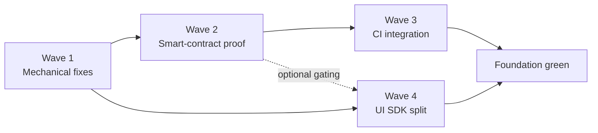

# DINOForge infra-pivot plan (2026-04-25)

## Why this exists

Mid-session, the user redirected the agent rotation away from feature-level audits toward infrastructure repair. Feature audits (audit-rotation iterations 1-36) were producing real, valid findings — but they were being layered on top of a foundation that does not actually work end-to-end. Validating "feature X uses registry Y correctly" while the underlying live-game launch path is broken produces false confidence.

The user's exact words:

> "work FIRST on steamless solus, hidden rdp, sandbox etc infra level items rather than feature for the game/mod framework itself. ;game bridge (e.g. Never bypassing live game reqs sans cloud (which we should avoid via strict precom\prepush systems + CI gates that validate those runs via manifests \ smart contract like systems; most if not all of that does not work."

This document synthesizes the 5 infra audits produced in iteration 37 into one executable plan with waves, gates, and explicit user dependencies.

## Diagnosis (synthesis of 5 infra audits)

1. **Steamless / multi-instance reality** — `boot.config single-instance=0` works, `_TEST` install dir works, the playCUA binary exists. But the DINOBox pool exists with **zero** boxes containing `DINOForge.Runtime.dll`, `_TEST/boot.config` has the wrong value, `Launch-DINOBox.ps1` defaults to broken `Hidden=true`, and there is no Steamless / Goldberg tooling at all (purely vaporware references). 7 named gaps catalogued in `docs/sessions/2026-04-25-steamless-multi-instance-audit.md`.

2. **Sandbox / isolation** — Of 7 documented mechanisms, **1.5 actually work** (TEST-dir + `boot.config` partial). `PlayCUABackend` auto-detect points at a path that does not exist on disk; VDD, DockerBackend, PhenoCompose, separate-user-account paths are all aspirational. See `docs/sessions/2026-04-25-sandbox-isolation-audit.md`.

3. **CI manifest gates** — **0 of 24** workflows launch the real game. `prove-features-gate.ps1` exists and contains real signature/judge logic but is **never invoked from any workflow**. No signature trust root, no merkle bundle hashing, no policy file. `docs/proof/judge-receipts/` does not exist on disk. See `docs/sessions/2026-04-25-ci-manifest-gate-audit.md`.

4. **Native vs Extended UI SDK** — Zero SDK contract for native (in-game DFCanvas) UI. `Domains/UI` registries (`HudElementRegistry`, `MenuRegistry`, `ThemeRegistry`, `HUDInjectionSystem`) are **orphaned** — packs can declare HUD elements but nothing renders them. 26 files need refactor for a clean native-vs-extended split. See `docs/sessions/2026-04-25-ui-sdk-audit.md`.

5. **Bridge bypass surface** — 7 silent-bypass sites in `GameBridgeServer` (`HandleStatus` returns literal `Running=true`, swallow `catch (Exception)`, `applyOverride` returns success without applying, etc.). 2 trait-fraud tests are tagged `[Trait("Category","E2E")]` / `UserStory` but their bodies use `FakeGameBridge`. See `docs/sessions/2026-04-25-bridge-bypass-audit.md`.

## Plan structure

| Wave | Tasks | Severity | Owner |
|------|-------|----------|-------|
| 1 — immediate, mechanical | #188 Steamless cleanup, #189 bridge bypass, #190 trait-fraud | P0/P1 | already in flight |
| 2 — architecture, design-first | #191 smart-contract proof spec | P0 | spec doc in flight |
| 3 — CI integration | #192 wire `prove-features-gate` into CI | P2 | depends on #191 |
| 4 — SDK split | #193 native vs extended UI, #194 wire orphaned registries | P2 | mutually dependent |

## Wave 1 — Immediate mechanical fixes

| Task | Files | Acceptance |
|------|-------|------------|
| #188 Steamless cleanup | `scripts/sandbox/New-DINOBoxPool.ps1`, `Launch-DINOBox.ps1`, `_TEST/boot.config` | `New-DINOBoxPool.ps1 -BoxCount 1 -Force` produces a box with `DINOForge.Runtime.dll` deployed; default Launch is `Hidden=$false`; vaporware Steamless/Goldberg references removed from docs. |
| #189 bridge bypass | `src/Tools/McpServer/GameBridgeServer.cs` (HandleStatus, HandleApplyOverride, swallow-catch sites) | All 7 silent-bypass sites either (a) return `error` when runtime is not connected, or (b) emit a structured log line that prove-features-gate can detect. |
| #190 trait-fraud | 2 named test files | Either change body to call real bridge, or remove `Category=E2E`/`UserStory` traits. No test claims an E2E trait while using `FakeGameBridge`. |

User must end-to-end verify: pool produces a launchable box, real `dinoforge_debug.log` entries appear, no fake-traited tests remain.

## Wave 2 — Smart-contract proof system

Defer detail to `docs/design/2026-04-25-smart-contract-proof-system.md` (in flight). Skeleton:
- bundle-merkle-root over (screenshot, log-tail, judge-output) per feature
- ed25519 (or sigstore cosign-keyless) signature over manifest
- `policy.yaml` declaring required claims, allowed judge models, max receipt age
- verifier reads receipts from `docs/proof/judge-receipts/`, checks merkle, signature, policy

Acceptance: a signed receipt with bundle merkle root verifies via `cosign verify-blob` (or local ed25519 verify) against the committed public key.

## Wave 3 — CI integration

After Wave 2 lands the spec + verifier:
- `prove-features-gate.yml` workflow runs on every PR, executes `prove-features-gate.ps1` against `docs/proof/judge-receipts/`
- Required-status check on main
- Policy decides which features must have a non-stale receipt

Acceptance: a PR that lacks a recent valid receipt fails CI; a PR with a verified receipt passes. Self-hosted runner provisioning (referenced in `game-launch.yml`) is the open user decision — provision it or drop the workflow.

## Wave 4 — UI SDK split

Refactor scope (from audit #4): split `src/Domains/UI` into `SDK.Native` (DFCanvas-targeted) and `SDK.Extended` (off-screen / overlay). Wire `HudElementRegistry`, `MenuRegistry`, `ThemeRegistry` into a real production rendering path inside `Runtime/UI/HUDInjectionSystem`. 26 files affected; follow the file map in the UI SDK audit doc.

Acceptance: a pack declaring `hud_elements` / `menus` / `themes` actually renders them in-game on `DFCanvas_Root` — verifiable via Wave 2 receipt.

## Verification gates per wave

- **Wave 1** acceptance: `New-DINOBoxPool.ps1 -BoxCount 1 -Force` produces a box with Runtime.dll deployed; user-replayable launch produces real `dinoforge_debug.log` entries.
- **Wave 2** acceptance: signed receipt with bundle merkle root verifies via `cosign verify-blob`.
- **Wave 3** acceptance: PR lacking a recent valid receipt fails CI.
- **Wave 4** acceptance: pack-declared HUD elements render in-game on `DFCanvas_Root`.

## What this pivot is NOT

- Not a rewrite of feature-level audit work — iterations 1-36 produced real fixes; they were just sitting on rotten foundation.
- Not abandoning the audit-rotation methodology — it resumes once Waves 1-3 land.
- Not adopting cloud-only fallback — user explicitly rejected. Local sandbox + manifest receipts is the path.

## Open user-driven items still pending

| Task | Blocking on |
|------|-------------|
| #98 Pack hot-reload session proof | Wave 1 sandbox to actually work |
| #101 AssetSwap render verify | Wave 1 sandbox + Wave 2 receipt |
| #103 First external Kimi receipt | `MOONSHOT_API_KEY` + Wave 1 sandbox + Wave 2 signing |
| #104 playCUA-routed launch | #188 Fix 1 (path-drift) |

Cross-reference: `docs/TRUTH_TABLE.md` rows for hidden-desktop, judge-receipts, CI-game-launch will move from ❌ STUB → 🟡 PARTIAL after Wave 1, → ✅ REAL after Wave 2 + Wave 3.

## Estimated effort

| Wave | Agent time | User dependency |
|------|------------|-----------------|
| 1 | ~3 hours | end-to-end verification of pool launch |
| 2 spec | ~1 day | signing scheme decision (sigstore vs local ed25519) |
| 2 impl | ~2-3 days | none (after spec approved) |
| 3 | ~1 day after Wave 2 | self-hosted runner provisioning OR drop game-launch.yml |
| 4 | ~1 sprint | none — pure refactor |

## What the user must do

1. Run end-to-end Wave 1 verification (DINOBox pool with deployed DLL, real launch, real log).
2. Provide `MOONSHOT_API_KEY` for first Kimi receipt.
3. Either provision the self-hosted runner referenced in `game-launch.yml`, OR explicitly drop that workflow.
4. Decide whether sigstore (cosign keyless, requires GitHub identity) or local ed25519 key is preferred for Wave 2 signing.

---

**Cross-references:**
- `docs/TRUTH_TABLE.md` — to be updated after each wave lands
- `docs/sessions/2026-04-25-steamless-multi-instance-audit.md` (audit #1)
- `docs/sessions/2026-04-25-sandbox-isolation-audit.md` (audit #2)
- `docs/sessions/2026-04-25-ci-manifest-gate-audit.md` (audit #3)
- `docs/sessions/2026-04-25-ui-sdk-audit.md` (audit #4)
- `docs/sessions/2026-04-25-bridge-bypass-audit.md` (audit #5)
- `docs/design/2026-04-25-smart-contract-proof-system.md` (Wave 2 spec, in flight)
- Tasks: #188, #189, #190, #191, #192, #193, #194
