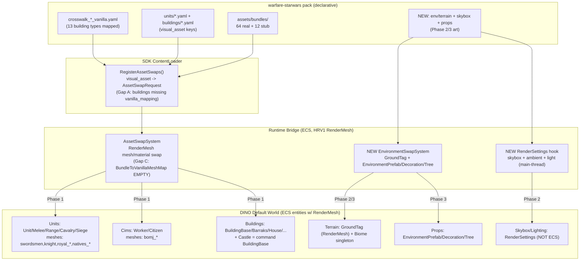

# Full-World Star Wars Total Conversion — Discovery + Phased Plan

**Date:** 2026-05-30 (iter-149+)
**Base branch:** `integration/v0.27.0-reconcile-20260530` (base SHA `f75c3105`)
**Worktree branch:** `docs/full-world-sw-plan-20260530`
**Author:** discovery agent (read-only game inspection + Bridge/dump reflection)

## 0. Problem statement

User reports the **entire in-game world is 100% native** — castle/town-center, cims
(civilians/workers), all buildings, all units, AND the maps/terrain. Prior work (#964)
mapped *combat units*; this blueprint extends the swap surface to the remaining four
layers (**castle/command, cims, buildings, maps/environment**) and defines the
genuinely-new asset class (terrain/biome/skybox/props).

This is a **discovery + planning doc**, not an implementation. All game data below is
from **read-only inspection**: the live debug-log mesh survey, the entity-archetype
dumps at `BepInEx/dinoforge_dumps/dump_20260531T012328Z/`, and the Bridge/VanillaCatalog
source. No deploy was performed (a deploy-lane agent held the GameControlCli pipe; we
stayed read-only as instructed).

---

## 1. DINO world layers — the swap surface (discovered)

DINO's `Default World` holds **111 unit archetypes, 214 building archetypes, 1 projectile
archetype, 154 other** (per `VanillaCatalog built:` log line, stable across 8 builds).
The world is built from ECS entities that, with very few exceptions, carry a
`Unity.Rendering.RenderMesh` shared component (Hybrid Renderer V1 — confirmed:
`ResolveRenderMeshType` resolves `Unity.Rendering.RenderMesh`, NOT HRV2). **This is the
single load-bearing fact: every visible layer below renders through the same
`RenderMesh.mesh` / `RenderMesh.material` fields the existing AssetSwapSystem mutates.**

### 1.1 Marker components found in the archetype dump (Default World)

| Layer | DINO marker component(s) | Count | Carries RenderMesh? |
|---|---|---|---|
| **Units (combat)** | `Components.Unit`, `MeleeUnit`(84), `RangeUnit`(37), `CavalryUnit`(14), `SiegeUnit`(13) | 121 `Unit` | Yes |
| **Cims / population** | `Components.Citizen`, `Worker`, `WorkerPoint`(41), `WorkerPlace`(41), `Housemate`(13), `CitizenLoiteringData`, `EnemyCitizen`, `UndeadCitizen`, `WorkersEmployment`/`WorkersDistributionPriority` | — | Yes (Citizen has RenderMesh; `bomj_*` meshes) |
| **Buildings (incl. castle/command)** | `Components.BuildingBase`(216), `Barraks`(17), `House`/`HouseBase`(13), `Farm`, `Granary`, `Hospital`, `ForesterHouse`, `StoneCutter`, `IronMine`, `Storage*`(28), `Producer*`(26), `TowerPlace`/`TowerData`(40), `GateBase`/`GateState`/`WallMerge`/`EnemyWallTag` | 214 archetypes | Yes |
| **Resource nodes** | `ResourceSource`/`ResourceSourceBase`(11), `PickableResource`, `ResourcePlantPrefabs`, `Tree`(forest resource) | — | Yes |
| **Environment props** | `Components.EnvironmentPrefab`/`EnvironmentPrefabData`(24), `Decoration`/`DecorationBaseData`(13), `Tree`, `CleanableDecoration`, `BurialGroundBase` | — | Yes (`EnvironmentPrefab` signature includes `RenderMesh`) |
| **Terrain / ground** | `Components.RawComponents.GroundTag` | — | **Yes** (see 1.3) |
| **Map / biome (data)** | `BiomeOverrides`, `biomesColors`, `biomeId`, `MapEditorBiomePaintSingleton`, `BiomesIdWalkableMapping`, `biomesOverlayData` | singletons | n/a (data, drives ground material) |

> **No explicit Faction component** (confirmed) — faction is implicit via `Components.Enemy`(129)
> + unit-type markers. Castle/town-center is **not** a distinct marker; it is a `BuildingBase`
> archetype (the player's main building). The SW pack already models it as
> `rep_command_center` / `cis_tactical_center` (`building_type: command`).

### 1.2 Cims (civilians/workers) — the `bomj_*` meshes

The live mesh survey (debug log, `[DIAGNOSTIC] Vanilla mesh name survey`) shows the
civilian/worker population renders with meshes named **`bomj_*`** (`bomj_ban_1..4`,
`bomj_fork_1..4`, `bomj_rip_1..4`, `bomj_shield_1..4`, `bomj_big_1`) — "bomj" is the
DINO dev slang for the peasant/citizen body. These coexist with the `Worker`/`Citizen`
ECS markers. **Cims are swappable exactly like units** (RenderMesh + `Components.Worker`/
`Components.Citizen` archetype filter). SW equivalent: clone-cadet / worker-droid / pit-droid.

### 1.3 Terrain — `GroundTag` is RenderMesh-backed (KEY FINDING)

The `GroundTag` archetype signature (from dump) is:

```
BuiltinMaterialPropertyUnity_LightData + ... + ChunkWorldRenderBounds + GroundTag +
HybridChunkInfo + LocalToWorld + PerInstanceCullingTag + RenderBounds + RenderMesh +
Rotation + Static + Translation + WorldRenderBounds
```

**Terrain ground IS an ECS entity carrying `RenderMesh`** → the *same* swap mechanism
(material field on RenderMesh) can re-skin the ground. The terrain *look* is further
driven by the **biome system** (`MapEditorBiomePaintSingleton`, `biomesColors`,
`BiomesIdWalkableMapping`) — biomes paint ground material/color. Swapping the
ground `RenderMesh.material` (sand/desert for Tatooine, grass for Naboo, etc.) is the
hook. Skybox is NOT an ECS entity (see Unknowns §6).

### 1.4 Map list / named maps

DINO does not expose Tatooine/Naboo/Umbara/Coruscant as built-in maps. It has a
**`Systems.MapEditor`** subsystem (`MapEditorWorldLoaderSystem`, `RegenerateMapSystem`,
`MapEditorPaintSystem`, `MapEditorBiomePaintSingleton`) and `Systems.WorldLoading` +
`Systems.WeatherSystems` (`PrecipitationDrawSystem`, `WindSystem`). The SW maps are
therefore **themed re-skins of existing DINO maps** (biome material + skybox + prop
swaps applied on top of whatever map the player loads), NOT new scene files in Phase 1–3.
Authoring brand-new map geometry would require the MapEditor save format (out of scope;
flagged as the largest unknown).

---

## 2. Map / environment system — what's swappable & the hook

| Sub-layer | DINO mechanism | Swappable via our Bridge? | Hook |
|---|---|---|---|
| Ground terrain mesh/material | `GroundTag` ECS entity + `RenderMesh` + biome paint | **Yes** | RenderMesh material swap on `GroundTag` query (new env-swap path) |
| Biome color/look | `MapEditorBiomePaintSingleton`, `biomesColors` (data singleton) | Partial | Override biome color singleton OR swap ground material (material swap is simpler/robust) |
| Environment props (rocks/trees/structures) | `Components.EnvironmentPrefab`/`Decoration`/`Tree` ECS entities + RenderMesh | **Yes** | RenderMesh mesh+material swap filtered by `EnvironmentPrefab`/`Decoration`/`Tree` |
| Skybox | Unity `RenderSettings.skybox` (scene-level, NOT ECS) | **Unknown** | Needs main-thread `RenderSettings.skybox = mat` set from a MonoBehaviour/Harmony hook (NEW mechanism) |
| Lighting/ambient | Unity `RenderSettings.ambient*` / directional light | **Unknown** | Same as skybox — `RenderSettings` set, new mechanism |
| Weather | `Systems.WeatherSystems` (`PrecipitationDrawSystem`, `WindSystem`) | Read-only for now | Out of scope (polish) |

**Conclusion:** ground + props are reachable through the **existing RenderMesh swap
mechanism** (extend AssetSwapSystem to query `GroundTag`/`EnvironmentPrefab`/`Decoration`/
`Tree`). Skybox + lighting are the **one genuinely new mechanism** — they live on Unity's
scene-level `RenderSettings`, not ECS, and require a small main-thread setter (Harmony
postfix on scene load, or the existing Win32→main-thread dispatcher).

---

## 3. Current swap pipeline (as built) — gaps

1. **Registration** (`ContentLoader.RegisterAssetSwaps`, lines 609–648): for every
   unit/building with a `visual_asset`, if the bundle file exists, registers an
   `AssetSwapRequest`. **Gap A:** building swaps (line 643) are registered WITHOUT a
   `vanilla_mapping` (4th ctor arg) — so buildings cannot be archetype-filtered and fall
   through to the RenderMesh-only query. **Gap B:** cims, terrain, and props have NO
   registration path at all.
2. **Application** (`AssetSwapSystem.TrySwapRenderMeshFromBundle`): loads mesh/material
   from the mod bundle, queries `RenderMesh` (+ optional archetype filter), and mutates
   `RenderMesh.mesh`/`.material`. **Gap C (BLOCKING):** the entity swap is gated by
   `BundleToVanillaMeshMap` which is **EMPTY** → the system runs in **DIAGNOSTIC MODE**
   and skips all swaps. This is why the world is still 100% native. The map must be
   populated with `{ bundle-substring → [vanilla mesh-name substrings] }` using the live
   mesh survey (§1.1/§4).
3. **Disk-patch (Phase 1 of swap)** depends on the Addressables catalog key matching;
   mod bundles use filenames as keys, so catalog lookup usually misses → entity swap
   (Phase 2) is the real mechanism (already the documented design).

---

## 4. Asset manifest (5 layers: castle/cims/buildings/units/maps)

Bundle audit: **64 real bundles + 12 stubs (90 bytes)** under
`packs/warfare-starwars/assets/bundles/`. Stubs = building meshes needing art.

### Layer 1 — Units (combat) — mostly HAVE
- **Have-now (real bundle):** clone troopers, ARC, droids (B1/B2/BX/droideka), Grievous,
  vehicles (BARC, AT-TE, V-19, tri-fighter, HMP gunship), ~tracked in
  `addressables.yaml` + `bundles/`. ~50 unit/vehicle bundles real.
- **Vanilla mesh targets** (for `BundleToVanillaMeshMap`): `swordsmen`, `spearman`,
  `knight`, `horseman`, `archer`-class (`royal_*`, `natives_*`), siege (`royal_battering_ram`).
- **Stub/needs-art (#973):** none of the 12 stubs are units (all buildings).

### Layer 2 — Cims / population — NEEDS new mapping + likely new art
- **Vanilla mesh targets:** `bomj_ban_*`, `bomj_fork_*`, `bomj_rip_*`, `bomj_shield_*`,
  `bomj_big_1` (the worker/citizen bodies); archetype filter `Components.Worker` /
  `Components.Citizen`.
- **SW equivalent:** clone cadet / worker-droid / pit-droid / GNK power droid.
- **Asset status:** NO dedicated cim bundle exists yet → **new-art needs sourcing**
  (1–2 low-poly worker-droid meshes cover all `bomj_*`).

### Layer 3 — Buildings (incl. castle/command) — PARTIAL
- **Crosswalk EXISTS:** `assets/crosswalk_republic_vanilla.yaml` +
  `crosswalk_cis_vanilla.yaml` map **all 13 vanilla building types**
  (house, farm, granary, hospital, forester_house, stone_cutter, iron_mine, barracks,
  builder_house, engineer_guild, gate, soul_mine, + command/castle) → SW replacements.
- **Have-now (real bundle):** `sw-rep-command-center`, `sw-cis-command-center`,
  `sw-cis-droid-factory`, `sw-cis-hangar-bay`, towers, ~14 real building bundles.
- **Stub/needs-art (#973 — 12 × 90-byte stubs):** `sw-assembly-line`, `sw-blast-wall`,
  `sw-durasteel-barrier`, `sw-guard-tower`, `sw-heavy-foundry`, `sw-mining-facility`,
  `sw-processing-plant`, `sw-skyshield-generator`, `sw-tech-union-lab`,
  `sw-tibanna-refinery`, `sw-vulture-nest`, `sw-weapons-factory`.
- **Vanilla mesh targets:** buildings need a mesh-name survey pass (current diagnostic
  only surveyed the unit-filtered query → no building mesh names captured yet; run an
  un-filtered or `BuildingBase`-filtered survey to populate the map).

### Layer 4 — Castle / town-center
- Modeled as `building_type: command` (`rep_command_center` health 2200 /
  `cis_tactical_center` 1400). Bundles **real** (`sw-rep-command-center`,
  `sw-cis-command-center`). Vanilla target: the player main-building `BuildingBase`
  archetype (mesh survey TODO).

### Layer 5 — Maps / environment — NEW CLASS, needs sourcing
- **Terrain ground material:** desert (Tatooine), lush (Naboo), shadow/ash (Umbara),
  urban/metal (Coruscant) — **new textures/materials needed** (CC0 tileable terrain).
- **Skybox cubemaps:** 4 themed skyboxes (binary suns, Naboo sky, Umbara overcast,
  Coruscant cityscape) — **new cubemap art needed**.
- **Environment props:** moisture vaporators, rock formations, droid debris — re-skin
  `EnvironmentPrefab`/`Decoration`/`Tree` (vanilla `Tree`/rock meshes) — **new prop meshes**.
- **Asset status:** ENTIRELY new-class-needs-sourcing; tie to #946 art-licensing strategy
  (Kenley space-kit CC0 already vendored under `assets/source/kenney/`).

---

## 5. Phased plan

### Phase 1 — Entity swap for castle / cims / buildings / units (CODE-FIRST, uses existing+stub bundles)
**Goal:** make the existing 64 real bundles actually appear in-game (today they're inert —
DIAGNOSTIC MODE). This is the highest-leverage, lowest-new-art phase.

- **Code:**
  1. Run a **building/cim mesh-name survey** — extend the diagnostic dump in
     AssetSwapSystem to also query `BuildingBase`, `Worker`/`Citizen` (not just the
     unit-RenderMesh path) so we capture vanilla building + `bomj_*` mesh names.
  2. **Populate `BundleToVanillaMeshMap`** (AssetSwapSystem) — or, better, replace the
     hardcoded map with a data-driven map sourced from the pack crosswalk YAMLs
     (`crosswalk_*_vanilla.yaml`) so it's declarative (Legal Move: patch mapping).
  3. **Fix Gap A** — pass `vanilla_mapping` for building swaps in
     `ContentLoader.RegisterAssetSwaps` (line 643) so buildings get archetype-filtered.
  4. **Fix Gap B** — add cim registration: map `Components.Worker`/`Citizen` to a SW
     worker bundle.
- **Assets:** existing 64 real bundles (units, vehicles, ~14 buildings, 2 command
  centers); accept 12 stub buildings render as vanilla until Phase art lands.
- **Verifies it:** `game_query_entities` + `game_screenshot` before/after a swap on a
  known mesh (e.g. `swordsmen` → clone trooper); debug log
  `TrySwapRenderMeshFromBundle: swapped N/M entities` > 0; external VLM judge receipt.

### Phase 2 — Themed terrain + skybox per SW map (the ENV layer, NEW mechanism)
**Goal:** ground + sky read as Tatooine/Naboo/Umbara/Coruscant.

- **Code:** new **`EnvironmentSwapSystem`** (sibling of AssetSwapSystem) that:
  1. queries `GroundTag` RenderMesh entities → swaps ground material (terrain texture).
  2. sets `RenderSettings.skybox` + ambient on scene load via a **main-thread hook**
     (Harmony postfix on the gameplay-scene load, or MainThreadDispatcher) — this is the
     ONE new mechanism not covered by ECS RenderMesh.
  3. optional: override `MapEditorBiomePaintSingleton`/`biomesColors` to recolor biomes.
- **Assets:** 4 terrain material sets + 4 skybox cubemaps (new-class sourcing, #946).
- **Verifies it:** screenshot of ground + sky per theme; VLM judge "is this a desert
  with twin suns?".

### Phase 3 — Props + lighting polish
**Goal:** environment props + lighting/ambient match each theme.

- **Code:** extend EnvironmentSwapSystem to swap `EnvironmentPrefab`/`Decoration`/`Tree`
  RenderMesh (props: vaporators, rocks, debris) + set directional light color/intensity
  via `RenderSettings`.
- **Assets:** prop meshes (moisture vaporator, rock formations, droid wreckage), per-theme
  lighting configs.
- **Verifies it:** full-scene screenshot per map; side-by-side native vs SW; judge receipt.

---

## 6. Biggest unknowns (flagged)

1. **Skybox/lighting swappability (HIGH):** skybox + ambient are Unity **scene-level
   `RenderSettings`**, NOT ECS — our RenderMesh Bridge does NOT reach them. Needs a NEW
   main-thread setter (Harmony postfix on scene load or MainThreadDispatcher). Unverified
   that `RenderSettings.skybox` is honored under DINO's custom render pipeline
   (`RenderFeature.Silhouette` is present → custom URP/SRP feature; skybox handling may
   differ). **Must be spiked first in Phase 2.**
2. **Building/cim mesh names UNKNOWN (MEDIUM):** the current diagnostic survey is filtered
   to the unit RenderMesh query, so we only have unit mesh names. A `BuildingBase`/`Worker`
   survey pass is a prerequisite to populating the swap map for those layers.
3. **`BundleToVanillaMeshMap` empty → everything inert (BLOCKING but easy):** this is the
   single reason nothing swaps today; Phase 1 step 2 unblocks it.
4. **Custom render pipeline (`RenderFeature.Silhouette`) (MEDIUM):** DINO uses a custom
   render feature; confirm RenderMesh material swaps survive the silhouette pass (units
   already proven swappable, so likely fine for ground too — verify on terrain).
5. **HRV1 confirmed, no HRV2 path needed (RESOLVED):** `ResolveRenderMeshType` resolves
   `Unity.Rendering.RenderMesh` (HRV1) — the mutable mesh/material FieldInfo path applies.
6. **New map geometry (OUT OF SCOPE):** authoring brand-new map layouts needs the
   `Systems.MapEditor` save format; Phases 1–3 re-skin existing maps only.

---

## 7. Conversion-layer diagram



---

## 8. Summary table — 5-layer asset status

| Layer | Vanilla marker / mesh | SW mapping exists? | Bundle status | Swap mechanism | Phase |
|---|---|---|---|---|---|
| Units | `Unit`/`MeleeUnit`… ; `swordsmen`,`royal_*`,`natives_*` | Yes (units/*.yaml) | HAVE (~50 real) | RenderMesh (existing) | 1 |
| Cims | `Worker`/`Citizen` ; `bomj_*` | No (new) | MISSING (new art) | RenderMesh (existing) | 1 |
| Buildings | `BuildingBase`/`Barraks`/… | Yes (crosswalk_*) | PARTIAL (14 real, 12 stub #973) | RenderMesh (existing, fix Gap A) | 1 |
| Castle/command | `BuildingBase` (command) | Yes (rep/cis command center) | HAVE (2 real) | RenderMesh (existing) | 1 |
| Maps/terrain | `GroundTag`+RenderMesh+biome | No (new) | MISSING (terrain mat) | RenderMesh (NEW EnvSwapSystem) | 2 |
| Maps/skybox+light | `RenderSettings` (NOT ECS) | No (new) | MISSING (cubemaps) | **NEW RenderSettings hook** | 2 |
| Props | `EnvironmentPrefab`/`Decoration`/`Tree` | No (new) | MISSING (prop meshes) | RenderMesh (NEW EnvSwapSystem) | 3 |

**The one-line blueprint:** four of five layers (units, cims, buildings, castle, ground,
props) all render through HRV1 `RenderMesh` and are reachable by the *existing* swap
mechanism — the only true blocker is the empty `BundleToVanillaMeshMap` (DIAGNOSTIC MODE)
plus missing per-layer mesh-name surveys and art. Only **skybox + lighting** need a
genuinely new (non-ECS) `RenderSettings` mechanism.
