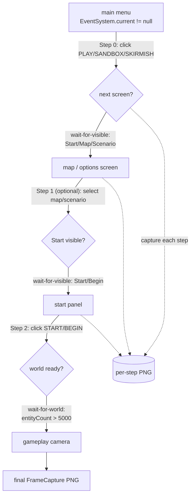

# Menu → Skirmish Navigation Flow Map (2026-05-30)

## Problem

`#972` landed **EventSystemDriver** (`game_ui_pointer` — fires real in-process EventSystem
pointer events; OS-synthetic input is NOT delivered to DINO's EventSystem). `#980` landed
**FrameCapture** (reliable PNG in any state). What was missing: the multi-step UI *sequence*
to go main menu → start a skirmish → reach the gameplay camera. RPCs that create the
world-loading singleton load a world but never fire the menu→level UI transition, so the
gameplay camera was never reached and FrameCapture had no in-game frame to photograph.

## Solution

`NavigationScripter` (`src/Runtime/Capture/NavigationScripter.cs`) composes the existing
primitives into one parameterized, robust routine:



### Step model (data-driven, selector-list resolution)

Each step lists an **ordered set of candidate selectors** and clicks the first that resolves
to an *actionable* node (DINO's `MainMenuButton:Selectable` is handled by the EventSystem
driver). This tolerates label/locale/build variance — we never hard-bind to one label.

| Step | Candidate selectors (first actionable wins) | Wait-for condition | Optional |
|------|---------------------------------------------|--------------------|----------|
| 0 open play menu | `label=Skirmish`, `label=Free Play`, `label=Sandbox`, `label=New Game`, `label=Play`, `name=PlayButton`, … | any-visible: `Start`/`Map`/`Scenario`/`role=button` | no |
| 1 select map/scenario | `name=MapSelect`, `label=Map`, `label=Scenario`, `label=Random`, `role=toggle` | any-visible: `Start`/`Begin`/`name=StartButton` | **yes** (some builds skip straight to Start) |
| 2 start match | `label=Start`, `label=Begin`, `label=Confirm`, `label=Play`, `name=StartButton` | world-ready: `entityCount > 5000` | no |

### Robustness

- **Wait-for-condition, not fixed sleeps**: between steps the scripter polls
  `UiSelectorEngine.EvaluateState(sel, "visible")` (next-canvas appears) or the active ECS
  world entity count (`World.DefaultGameObjectInjectionWorld`, `IncludePrefab`) until the
  condition holds or the per-step timeout elapses. A short post-condition `settleMs` lets the
  freshly-shown screen finish its open animation before the screenshot.
- **Map-select sub-flow** is an *optional* step — failure to resolve it is logged and skipped,
  not treated as a blocking failure.
- **Per-step trace**: the returned `NavigationResult.steps[]` records, for each step, the
  selector that actually resolved, whether the wait condition was satisfied, the screenshot
  path, and a diagnostic detail — so a verify-agent sees exactly *where* a flow stalled
  (`blockedAtStep`).

## Surfaces

- **In-process**: `NavigationScripter.Run(plan, screenshotDir, finalShot)` (main-thread only).
- **Bridge RPC**: `navigateToGameplay` / `navigate_to_gameplay`
  (`GameBridgeServer.HandleNavigateToGameplay`) — marshals to the main thread, 120 s ceiling.
- **GameClient**: `NavigateToGameplayAsync(plan?, screenshotDir?, finalShot?)`.
- **CLI**: `GameControlCli navigate-to-gameplay [<plan>] [screenshotDir=<dir>] [finalShot=<path>]`.
- **MCP tool**: `game_navigate_to_gameplay(plan="skirmish", screenshot_dir?, final_shot?, pipe_name?)`.

## Calibrating selectors against a live build

DINO's exact native menu labels were not documented offline. Before/while running, dump the
live UI tree to confirm/extend the candidate lists per build:

```bash
GameControlCli ui-tree              # full live UI hierarchy (names + labels + roles)
GameControlCli ui-tree "role=button"
```

Then call:

```bash
GameControlCli navigate-to-gameplay skirmish finalShot=docs/screenshots/gameplay-camera-reached-20260530.png
```

The candidate lists in `SkirmishPlan()` are the single place to extend when a build uses a
label not yet covered — no other code changes are needed.
