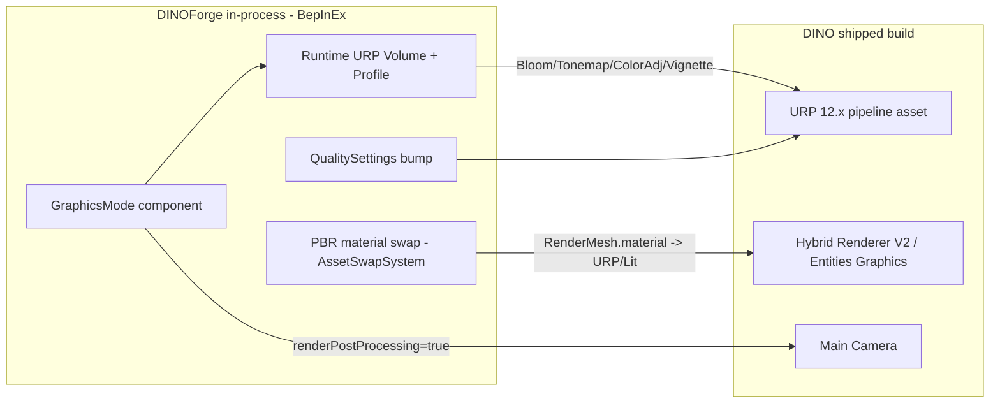

# Realistic GFX Mode — R&D Feasibility + Path (2026-05-30)

**Goal:** A toggle that shifts DINO from its low-poly, TABS-like flat look toward a
Manor-Lords-like high-fidelity look, in-process via BepInEx, "powered by Vulkan/DX12
where allowed." This was explicitly to be evaluated seriously, not dismissed.

**Verdict up front:** A *meaningful* cinematic uplift is **achievable and low-risk**
(post-processing + quality + PBR material/mesh swaps). A *literal* "Manor Lords-like"
result is **partially reachable** — the lighting/post/quality half is in reach; the
asset half (geometry density, authored PBR textures, real GI) is bounded by what
assets we author, not by engine limits. A render-pipeline replacement (Tier C) is
**not recommended / effectively infeasible** on a shipped build.

---

## 1. DINO's current renderer + graphics API (confirmed by inspection)

Inspected the shipped game at
`G:\SteamLibrary\steamapps\common\Diplomacy is Not an Option\Diplomacy is Not an Option_Data`.

**Render pipeline: URP (Universal Render Pipeline) 12.x — NOT Built-in RP.**
Evidence (`_Data/Managed/`):
- `Unity.RenderPipelines.Universal.Runtime.dll`
- `Unity.RenderPipelines.Universal.Shaders.dll`
- `Unity.RenderPipeline.Universal.ShaderLibrary.dll`
- `Unity.RenderPipelines.Core.Runtime.dll` (SRP core — the Volume framework lives here)
- `Unity.RenderPipelines.ShaderGraph.ShaderGraphLibrary.dll`

`globalgamemanagers` string scan also shows
`Hidden/Universal Render Pipeline/StencilDeferred` — i.e. DINO has the URP
**Deferred** rendering path available (relevant for many real-time lights).

> **This is the single most important finding and it *improves* the original brief.**
> The task assumed "likely Built-in RP" and PostProcessing v2. DINO is URP, which has
> a *first-class, integrated* post-processing system via the **Volume framework**. We do
> NOT need the legacy PostProcessing v2 package (it isn't shipped, and mixing it with URP
> would conflict). We use `UnityEngine.Rendering.Volume` + URP `VolumeComponent` overrides.

**ECS rendering: Hybrid Renderer V2 / Entities Graphics.** Evidence:
`Unity.Rendering.Hybrid.dll`, `Unity.Entities.Hybrid*.dll`, `Unity.Transforms.Hybrid.dll`.
All units/buildings are ECS entities drawn via `RenderMesh` shared components (already
documented in `AssetSwapSystem.cs`). **Consequence:** PBR material swaps must replace the
`Material` on the entity's `RenderMesh` (the existing AssetSwap path already does this),
and the replacement material must use a **URP** shader (`Universal Render Pipeline/Lit`),
not Built-in `Standard`.

**Engine / runtime:** Unity 2021.3.45f2, Mono, BepInEx 5.4.23.5 (we run in-process,
can Harmony-patch and `AddComponent` on the main thread). `boot.config` shows
`gfx-enable-native-gfx-jobs=1`, `hdr-display-enabled=0`, `force-windowed=1`.

**Current graphics API:** Unity default selection (DX11 on Windows for a 2021.3 URP
title, unless overridden). Not pinned in `boot.config`. See Tier A.



---

## 2. Per-tier feasibility

### TIER A — Force graphics API (`-force-vulkan` / `-force-d3d12`) — LOW value

- **What it is:** Unity standalone players accept `-force-vulkan`, `-force-d3d12`,
  `-force-glcore`, `-force-d3d11`. Selects the backend `GraphicsDeviceType`.
- **DINO current API:** not pinned in `boot.config`; Unity auto-selects (DX11 typical
  for 2021.3 URP on Windows).
- **Verdict / what it buys:** **API ≠ fidelity.** Switching DX11→DX12/Vulkan changes
  *how* draw calls are submitted (threading, overhead), not *what* is rendered. On a
  URP title it can change CPU-side frame pacing and, with DOTS/Burst + many entities,
  DX12/Vulkan's better multithreaded submission *may* improve frame time in big battles
  — but it adds **zero visual fidelity** on its own and risks driver-specific
  regressions/crashes. There is no shader/effect in URP that is Vulkan-only here.
- **Hook:** We launch the game ourselves (`Start-Process <exe>`), so we can append
  `-force-vulkan`/`-force-d3d12` to launch args, OR expose it as a config note. We do
  **not** recommend forcing it by default. Treat it as an *optional perf experiment*,
  decoupled from the "realistic look" feature. **The phrase "powered by Vulkan/DX12" in
  the brief is best read as a perf-headroom lever, not the source of fidelity.**

### TIER B — The real achievable lift on URP via BepInEx — RECOMMENDED, FOCUS HERE

All four sub-levers are feasible in-process. Ordered by visible-lift-per-risk:

**B1. Post-processing stack injection (biggest visible lift, lowest risk) — DONE (PoC).**
- URP evaluates a global `Volume` stack per camera. We create a DINOForge-owned
  `GameObject` + `Volume` (`isGlobal=true`, high `priority`) with a runtime-built
  `VolumeProfile`, and add overrides: `Tonemapping(ACES)`, `Bloom`, `ColorAdjustments`
  (contrast/saturation/exposure), `Vignette`.
- **Critical gotcha (confirmed):** URP only runs the post stack on cameras with
  `UniversalAdditionalCameraData.renderPostProcessing == true`. DINO's camera may ship
  with it off, so the toggle must flip that flag on `Camera.main`
  (`cam.GetUniversalAdditionalCameraData().renderPostProcessing = true`).
- **SSAO caveat:** URP **SSAO is a `ScriptableRendererFeature`, not a Volume override.**
  It cannot be enabled from a Volume alone. Enabling it at runtime means injecting a
  `ScreenSpaceAmbientOcclusion` feature into the active `UniversalRendererData`'s
  `rendererFeatures` list (or a custom CommandBuffer AO pass). Deferred to Phase 3 to
  keep Phase 1 volume-only. (The PoC documents this inline.)
- **Perf:** Bloom + tonemap + color grading + vignette are cheap full-screen passes
  (a few % GPU at 1080p). SSAO is the expensive one (~1–3 ms). Acceptable.
- **Hook:** `src/Runtime/Graphics/GraphicsMode.cs` (built this session).

**B2. PBR material swap (the "material half" of Manor-Lords-like).**
- Replace flat unit/building materials with `Universal Render Pipeline/Lit` materials
  carrying metallic/normal/roughness/AO maps (e.g. the BF2-ripped PBR textures tracked
  under #973).
- **Hook:** the existing `AssetSwapSystem` already swaps `RenderMesh.material` on live
  entities — the exact mechanism needed. We add a "PBR upgrade" swap set that points
  vanilla addresses at URP/Lit materials. **Constraint:** shader MUST be URP/Lit (the
  game's shader variants are URP; Built-in `Standard` would render magenta).
- **Perf:** normal/AO sampling is cheap; cost is texture memory. Fine for hundreds of
  instances given GPU instancing via Hybrid Renderer.
- **Risk:** medium — requires correct addressable-key targeting (custom keys, not asset
  paths — see ECS facts) and authored/validated textures. This is content work on top of
  an existing engine path.

**B3. Lighting / shadows / quality bump.**
- `QualitySettings.shadowDistance`, `shadowResolution`, `shadowCascades`,
  `QualitySettings.SetQualityLevel`, plus URP asset fields (shadow atlas size, MSAA,
  render scale) reachable via the active `UniversalRenderPipelineAsset`
  (`GraphicsSettings.currentRenderPipeline`). Bump ambient via `RenderSettings`.
- **Perf:** higher shadow res/distance + extra cascades is the main GPU cost; gate by
  tier. **Risk:** low (pure settings), but must be reversible (cache + restore on toggle
  back to Vanilla).

**B4. High-poly mesh swaps (the "geometry half").**
- The hi-fi mesh swaps (#964 swap layer + #973 BF2 assets) are the geometry side of
  "Manor Lords-like." Same `AssetSwapSystem` `RenderMesh.mesh` path as B2.
- **Risk/cost:** highest — asset authoring + LOD + bundle build at 2021.3.45f2. Engine
  path exists; this is bounded by asset production, not feasibility.

### TIER C — Runtime swap Built-in RP → URP/HDRP — N/A, and HDRP swap is INFEASIBLE

- The brief's Tier C presumed DINO was Built-in RP. **It is already URP**, so
  "Built-in → URP" is moot.
- The *real* Tier-C question becomes **"URP → HDRP at runtime on a shipped build."**
  **Honest verdict: effectively infeasible.** Blockers:
  1. **Shaders.** Every material in the game references URP shader variants compiled
     into the shipped shader bundles. HDRP uses entirely different shaders/passes.
     Swapping the pipeline asset would render the entire scene magenta; you'd have to
     re-author and re-import *every* material and re-ship shader variant collections —
     not doable in-process.
  2. **Pipeline asset + global settings** are baked; HDRP requires `HDRenderPipelineAsset`
     + `HDRP Global Settings` + volume framework profiles that don't exist in the build,
     and HDRP package assemblies are **not shipped** (only URP DLLs are present).
  3. **Hybrid Renderer V2** material property layout differs across pipelines; the
     45K-entity DOTS render path is wired for URP.
  4. **Lighting/GI** (HDRP physical lights, exposure, volumetrics) need authored data
     not present.
- **Conclusion:** Do not promise pipeline replacement. Everything "Manor-Lords-like"
  we can realistically deliver is achieved *within URP* (Tier B). HDRP-grade results
  would require shipping a different game.

---

## 3. SOTA: how shipped Unity games get graphics-overhaul mods

- **Cities: Skylines — "Lumina" / LUT mods (closest analog).** C:S is a SRP-era Unity
  title; graphics mods inject **post-processing + LUTs at runtime** through the engine's
  volume/post stack via Harmony, rather than touching the pipeline. This is exactly the
  Tier-B1 pattern: a mod-owned post-process volume layered over the game's camera.
  (`cslmodding.info/lut`, Lumina on Steam Workshop / Skymods.)
- **BepInEx + URP Volume framework (general pattern).** The proven recipe for any
  shipped URP game: create a `Volume` with a runtime `VolumeProfile`, add
  `VolumeComponent` overrides (`Bloom`, `Tonemapping`, `ColorAdjustments`…), and ensure
  the camera has `renderPostProcessing` enabled. Custom effects beyond the built-ins use
  a `ScriptableRendererFeature` injected into the renderer data. (Unity URP docs:
  "Custom post-processing with Volume support"; Noveltech "Modifying PostProcessing
  Parameters at Runtime in URP"; Cyan/Febucci URP PP guides.)
- **BepInEx.GraphicsSettings** — community plugin that bumps Unity quality/graphics
  settings at runtime: validates the Tier-B3 lever (QualitySettings/URP-asset tweaks
  from a plugin).
- **Valheim / RimWorld** — large BepInEx ecosystems; graphics tweaks are overwhelmingly
  post-processing + settings + asset/material swaps, never pipeline replacement.

**Takeaway:** Every successful shipped-game graphics overhaul is **post-process +
settings + asset/material swap**, layered on top of the existing pipeline via BepInEx.
Nobody hot-swaps the render pipeline. Our plan matches the proven pattern 1:1.

Sources:
- Unity URP — Custom post-processing with Volume support (docs.unity3d.com)
- Noveltech — Modifying PostProcessing Parameters at Runtime in URP (noveltech.dev)
- Cyan — Post Processing in the Universal RP (cyangamedev.wordpress.com)
- Cities: Skylines LUT modding (cslmodding.info/lut) + Lumina (Steam Workshop / Skymods)
- BepInEx.GraphicsSettings (github.com/BepInEx/BepInEx.GraphicsSettings)
- BepInEx (bepinex.org)

---

## 4. Recommended GRAPHICS-MODE TOGGLE design

A single low↔high switch:

| Tier | Post-process | PBR materials | Quality/Lighting | Meshes |
|------|--------------|---------------|------------------|--------|
| **Vanilla** (default) | none (DINOForge volume disabled) | vanilla | vanilla | vanilla |
| **High** | ACES tonemap + bloom + color grading + vignette (+SSAO Phase 3) | URP/Lit PBR swap (#973) | bumped shadow dist/res/cascades, render scale | hi-poly swap (#964/#973) |

**Wiring:**
- **BepInEx config:** `[Graphics] Tier = Vanilla|High` (added this session,
  `Config.Bind`, default `Vanilla`). This is the source of truth and is read on startup.
- **In-game toggle:** expose in the **F10 mod menu / settings panel** as a Graphics
  section (a dropdown or low/high switch) and/or an F-key. The menu calls
  `GraphicsMode.Toggle()` / sets `ConfiguredTier` then `Apply()` on the main thread.
- **ui_theme integration:** the High tier can ship alongside a themed UI accent so the
  "cinematic mode" reads as a cohesive preset.
- **Reversibility (mandatory):** every lever caches vanilla state and restores on
  switch back to Vanilla. Phase 1 already does this (volume `enabled=false` +
  `renderPostProcessing=false` fully restore vanilla). B3/B2/B4 must cache+restore
  QualitySettings, materials, and meshes respectively.
- **Re-apply triggers:** `SceneManager.activeSceneChanged` (camera is null on menu /
  mid-transition; DINO's PlayerLoop means no `Update()`), plus explicit menu/F-key.

---

## 5. Phased plan

- **Phase 1 — Post-processing injection PoC (DONE this session).**
  `GraphicsMode.cs` + config flag + Plugin wiring. Biggest visible lift, lowest risk,
  fully reversible, off by default. Compiles against shipped URP DLLs. *Expected visible
  change when set to High:* a filmic ACES tone curve (flat → contrasty, richer
  midtones), soft bloom on highlights/snow/muzzle flashes, slightly punchier
  saturation/contrast, and a subtle vignette — the single biggest "TABS-flat →
  cinematic" shift, without touching a single asset.
- **Phase 2 — PBR material swap.** Add a "PBR upgrade" swap set in `AssetSwapSystem`
  targeting vanilla unit/building addresses with URP/Lit + metallic/normal/roughness/AO
  (#973 textures). Validate addressable-key targeting + texture import. Reversible.
- **Phase 3 — Quality/lighting + SSAO renderer feature.** Bump shadow distance/res/
  cascades, render scale, ambient; inject the URP `ScreenSpaceAmbientOcclusion`
  `ScriptableRendererFeature` into the active `UniversalRendererData`. Cache+restore.
- **Phase 4 (optional) — hi-poly mesh swaps** (#964/#973) for the geometry half.
- **Tier-C verdict:** do **not** attempt pipeline replacement (URP→HDRP). Infeasible on
  a shipped build (shaders/assets/assemblies not present). All realistic gains live in
  Tier B within URP.

---

## 6. PoC delivered

- **Files:**
  - `src/Runtime/Graphics/GraphicsMode.cs` — `GraphicsMode` MonoBehaviour +
    `GraphicsTier` enum. Builds & populates a runtime URP `Volume`/`VolumeProfile`
    (ACES tonemap, bloom, color adjustments, vignette), flips
    `renderPostProcessing` on `Camera.main`. Off by default, idempotent, fully
    reversible, graceful-degradation try/catch, no reliance on `Update()`.
  - `src/Runtime/Plugin.cs` — `[Graphics] Tier` config bind; attaches `GraphicsMode`
    to the persistent root; re-applies on `activeSceneChanged`.
  - `src/Runtime/DINOForge.Runtime.csproj` — added non-private references to
    `Unity.RenderPipelines.Core.Runtime` + `Unity.RenderPipelines.Universal.Runtime`.
- **Build:** `dotnet build src/Runtime/DINOForge.Runtime.csproj -c Release
  -p:TargetFramework=netstandard2.0` → **0 errors** (125 pre-existing warnings).
  This compile-checks the entire URP Volume API (Bloom/Tonemapping/ColorAdjustments/
  Vignette/UniversalAdditionalCameraData) against DINO's shipped assemblies.
- **Default state:** OFF (`Tier=Vanilla`). No behavior change unless a user sets
  `Tier=High`. **Not deployed** (per instruction — report code-ready; deploy when the
  game lane is free).
- **Commit:** see branch `feat/realistic-gfx-mode-rnd-20260530` (worktree).

### Verification still owed (honesty note)
Per project rule "assume broken until externally verified": the PoC is **compile-verified
only**. It has NOT been deployed or visually confirmed in-game. Remaining proof: deploy
(`-p:DeployToGame=true`), set `Tier=High`, capture before/after screenshots in a battle
scene, confirm the ACES/bloom shift and that `Tier=Vanilla` restores the exact vanilla
look. Two residual runtime risks to validate: (1) whether DINO's camera setup honors a
3rd-party global Volume at priority 100 (should, per URP global volume semantics), and
(2) `Camera.main` resolves to the gameplay camera (DINO may tag differently — fallback to
`Camera.allCameras` scan may be needed, mirroring `LODManager`).
```
