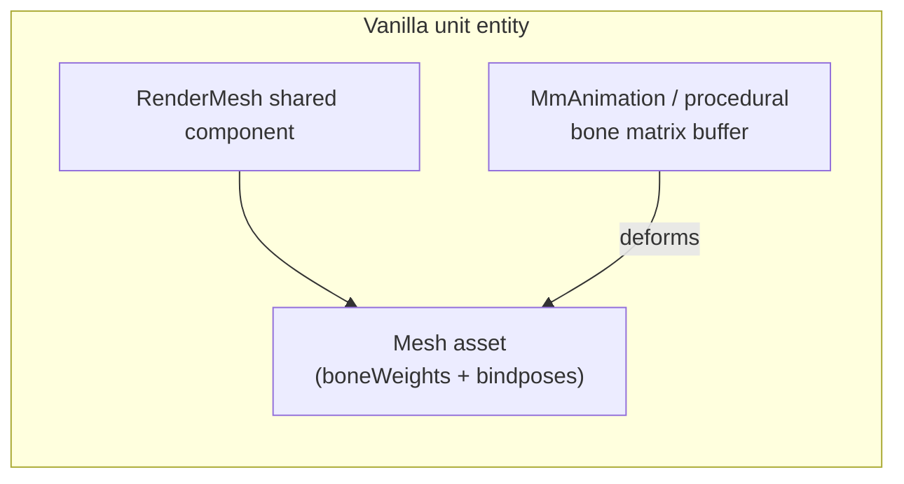

# RIGGING-OPTIMIZER Pipeline (Task #991)

**Date:** 2026-05-31  
**Branch target:** `reconcile3/converge-20260531`  
**Related:** #973 (procedural unit animation + spark VFX), #991 (rigging-optimizer)  
**Problem:** Swapped Star Wars unit meshes appear **static/frozen** while vanilla DINO units animate.

---

## Executive summary

| Layer | Finding |
|-------|---------|
| **DINO rendering** | Gameplay units use ECS **`RenderMesh`** shared components (Hybrid Renderer). Animation is driven by DINO's internal systems (`MmAnimation*`, procedural bone updates), **not** by swapping `GameObject` `SkinnedMeshRenderer` instances in the scene. |
| **SW assets today** | Sketchfab GLBs are imported as **static** meshes (`Rigging: None` per `UNITY_IMPORT_GUIDE.md`). Bundles expose `MeshFilter`/`MeshRenderer` or an SMR whose `sharedMesh` has **no bindposes / bone weights**. |
| **AssetSwapSystem** | Phase 2 copies only `Mesh` + `Material` onto `RenderMesh` via reflection. It **does not** rebind bones or validate skinning compatibility. Assigning a static mesh to an entity whose vanilla mesh was skinned produces a **frozen** silhouette (bind pose + procedural motion mismatch — #973). |
| **Fix order** | (1) Rig/retarget SW meshes to DINO's reference skeleton per archetype → (2) decimate + LOD → (3) bundle as skinned meshes → (4) extend swap path with bindpose validation (prototype landed) → (5) populate `BundleToVanillaMeshMap` from diagnostic survey. |

---

## 1. DINO unit skinning model (findings)

### 1.1 What we know from code and docs

- **`AssetSwapSystem`** documents entity-dump conclusion: DINO uses `Unity.Rendering.RenderMesh` on unit archetypes (`AssetSwapSystem.cs` class header, lines 48–51).
- **Live swap path** mutates `RenderMesh.mesh` and `RenderMesh.material` only (`TrySwapRenderMeshFromBundle`). No `SkinnedMeshRenderer` on ECS entities; no `Animator` in the swap loop.
- **Prefab extraction** prefers `SkinnedMeshRenderer.sharedMesh` when loading mod bundles but then treats the result as a plain `Mesh` for ECS — **bone weights ride on the `Mesh` asset**, not on the SMR component at runtime.
- **DINO animation surface** (from `ComponentMap` / `StatModifierSystem` comments): `Components.MmAnimationPropertyAttackSpeedModifier` and related `MmAnimation*` types adjust animation timing; full bone posing is **game-native procedural**, consistent with #973 ("procedural + spark").
- **Pack intake policy** (`intake_rules.yaml`): `unit_model.requires_rigging: true` — content spec already expects rigged infantry.

### 1.2 Inferred runtime model (to confirm with one diagnostic pass in-game)

**Working hypothesis (high confidence):**

1. Vanilla infantry/hero **share a small set of reference rigs** per body class (humanoid infantry, droid, walker, flyer), not one unique skeleton per cosmetic mesh.
2. All units in a class reuse the **same bindpose count and bone name ordering** on their render meshes; swapping cosmetics means swapping **`Mesh` data that remains compatible with that skeleton**.
3. Buildings and vehicles may use static `RenderMesh` meshes (no skinning) — swaps there can remain static.

**Verification checklist (15 min, in gameplay):**

1. Deploy build with current `AssetSwapSystem` diagnostic pass enabled; load a match with mixed vanilla units.
2. Read `BepInEx/dinoforge_debug.log` for `[DIAGNOSTIC] Vanilla mesh name survey` — record `mesh="..."` names per archetype.
3. For one infantry mesh name, inspect whether `Mesh.bindposes.Length > 0`.
4. Compare bindpose counts across two different vanilla infantry types (e.g. militia vs knight). **If counts match → shared rig retarget is viable.**

### 1.3 What SW raw assets contain

- Import guide explicitly sets **`Rigging: None`** for current SW pipeline (`UNITY_IMPORT_GUIDE.md`).
- `STYLIZATION_GUIDE.md` defers "Full skeleton (60+ bones) → Simplified or none (static model)" — art path optimized for silhouette, not animation.
- `PrefabGenerationService` (PackCompiler) emits **`MeshFilter` + `MeshRenderer`**, not `SkinnedMeshRenderer`, even when skeleton metadata exists — tooling gap aligned with frozen swaps.

---

## 2. Rig + retarget approach for SW meshes

### 2.1 Recommended strategy: **retarget to DINO reference skeleton** (not Rigify-from-scratch per asset)

| Option | Pros | Cons | Verdict |
|--------|------|------|---------|
| **A. Retarget to DINO vanilla bindposes** | Reuses live animation; one rig per archetype class; smallest runtime risk | Requires reference mesh + bone name map once per class | **Primary** |
| **B. Auto-rig (Rigify / Mixamo)** | Fast on static Sketchfab meshes | Bone names/count won't match DINO; still frozen unless retargeted | **Only as step inside A** |
| **C. SMR-only swap on prefab** | Familiar Unity workflow | **Does not apply** — ECS path never updates scene SMRs | **Not sufficient alone** |

### 2.2 Per-archetype reference rig library

Create `packs/warfare-starwars/assets/rig_reference/` (new):

| `vanilla_mapping` / unit class | Reference source | Retarget profile |
|-------------------------------|------------------|------------------|
| `line_infantry`, `ranged_infantry`, melee variants | Vanilla militia/knight mesh (from diagnostic) | `dino_humanoid_infantry` |
| CIS droid infantry | Vanilla droid mesh | `dino_droid_humanoid` |
| Walkers / large vehicles | Static or articulated rig TBD | `dino_walker` or static |
| Flyers | Static mesh + bank animation | `static` or `dino_flyer` |

Store for each profile:

- `reference_mesh.glb` (or `.fbx`) exported from DINO Addressables / diagnostic capture  
- `bone_names.json` — ordered list matching `Mesh.bindposes`  
- Blender armature `.blend` marked as **source of truth** for weight transfer  

### 2.3 Blender pipeline (automated)

Script: `packs/warfare-starwars/assets/tools/blender_rig_and_decimate.py`

1. Import SW `normalized.glb` (static).  
2. Import reference armature; **weight transfer** (Data Transfer modifier) from reference mesh → SW mesh.  
3. Validate: every vertex has weights; bone count == reference; no empty groups.  
4. **Decimate** to tier budget (infantry 800–2k tris LOD0).  
5. Generate **LOD1/LOD2** (60% / 30% tris) with bone weights preserved.  
6. Export `working/<asset_id>/rigged.glb` + validation JSON.

### 2.4 Unity bundle build changes

Update `GenerateStarWarsPrefabsFromModels.cs` (or PackCompiler prefab path) for **rigged infantry**:

- Import rigged GLB with **Generic** rig, **preserve bones**.  
- Prefab root: **`SkinnedMeshRenderer`** (not `MeshFilter`).  
- Ensure `sharedMesh` has `bindposes.Length == reference`.  
- Keep `go.name = bundleKey` for `LoadAsset<GameObject>(assetName)` fallback.

---

## 3. LOD / decimate step (optimizer)

### 3.1 Budgets (from `NORMALIZATION_PIPELINE.md` + `asset_pipeline.yaml`)

| Tier | LOD0 tris | LOD1 | LOD2 | Notes |
|------|-----------|------|------|-------|
| Infantry | 800–2,000 | 60% | 30% | Screen sizes 100 / 50 / 20 |
| Hero | 1,200–3,000 | 60% | 30% | Allow 5k hard max |
| Small vehicle | 2,000–6,000 | 70% | 40% | |
| Large vehicle | 5,000–15,000 | 70% | 40% | |

**Order:** rig/retarget **first**, decimate **second** (avoids breaking weights).

### 3.2 Tooling

| Tool | Role |
|------|------|
| **Blender** `decimate` (collapse) | Primary LOD0 reduction on rigged mesh |
| **Blender** duplicate + decimate | LOD1/LOD2 meshes in same armature |
| **PackCompiler** `AssetOptimizationService` | CI validation; preserves `BoneWeights` |
| **Rust** `OptimizeAsset` | Optional SIMD pass once rigged GLB validated |

At hundreds of units, **GPU cost is draw calls + skinned vertex count** — enforce LOD2 under 600 tris for background infantry.

---

## 4. AssetSwapSystem gaps and prototype

### 4.1 Current behavior (gap list)

| Gap | Impact |
|-----|--------|
| Swaps `RenderMesh.mesh` only | Static mesh on skinned entity → **frozen** |
| No `bindposes` / bone count check | Silent failure (#973) |
| `BundleToVanillaMeshMap` empty | Diagnostic mode skips selective swap |
| HRV2 `RenderMeshUnmanaged` | Entity swap no-op |
| PackCompiler prefabs use `MeshRenderer` | Bundles lack skinned mesh even if GLB rigged |

### 4.2 Prototype (landed in this task)

**Skinned compatibility gate** in `TrySwapRenderMeshFromBundle`:

- Before applying replacement mesh, compare `currentMesh.bindposes.Length` vs `replacementMesh.bindposes.Length`.
- If vanilla is skinned and replacement is static → **skip swap**, log once per asset with `#973` hint.
- If bindpose counts differ → skip swap, log mismatch.

### 4.3 Future work

- **HRV2** mesh swap via `MaterialMeshInfo` / `RenderMeshUnmanaged` API (#608 P2).  
- Populate `BundleToVanillaMeshMap` after diagnostic survey.  
- `game_verify_mod` check: `bindposes > 0` for infantry bundles.

---

## 5. Phased plan

| Phase | Scope | Exit criteria |
|-------|--------|---------------|
| **P0 — Observe** (0.5 d) | Run vanilla mesh diagnostic; record mesh names + bindpose counts | Reference table in `assets/rig_reference/README.md` |
| **P1 — Rig library** (2 d) | Export DINO reference meshes; `bone_names.json` per class | One humanoid + one droid retarget in Blender |
| **P2 — Art batch** (ongoing) | `blender_rig_and_decimate.py` on SW raw assets | 3 infantry bundles with `bindposes > 0` |
| **P3 — Bundle pipeline** (1 d) | Unity/PackCompiler emit `SkinnedMeshRenderer` prefabs | Units animate in TEST instance |
| **P4 — Optimizer** (1 d) | LOD1/2 + poly budgets in CI validation | `AssetValidationService` fails static infantry |
| **P5 — Runtime hardening** (0.5 d) | HRV2 path, mesh map, MCP skinning check | No frozen swaps in regression suite |

---

## 6. Files touched in this task

| File | Change |
|------|--------|
| `docs/sessions/rigging-optimizer-pipeline-20260531.md` | This document |
| `packs/warfare-starwars/assets/tools/blender_rig_and_decimate.py` | Blender rig + decimate scaffold |
| `src/Runtime/Bridge/AssetSwapSystem.cs` | Skinned mesh compatibility gate |

---

## 7. References

- `src/Runtime/Bridge/AssetSwapSystem.cs` — Phase 2 `RenderMesh` swap  
- `docs/qa/assetswap-real-bundles-spec.md` — bundle prefab structure (static bias)  
- `packs/warfare-starwars/assets/UNITY_IMPORT_GUIDE.md` — `Rigging: None`  
- `packs/warfare-starwars/assets/policies/intake_rules.yaml` — `requires_rigging: true`  
- `src/Tools/PackCompiler/Services/AssetImportService.cs` — bone weight extraction  
