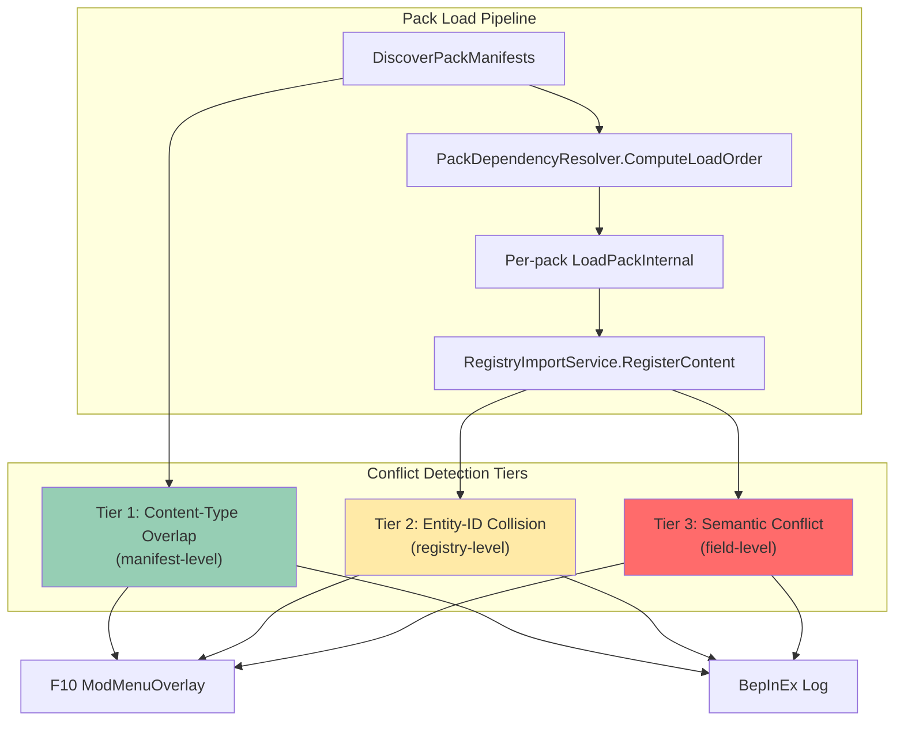
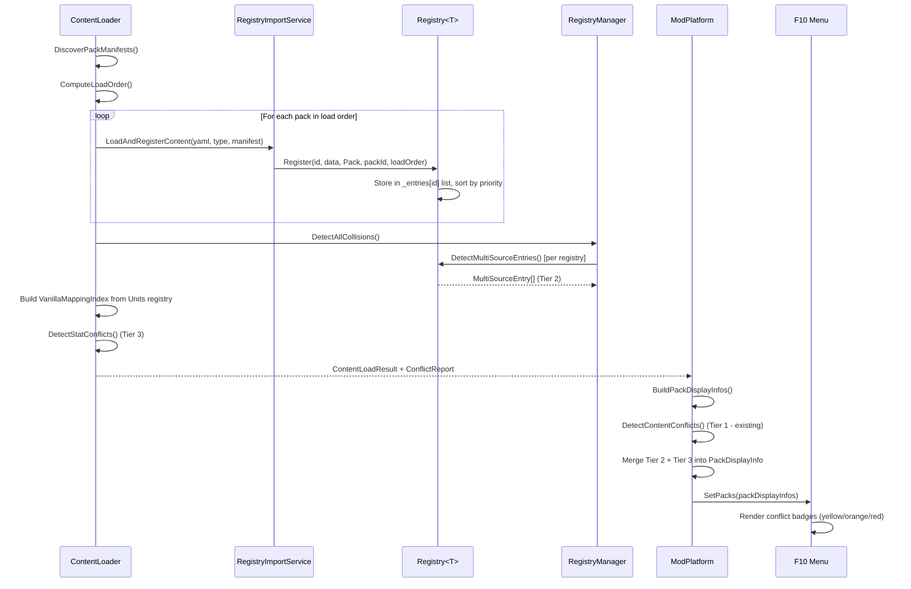

# SPEC-008: Automatic Mod Conflict Detection Engine

**Status**: Proposed
**Date**: 2026-05-25
**Author**: DINOForge Agents
**Iteration**: 147

---

## Overview

DINOForge currently relies on manual `conflicts_with` declarations in `pack.yaml` to flag incompatible mods. This is opt-in, incomplete, and fails silently when pack authors forget to declare conflicts. The Automatic Mod Conflict Detection Engine replaces this with a 3-tier system that detects conflicts at increasing depths of analysis, from manifest-level content-type overlap down to per-field stat collisions on the same ECS entity.

The engine runs at pack load time (inside `ContentLoader.LoadPacks`) and post-registration (inside `ModPlatform.BuildPackDisplayInfos`). Detected conflicts are surfaced through the F10 mod menu UI, the BepInEx log, and the `game_status` MCP tool.

---

## Problem Statement

Given two packs loaded simultaneously:

| Scenario | Current behavior | Desired behavior |
|----------|-----------------|-------------------|
| Both declare `loads: factions:` | Tier 1 warning in UI (landed iter-147) | Unchanged (already works) |
| Both register unit ID `rep_clone_trooper` | Last-load-wins silently; `Registry<T>` stores both but serves highest priority. If equal priority, winner is arbitrary. | Explicit conflict report naming both packs and the colliding ID |
| Both map `vanilla_mapping: line_infantry` with different HP stats | No detection; both stat injections fire, last write wins at ECS level | Semantic conflict report showing the stat delta |
| A `total_conversion` pack coexists with another `total_conversion` | No detection | Auto-conflict: two total conversions are always incompatible |

The core invariant: **the user should never be surprised by which mod "won" a conflict**. Every overwrite must be visible and intentional.

---

## Architecture



---

## Tier 1: Content-Type Overlap (DONE)

### What It Detects

Two or more enabled packs both declare the same content type in their `loads:` section. Example: `warfare-starwars` and `warfare-modern` both load `factions` and `units`.

### Current Implementation

- **Location**: `ModPlatform.ExtractContentSummary()` + `ModPlatform.DetectContentConflicts()` (lines 824-917)
- **When**: After all packs are loaded, during `BuildPackDisplayInfos()`
- **Output**: `PackDisplayInfo.DetectedConflicts` list (e.g., `"warfare-modern also loads: factions"`)
- **UI**: Displayed as yellow warning badges in the F10 pack list

### Limitations

- Only compares content-type *names* (e.g., "units"), not the specific entity IDs within
- Cannot distinguish additive content (Pack A adds republic units, Pack B adds CIS units) from overwriting content (both packs define `rep_clone_trooper`)
- Overly broad: flags every warfare pack pair even when their content is disjoint

### Enhancement (Minor)

Add `total_conversion` mutual exclusion: if two packs both have `type: total_conversion`, auto-inject a conflict even if their content types don't overlap. Total conversions by definition replace the entire game experience.

```csharp
// In DetectContentConflicts, after content-type loop:
var totalConversions = packs.Where(p => p.IsEnabled && p.Type == "total_conversion").ToList();
if (totalConversions.Count >= 2)
{
    foreach (var tc in totalConversions)
    {
        var others = totalConversions.Where(o => o.Id != tc.Id).Select(o => o.Id);
        // Inject: "Incompatible: multiple total_conversion packs active: {others}"
    }
}
```

---

## Tier 2: Entity-ID Collision Detection (NEW)

### What It Detects

Two or more packs register entries with the **same entity ID** in the **same registry**. Example: `warfare-starwars` and a hypothetical `warfare-starwars-rebalance` both register unit ID `rep_clone_trooper`.

### Why the Infrastructure Already Supports This

`Registry<T>.Register()` stores **all** registrations in a `List<RegistryEntry<T>>` per ID (line 51 of Registry.cs). `Registry<T>.DetectConflicts()` already finds entries where multiple registrations share the same top priority. The gap is:

1. **Nobody calls `DetectConflicts()` after pack loading.** `ContentLoader.LoadPacks()` does not invoke it.
2. **Results are not surfaced to the UI or log.**
3. **Same-priority is the only conflict mode detected.** Two packs at different priorities still silently overwrite; the user should know about any multi-source registration, not just tied priorities.

### Design

#### New type: `ConflictReport`

```csharp
namespace DINOForge.SDK.Registry
{
    /// <summary>
    /// Aggregates all detected conflicts across all registries after a pack load cycle.
    /// </summary>
    public sealed class ConflictReport
    {
        /// <summary>Tier 1: content-type overlaps (manifest-level).</summary>
        public IReadOnlyList<ContentTypeOverlap> ContentTypeOverlaps { get; init; }

        /// <summary>Tier 2: entity-ID collisions (registry-level).</summary>
        public IReadOnlyList<EntityIdCollision> EntityIdCollisions { get; init; }

        /// <summary>Tier 3: semantic conflicts (field-level stat deltas).</summary>
        public IReadOnlyList<SemanticConflict> SemanticConflicts { get; init; }

        /// <summary>True if any tier has at least one conflict.</summary>
        public bool HasConflicts =>
            ContentTypeOverlaps.Count > 0 ||
            EntityIdCollisions.Count > 0 ||
            SemanticConflicts.Count > 0;

        /// <summary>Severity: highest tier with conflicts.</summary>
        public ConflictSeverity MaxSeverity { get; init; }
    }

    public sealed class EntityIdCollision
    {
        /// <summary>The registry type name (e.g., "Units", "Factions").</summary>
        public string RegistryName { get; init; }

        /// <summary>The colliding entity ID (e.g., "rep_clone_trooper").</summary>
        public string EntityId { get; init; }

        /// <summary>Pack IDs that registered this entity, in load order.</summary>
        public IReadOnlyList<string> PackIds { get; init; }

        /// <summary>The pack that "won" (highest priority or last-loaded at equal priority).</summary>
        public string WinnerPackId { get; init; }

        /// <summary>Whether the collision involves equal-priority entries (ambiguous winner).</summary>
        public bool IsPriorityTied { get; init; }
    }

    public enum ConflictSeverity
    {
        /// <summary>Informational: content-type overlap, disjoint IDs.</summary>
        Info = 0,

        /// <summary>Warning: entity-ID collision with clear priority winner.</summary>
        Warning = 1,

        /// <summary>Error: entity-ID collision with tied priorities (ambiguous winner).</summary>
        Error = 2,

        /// <summary>Critical: semantic conflict on same stat of same vanilla entity.</summary>
        Critical = 3
    }
}
```

#### New method: `RegistryManager.DetectAllConflicts()`

```csharp
public IReadOnlyList<EntityIdCollision> DetectAllCollisions()
{
    var collisions = new List<EntityIdCollision>();
    CollectCollisions(Units, "Units", collisions);
    CollectCollisions(Buildings, "Buildings", collisions);
    CollectCollisions(Factions, "Factions", collisions);
    CollectCollisions(Weapons, "Weapons", collisions);
    CollectCollisions(Doctrines, "Doctrines", collisions);
    CollectCollisions(Waves, "Waves", collisions);
    CollectCollisions(Squads, "Squads", collisions);
    CollectCollisions(FactionPatches, "FactionPatches", collisions);
    return collisions;
}

private static void CollectCollisions<T>(
    IRegistry<T> registry, string registryName, List<EntityIdCollision> output)
{
    // DetectConflicts() already finds tied-priority entries.
    // We also need to surface non-tied multi-source registrations.
    // This requires a new IRegistry<T> method: DetectMultiSourceEntries().
}
```

#### New IRegistry method: `DetectMultiSourceEntries()`

```csharp
/// <summary>
/// Returns all entity IDs that have registrations from more than one pack,
/// regardless of priority. This surfaces intentional overrides as well as
/// accidental collisions.
/// </summary>
IReadOnlyList<MultiSourceEntry> DetectMultiSourceEntries();
```

Where:

```csharp
public sealed class MultiSourceEntry
{
    public string EntryId { get; }
    public IReadOnlyList<(string PackId, int Priority)> Sources { get; }
    public bool IsPriorityTied { get; }
}
```

Implementation in `Registry<T>`:

```csharp
public IReadOnlyList<MultiSourceEntry> DetectMultiSourceEntries()
{
    var results = new List<MultiSourceEntry>();
    foreach (var kvp in _entries)
    {
        if (kvp.Value.Count < 2) continue;

        // Group by source pack to avoid counting same-pack re-registrations
        var distinctPacks = kvp.Value
            .Select(e => (e.SourcePackId, e.Priority))
            .GroupBy(x => x.SourcePackId, StringComparer.Ordinal)
            .Select(g => (PackId: g.Key, Priority: g.Max(x => x.Priority)))
            .ToList();

        if (distinctPacks.Count < 2) continue;

        int topPriority = distinctPacks.Max(x => x.Priority);
        int tiedCount = distinctPacks.Count(x => x.Priority == topPriority);

        results.Add(new MultiSourceEntry
        {
            EntryId = kvp.Key,
            Sources = distinctPacks.Select(x => (x.PackId, x.Priority)).ToList(),
            IsPriorityTied = tiedCount >= 2
        });
    }
    return results;
}
```

#### Integration point: `ContentLoader.LoadPacks()`

After the existing per-pack load loop (line 258-271 of ContentLoader.cs), add:

```csharp
// --- Tier 2: Entity-ID collision detection ---
if (_registryManager != null)
{
    var collisions = _registryManager.DetectAllCollisions();
    foreach (var collision in collisions)
    {
        string severity = collision.IsPriorityTied ? "ERROR" : "WARN";
        errors.Add($"[Conflict/{severity}] {collision.RegistryName} ID '{collision.EntityId}' " +
            $"registered by {string.Join(", ", collision.PackIds)}. " +
            $"Winner: {collision.WinnerPackId}" +
            (collision.IsPriorityTied ? " (TIED PRIORITY - winner is arbitrary!)" : ""));
    }
}
```

#### UI surface: F10 mod menu

Extend `PackDisplayInfo.DetectedConflicts` to include Tier 2 results. Color-code:
- Yellow badge: Tier 1 (content-type overlap, informational)
- Orange badge: Tier 2, priority resolved (one pack wins clearly)
- Red badge: Tier 2, priority tied (ambiguous winner)

---

## Tier 3: Semantic Conflict Detection (FUTURE)

### What It Detects

Two packs modify the **same stat field** on the **same vanilla entity** via different mechanisms:
1. Two packs both map `vanilla_mapping: line_infantry` and define different `stats.hp` values
2. A content pack defines a unit with `vanilla_mapping: militia` and a balance pack defines a `stats` override targeting `militia`
3. Two stat override YAML files target the same `target_type + stat_path`

### Why This Is Hard

Stat application happens through three independent paths:
1. **PackStatInjector** (`ModPlatform.RebuildCatalogAndApplyStats`) -- writes pack unit definitions' stats to matching vanilla entities via `vanilla_mapping`
2. **OverrideApplicator.ApplyUnitOverrides** -- applies unit-level overrides from registries
3. **OverrideApplicator.ApplyStatOverrides** -- applies YAML-declared `StatOverrideDefinition` entries

All three write to the same ECS components on the same entities. The "last write wins" at the ECS level, and the write order depends on:
- Pack load order (topological sort by dependency, then `load_order` field)
- Code execution order within `RebuildCatalogAndApplyStats`

Detecting semantic conflicts requires cross-referencing:
- Unit definitions' `vanilla_mapping` values across packs
- Stat override definitions' `target_type` values across packs
- The specific stat paths modified by each

### Design

#### New type: `VanillaMappingIndex`

Built after all packs are loaded, before stat injection:

```csharp
public sealed class VanillaMappingIndex
{
    // vanilla_mapping value -> list of (packId, unitId, stats) tuples
    private readonly Dictionary<string, List<MappingEntry>> _mappings;

    public sealed class MappingEntry
    {
        public string PackId { get; }
        public string UnitId { get; }
        public string VanillaMapping { get; }
        public UnitStats Stats { get; }
    }

    /// <summary>
    /// Build the index from all registered units across all packs.
    /// </summary>
    public static VanillaMappingIndex Build(RegistryManager registry)
    {
        var mappings = new Dictionary<string, List<MappingEntry>>(StringComparer.Ordinal);
        foreach (var entry in registry.Units.All)
        {
            var unit = entry.Value.Data;
            if (string.IsNullOrEmpty(unit.VanillaMapping)) continue;

            if (!mappings.TryGetValue(unit.VanillaMapping, out var list))
            {
                list = new List<MappingEntry>();
                mappings[unit.VanillaMapping] = list;
            }
            list.Add(new MappingEntry
            {
                PackId = entry.Value.SourcePackId,
                UnitId = unit.Id,
                VanillaMapping = unit.VanillaMapping,
                Stats = unit.Stats
            });
        }
        return new VanillaMappingIndex { _mappings = mappings };
    }

    /// <summary>
    /// Detect cases where multiple packs from different source packs target the same
    /// vanilla_mapping with different stat values.
    /// </summary>
    public IReadOnlyList<SemanticConflict> DetectStatConflicts()
    {
        var conflicts = new List<SemanticConflict>();
        foreach (var kvp in _mappings)
        {
            var byPack = kvp.Value
                .GroupBy(e => e.PackId, StringComparer.Ordinal)
                .ToList();

            if (byPack.Count < 2) continue;

            // Compare stat fields pairwise between packs
            var entries = byPack.Select(g => g.First()).ToList();
            for (int i = 0; i < entries.Count; i++)
            {
                for (int j = i + 1; j < entries.Count; j++)
                {
                    var deltas = CompareStats(entries[i].Stats, entries[j].Stats);
                    if (deltas.Count > 0)
                    {
                        conflicts.Add(new SemanticConflict
                        {
                            VanillaMapping = kvp.Key,
                            PackA = entries[i].PackId,
                            UnitA = entries[i].UnitId,
                            PackB = entries[j].PackId,
                            UnitB = entries[j].UnitId,
                            StatDeltas = deltas
                        });
                    }
                }
            }
        }
        return conflicts;
    }
}
```

#### Semantic conflict output format

```csharp
public sealed class SemanticConflict
{
    public string VanillaMapping { get; init; }
    public string PackA { get; init; }
    public string UnitA { get; init; }
    public string PackB { get; init; }
    public string UnitB { get; init; }
    public IReadOnlyList<StatDelta> StatDeltas { get; init; }
}

public sealed class StatDelta
{
    public string StatPath { get; init; }   // e.g., "hp", "damage", "cost.gold"
    public double ValueA { get; init; }
    public double ValueB { get; init; }
    public double DeltaPercent => ValueA == 0 ? double.MaxValue : Math.Abs(ValueB - ValueA) / ValueA * 100;
}
```

#### Example output

```
[Conflict/CRITICAL] vanilla_mapping 'line_infantry' targeted by 2 packs:
  warfare-starwars/rep_clone_trooper: hp=125, damage=14, armor=6
  warfare-modern/west_rifleman:       hp=100, damage=18, armor=4
  Deltas: hp +25%, damage -22%, armor +50%
  Winner (by load order): warfare-starwars (load_order=100, loaded 2nd)
```

#### Stat override cross-reference

Additionally, the engine must detect when a stat override YAML targets the same entity as a content pack's `vanilla_mapping`:

```yaml
# In a balance pack's stats/rebalance.yaml:
- target_type: line_infantry
  stat_path: hp
  operation: multiply
  value: 0.8
```

If `warfare-starwars` maps `rep_clone_trooper` to `vanilla_mapping: line_infantry` with `hp: 125`, and a balance pack applies `hp *= 0.8`, the effective HP is 100. This is not a "conflict" per se but a **dependency interaction** that the user should see.

The engine surfaces these as informational notes:

```
[Info] stat override from 'economy-balanced' affects 'line_infantry' (hp *= 0.8).
  Packs targeting line_infantry: warfare-starwars (rep_clone_trooper, hp=125 -> effective 100)
```

---

## Conflict Resolution Strategies

The engine detects conflicts but also provides resolution mechanisms:

### Strategy 1: Priority-Based (Default)

The existing `RegistrySource` tier (BaseGame=0 < Framework=1 < DomainPlugin=2 < Pack=3) plus `load_order` within tier already provides deterministic resolution. The engine makes this visible:

```
Winner: warfare-starwars (Pack tier, load_order=100)
Loser:  warfare-modern   (Pack tier, load_order=100) -- TIED, won by load position
```

### Strategy 2: Explicit `conflicts_with` (Manual Override)

Pack authors can declare `conflicts_with: [warfare-modern]` in `pack.yaml`. The engine respects this: if a declared conflict is detected, the conflicting pack is **not loaded** (existing behavior in `PackDependencyResolver.DetectConflicts`).

### Strategy 3: Pack Type Mutual Exclusion

`total_conversion` packs are mutually exclusive by definition. The engine auto-injects `conflicts_with` for any pair of total_conversion packs.

### Strategy 4: User Override via F10 Menu (Future)

The F10 mod menu will display detected conflicts and allow the user to:
- Disable one of the conflicting packs (toggle)
- Adjust load order (drag-and-drop reorder)
- Pin a pack as "always wins" for a specific entity ID (override file written to `dinoforge_packs/overrides/`)

---

## Data Flow



---

## Implementation Plan

### Phase 1: Tier 2 Entity-ID Collision (Target: v0.28.0)

| Task | File | Effort |
|------|------|--------|
| Add `MultiSourceEntry` class | `src/SDK/Registry/MultiSourceEntry.cs` | S |
| Add `DetectMultiSourceEntries()` to `IRegistry<T>` | `src/SDK/Registry/IRegistry.cs` | S |
| Implement in `Registry<T>` | `src/SDK/Registry/Registry.cs` | M |
| Add `EntityIdCollision` + `ConflictReport` classes | `src/SDK/Registry/ConflictReport.cs` | S |
| Add `DetectAllCollisions()` to `RegistryManager` | `src/SDK/Registry/RegistryManager.cs` | S |
| Wire into `ContentLoader.LoadPacks()` post-load | `src/SDK/ContentLoader.cs` | M |
| Extend `PackDisplayInfo` with Tier 2 conflict data | `src/Runtime/UI/ModMenuOverlay.cs` | M |
| Update `BuildPackDisplayInfos` to merge Tier 2 | `src/Runtime/ModPlatform.cs` | M |
| Add `total_conversion` mutual exclusion | `src/Runtime/ModPlatform.cs` | S |
| Unit tests: multi-pack collision scenarios | `src/Tests/Registry/ConflictDetectionTests.cs` | L |
| Integration test: two packs, same unit ID | `src/Tests/Integration/ContentLoaderConflictTests.cs` | M |

**Total estimate**: ~2-3 days agent work

### Phase 2: Tier 3 Semantic Conflict (Target: v0.30.0)

| Task | File | Effort |
|------|------|--------|
| Add `VanillaMappingIndex` class | `src/SDK/Registry/VanillaMappingIndex.cs` | M |
| Add `SemanticConflict` + `StatDelta` types | `src/SDK/Registry/SemanticConflict.cs` | S |
| Implement `DetectStatConflicts()` | `src/SDK/Registry/VanillaMappingIndex.cs` | L |
| Cross-reference stat overrides with vanilla_mapping | `src/SDK/Registry/VanillaMappingIndex.cs` | M |
| Wire into ContentLoader post-load chain | `src/SDK/ContentLoader.cs` | M |
| Extend ConflictReport with Tier 3 data | `src/SDK/Registry/ConflictReport.cs` | S |
| F10 UI: stat delta visualization | `src/Runtime/UI/ModMenuOverlay.cs` | L |
| Unit tests: vanilla_mapping collision | `src/Tests/Registry/SemanticConflictTests.cs` | L |
| FsCheck property tests: random stat conflicts | `src/Tests/ParameterizedTests/ConflictFsCheckProperties.cs` | M |

**Total estimate**: ~4-5 days agent work

### Phase 3: User-Facing Resolution (Target: v0.32.0)

| Task | File | Effort |
|------|------|--------|
| F10 menu conflict resolution panel | `src/Runtime/UI/ConflictResolutionPanel.cs` | L |
| User override file format (`overrides/*.yaml`) | New schema: `schemas/conflict_override.schema.json` | M |
| Override file loader in ContentLoader | `src/SDK/ContentLoader.cs` | M |
| Load order drag-and-drop in F10 menu | `src/Runtime/UI/ModMenuOverlay.cs` | L |
| MCP tool: `game_conflict_report` | `src/Tools/DinoforgeMcp/dinoforge_mcp/server.py` | M |

**Total estimate**: ~5-7 days agent work

---

## Testing Strategy

### Unit Tests (Tier 2)

```csharp
[Fact]
public void DetectMultiSourceEntries_TwoPacks_SameUnitId_ReturnsCollision()
{
    var registry = new Registry<UnitDefinition>();
    registry.Register("clone-trooper", unit1, RegistrySource.Pack, "pack-a", 100);
    registry.Register("clone-trooper", unit2, RegistrySource.Pack, "pack-b", 100);

    var entries = registry.DetectMultiSourceEntries();
    entries.Should().HaveCount(1);
    entries[0].EntryId.Should().Be("clone-trooper");
    entries[0].Sources.Should().HaveCount(2);
    entries[0].IsPriorityTied.Should().BeTrue();
}

[Fact]
public void DetectMultiSourceEntries_DifferentPriority_ReportsWinner()
{
    var registry = new Registry<UnitDefinition>();
    registry.Register("clone-trooper", unit1, RegistrySource.Pack, "pack-a", 100);
    registry.Register("clone-trooper", unit2, RegistrySource.Pack, "pack-b", 200);

    var entries = registry.DetectMultiSourceEntries();
    entries[0].IsPriorityTied.Should().BeFalse();
    // pack-b has higher load_order = higher priority within same tier
}

[Fact]
public void DetectMultiSourceEntries_SamePack_TwoRegistrations_NoCollision()
{
    var registry = new Registry<UnitDefinition>();
    registry.Register("clone-trooper", unit1, RegistrySource.Pack, "pack-a", 100);
    registry.Register("clone-trooper", unit2, RegistrySource.Pack, "pack-a", 100);

    var entries = registry.DetectMultiSourceEntries();
    entries.Should().BeEmpty(); // same pack, not a cross-pack collision
}
```

### Integration Tests (Tier 2)

Create two test packs in `src/Tests/Fixtures/`:
- `conflict-pack-a/` with unit `test-soldier` (hp=100)
- `conflict-pack-b/` with unit `test-soldier` (hp=200)

Load both via `ContentLoader.LoadPacks()` and verify:
1. `ContentLoadResult.Errors` contains a Tier 2 conflict message
2. `RegistryManager.Units.Get("test-soldier")` returns the higher-priority definition
3. The conflict report names both packs

### Property Tests (Tier 3)

```csharp
[FsCheck.Xunit.Property]
public Property VanillaMappingConflict_AlwaysDetected(
    NonEmptyString vanillaMapping,
    PositiveFloat hpA, PositiveFloat hpB)
{
    // If two units from different packs share vanilla_mapping and differ on hp,
    // the semantic conflict detector must find them.
    Func<bool> test = () => {
        var index = BuildIndex(vanillaMapping.Get, hpA.Get, hpB.Get);
        var conflicts = index.DetectStatConflicts();
        return hpA.Get != hpB.Get
            ? conflicts.Count == 1
            : conflicts.Count == 0;
    };
    return test.ToProperty();
}
```

---

## Non-Functional Requirements

| ID | Requirement |
|----|-------------|
| N-01 | Conflict detection must complete within 50ms for 20 loaded packs with 500 total entities |
| N-02 | No heap allocations during pack load hot path beyond the conflict report itself |
| N-03 | ConflictReport must be serializable to JSON for MCP `game_status` tool |
| N-04 | All conflict messages must include actionable text (which pack to disable or which load_order to change) |
| N-05 | Tier 2 detection must not require re-reading YAML files (operates on in-memory registry data) |
| N-06 | Tier 3 detection must not block pack loading; runs as a post-load analysis pass |

---

## Risks and Mitigations

| Risk | Impact | Mitigation |
|------|--------|------------|
| False positive Tier 1 warnings for additive packs | User ignores all warnings | Tier 2 replaces vague Tier 1 warnings with precise ID-level data; Tier 1 becomes informational only |
| Performance regression with 50+ packs | Slow game startup | Lazy conflict detection: compute on first F10 open, not on load |
| Breaking change to IRegistry<T> interface | Test failures | Add `DetectMultiSourceEntries` with default interface method (C# 8+ DIM) returning empty list |
| Stat comparison floating-point drift | False semantic conflicts | Use epsilon-based comparison (delta > 0.01) for float stats |
| Pack authors rely on load-order-wins behavior | Changing to explicit errors breaks existing setups | Tier 2 reports are warnings by default; only tied-priority becomes an error. Add `allow_override: true` manifest field for packs that intentionally override others |

---

## Open Questions

1. **Should Tier 2 block pack loading or just warn?** Current design: warn only (log + UI badge). Blocking would prevent the game from starting with conflicting packs, which is safer but more disruptive. Recommendation: warn by default, add a `strict_conflicts: true` config option for users who want blocking behavior.

2. **Should `allow_override: true` in pack.yaml suppress Tier 2 warnings for intentional overrides?** Example: a "Star Wars Rebalance" pack that intentionally overrides `warfare-starwars` units. If it declares `overrides_pack: warfare-starwars`, the engine could treat those ID collisions as intentional. Recommendation: yes, add `overrides_pack` field to pack.yaml schema.

3. **How to handle stat override + content pack interactions?** A balance pack that multiplies `line_infantry.hp *= 0.8` affects every content pack that maps to `line_infantry`. This is by design (balance packs are meant to be cross-cutting). Should the engine distinguish "balance pack interactions" from "content pack collisions"? Recommendation: yes, use pack `type` field -- `balance` type packs get informational notes, not conflict warnings.

---

## References

- `src/SDK/Registry/Registry.cs` -- existing multi-entry storage and DetectConflicts()
- `src/SDK/ContentRegistrationService.cs` -- RegistryImportService.RegisterContent() dispatch
- `src/SDK/ContentLoader.cs` -- LoadPacks() pipeline
- `src/Runtime/ModPlatform.cs` -- ExtractContentSummary(), DetectContentConflicts(), BuildPackDisplayInfos()
- `src/Runtime/UI/ModMenuOverlay.cs` -- PackDisplayInfo, F10 rendering
- `src/SDK/Dependencies/PackDependencyResolver.cs` -- DetectConflicts() for manifest-declared conflicts
- Pattern #234 (Test Fixture ID Leakage) -- related registry collision pattern
