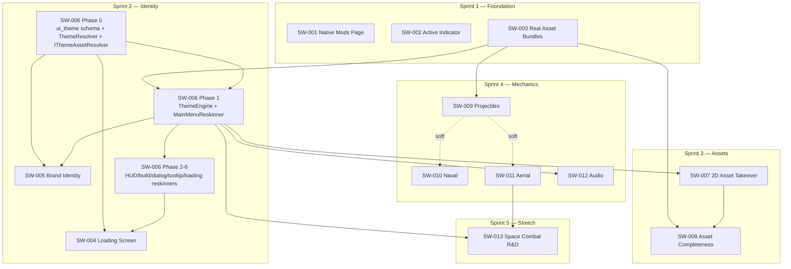
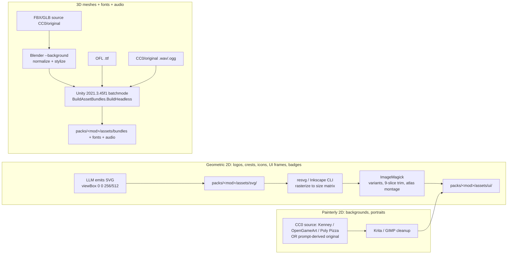

# EPIC-027 — Master File-Level Implementation Plan

**Status**: Authoritative — single source of truth for orchestrator wave dispatch
**Date**: 2026-05-28
**Epic**: [EPIC-027 — True Full-Conversion Experience](../v0.27.0-full-conversion-epic.md)
**Target**: v0.27.0
**Synthesizes**: 13 story specs (`docs/specs/v0.27.0/`), 8 design docs (`docs/design/`),
10 research docs (`docs/research/`), 2 diagnosis docs (`docs/sessions/native-mods-page-diagnosis.md`,
`docs/qa/assetswap-real-bundles-spec.md`).

> This document tells an orchestrator: **what to build, in what order, which files each agent
> touches, what can run in parallel, where agents will collide, and how art is produced.**
> Per-story acceptance criteria live in the individual story specs — they are not repeated here.

---

## 0. How to read this plan

- **Build sequence (§1)** = the hard dependency DAG. Do not start a node until its parents are green.
- **Per-story file tasks (§2)** = the concrete create/modify list per story, pulled from design docs.
- **Parallelization map (§3)** = what to dispatch simultaneously, plus the file-overlap hotspots
  that MUST be serialized or worktree-isolated.
- **Art sub-plan (§4)** = the SVG → raster → bundle pipeline and who runs each stage.
- **100%-complete definition (§5)** = the asset checklist gate per mod.
- **Engine quirks in tandem (§6)** = engine fixes that must land alongside the feature work so
  mod + engine progress together with zero deferrals.

---

## 1. Dependency-Ordered Build Sequence

### 1.1 The two foundation roots that unblock everything



### 1.2 Critical path (the longest chain that gates the v0.27.0 tag)

```
SW-003 (real bundles)  ──►  SW-006 P0 (schema+resolver)  ──►  SW-006 P1 (ThemeEngine+MainMenuReskinner)
   ──►  SW-007 (2D takeover Strategy B)  ──►  SW-008 (asset completeness)  ──►  Epic DoD gate
```

SW-006 Phase 0 is the single most load-bearing node: the `ui_theme` schema + `ResolvedTheme`
+ `IThemeAssetResolver` underpin SW-004 (loading), SW-005 (identity), SW-007 (2D, Strategy B
surface detection), and SW-012 (audio scene-change hook). It must be built first in Sprint 2,
alone, before the rest of Sprint 2 fans out.

SW-003 (real bundles) is the other root: it unblocks SW-008 (3D mesh completeness), SW-009
(projectile bundles use the identical Unity-batchmode pipeline), and the font bundles that
SW-005 needs. It contains the only **manual, un-CI-able Unity 2021.3.45f1 batchmode step** in
the whole epic, so it must be scheduled at the very start of Sprint 1.

### 1.3 Ordering rationale per dependency edge

| Edge | Why |
|---|---|
| SW-003 → SW-008 | Asset completeness counts non-stub bundles; bundles must exist first. |
| SW-003 → SW-009 | Projectile bundles use the same `GenerateStarWarsPrefabsFromModels` + `BuildAssetBundles.BuildHeadless` path. |
| SW-003 → SW-006 P1 | `IThemeAssetResolver`'s `bundle:asset` + bare-bundle path is validated against real bundles, not stubs. |
| SW-006 P0 → P1 | ThemeEngine consumes `ResolvedTheme`; resolver/schema must compile + test first. |
| SW-006 P0 → SW-004 | `LoadingScreenConfig` validation reuses the schema-validation harness; resolver supplies background/sprite resolution. |
| SW-006 P1 → SW-005 | Brand identity is applied by `MainMenuReskinner`; the reskinner must exist. |
| SW-006 P1 → SW-007 | Strategy B surface walks reuse `MainMenuReskinner` / `CanvasWalker`. |
| SW-006 P1 → SW-012 | Audio swap hooks the same `activeSceneChanged` plumbing the ThemeEngine installs. |
| SW-007 → SW-008 | Portraits render through `TcSpriteLoader` / `TcUiSpritePass`. |
| SW-009 → SW-010/011 (soft) | Naval/aerial fall back to default projectiles if SW-009 not merged. |

---

## 2. Per-Story File-Level Task List

Legend: **[NEW]** create file · **[MOD]** modify existing file · **[ASSET]** art/bundle/yaml content.

### SW-001 — Native Mods Page Visible  (Sprint 1, 8 pts, P0)

Source of truth: `docs/sessions/native-mods-page-diagnosis.md` §4–5 (exact fix steps).

| File | Change |
|---|---|
| **[MOD]** `src/Runtime/UI/NativeMenuInjector.cs` | Add `ClearAllButtonListeners(Button)` helper (clears persistent serialized listeners via `GetPersistentEventCount`/`RemovePersistentListener`); call from `RewireModsButtonClick` (~L1281) and `EnforceModsButtonState` before re-adding `OnModsButtonClicked`. Add `TryAttachNativeModsPage(Canvas, attemptId)` + `FindMainMenuContent(Canvas)`; invoke after `CommitInjectionAndLog`. |
| **[MOD]** `src/Runtime/UI/NativeMainMenuModMenu.cs` | Replace stub `Show/Hide/Toggle/SetPacks`; `CanUseNativeScreen => _modsPage != null`; add `Attach(NativeModsPage, Canvas, GameObject? content)`. |
| **[MOD]** `src/Runtime/UI/ContextualModMenuHost.cs` | Add `internal NativeMainMenuModMenu NativeHost => _nativeHost;`. |
| **[MOD]** `src/Runtime/UI/NativeModsPage.cs` | Add `_root.transform.SetAsLastSibling()` at end of `BuildUI`. No layout changes. |
| **[NEW]** `src/Tests/ModsPageControllerTests.cs` | Unit tests: page construction + pack-entry population + no-blank-state path. |

Guards: page named `DINOForge_ModsPage` (CanvasWalker skip); destroyed on close (N-03); no
GraphicRaycaster added (inherits main-menu canvas raycaster); Pattern #235.

### SW-002 — DINOForge Active Indicator  (Sprint 1, 3 pts, P1)

| File | Change |
|---|---|
| **[NEW]** `src/Runtime/UI/WindowTitleService.cs` | `Format(vanillaTitle, activePackName?, version)` → `"{vanilla} | {pack} | DINOForge v{ver}"`; Win32 P/Invoke `FindWindow` + `SetWindowTextW`; read-back `GetWindowText` to verify. |
| **[MOD]** `src/Runtime/Plugin.cs` | Call `WindowTitleService.SetInitial(version)` in `Awake()` after version is known. |
| **[MOD]** `src/Runtime/ModPlatform.cs` | After pack load + on hot-reload (`DINOForge_HotReload`), call `WindowTitleService.Update(activeTcPackName)`. |
| **[NEW]** `src/Tests/WindowTitleServiceTests.cs` | Unit tests for `Format()` (pack present / absent). |

### SW-003 — Real Asset Bundles  (Sprint 1, 13 pts, P0) — contains the manual Unity step

Source of truth: `docs/qa/assetswap-real-bundles-spec.md`.

| File | Change |
|---|---|
| **[MOD]** `unity-assetbundle-builder/Assets/Editor/GenerateStarWarsPrefabs.cs` | Add the 12 stub building IDs to the `Definitions[]` array (cube/sphere primitives, per spec §6 Action 1). |
| **[MOD]** `unity-assetbundle-builder/Assets/Editor/GenerateStarWarsPrefabsFromModels.cs` | Add FBX-backed entries for units with source FBX (`sw-cis-b1-battle-droid`, `sw-rep-clone-heavy`, etc.) to promote from primitive → real mesh. |
| **[MANUAL]** Unity 2021.3.45f1 batchmode | `GenerateStarWarsPrefabs.Generate` → `GenerateStarWarsPrefabsFromModels.Generate` → `BuildAssetBundles.BuildHeadless` (commands in spec §3/§6). |
| **[ASSET]** `packs/warfare-starwars/assets/bundles/*` | Copy build output; every file > 1 KB. Mirror for `packs/warfare-modern/assets/bundles/`. |
| **[NEW]** `scripts/ci/detect_stub_bundles.py` | CI gate: fail if any bundle < 1 KB in either pack. |
| **[NEW]** `docs/guide/asset-bundle-build.md` | Document exact Unity project path + batchmode commands + version note (f1 not f2). |
| **[MOD]** `src/Runtime/Bridge/AssetSwapSystem.cs` | Add bundle-version-mismatch detection + WARNING log + retain vanilla (Scenario 4); no exception swallow (Pattern #111). Verify `LoadAllAssets()` name-mismatch fallback against real bundles. |
| **[ASSET]** TMP_FontAsset bundles | Build SW-005 fonts (Orbitron/Exo2 etc.) as Unity 2021.3.45f1 bundles here (F-06). |

> NOTE the spec resolves the CLAUDE.md `f2` vs installed `f1` discrepancy: **use `2021.3.45f1`**
> (the version that built the existing working bundles). Update CLAUDE.md / `asset-bundle-build.md`
> to record `f1` is the canonical build version.

### SW-006 — Full UI/UX Reskin Engine  (Sprint 2, 21 pts, P1) — the spine

Source of truth: `docs/design/ui-ux-reskin-system.md` (§1–9), phased per `full-ui-ux-reskin.md`.

**Phase 0 — schema + resolver (no visible change; build FIRST, alone):**

| File | Change |
|---|---|
| **[NEW]** `schemas/ui_theme.schema.json` | Schema for `ui_theme` block (palette/fonts/sprites/rewrites/surfaces). Register in the schema set. |
| **[NEW]** `src/SDK/Models/Theme/UiTheme.cs` | `UiTheme : IValidatable`, `ThemePalette`, `ThemeFonts`, `SurfaceOverride` (design §1 C# model). `IReadOnlyDictionary` + `StringComparer.Ordinal` (Pattern #99/#123). |
| **[NEW]** `src/SDK/Models/Theme/ResolvedTheme.cs` | `ResolvedTheme`, `ResolvedSurfaceTheme` (immutable). |
| **[NEW]** `src/SDK/Models/Theme/ThemeResolver.cs` | 3-layer merge (default → TC pack → user); last-writer-wins; shallow surface merge (design §5). |
| **[NEW]** `src/SDK/Assets/IThemeAssetResolver.cs` + impl `ThemeAssetResolver.cs` | `ResolveSprite/ResolveFont/ResolveBackground`; resolution order Addressables key → `bundle:asset` → bare bundle → raw PNG (design §3); cache by `sourceRef`. |
| **[MOD]** `src/SDK/Models/PackManifest.cs` (or pack loader) | Parse `ui_theme` via YamlDotNet; keep Runtime hand-parse fallback. |
| **[NEW]** `src/Tests/Mocks/FakeSurfaceReskinner.cs`, `FakeThemeAssetResolver.cs` | Pattern #125 test doubles. |
| **[NEW]** `src/Tests/Theme/ThemeResolverTests.cs` + FsCheck props | Associativity + last-writer-wins of merge. |

**Phase 1 — ThemeEngine + MainMenuReskinner (parity, gates everything downstream):**

| File | Change |
|---|---|
| **[NEW]** `src/Runtime/UI/Theme/ThemeEngine.cs` | Main-thread orchestrator owned by RuntimeDriver; `SetActiveTheme`, `Tick(scene)`, `OnSceneChanged`; `_styledCanvasIds` dedupe (design §2/§6). |
| **[NEW]** `src/Runtime/UI/Theme/ISurfaceReskinner.cs` | `Surface`, `Matches(Canvas)`, `Apply(...)`. |
| **[NEW]** `src/Runtime/UI/Theme/CanvasWalker.cs` | Reflection helpers `ActiveCanvases`, `Images`, `NameMatches`, TMP font swap (design §4). |
| **[NEW]** `src/Runtime/UI/Theme/MainMenuReskinner.cs` | Reimplements `MainMenuThemer` as `ISurfaceReskinner` driven by `ResolvedTheme`. |
| **[MOD]** `src/Runtime/UI/MainMenuThemer.cs` | **REMOVE** after parity confirmed (F-02). |
| **[MOD]** `src/Runtime/ModPlatform.cs` (RuntimeDriver) | Own `ThemeEngine`; call `Tick` from pump + `OnSceneChanged` from the static scene delegate. |
| **[NEW]** `BepInEx/plugins/dinoforge-ui-assets/surface_detectors.json` (+ deploy target) | Data-driven detection rules (design §2). |

**Phases 2–6 — one reskinner per surface (each independently shippable):**

| Phase | **[NEW]** file under `src/Runtime/UI/Theme/` |
|---|---|
| 2 | `HudReskinner.cs`, `ResourceBarReskinner.cs` |
| 3 | `BuildMenuReskinner.cs`, `UnitPanelReskinner.cs` |
| 4 | `DialogReskinner.cs`, `PauseMenuReskinner.cs` |
| 5 | `TooltipReskinner.cs`, `NotificationReskinner.cs` |
| 6 | `LoadingScreenReskinner.cs` (used by SW-004) |

All detectors confirmed against live `dinoforge ui-tree` / `game_ui_automation` dumps before
shipping each phase (F-08; do not hardcode blind).

### SW-004 — Loading Screen Takeover  (Sprint 2, 13 pts, P1)

Source of truth: `docs/design/loading-screen-system.md`.

| File | Change |
|---|---|
| **[NEW]** `src/Runtime/UI/LoadingScreenController.cs` | Owns `DINOForge_LoadingScreen` canvas (sortingOrder 9998); `Show/EnsureVisible/SetPackProgress/SetMessage/BeginFadeOut`; tip rotation via `Time.unscaledDeltaTime` in the `WaitForEndOfFrame` coroutine. **Replaces** `ModLoadingOverlay`. |
| **[MOD]** `src/Runtime/UI/ModLoadingOverlay.cs` | **REMOVE** (F-01 — must not coexist). |
| **[NEW]** `src/Runtime/Loading/ThemeScanner.cs` | `ScanForActiveTheme(packsDir, disabledIds)` partial-parse pack.yaml headers (type + loading_screen); `LoadingScreenTheme`. |
| **[NEW]** `src/SDK/Models/LoadingScreenConfig.cs` | YAML model (background/logo/tips/tip_rotation_seconds/accent_color/overlay_opacity). |
| **[MOD]** `src/SDK/Models/PackManifest.cs` | Add `LoadingScreenConfig? LoadingScreen`. |
| **[MOD]** `schemas/pack-manifest.schema.json` | Add `loading_screen` object + `if/then` rejecting it on `type != total_conversion`. |
| **[MOD]** `src/Runtime/ModPlatform.cs` (RuntimeDriver) | Swap `_loadingOverlay` → `_loadingScreenController`; wire `OnPackProgress`; `BeginFadeOut` after load. |
| **[MOD]** `src/Runtime/Plugin.cs` | In `OnActiveSceneChanged`: `EnsureVisible` on `InitialGameLoader`, `BeginFadeOut` on `MainMenu`; static `_loadingScreenControllerRef`. |
| **[ASSET]** `BepInEx/plugins/dinoforge-ui-assets/loading/*` | `loading-bg.png`, `df-logo.png`, `spinner.png`, `progress-track.png`, `progress-fill.png` (design §7). |
| **[NEW]** `src/Tests/Loading/ThemeScannerTests.cs`, `LoadingScreenConfigValidationTests.cs` | Schema-reject + scan tests. |

### SW-005 — Mod Brand Identity  (Sprint 2, 8 pts, P1)

Source of truth: `docs/design/identity-starwars.md`, `identity-modern.md`, `main-menu-takeover.md`.
This story is largely **content + manifest wiring**; the engine that applies it is SW-006 P1.

| File | Change |
|---|---|
| **[MOD]** `packs/warfare-starwars/pack.yaml` | Full `ui_theme` block: palette (gold `#FFE81F`/navy), fonts (Orbitron/Exo2), rewrites ("New Campaign"…), `surfaces.main_menu` (title, deep-space bg). |
| **[MOD]** `packs/warfare-modern/pack.yaml` | Full `ui_theme`: amber `#F5A623`, Bebas Neue/Barlow, satellite-pass bg, stencil title. |
| **[ASSET]** `packs/warfare-starwars/assets/ui/` | `menu_bg.png` (1920×1080), `menu_logo.png` (~768×200), `btn_republic_{normal,hover,pressed,disabled}.9.png`. |
| **[ASSET]** `packs/warfare-starwars/assets/fonts/{Orbitron,Exo2}/` + `OFL.txt` | OFL fonts; TMP bundle built in SW-003. |
| **[ASSET]** `packs/warfare-modern/assets/ui/` + `assets/fonts/{BebasNeue,BarlowCondensed,ShareTechMono}/` | Modern equivalents. |
| **[MOD]** `MainMenuReskinner.cs` (SW-006) | Inject `DINOForge_ModLogo` (`raycastTarget=false`); set vanilla title TMP alpha 0 when logo active. |

### SW-007 — In-Game 2D Asset Takeover  (Sprint 3, 13 pts, P1)

Source of truth: `docs/design/ingame-asset-takeover-spec.md`. Deliver Strategy B + C first, then A.

| File | Change |
|---|---|
| **[NEW]** `src/SDK/Assets/SpriteSwapRegistry.cs` | Thread-safe `addressKey → Sprite` + `surfaceSlot → Sprite`; cache by pack-relative PNG path (`StringComparer.Ordinal`); invalidate on HotReload. Mirrors `AssetSwapRegistry`. |
| **[NEW]** `src/Runtime/Bridge/TcSpriteLoader.cs` | PNG bytes → `Texture2D.LoadImage` → `Sprite.Create` (incl. `Vector4 border` 9-slice overload); populates registry at scene load. |
| **[NEW]** `src/Runtime/UI/TcUiSpritePass.cs` | Walks live UGUI; applies `TcUiSurfaces` slot replacements (extends MainMenuReskinner scan). |
| **[NEW]** `src/Runtime/UI/TcCursorApplicator.cs` | `Cursor.SetCursor` at startup + re-apply on `activeSceneChanged`. |
| **[NEW]** `src/Runtime/Bridge/AddressablesSpritePatch.cs` | Harmony Prefix on `AddressablesImpl.LoadAssetAsync(IResourceLocation)` (Strategy A); resolve type via assembly scan. |
| **[MOD]** `src/SDK/Models/TotalConversionManifest.cs` | Extend `TcAssetReplacements` with `TcUiReplacements` (`KeyedSprites`, `Surfaces`, `Cursor`, `Fonts`), `TcUiSurfaces`, `TcCursorDef`. |
| **[MOD]** `schemas/total-conversion.schema.json` | Add `asset_replacements.ui` shape. |
| **[NEW]** `docs/reference/dino-sprite-key-map.yaml` + `dino-ui-atlas-spec.yaml` | Output of the Addressables key-discovery pass (gates Strategy A). |
| **[NEW]** tests | `SpriteSwapRegistryTests`, `TcSpriteLoaderTests`, plus patch wiring tests. |

### SW-008 — Mod Asset Completeness  (Sprint 3, 13 pts, P1) — content-heavy

| File | Change |
|---|---|
| **[ASSET]** `packs/warfare-starwars/assets/ui/portraits/<unit-id>.png` | 64×64 RGBA per defined unit (14+). |
| **[ASSET]** `packs/warfare-starwars/assets/ui/badges/<role>.png` | 16×16 per role (7). |
| **[ASSET]** `packs/warfare-starwars/assets/ui/{republic,cis}-emblem.png` | 128×128 (overlaps SW-005). |
| **[ASSET]** new unit YAMLs | +8 SW unit defs to reach ≥22/28; +N Modern to reach ≥18/28. |
| **[ASSET]** `packs/warfare-modern/assets/ui/...` | Modern portraits/badges/emblems (crosshair/dog-tag frame). |
| **[MOD]** `src/Tools/PackCompiler/...` validator | Dangling asset references reported as **errors** not warnings (F-05). |
| **[MOD]** `dinoforge verify-mod` (CLI) | 0 missing-bundle + 0 stub-bundle for both packs. |

### SW-009 — Blaster / Projectile Support  (Sprint 4, 8 pts, P2)

Existing: `src/SDK/Models/ProjectileDefinition.cs`, `schemas/projectile.schema.json`,
`src/Runtime/Bridge/ProjectileVFXSystem.cs`.

| File | Change |
|---|---|
| **[MOD]** `src/SDK/Models/UnitDefinition.cs` | Add `projectile_visual` key (bundle-key ref). |
| **[NEW]** `src/SDK/Assets/ProjectileSwapRegistry.cs` | `unit_id → projectile_bundle_key`; mirrors AssetSwapRegistry. |
| **[NEW]** `src/Runtime/Bridge/ProjectileSwapSystem.cs` | Applies override at projectile spawn during Fight group; default fallback + WARNING (Pattern #104); `EntityQueryOptions.IncludePrefab`. |
| **[MOD]** `schemas/unit.schema.json` (or `projectile.schema.json`) | Validate `projectile_visual`. |
| **[ASSET]** projectile bundles (Unity 2021.3.45f1 via SW-003 pipeline) | ≥3 variants/mod (infantry bolt, heavy, missile); gold/blue + red blasters (SW), amber tracer + missile (Modern). |
| **[NEW]** `src/Tests/ProjectileSwapRegistryTests.cs` | Unit tests + missing-bundle fallback. |

### SW-010 — Naval Combat  (Sprint 4, 13 pts, P2)

Source of truth: `docs/research/naval-mechanic-design.md`. **Mirror the existing
`src/Runtime/Aviation/` namespace exactly** (AviationPlugin/AerialUnitMapper/AerialMovementSystem
… already exist — copy the structure).

| File | Change |
|---|---|
| **[NEW]** `src/Runtime/Naval/NavalUnitComponent.cs` | Marker + water-motion params (draft, cruise, turn, beach flags, docked). |
| **[NEW]** `src/Runtime/Naval/NavalUnitMapper.cs` | Attach from `behavior_tags: [Naval]` + `naval` block (mirrors `AerialUnitMapper`). |
| **[NEW]** `src/Runtime/Naval/NavalMovementSystem.cs` | Water-constrained motion; owns vertical/Y like aerial owns altitude. |
| **[NEW]** `src/Runtime/Naval/NavalTargetingSystem.cs` | Ship-vs-ship / ship-vs-shore / AA targeting. |
| **[NEW]** `src/Runtime/Naval/NavalSpawnSystem.cs` | Snap-to-water spawn. |
| **[NEW]** `src/Runtime/Naval/WaterProbe.cs` | `IsWater/IsShallowWater/SampleWaterSurfaceY` — the hard integration seam; resolve water component via `dinoforge component-map` (do NOT guess). |
| **[NEW]** `src/Runtime/Naval/HarborComponent.cs`, `HarborInteractionSystem.cs` | Phase-2 docking/repair/production (optional within v0.27.0). |
| **[NEW]** `src/Runtime/Naval/NavalPlugin.cs` | Sub-domain plugin (mirrors `AviationPlugin`). |
| **[NEW]** `src/SDK/Models/NavalProperties.cs` | Mirrors `AerialProperties.cs`. |
| **[MOD]** `src/SDK/Models/UnitDefinition.cs` | Add `Naval` subsection + `terrain_affinity: [water, amphibious, land]`. |
| **[NEW]** `schemas/naval-combat.schema.json` | New schema; wire into `PackCompiler validate`. |
| **[ASSET]** `packs/warfare-{modern,starwars}/units/naval/*.yaml` | ≥2 naval units/mod. |
| **[NEW]** `src/Tests/NavalArchetypeTests.cs` | ≥5 stat-validation tests. |

### SW-011 — Aerial Combat Complete  (Sprint 4, 13 pts, P2)

Existing `src/Runtime/Aviation/*` + `src/SDK/Models/AerialProperties.cs` are partial — **complete**,
do not recreate.

| File | Change |
|---|---|
| **[MOD]** `src/Runtime/Aviation/AerialMovementSystem.cs` | Ignore ground terrain costs (F-01) — fix the incomplete terrain override. |
| **[MOD]** `src/Runtime/Aviation/AerialTargetingSystem.cs` | Air-to-ground + air-to-air range checks; `target_priority: air` AA preference + range multiplier. |
| **[MOD]** `src/SDK/Models/UnitDefinition.cs` | Add `target_priority: air|ground|all`. |
| **[ASSET]** unit YAMLs | ≥2 aerial + 1 anti-air per mod (LAAT/Vulture/ARC-170/Hailfire etc.). |
| **[NEW]** `src/Tests/AerialCombatTests.cs` | ≥5 tests incl. ground-pathfinding regression (N-01). |

### SW-012 — Audio Takeover  (Sprint 4, 8 pts, P2)

| File | Change |
|---|---|
| **[MOD]** `schemas/ui_theme.schema.json` | Add `audio.menu_music`, `audio.gameplay_music`, `volume`, `fade_in_ms`. |
| **[MOD]** `src/SDK/Models/Theme/UiTheme.cs` | Add `ThemeAudio` block. |
| **[MOD]** `MainMenuReskinner.cs` / new `AudioSwapHelper.cs` | `FindMenuMusicSource()` (loop+duration>30s heuristic, main thread); `Stop`→swap `clip`→`Play`; crossfade via `System.Threading.Timer` on main thread (no `Thread.Sleep`). |
| **[MOD]** `src/Runtime/Plugin.cs` | Gameplay-scene + reload re-apply via `activeSceneChanged`. |
| **[ASSET]** `packs/warfare-{starwars,modern}/assets/audio/{menu,gameplay}_theme.unity3d` | Unity 2021.3.45f1 AudioClip bundles; **original/CC0 only** (per `art-licensing-strategy.md`). |
| **[NEW]** `src/Tests/AudioSwapTests.cs` | Missing-bundle graceful-degrade test. |

### SW-013 — SW Space Combat (R&D / Stretch)  (Sprint 5, 13 pts, P3)

| File | Change |
|---|---|
| **[NEW]** `docs/specs/v0.28.0/sw-space-combat-design.md` | **Minimum deliverable**: HUD-minigame vs separate-scene recommendation + risk + revised estimate + DINO ECS/scene touchpoints (`sw-space-combat-rnd.md` feeds this). |
| **[NEW]** (if prototype) `src/Runtime/UI/Theme/SpaceCombatHudReskinner.cs` + `DINOForge_SpaceCombatPanel` | Themed HUD panel; Pattern #235 EventSystem guard; BepInEx feature flag `[SpaceCombat] enabled=false`. |

---

## 3. Parallelization Map

### 3.1 Per-sprint parallel dispatch sets

**Sprint 1 — 3 parallel agents (dispatch all at once):**
- Agent A → SW-001 (UI files: NativeMenuInjector / NativeMainMenuModMenu / ContextualModMenuHost / NativeModsPage)
- Agent B → SW-002 (WindowTitleService + Plugin.cs + ModPlatform.cs title hook)
- Agent C → SW-003 (unity-assetbundle-builder editor scripts + manual Unity batchmode + AssetSwapSystem version-check + CI detector). **Start C first** — it owns the slow manual Unity step.

**Sprint 2 — strictly serialize the spine head, then fan out:**
- **First, alone:** Agent → SW-006 **Phase 0** (schema + SDK models + resolver + tests). Nothing else in Sprint 2 starts until P0 merges.
- **Then, alone:** Agent → SW-006 **Phase 1** (ThemeEngine + MainMenuReskinner + RuntimeDriver wiring + remove MainMenuThemer).
- **After P1 merges, 3 parallel agents:**
  - Agent → SW-006 Phases 2–6 (new reskinner files, no overlap with each other beyond ThemeEngine registration)
  - Agent → SW-004 (LoadingScreenController + ThemeScanner + LoadingScreenConfig + schema)
  - Agent → SW-005 (pack.yaml `ui_theme` + art assets; touches MainMenuReskinner for logo inject)

**Sprint 3 — 2 parallel agents:**
- Agent → SW-007 (SpriteSwapRegistry/TcSpriteLoader/TcUiSpritePass/TcCursorApplicator/AddressablesSpritePatch). Strategy A waits on the key-discovery pass; ship Strategy B+C first.
- Agent → SW-008 (portrait/badge/emblem assets + new unit YAMLs + PackCompiler validator). Consumes SW-007's `TcSpriteLoader` for runtime portraits.

**Sprint 4 — 4 parallel agents (fully independent namespaces):**
- Agent → SW-009 (ProjectileSwapRegistry/System — start ~1 day before naval/aerial so they can consume it)
- Agent → SW-010 (`src/Runtime/Naval/*` — brand-new namespace, zero collision)
- Agent → SW-011 (`src/Runtime/Aviation/*` — complete existing files)
- Agent → SW-012 (audio — touches MainMenuReskinner + Plugin.cs)

**Sprint 5 — 1 agent:** SW-013 R&D doc (+ optional prototype).

To honor the ≥5-concurrent-agent floor (`feedback_scale_concurrency_10_15.md`), backfill any
sprint with fewer than 5 active stories using **gardener side-tasks**: detector re-runs (`scripts/ci/*`),
XML-doc passes on new public APIs, CHANGELOG updates, and `ui-tree` dump capture for the next
phase's surface detectors.

### 3.2 Top file-overlap hotspots — MUST serialize or worktree-isolate

These files are written by multiple stories. Parallel agents WILL collide here. Recommendation
per file:

| # | Hotspot file | Stories that touch it | Mitigation |
|---|---|---|---|
| **1** | `src/Runtime/ModPlatform.cs` (RuntimeDriver) | SW-002 (title update), SW-004 (loading controller swap + OnPackProgress), SW-006 P1 (ThemeEngine ownership + pump/scene wiring), SW-012 (audio re-apply) | **SERIALIZE.** This is the single most contended file. Land SW-006 P1's RuntimeDriver wiring FIRST (it is on the critical path anyway), then apply SW-002/SW-004/SW-012 edits sequentially on top. Never run two ModPlatform-editing agents concurrently. |
| **2** | `src/Runtime/Plugin.cs` | SW-002 (title set in Awake), SW-004 (OnActiveSceneChanged show/hide), SW-007 (cursor at Awake), SW-012 (gameplay scene re-apply) | **SERIALIZE** the `Awake()` and `OnActiveSceneChanged()` bodies. Each story appends a distinct call — assign one integrator to merge the four additions, or land them in dependency order (SW-002 → SW-004 → SW-007 → SW-012) with a rebase between each. |
| **3** | `src/SDK/Models/UnitDefinition.cs` | SW-009 (`projectile_visual`), SW-010 (`Naval` + `terrain_affinity`), SW-011 (`target_priority`) | **WORKTREE-ISOLATE + serialize the merge.** All three add new properties to the same model. Give each agent its own worktree; integrate in one short serialized merge window (additions are non-conflicting in intent but touch adjacent lines). |

Secondary (lower-frequency) shared surfaces, manage with worktrees:
- `schemas/ui_theme.schema.json` — SW-006 P0 creates it; SW-012 extends it (audio). Serialize: P0 first.
- `schemas/total-conversion.schema.json` — SW-007 only (no collision).
- `MainMenuReskinner.cs` — SW-006 P1 creates; SW-005 (logo) + SW-012 (audio source find) extend. Land P1 first, then SW-005/SW-012 sequentially.
- `src/Runtime/Bridge/AssetSwapSystem.cs` — SW-003 only modifies it (version check). SW-009 adds a *separate* `ProjectileSwapSystem.cs` rather than editing AssetSwapSystem — keep it that way to avoid a 4th hotspot.

> Rule of thumb for the orchestrator: any story whose file list includes `ModPlatform.cs`,
> `Plugin.cs`, or `UnitDefinition.cs` must NOT be dispatched concurrently with another story
> that touches the same one. Use `EnterWorktree` per agent and merge those three files in a
> dedicated serialized integration step (per `feedback_no_git_ops_while_agents_running.md`).

---

## 4. Art-Production Sub-Plan

Synthesizes `svg-generation-patterns.md`, `oss-art-tooling.md`, `headless-adobe.md`,
`art-licensing-strategy.md`, and the identity asset manifests.

### 4.1 Pipeline by asset class



### 4.2 Who generates what

| Asset family | Producer | Tool chain | Lands in |
|---|---|---|---|
| Crests, emblems, UI glyph atlas, button 9-slice frames, panel frames, cursors | **Art agent emits SVG** (geometric, per `svg-generation-patterns.md`) | `resvg` (CI-fast) or `inkscape --export-type=png`; `ImageMagick` for size matrix + `montage` atlas | `assets/svg/` → `assets/ui/` |
| Menu/loading backgrounds (1920×1080) | Prompt-derived original or CC0 composite | Krita/GIMP paint-over → ImageMagick resize | `assets/ui/menu_bg.png`, `loading_bg.png` |
| Unit portraits (64–256px) | Blender turntable render of the 3D mesh, OR prompt-derived | Blender `--background` render → ImageMagick crop/frame | `assets/ui/portraits/<unit>.png` |
| 3D unit meshes | FBX source (existing in `unity-assetbundle-builder/Assets/Models/` or CC0 Kenney) | Blender normalize/stylize → **Unity 2021.3.45f1 batchmode** | `assets/bundles/<bundle-key>` |
| TMP fonts | OFL .ttf (Orbitron/Exo2/Bebas/Barlow/ShareTechMono/JetBrainsMono) | Unity 2021.3.45f1 TMP FontAsset → bundle | `assets/fonts/` + bundle |
| Music/SFX | Original composition or CC0 | Unity 2021.3.45f1 AudioClip bundle | `assets/audio/*.unity3d` |

**Adobe is NOT in the default path** (`headless-adobe.md` decision rule: choose non-Adobe for
scale/reproducibility). Reserve `aerender`/Illustrator only if a designer-authored PSD/AI asset
must be matched — none required for v0.27.0.

### 4.3 Build-step contract (the SVG→PNG rasterizer the pipeline needs)

Add a PackCompiler asset step (or `scripts/art/rasterize_svg.ps1`) that, per
`svg-generation-patterns.md §6`:
1. Validates every SVG has a `viewBox`; rejects external refs/embedded rasters.
2. Rasterizes `assets/svg/*.svg` → `assets/ui/*.png` at the size matrix (1x/2x/4x + exact UI size).
3. Emits sidecar 9-slice border JSON next to each frame PNG.
4. Packs icon families into `assets/ui/atlases/` with a UV/pivot manifest.
PackCompiler then consumes the **rasterized PNGs**, never raw SVG, for deployment.

### 4.4 Licensing gate (blocking, per `art-licensing-strategy.md`)

Every shipped asset MUST have a manifest entry (`id/type/source/creator/license/license_url/
attribution/modifications/provenance/review_status`). Generate `packs/<id>/ATTRIBUTION.md`
from it at release. **Forbidden:** ripped Lucasfilm/EA/Disney art, trademarked logos, the Star
Wars logotype, copyrighted soundtracks. SW title carries the non-endorsement disclaimer
(`identity-starwars.md §8`). Prompt rule: describe original geometry ("8-tooth gold gear ring"),
never "a stormtrooper helmet".

---

## 5. "100% Asset-Complete" Definition & Checklist

A mod is **100% asset-complete** when, per SW-008 + the identity manifests, every defined
unit/building has all four of:
(a) a real (>1 KB) Unity 2021.3.45f1 3D bundle,
(b) a 64×64 portrait PNG,
(c) a 16×16 role-badge PNG,
(d) correct YAML references with zero dangling pointers,
**and** the shared brand/UI set is present.

### 5.1 Gate checklist (run before claiming the epic done)

- [ ] `scripts/ci/detect_stub_bundles.py` → 0 stubs in both packs (SW-003).
- [ ] `dinoforge verify-mod --pack warfare-starwars` → exit 0, 0 missing/stub bundle errors.
- [ ] `dinoforge verify-mod --pack warfare-modern` → exit 0.
- [ ] `PackCompiler validate` → 0 errors **and** 0 dangling-asset errors, both packs.
- [ ] Unit count: SW ≥ 22/28, Modern ≥ 18/28.
- [ ] Every defined unit has portrait (64×64) + role badge (16×16).
- [ ] Faction emblems (player+enemy) 128×128 present, both packs.
- [ ] Cursor 32×32 present, both packs.
- [ ] Full `ui_theme` block validates against `schemas/ui_theme.schema.json`, both packs.
- [ ] Every shipped font dir has `OFL.txt`; `ATTRIBUTION.md` generated; SW disclaimer present.
- [ ] TMP font + audio bundles built with 2021.3.45f1 and loadable.
- [ ] In-game external judge receipts in `docs/proof/judge-receipts/` per story (no self-judging).

### 5.2 Per-mod target tables

**warfare-starwars:** 30/30 non-stub bundles · 14+ portraits · 7 role badges · Republic+CIS
emblems · cursor · +8 new unit YAMLs (→≥22) · Orbitron+Exo2 OFL · SW menu/loading/projectile/audio art.

**warfare-modern:** ≥12 non-stub bundles · all-unit portraits · 7 badges · Alliance+Enemy
emblems · cursor · units →≥18 · Bebas+Barlow+ShareTechMono OFL · Modern art set.

---

## 6. Engine Quirks To Fix In Tandem (no deferrals)

These engine-side fixes are scoped INTO the stories above so mod content and engine progress
together. Tracking them explicitly so none slips.

| Quirk / regression | Fix lands in | File(s) |
|---|---|---|
| **AssetSwap real bundles (#101)** — 90-byte stubs render 0/36 | SW-003 | `unity-assetbundle-builder/.../GenerateStarWarsPrefabs*.cs`, `AssetSwapSystem.cs` (version-mismatch WARNING, name-mismatch fallback) |
| **PackStatInjector MainMenu NRE** — `GetComponentData` on prefab-only archetypes throws in MainMenu | Verify/keep the existing entity-count gate; re-test after ThemeEngine scene hooks change timing | `src/Runtime/Bridge/PackStatInjector.cs` (MinEntityCountForApply gate already present L50–74) |
| **F9/F10 + empty-packs regression** — mod menu / overlay must not blank with zero user packs | SW-001 Scenario 2 ("No additional packs loaded" message); confirm F9/F10 still fire with empty pack set | `NativeModsPage.cs`, `ModMenuPanel.cs`, `KeyInputSystem.cs` |
| **MainMenuThemer → ThemeEngine migration** — must not regress iter-146 MODS button + title | SW-006 P1 (screenshot-diff vs `iter146_mods_button_verified.png`); remove old class only after parity | `MainMenuThemer.cs` (delete), `MainMenuReskinner.cs` |
| **Loading overlay duplication** — `ModLoadingOverlay` and `LoadingScreenController` must not coexist | SW-004 (remove ModLoadingOverlay) | `ModLoadingOverlay.cs` (delete), `LoadingScreenController.cs` |
| **Naval/aerial ECS wiring** — water/terrain component names unknown; group ordering | SW-010 `WaterProbe` resolves via `dinoforge component-map` (no guessing); SW-011 fixes terrain-cost override; both use `IncludePrefab`, hook Simulation→PathFinding / Fight | `src/Runtime/Naval/*`, `src/Runtime/Aviation/AerialMovementSystem.cs`/`AerialTargetingSystem.cs` |
| **Projectile spawn timing** — must fire at spawn, not mid-flight; default fallback no-throw | SW-009 | `ProjectileSwapSystem.cs` (Fight group OnUpdate, Pattern #104) |
| **Addressables key opacity** — Strategy A needs `AddressablesImpl` type + key map | SW-007 key-discovery pass before Strategy A ships | `docs/reference/dino-sprite-key-map.yaml`, `AddressablesSpritePatch.cs` |
| **netstandard2.0 / Mono constraints** — no compile-time TMP/Addressables; main-thread-only canvas walks; `activeSceneChanged` not `sceneLoaded`; bundles must be 2021.3.45f1; `DINOForge_` prefix; `raycastTarget=false` (Pattern #235) | ALL UI/Theme/loading stories | enforced across SW-001/004/005/006/007/012 |

---

## 7. Recommended Sprint-1 Parallel Dispatch (orchestrator launch order)

Launch these **three agents simultaneously** at the start (each in its own worktree per
`feedback_no_git_ops_while_agents_running.md`), and backfill to ≥5 with gardener tasks:

1. **Agent SW-003 (launch first — owns the slow manual Unity step):**
   touches `unity-assetbundle-builder/Assets/Editor/GenerateStarWarsPrefabs.cs`,
   `GenerateStarWarsPrefabsFromModels.cs`, `src/Runtime/Bridge/AssetSwapSystem.cs`,
   `scripts/ci/detect_stub_bundles.py`, `docs/guide/asset-bundle-build.md`,
   `packs/warfare-{starwars,modern}/assets/bundles/*`.
2. **Agent SW-001:** touches `src/Runtime/UI/NativeMenuInjector.cs`,
   `NativeMainMenuModMenu.cs`, `ContextualModMenuHost.cs`, `NativeModsPage.cs`,
   `src/Tests/ModsPageControllerTests.cs`.
3. **Agent SW-002:** touches `src/Runtime/UI/WindowTitleService.cs` [new],
   `src/Runtime/Plugin.cs` (Awake title), `src/Runtime/ModPlatform.cs` (title update hook),
   `src/Tests/WindowTitleServiceTests.cs`.

   **Note:** SW-002 touches `Plugin.cs` + `ModPlatform.cs` (hotspots #1 & #2). Since Sprint 2's
   SW-006 P1 will rewrite RuntimeDriver wiring in those files, SW-002 should make **minimal,
   append-only** edits (one title call each) and be rebased onto SW-006 P1 in Sprint 2 rather
   than the reverse. No other Sprint-1 agent touches those two files, so Sprint 1 itself is collision-free.

Backfill agents 4–5 with: (a) capture `dinoforge ui-tree` dumps for Sprint-2 surface detectors;
(b) draft `schemas/ui_theme.schema.json` skeleton + `UiTheme` model stubs to warm-start SW-006 P0.

---

## 8. Top 3 File-Overlap Hotspots (serialization required)

1. **`src/Runtime/ModPlatform.cs`** — SW-002, SW-004, SW-006 P1, SW-012. Land SW-006 P1 first;
   apply the others sequentially on top. Never concurrent.
2. **`src/Runtime/Plugin.cs`** — SW-002, SW-004, SW-007, SW-012 (Awake + OnActiveSceneChanged).
   One integrator merges the four append-only call sites in dependency order.
3. **`src/SDK/Models/UnitDefinition.cs`** — SW-009, SW-010, SW-011 add adjacent new properties.
   Worktree-isolate the three agents; merge in one dedicated serialized window.

---

## Related

- Epic: `docs/specs/v0.27.0-full-conversion-epic.md`
- Story index + sprint plan: `docs/specs/v0.27.0/README.md`
- Design: `ui-ux-reskin-system.md`, `identity-starwars.md`, `identity-modern.md`,
  `loading-screen-system.md`, `main-menu-takeover.md`, `ingame-asset-takeover-spec.md`
- Research: `naval-mechanic-design.md`, `aerial-completeness.md`, `blaster-projectile-survey.md`,
  `svg-generation-patterns.md`, `oss-art-tooling.md`, `headless-adobe.md`, `art-licensing-strategy.md`,
  `audio-takeover-survey.md`, `sw-space-combat-rnd.md`
- Diagnosis: `docs/sessions/native-mods-page-diagnosis.md`, `docs/qa/assetswap-real-bundles-spec.md`
