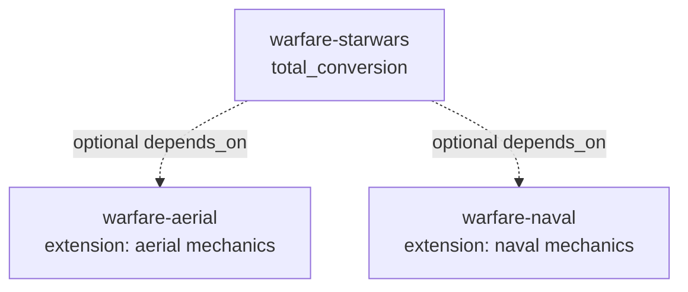

# Warfare: Naval Expansion

An **extension** pack that adds naval vessels and (future) harbor infrastructure to
vanilla *Diplomacy is Not an Option* factions. It is the seafaring companion to
[`warfare-aerial`](../warfare-aerial/): both are additive **engine-extension** packs
that layer base mechanics onto the vanilla game rather than replacing factions the way a
`total_conversion` (e.g. `warfare-starwars`) does.

## Classification

| Field | Value | Why |
|-------|-------|-----|
| `type` | `content` | The schema `type` enum has no `extension` member; `content` is the additive-content tier (same tier `warfare-aerial` uses). |
| `classification` | `engine_extension` | Marks this as a base-mechanics extension, not standalone content. |
| `tags` | `extension`, `naval`, `warfare` | Carries the "extension" + "naval" intent for search/discovery. |
| `framework_version` | `>=0.1.0 <1.0.0` | Matches the focus-set extension packs. |

## Relationship to other packs

`warfare-aerial` and `warfare-naval` provide the aerial and naval base mechanics.
A themed total conversion such as `warfare-starwars` may optionally `depends_on`
these extensions to reuse their unit classes and movement mappings.

## Contents

- `units/naval_units.yaml` — minimal seed roster (Scout Skiff, War Galley).

Expand with transports, capital ships, anti-air escorts, and harbor buildings as the
naval subsystem matures.
